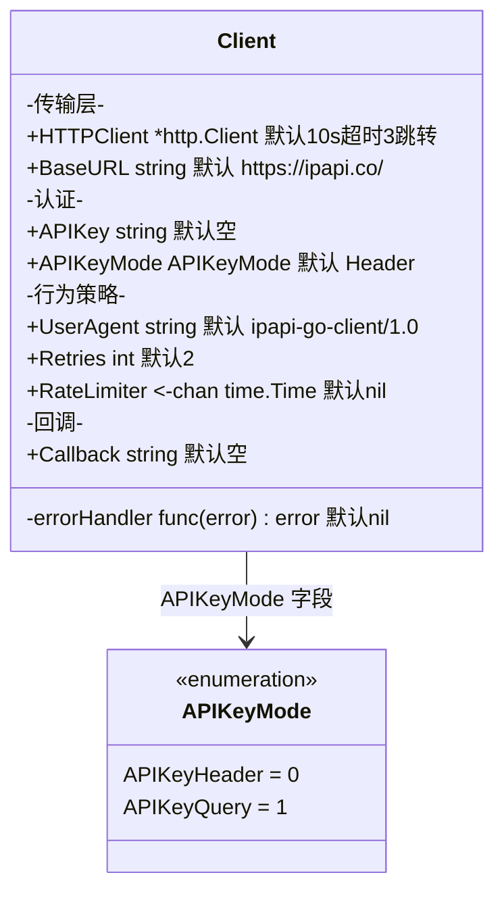
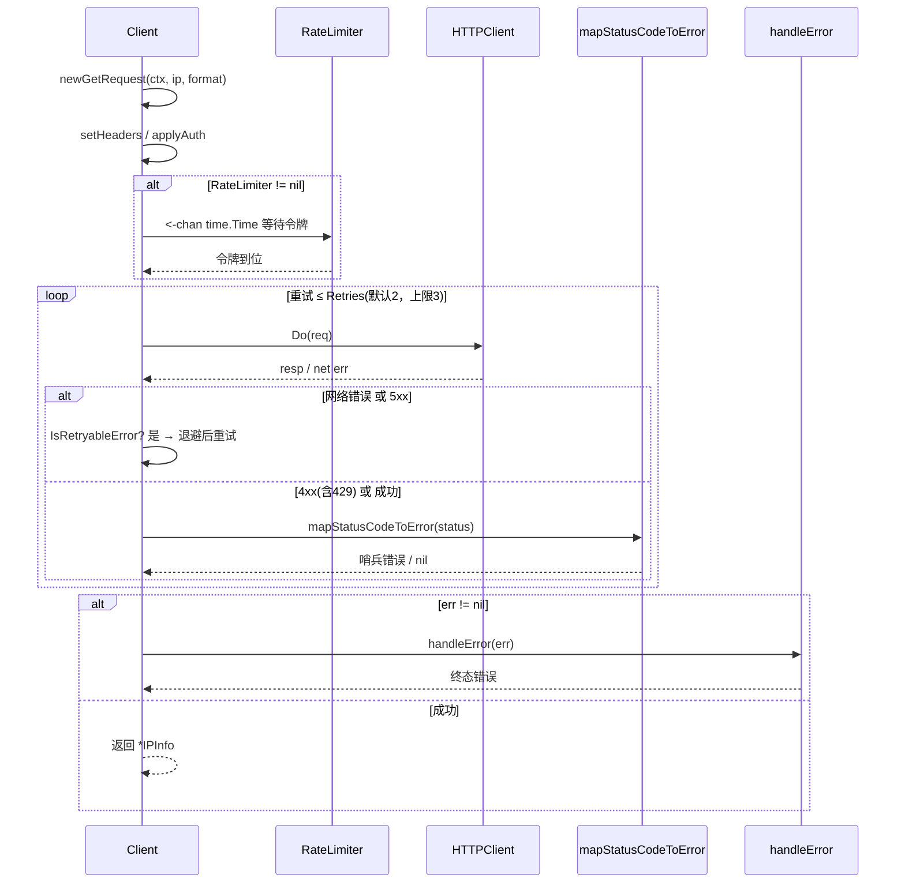
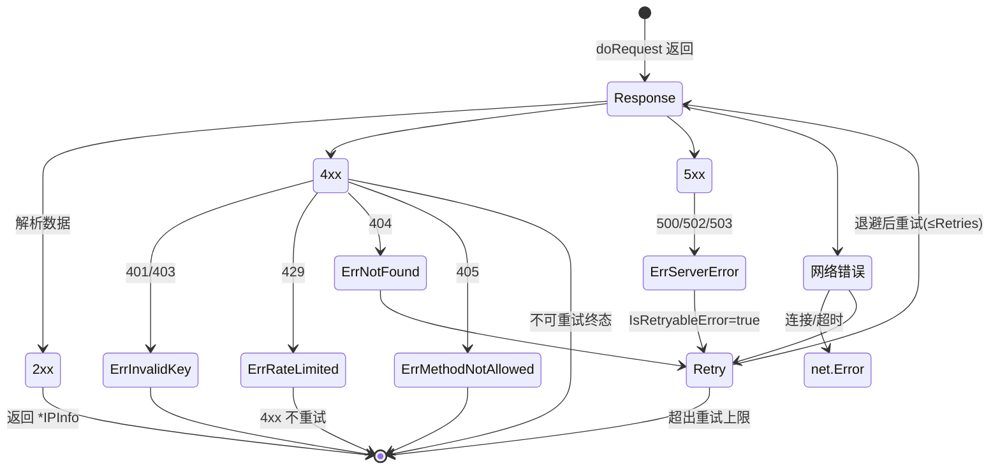

# 🏠 Client 客户端

> `pkg/ipapi/client.go` — SDK 的核心类型。

## 定义

```go
type Client struct {
	HTTPClient   *http.Client          // 底层 HTTP 客户端
	BaseURL      string                // API 基地址
	APIKey       string                // API 密钥
	APIKeyMode   APIKeyMode            // 认证方式
	UserAgent    string                // User-Agent 头
	Retries      int                   // 重试次数
	RateLimiter  <-chan time.Time      // 速率限制通道
	Callback     string                // JSONP 回调名
	errorHandler func(error) error     // 自定义错误处理（非导出）
}
```

::: tip 🎨 一图抵千言
`Client` 字段按职责分四组：传输层、认证、行为策略、回调。下图展示字段归属与默认值。
:::



## 字段说明

| 字段 | 类型 | 默认值 | 对应选项 | 说明 |
|------|------|--------|----------|------|
| `HTTPClient` | `*http.Client` | 10s 超时 + 3 跳转限制 | [`WithCustomHTTPClient`](./with-custom-http-client) | 底层传输层 |
| `BaseURL` | `string` | `https://ipapi.co/` | [`WithBaseURL`](./with-base-url) | API 基地址 |
| `APIKey` | `string` | `""` | [`WithAPIKey`](./with-api-key) | API 密钥，空则匿名 |
| `APIKeyMode` | `APIKeyMode` | `APIKeyHeader` | [`WithAPIKeyQuery`](./with-api-key-query) | 认证方式 |
| `UserAgent` | `string` | `ipapi-go-client/1.0` | [`WithUserAgent`](./with-user-agent) | UA 头 |
| `Retries` | `int` | `2` | [`WithRetries`](./with-retries) | 网络错误/5xx 重试次数 |
| `RateLimiter` | `<-chan time.Time` | `nil`（不限流） | [`WithRateLimiter`](./with-rate-limiter) | 限流令牌通道 |
| `Callback` | `string` | `""` | [`WithCallback`](./with-callback) | JSONP 回调名 |
| `errorHandler` | `func(error) error` | `nil` | [`WithErrorHandler`](./with-error-handler) | 错误处理回调 |
| `HTTPClient.Timeout` | `time.Duration` | `10s` | [`WithTimeout`](./with-timeout) | 单请求超时（就地修改） |

## 构造

```go
client := ipapi.NewClient(opts ...ClientOption) *Client
```

详见 [`NewClient`](./new-client)。

## 方法

`Client` 暴露 6 个查询方法，详见 [方法详解](./methods)。

## 内部方法（非导出）

| 方法 | 职责 |
|------|------|
| `doRequest` | 执行请求，含限流/重试/状态码映射 |
| `applyAuth` | 注入认证与 JSONP 回调 |
| `setHeaders` | 设置通用头 |
| `mapStatusCodeToError` | HTTP 状态码 → 错误 |
| `handleError` | 统一错误出口 |

下面这张时序图展示一次 `GetIPInfo` 调用内部方法的协作视角：限流令牌、重试判定与错误出口如何串联。



::: warning ⚠️ 4xx 不重试
`IsRetryableError` 仅对 [`ErrRateLimited`](./errors) `||` [`ErrServerError`](./errors) `||` [`ErrNotFound`](./errors) 返回真。`429`（限流）虽归类为 `ErrRateLimited`，但属于 4xx——SDK **不重试**，留给调用方决定退避策略。
:::

## 常量

### 基地址与超时

```go
const (
	defaultBaseURL    = "https://ipapi.co/"
	defaultTimeout    = 10 * time.Second
	maxRedirects      = 3
	defaultRetryDelay = 500 * time.Millisecond
)
```

### 格式常量

```go
type Format string

const (
	FormatJSON  Format = "json"
	FormatJSONP Format = "jsonp"
	FormatXML   Format = "xml"
	FormatCSV   Format = "csv"
	FormatYAML  Format = "yaml"
)
```

`validFormats` 是合法格式的白名单 map，供 [`ValidateFormat`](./validate-format) 使用。

### 认证模式

```go
type APIKeyMode int

const (
	APIKeyHeader APIKeyMode = iota // 0，Bearer Header（默认）
	APIKeyQuery                    // 1，?key= 查询参数
)
```

## 错误哨兵值

```go
var (
	ErrInvalidIP        = errors.New("invalid IP address")
	ErrInvalidField     = errors.New("invalid field name")
	ErrInvalidFormat    = errors.New("invalid response format")
	ErrRateLimited      = errors.New("API rate limit exceeded")
	ErrReservedIP       = errors.New("reserved IP address")
	ErrNotFound         = errors.New("resource not found")
	ErrServerError      = errors.New("server error")
	ErrUnexpectedData   = errors.New("unexpected response data")
	ErrMethodNotAllowed = errors.New("method not allowed")
	ErrInvalidKey       = errors.New("invalid API key")
)
```

详见 [错误类型](./errors)。

下面这张状态图展示 HTTP 响应码到哨兵错误的映射决策视角：哪些码可重试、哪些直接终态。



::: details 📊 哪些错误会被重试？
[`IsRetryableError`](./errors) 判定为真的三类：[`ErrServerError`](./errors)（5xx）、[`ErrNotFound`](./errors)（404，可重试因可能是瞬时缓存未命中）、网络错误。其余哨兵值（含 `ErrRateLimited`/`ErrInvalidKey`）一律直接返回，不消耗重试配额。
:::

## 线程安全

`Client` 无可变共享状态，可在多 goroutine 间复用。建议**复用单例**而非每次新建。

::: tip 🚀 复用单例
`Client` 字段在请求过程中不会被修改（`errorHandler` 等在构造时定型），因此单个实例可安全并发。复用还能复用底层 HTTP 连接池，避免重复握手。

```go
// 全局单例，启动时构造
var ipapiClient = ipapi.NewClient(ipapi.WithAPIKey(os.Getenv("IPAPI_KEY")))
```
:::

::: details 🔍 为什么线程安全？
- `HTTPClient` 自身是并发安全的（`net/http` 设计如此）。
- `RateLimiter` 是只读接收通道 `<-chan time.Time`，多 goroutine 抢令牌天然安全。
- `APIKey`、`BaseURL` 等配置字段在构造后不再被 SDK 内部修改。
- 唯一可变的是 `Retries`、`RateLimiter` 等导出字段——若你要在运行期改，应自行加锁或避免这样做。
:::

## 下一步

- 🏗 看 [`NewClient`](./new-client)
- 📖 看 [方法详解](./methods)
- 🧭 学 [Client 概念](/guide/client-concept)
