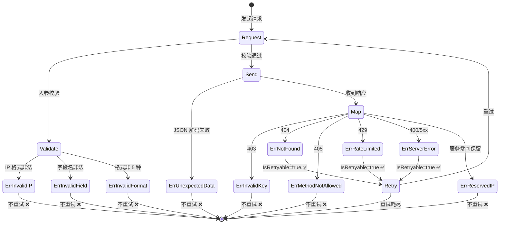

# 🛡 错误类型

> `pkg/ipapi/errors.go` + `client.go` 中的哨兵错误。

## 哨兵错误值

定义在 `client.go`：

| 错误 | 消息 | 触发场景 |
|------|------|----------|
| `ErrInvalidIP` | `invalid IP address` | IP 格式非法 |
| `ErrInvalidField` | `invalid field name` | 字段名不在白名单 |
| `ErrInvalidFormat` | `invalid response format` | 格式非 5 种之一 |
| `ErrRateLimited` | `API rate limit exceeded` | 触发 429 / 限流 |
| `ErrReservedIP` | `reserved IP address` | 私有/回环等保留地址 |
| `ErrNotFound` | `resource not found` | 404 |
| `ErrServerError` | `server error` | 5xx / 400 |
| `ErrUnexpectedData` | `unexpected response data` | JSON 解码失败 |
| `ErrMethodNotAllowed` | `method not allowed` | 405 |
| `ErrInvalidKey` | `invalid API key` | 403 / Invalid Key |

## 错误处理函数

### handleError

```go
func (c *Client) handleError(err error) error
```

统一错误出口：
1. 若设了 `errorHandler`，先调它
2. 否则 `errors.As` 解包 `APIError`，按 `Reason` 映射哨兵

`Reason` → 哨兵映射：

| `APIError.Reason` | 哨兵 |
|-------------------|------|
| `"RateLimited"` | `ErrRateLimited` |
| `"Reserved IP Address"` | `ErrReservedIP` |
| `"Invalid IP Address"` | `ErrInvalidIP` |
| `"Invalid Key"` | `ErrInvalidKey` |

### IsRetryableError

```go
func IsRetryableError(err error) bool
```

判断错误是否值得重试，返回 `true` 的：
- `ErrRateLimited`
- `ErrServerError`
- `ErrNotFound`

## 重试决策表

| 哨兵错误 | 可重试 | 原因 |
|---------|--------|------|
| `ErrInvalidIP` | ❌ | 客户端输入错误，重试无意义 |
| `ErrInvalidField` | ❌ | 字段名固定，重试不变 |
| `ErrInvalidFormat` | ❌ | 客户端格式错误 |
| `ErrRateLimited` | ✅ | 限流是临时的，稍后可能恢复 |
| `ErrReservedIP` | ❌ | IP 性质固定 |
| `ErrNotFound` | ✅ | 资源可能瞬时缺失 |
| `ErrServerError` | ✅ | 5xx 可能是临时故障 |
| `ErrUnexpectedData` | ❌ | 响应体结构问题 |
| `ErrMethodNotAllowed` | ❌ | HTTP 方法固定 |
| `ErrInvalidKey` | ❌ | 鉴权问题，重试无用 |

::: warning ⚠️ 429 不重试
虽然 `ErrRateLimited` 满足 `IsRetryableError=true`，但 SDK 内部重试逻辑**不重试 4xx（含 429）**。`IsRetryableError` 是给调用方判断是否值得**自己重试**的语义提示，与 SDK 内部重试策略是两套独立机制。
:::

详见 [IsRetryableError](./is-retryable)。

### WrapError

```go
func WrapError(op string, err error) error
```

给错误加操作名，保留 `%w` 链：

```go
err := ipapi.WrapError("lookup", originalErr)
// "lookup failed: ..."
```

详见 [WrapError](./wrap-error)。

## 状态码映射

`mapStatusCodeToError`（在 `api.go`）：

| HTTP | 错误 |
|------|------|
| 400 | `ErrServerError` |
| 403 | `ErrInvalidKey` |
| 404 | `ErrNotFound` |
| 405 | `ErrMethodNotAllowed` |
| 429 | `ErrRateLimited` |
| 500 | `ErrServerError` |

::: tip 🎨 一图抵千言
10 个哨兵错误的生命周期与可重试性流转。
:::



::: tip 💡 优先级
当响应体含 `APIError`（`HasError=true`）时，`doRequest` 直接返回它，`handleError` 再按 `Reason` 映射。状态码映射仅在没有可用 `APIError` 时兜底。
:::

## 用法示例

```go
info, err := client.GetIPInfo(ctx, "invalid.ip", "json")
if err != nil {
	switch {
	case errors.Is(err, ipapi.ErrInvalidIP):
		fmt.Println("→ 无效 IP")
	case errors.Is(err, ipapi.ErrReservedIP):
		fmt.Println("→ 保留地址")
	case errors.Is(err, ipapi.ErrRateLimited):
		time.Sleep(time.Minute)
	default:
		log.Println(err)
	}
}
```

::: tip 💡 errors.Is 而非 ==
哨兵错误可能被 `WrapError` 包裹，直接 `==` 比较会漏判。务必用 `errors.Is(err, ipapi.ErrXxx)` 顺着 `%w` 链查找，兼容包装后的错误。
:::

::: details 🔍 错误处理决策树
按错误来源分流处理：
- **客户端错误**（`ErrInvalidIP`/`ErrInvalidField`/`ErrInvalidFormat`）：修正输入，不重试
- **鉴权错误**（`ErrInvalidKey`）：检查 Key 配置/额度
- **限流错误**（`ErrRateLimited`）：退避后重试，考虑加缓存
- **服务端错误**（`ErrServerError`）：指数退避重试，告警
- **资源错误**（`ErrNotFound`）：核对 IP/字段是否存在
- **数据错误**（`ErrUnexpectedData`）：报告解析异常，可能版本不兼容
:::

## 取错误细节

```go
var apiErr *ipapi.APIError
if errors.As(err, &apiErr) {
	log.Printf("reason=%s ip=%s reserved=%v msg=%s",
		apiErr.Reason, apiErr.IP, apiErr.Reserved, apiErr.Message)
}
```

## 下一步

- 🛡 学 [错误处理概念](/guide/error-concept)
- 🧪 看 [错误处理示例](/examples/error-handling)
- 📖 看 [`APIError` 结构](./models#apierror)
