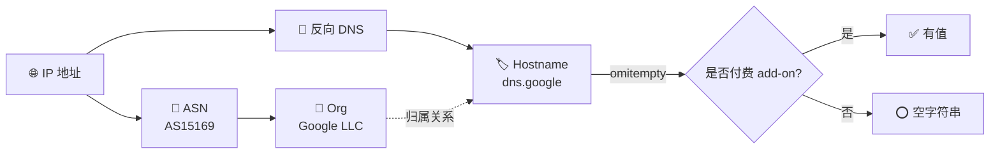

# 📡 ASN 字段

> 自治系统、组织、主机名。

::: tip 🎨 一图抵千言
网络归属字段层层细化：从 ASN 编号到组织名，再到反向解析出的主机名，逐步从「数字」走向「可读实体」。
:::



## 字段

### ASN

```go
ASN string `json:"asn"`
```

自治系统号。例：`AS15169`。

### Org

```go
Org string `json:"org"`
```

组织名。例：`Google LLC`。

### Hostname

```go
Hostname string `json:"hostname,omitempty"`
```

反向解析的主机名（可选 add-on，beta）。

::: tip 💡 Hostname 是可选 add-on
`hostname` 在 ipapi.co 是付费 add-on，普通账户可能为空。tag 带 `omitempty`。
:::

::: info 📋 字段速查表
| 字段 | JSON key | 类型 | 是否可选 | 示例 |
|------|----------|------|----------|------|
| `ASN` | `asn` | `string` | 否 | `AS15169` |
| `Org` | `org` | `string` | 否 | `Google LLC` |
| `Hostname` | `hostname,omitempty` | `string` | 是（add-on） | `dns.google` |
:::

::: warning ⚠️ Hostname 可能为空
由于 `omitempty`，未启用 add-on 时 `Hostname` 为空字符串。判断前先判空：`if info.Hostname != ""`。不要假设它一定有值，否则风控规则可能误判。
:::

## 示例

```go
info, _ := client.GetIPInfo(ctx, "8.8.8.8", "json")
fmt.Printf("ASN: %s 组织: %s 主机: %s\n",
	info.ASN, info.Org, info.Hostname)
// ASN: AS15169 组织: Google LLC 主机: dns.google
```

单字段：

```go
asn, _ := client.GetField(ctx, "8.8.8.8", "asn")
org, _ := client.GetField(ctx, "8.8.8.8", "org")
```

## 用途

- 🏢 IP 归属机构识别
- 🛡 风控（识别云厂商/IDC 流量）
- 🌐 网络拓扑分析
- 🔍 反向 DNS（hostname）

::: details 🧩 进阶：识别云厂商/IDC 流量做风控
```go
info, _ := client.GetIPInfo(ctx, ip, "json")
org := strings.ToLower(info.Org)
switch {
case strings.Contains(org, "google"),
     strings.Contains(org, "amazon"),
     strings.Contains(org, "microsoft"),
     strings.Contains(org, "digitalocean"):
    // 来自云厂商，可能是爬虫/机器人
    flagAsDatacenterTraffic(ip)
case info.Hostname != "" && strings.HasSuffix(info.Hostname, ".google"):
    flagAsDatacenterTraffic(ip)
default:
    // 可能是住宅 IP，放行
}
```
也可维护一份 ASN 黑名单（如已知代理出口 AS），直接 `info.ASN` 命中即拦截。
:::

::: tip 🔒 ASN 比 Org 更稳定
组织可能因收购、改名而变化（如 `Google LLC` → `Google LLC` 历史上多次调整），但 ASN 编号相对稳定。做长期风控策略时优先用 `ASN` 做 key，`Org` 仅作展示。
:::

## 下一步

- 📋 回 [字段总览](./fields)
- 📊 看 [统计字段](./field-stats)
