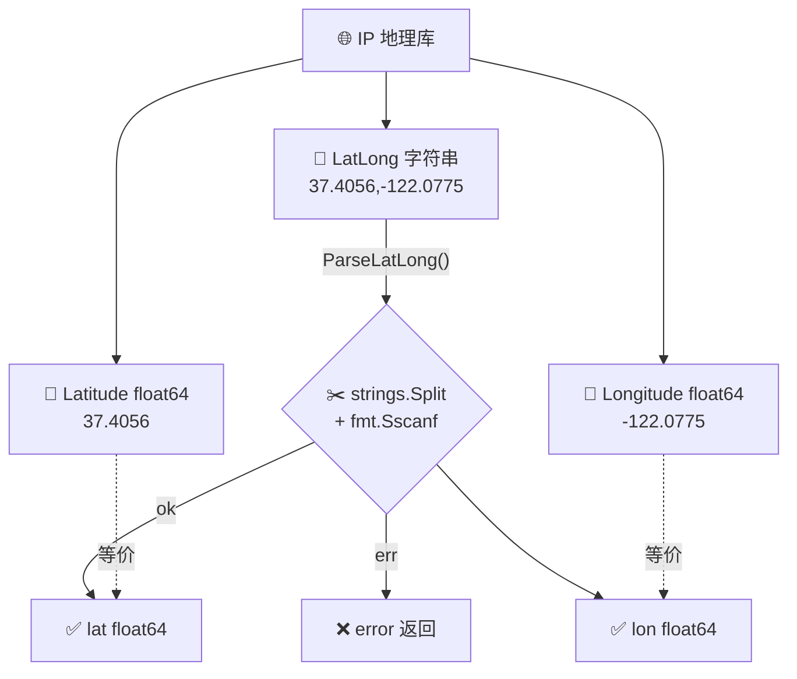

# 🧭 坐标字段

> 经纬度地理坐标。

::: tip 🎨 一图抵千言
坐标字段有三种形态：`Latitude`/`Longitude` 是拆分好的数值，`LatLong` 是合并字符串，`ParseLatLong` 负责把字符串再拆回数值。
:::



## 字段

### Latitude

```go
Latitude float64 `json:"latitude"`
```

纬度。例：`37.4056`。

### Longitude

```go
Longitude float64 `json:"longitude"`
```

经度。例：`-122.0775`。

### LatLong

```go
LatLong string `json:"latlong"`
```

经纬度组合字符串 `"lat,lon"`。例：`37.4056,-122.0775`。

## ParseLatLong 方法

```go
func (info *IPInfo) ParseLatLong() (float64, float64, error)
```

解析 `LatLong` 字符串为两个 `float64`：

```go
lat, lon, err := info.ParseLatLong()
if err != nil {
	log.Println("坐标格式错误:", err)
}
fmt.Printf("纬度=%.4f 经度=%.4f\n", lat, lon)
```

内部用 `strings.Split` + `fmt.Sscanf`。

::: warning ⚠️ ParseLatLong 依赖 LatLong 字段
`ParseLatLong()` 解析的是 `LatLong` 字符串字段，**不是** `Latitude`/`Longitude` 数值字段。如果你只请求了 `latitude` 单字段而没请求 `latlong`，`LatLong` 为空，`ParseLatLong()` 会返回错误。直接读 `Latitude`/`Longitude` 字段更稳妥。
:::

::: details 🔍 ParseLatLong 内部实现要点
- 用 `strings.Split(s, ",")` 切成两段
- 用 `fmt.Sscanf` 把每段解析为 `float64`
- 任何一段解析失败都返回 `error`
- 因此 `LatLong` 必须严格是 `"lat,lon"` 格式，多余空格通常能容忍，但缺逗号必失败
:::

## 示例

```go
info, _ := client.GetIPInfo(ctx, "8.8.8.8", "json")
fmt.Printf("坐标: %s\n", info.LatLong)
lat, lon, _ := info.ParseLatLong()
// 或直接用 Latitude / Longitude 字段
fmt.Printf("lat=%f lon=%f\n", info.Latitude, info.Longitude)
```

单字段：

```go
lat, _ := client.GetField(ctx, "8.8.8.8", "latitude")
latlong, _ := client.GetField(ctx, "8.8.8.8", "latlong")
```

## Latitude/Longitude vs LatLong

| 方式 | 类型 | 优势 | 何时用 |
|------|------|------|--------|
| `Latitude` / `Longitude` | `float64` | 直接数值，无需解析 | 默认首选，需做数学运算 |
| `LatLong` | `string` | 单字段查询省一次 | 需字符串格式或省配额 |

一般用 `Latitude`/`Longitude` 即可；`LatLong` 适合需要字符串格式或单字段省配额时。

::: tip 💡 省配额技巧
ipapi.co 按「字段数 × 请求数」计费。若只需坐标传给地图 API，单查 `latlong` 一次字段比查 `latitude`+`longitude` 两次字段省一半配额。取回后再用 `ParseLatLong()` 拆分。
:::

## 用途

- 🗺 地图标注（Google Maps 等）
- 📍 距离计算
- 🌤 当地天气查询

## 下一步

- 📋 回 [字段总览](./fields)
- 🧪 看 [经纬度解析示例](/examples/parse-latlong)
- ⏰ 看 [时间字段](./field-time)
