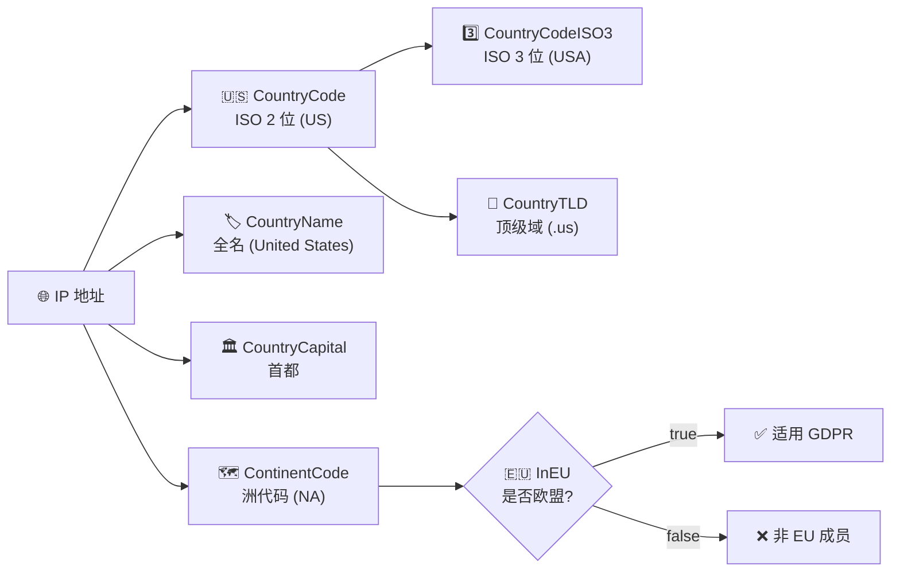

# 🌍 国家字段

> 国家与洲际归属信息。

::: tip 🎯 一图抵千言
国家字段围绕一个核心事实「这个 IP 属于哪个国家」展开，由 ISO 代码、名称、首都、顶级域等多维表征共同刻画。
:::

下方流程图展示了 country 系列字段之间的派生与归属关系：



## 字段

### Country

```go
Country string `json:"country"`
```

国家代码（ISO 2 位）。例：`US`。等同 `CountryCode`。

### CountryName

```go
CountryName string `json:"country_name"`
```

国家全名（英文）。例：`United States`。

### CountryCode

```go
CountryCode string `json:"country_code"`
```

ISO 2 位国家代码。例：`US`。

### CountryCodeISO3

```go
CountryCodeISO3 string `json:"country_code_iso3"`
```

ISO 3 位国家代码。例：`USA`。

### CountryCapital

```go
CountryCapital string `json:"country_capital"`
```

首都。例：`Washington D.C.`。

### CountryTLD

```go
CountryTLD string `json:"country_tld"`
```

国家顶级域。例：`.us`。

### ContinentCode

```go
ContinentCode string `json:"continent_code"`
```

洲代码。例：`NA`（北美）。

### InEU

```go
InEU bool `json:"in_eu"`
```

是否欧盟成员国。例：`false`。

::: info 📋 字段速查表
| 字段 | JSON key | 类型 | 示例值 | 说明 |
|------|----------|------|--------|------|
| `Country` | `country` | `string` | `US` | ISO 2 位，等同 CountryCode |
| `CountryName` | `country_name` | `string` | `United States` | 英文全名 |
| `CountryCode` | `country_code` | `string` | `US` | ISO 2 位 |
| `CountryCodeISO3` | `country_code_iso3` | `string` | `USA` | ISO 3 位 |
| `CountryCapital` | `country_capital` | `string` | `Washington D.C.` | 首都 |
| `CountryTLD` | `country_tld` | `string` | `.us` | 国家顶级域 |
| `ContinentCode` | `continent_code` | `string` | `NA` | 洲代码 |
| `InEU` | `in_eu` | `bool` | `false` | 是否欧盟成员国 |
:::

::: warning ⚠️ Country 与 CountryCode 重复
`Country` 与 `CountryCode` 在 ipapi.co 返回中是**同一个值**（均为 ISO 2 位代码）。SDK 保留两个字段以匹配不同 JSON key（`country` / `country_code`）。读哪个都行，写时建议统一用 `CountryCode` 语义更清晰。
:::

## 示例

```go
info, _ := client.GetIPInfo(ctx, "8.8.8.8", "json")
fmt.Printf("%s (%s/%s) 首都=%s TLD=%s 洲=%s EU=%v\n",
	info.CountryName, info.CountryCode, info.CountryCodeISO3,
	info.CountryCapital, info.CountryTLD, info.ContinentCode, info.InEU)
```

## 用途

- 🌐 按国家路由/合规
- 🇪🇺 GDPR/EU 合规判断（`InEU`）
- 🏳 本地化（语言、货币联动）

::: details 🧩 进阶：按 InEU 自动应用 GDPR 合规策略
```go
info, _ := client.GetIPInfo(ctx, ip, "json")
if info.InEU {
    // 强制 cookie 同意横幅、限制数据出境
    applyGDPRPolicy()
} else {
    applyDefaultPolicy()
}
```
也可结合 `ContinentCode` 做洲际粒度的路由，例如 `NA` 走北美节点、`EU` 走法兰克福节点。
:::

::: tip 🔒 合规提示
`InEU` 仅表示 IP 所属国家是否为欧盟成员，**不等同于用户本人国籍**。合规决策应同时考虑业务上下文与法律咨询，不要把字段值当作唯一判据。
:::

## 下一步

- 📋 回 [字段总览](./fields)
- 🧭 看 [坐标字段](./field-coord)
