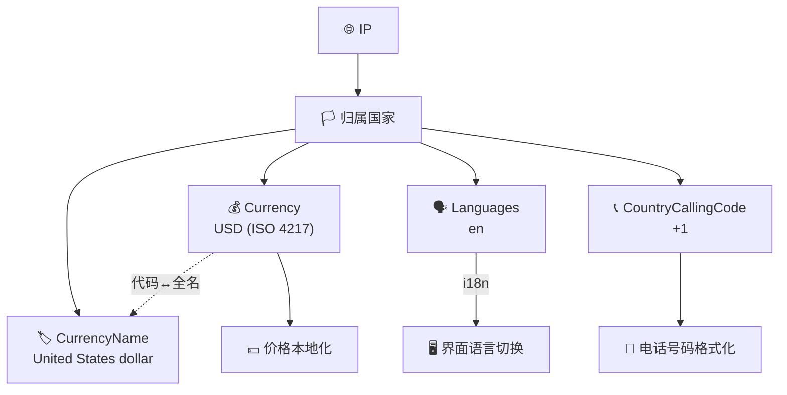

# 💱 货币与语言字段

> 货币、语言、国际电话区号。

::: tip 🎨 一图抵千言
这一组字段共同回答「面向这个 IP 所在国家的用户，该用什么货币、什么语言、什么电话格式」。
:::



## 字段

### Currency

```go
Currency string `json:"currency"`
```

货币代码（ISO 4217）。例：`USD`。

### CurrencyName

```go
CurrencyName string `json:"currency_name"`
```

货币全名。例：`United States dollar`。

### Languages

```go
Languages string `json:"languages"`
```

该国官方语言列表，逗号分隔。例：`en`。

### CountryCallingCode

```go
CountryCallingCode string `json:"country_calling_code"`
```

国际电话区号。例：`1`（美国）。

::: info 📋 字段速查表
| 字段 | JSON key | 类型 | 标准 | 示例 |
|------|----------|------|------|------|
| `Currency` | `currency` | `string` | ISO 4217 | `USD` |
| `CurrencyName` | `string` | ISO 4217 全名 | `United States dollar` |
| `Languages` | `languages` | `string` | 逗号分隔语言码 | `en` |
| `CountryCallingCode` | `country_calling_code` | `string` | ITU-T E.164 | `1` |
:::

::: warning ⚠️ Languages 可能多语言
`Languages` 是逗号分隔的字符串，多语言国家可能返回如 `de,fr,it`（瑞士）。直接当单语言用会出错，需 `strings.Split` 后取首个或按列表匹配。
:::

## 示例

```go
info, _ := client.GetIPInfo(ctx, "8.8.8.8", "json")
fmt.Printf("货币: %s (%s)\n语言: %s\n电话区号: +%s\n",
	info.Currency, info.CurrencyName,
	info.Languages, info.CountryCallingCode)
// 货币: USD (United States dollar)
// 语言: en
// 电话区号: +1
```

单字段：

```go
currency, _ := client.GetField(ctx, "8.8.8.8", "currency")
lang, _ := client.GetField(ctx, "8.8.8.8", "languages")
```

## 用途

- 💰 电商价格本地化
- 🗣 界面语言切换
- 📞 电话号码格式化

::: details 🧩 进阶：多语言国家取首选语言
```go
info, _ := client.GetIPInfo(ctx, ip, "json")
langs := strings.Split(info.Languages, ",")
preferred := langs[0] // 取首个作为默认
fmt.Printf("首选语言: %s, 货币: %s, 区号: +%s\n",
    preferred, info.Currency, info.CountryCallingCode)
```
更稳妥的做法是拿 `langs` 列表与你的应用支持语言集合做交集，选第一个命中的。
:::

::: tip 💡 拼电话号码格式
`CountryCallingCode` 只返回数字（如 `1`），不含 `+` 前缀。拼接国际号码时需自己补 `+`：`"+" + info.CountryCallingCode + localNumber`。
:::

## 下一步

- 📋 回 [字段总览](./fields)
- 📡 看 [ASN 字段](./field-asn)
