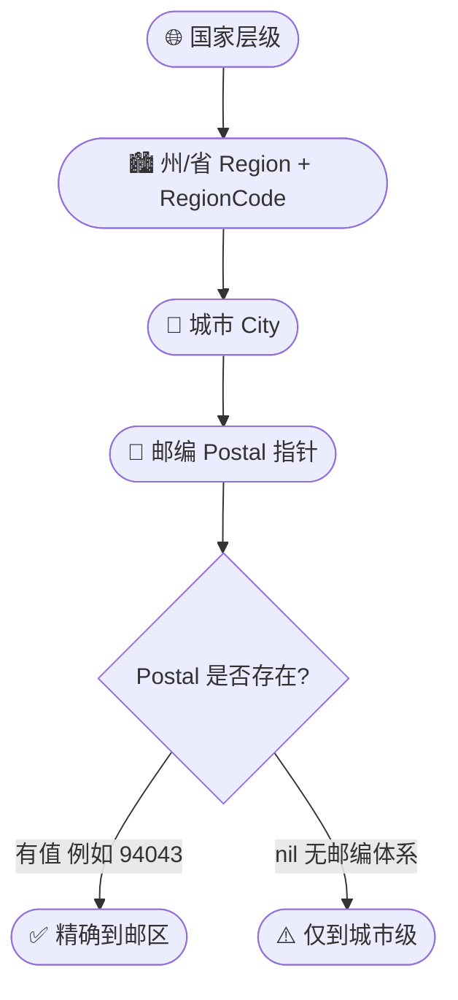

# 🏙 地理字段

> 城市级地理定位信息。

::: tip 🎨 一图抵千言
地理字段呈"国家→州/省→城市→邮编"的层级结构，自上而下逐级细化定位。
:::



## 字段

### City

```go
City string `json:"city"`
```

城市名（英文）。例：`Mountain View`。

### Region

```go
Region string `json:"region"`
```

州/省名。例：`California`。

### RegionCode

```go
RegionCode string `json:"region_code"`
```

州/省代码。例：`CA`。

### Postal

```go
Postal *string `json:"postal"`
```

邮政编码。**指针类型**——部分国家无邮编，需区分空与无。

用 [`GetPostal()`](./models#getpostal) 安全访问：

```go
fmt.Println(info.GetPostal()) // nil 时返回 ""
```

| 字段 | JSON 键 | 类型 | 层级 | 示例值 |
|------|---------|------|------|--------|
| `City` | `city` | `string` | 城市级 | `Mountain View` |
| `Region` | `region` | `string` | 州/省级 | `California` |
| `RegionCode` | `region_code` | `string` | 州/省缩写 | `CA` |
| `Postal` | `postal` | `*string` | 邮区级 | `94043` / `nil` |

::: warning ⚠️ Postal 必须用 GetPostal() 安全访问
`Postal` 是 `*string`，直接 `*info.Postal` 解引用在 `nil` 时会 **panic**。务必用 `info.GetPostal()`——它在 `nil` 时安全返回空字符串。
:::

## 示例

```go
info, _ := client.GetIPInfo(ctx, "8.8.8.8", "json")
fmt.Printf("%s, %s (%s) %s\n",
	info.City, info.Region, info.RegionCode, info.GetPostal())
// Mountain View, California (CA) 94043
```

单字段：

```go
city, _ := client.GetField(ctx, "8.8.8.8", "city")
postal, _ := client.GetField(ctx, "8.8.8.8", "postal")
```

## 用途

- 📍 用户城市级定位
- 🗺 地图标注
- 📦 物流地址预填

::: details 🔍 Region 与 RegionCode 的对照关系
`Region` 是完整州/省名（如 `California`），`RegionCode` 是 ISO 缩写（如 `CA`）。二者并非一一对应字符串截取——某些国家的 `RegionCode` 来自不同标准（如 ISO 3166-2）。需要做区域聚合统计时，**优先用 `RegionCode` 做键**，避免拼写差异（`California` vs `california`）导致分桶错误。
:::

::: tip 💡 地理字段精度的边界
IP 地理定位通常精确到**城市级**，而非街道级。`Postal` 反映的是该 IP 网段所在城市的代表性邮编，不一定等于用户真实邮编。**不要单独依赖 `Postal` 做精准投递或风控**——需结合坐标字段做交叉验证。
:::

## 下一步

- 📋 回 [字段总览](./fields)
- 🌍 看 [国家字段](./field-country)
