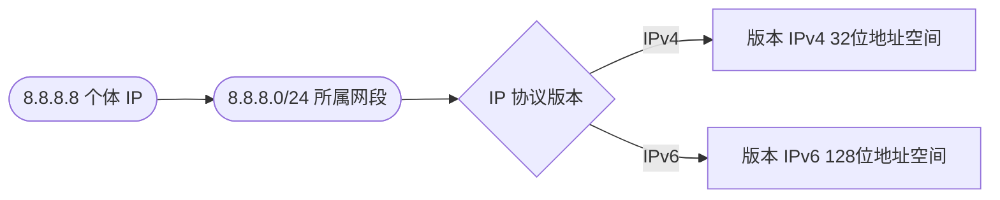

# 🌐 网络字段

> IP 地址本身的网络属性。

::: tip 🎨 一图抵千言
三个网络字段从"个体→归属→版本"层层递进，共同刻画一个 IP 的网络身份。
:::



## 字段

### IP

```go
IP string `json:"ip"`
```

查询的 IP 地址本身。例：`8.8.8.8`。

### Network

```go
Network string `json:"network"`
```

IP 所属网段 CIDR。例：`8.8.8.0/24`。

### Version

```go
Version string `json:"version"`
```

IP 协议版本。值：`IPv4` 或 `IPv6`。

| 字段 | JSON 键 | 类型 | 含义 | 示例值 |
|------|---------|------|------|--------|
| `IP` | `ip` | `string` | 查询的 IP 本身 | `8.8.8.8` |
| `Network` | `network` | `string` | 所属网段 CIDR | `8.8.8.0/24` |
| `Version` | `version` | `string` | 协议版本 | `IPv4` / `IPv6` |

::: info 💡 Network 的 CIDR 表示法
`8.8.8.0/24` 中的 `/24` 表示前 24 位为网络前缀，后 8 位为主机位，覆盖 `8.8.8.0`~`8.8.8.255` 共 256 个地址。结合 `IP` 与 `Network` 可判断"该 IP 属于哪个网段"。
:::

## 示例

```go
info, _ := client.GetIPInfo(ctx, "8.8.8.8", "json")
fmt.Printf("IP=%s 网段=%s 版本=%s\n", info.IP, info.Network, info.Version)
// IP=8.8.8.8 网段=8.8.8.0/24 版本=IPv4
```

单字段查询：

```go
network, _ := client.GetField(ctx, "8.8.8.8", "network")
version, _ := client.GetField(ctx, "8.8.8.8", "version")
```

## 用途

- 🧮 网段归属分析
- 🔄 IPv4/IPv6 区分统计
- 📡 网络拓扑可视化

::: details 🔍 IPv4 vs IPv6 判别示例
```go
info, _ := client.GetIPInfo(ctx, "2606:4700:4700::1111", "json")
if info.Version == "IPv6" {
    // 走 IPv6 专属逻辑（如 AAAA 记录统计）
}
// Network 对 IPv6 同样是 CIDR，如 "2606:4700:4700::/48"
```
:::

::: warning ⚠️ Network 可能为空
某些查询场景（如 `me` 端点偶发）`Network` 字段可能返回空字符串。做网段分析前请先判空，避免 `strings.Split(network, "/")` 越界。
:::

## 下一步

- 📋 回 [字段总览](./fields)
- 🏙 看 [地理字段](./field-geo)
