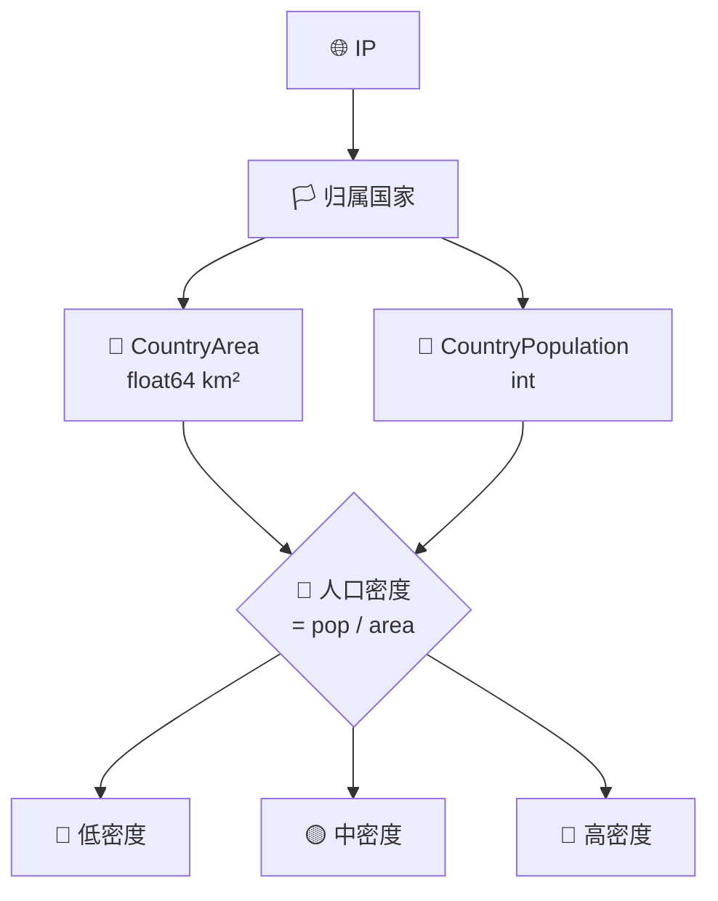

# 📊 统计字段

> 国家面积与人口统计。

::: tip 🎨 一图抵千言
统计字段描述 IP 归属国家的宏观规模，面积与人口组合可衍生出人口密度等指标。
:::



## 字段

### CountryArea

```go
CountryArea float64 `json:"country_area"`
```

国家面积（平方公里）。例：`9833520`（美国）。

### CountryPopulation

```go
CountryPopulation int `json:"country_population"`
```

国家人口。例：`327167434`。

::: info 📋 字段速查表
| 字段 | JSON key | 类型 | 单位 | 示例 |
|------|----------|------|------|------|
| `CountryArea` | `country_area` | `float64` | 平方公里 | `9833520` |
| `CountryPopulation` | `country_population` | `int` | 人 | `327167434` |
:::

::: warning ⚠️ 统计数据有滞后
`CountryArea` 与 `CountryPopulation` 是 ipapi.co 静态维护的国家级数据，并非实时。人口数字通常基于某次普查，可能与当前实际人口偏差数百万。仅用于宏观估算，不要用于精确结算或配额分配。
:::

## 示例

```go
info, _ := client.GetIPInfo(ctx, "8.8.8.8", "json")
fmt.Printf("%s 面积=%.0f km² 人口=%d\n",
	info.CountryName, info.CountryArea, info.CountryPopulation)
// United States 面积=9833520 km² 人口=327167434
```

单字段：

```go
area, _ := client.GetField(ctx, "8.8.8.8", "country_area")
pop, _ := client.GetField(ctx, "8.8.8.8", "country_population")
```

## 用途

- 📈 数据可视化
- 🧮 人口密度计算（面积/人口）
- 📊 国别统计报表

::: details 🧩 进阶：算人口密度并分级
```go
info, _ := client.GetIPInfo(ctx, ip, "json")
if info.CountryArea > 0 {
    density := float64(info.CountryPopulation) / info.CountryArea
    level := "中"
    switch {
    case density < 50:
        level = "低"
    case density > 200:
        level = "高"
    }
    fmt.Printf("%s 人口密度: %.1f 人/km² [%s]\n",
        info.CountryName, density, level)
}
```
注意除零保护：极小国家面积可能为 0 或缺值，计算前务必判 `info.CountryArea > 0`。
:::

::: tip 💡 与 Country 字段联动
统计字段本身不带国家名，需配合 `CountryName`/`CountryCode` 才知道描述的是哪个国家。建议封装一个 `CountryStats` 结构体把这几字段打包，避免拿到一堆数字却对不上国名。
:::

## 下一步

- 📋 回 [字段总览](./fields)
- 🌐 回 [网络字段](./field-network)
