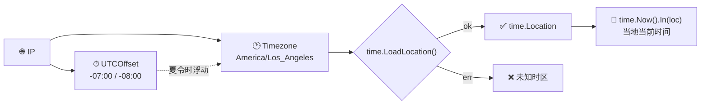

# ⏰ 时间字段

> 时区与 UTC 偏移。

::: tip 🎨 一图抵千言
时间字段由 `Timezone`（IANA 标识）和 `UTCOffset`（偏移字符串）组成，前者可直接喂给 Go 的 `time.LoadLocation` 得到本地时区。
:::



## 字段

### Timezone

```go
Timezone string `json:"timezone"`
```

IANA 时区标识。例：`America/Los_Angeles`。

### UTCOffset

```go
UTCOffset string `json:"utc_offset"`
```

UTC 偏移字符串。例：`-07:00`（夏令时）或 `-08:00`。

::: info 📋 字段对照
| 字段 | JSON key | 类型 | 格式 | 示例 |
|------|----------|------|------|------|
| `Timezone` | `timezone` | `string` | IANA 标识 | `America/Los_Angeles` |
| `UTCOffset` | `utc_offset` | `string` | `±HH:MM` | `-07:00` |
:::

::: warning ⚠️ UTCOffset 受夏令时影响
`UTCOffset` 反映的是**查询时刻**的偏移，会随夏令时切换而变化。同一 IP 在不同季节查询可能得到 `-07:00`（PDT）或 `-08:00`（PST）。不要把它当作固定常量缓存，应与查询时间一起记录。
:::

## 示例

```go
info, _ := client.GetIPInfo(ctx, "8.8.8.8", "json")
fmt.Printf("时区: %s (UTC%s)\n", info.Timezone, info.UTCOffset)
// 时区: America/Los_Angeles (UTC-07:00)
```

加载为 `time.Location`：

```go
loc, err := time.LoadLocation(info.Timezone)
if err == nil {
	t := time.Now().In(loc)
	fmt.Println("当地现在:", t)
}
```

单字段：

```go
tz, _ := client.GetField(ctx, "8.8.8.8", "timezone")
offset, _ := client.GetField(ctx, "8.8.8.8", "utc_offset")
```

## 用途

- 🕐 用户本地时间显示
- 📅 跨时区会议调度
- 🔄 日志时间本地化

::: details 🧩 进阶：用 Timezone 算用户当前本地时间
```go
info, _ := client.GetIPInfo(ctx, ip, "json")
loc, err := time.LoadLocation(info.Timezone)
if err != nil {
    // 退路：用 UTCOffset 构造 FixedZone
    // 注意 FixedZone 不感知夏令时
    loc = time.FixedZone("ip", parseOffsetMinutes(info.UTCOffset))
}
t := time.Now().In(loc)
fmt.Printf("用户当地现在: %s\n", t.Format("2006-01-02 15:04 MST"))
```
`time.LoadLocation` 依赖系统时区数据库（Linux 的 `tzdata` 包）。Alpine 镜像默认不含 tzdata，需 `apk add tzdata` 或在 Dockerfile 中复制 zoneinfo。
:::

::: tip 💡 日志本地化最佳实践
存日志时统一存 UTC（`time.Now().UTC()`），展示时再用 IP 对应的 `Timezone` 转换。这样多地区日志可对齐排序，不会因为夏令时跳变导致时间错乱。
:::

## 下一步

- 📋 回 [字段总览](./fields)
- 💱 看 [货币/语言字段](./field-currency)
