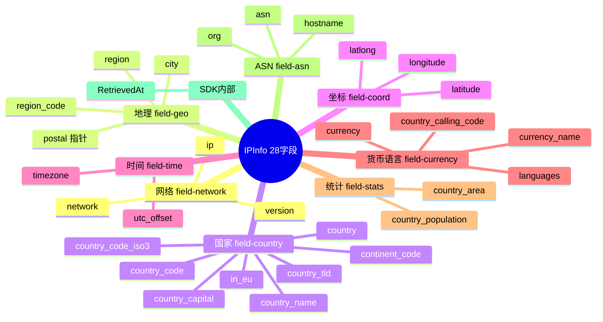

# 📋 IPInfo 字段总览

> `IPInfo` 结构体的 28 个字段一览，按类别分组。

::: tip 🎨 一图抵千言
28 个字段分 8 大类别，一眼看清结构全貌。
:::



::: info 💡 28 字段的来由
`RetrievedAt` 是 SDK 自加的时间戳（非 API 返回），用于缓存与新鲜度判断；其余 27 个字段全部对应 ipapi.co 的 JSON 响应键。`Hostname` 因可能缺失标注 `omitempty`。
:::

## 全部字段

| 字段 | JSON | 类型 | 类别 |
|------|------|------|------|
| `IP` | `ip` | `string` | [网络](./field-network) |
| `Network` | `network` | `string` | [网络](./field-network) |
| `Version` | `version` | `string` | [网络](./field-network) |
| `City` | `city` | `string` | [地理](./field-geo) |
| `Region` | `region` | `string` | [地理](./field-geo) |
| `RegionCode` | `region_code` | `string` | [地理](./field-geo) |
| `Postal` | `postal` | `*string` | [地理](./field-geo) |
| `Country` | `country` | `string` | [国家](./field-country) |
| `CountryName` | `country_name` | `string` | [国家](./field-country) |
| `CountryCode` | `country_code` | `string` | [国家](./field-country) |
| `CountryCodeISO3` | `country_code_iso3` | `string` | [国家](./field-country) |
| `CountryCapital` | `country_capital` | `string` | [国家](./field-country) |
| `CountryTLD` | `country_tld` | `string` | [国家](./field-country) |
| `ContinentCode` | `continent_code` | `string` | [国家](./field-country) |
| `InEU` | `in_eu` | `bool` | [国家](./field-country) |
| `Latitude` | `latitude` | `float64` | [坐标](./field-coord) |
| `Longitude` | `longitude` | `float64` | [坐标](./field-coord) |
| `LatLong` | `latlong` | `string` | [坐标](./field-coord) |
| `Timezone` | `timezone` | `string` | [时间](./field-time) |
| `UTCOffset` | `utc_offset` | `string` | [时间](./field-time) |
| `CountryCallingCode` | `country_calling_code` | `string` | [语言](./field-currency) |
| `Languages` | `languages` | `string` | [语言](./field-currency) |
| `Currency` | `currency` | `string` | [货币](./field-currency) |
| `CurrencyName` | `currency_name` | `string` | [货币](./field-currency) |
| `CountryArea` | `country_area` | `float64` | [统计](./field-stats) |
| `CountryPopulation` | `country_population` | `int` | [统计](./field-stats) |
| `ASN` | `asn` | `string` | [ASN](./field-asn) |
| `Org` | `org` | `string` | [ASN](./field-asn) |
| `Hostname` | `hostname,omitempty` | `string` | [ASN](./field-asn) |
| `RetrievedAt` | `-` | `time.Time` | SDK 内部 |

## 字段访问

```go
info, _ := client.GetIPInfo(ctx, "8.8.8.8", "json")
fmt.Println(info.City)              // 结构体字段
fmt.Println(info.GetPostal())      // 指针字段用安全方法
lat, lon, _ := info.ParseLatLong() // 字符串坐标解析
```

| 访问方式 | 适用字段 | 特点 |
|----------|----------|------|
| 直接 `info.City` | 非 `*string` 字段（27 个） | 零值为 `""`，无法区分"缺失"与"空" |
| `info.GetPostal()` | `Postal`（`*string`） | nil 时返回 `""`，安全解引用 |
| `info.ParseLatLong()` | `LatLong`（string） | 解析 `"lat,lon"` 为两个 float64 |
| `client.GetField(...)` | 任意单字段 | 原始 string，轻量按需查询 |

::: warning ⚠️ Postal 为何是指针？
`Postal` 是 `*string`——部分国家没有邮编体系，API 返回时会**缺失该键**。用指针可区分三种状态：`nil`（缺失）、`""`（空字符串）、`"94043"`（有值）。直接用 `string` 类型会把"缺失"和"空"都塌缩成 `""`，丢失信息。
:::

## 单字段查询

任意字段都可用 [`GetField`](./get-field) 单查：

```go
city, _ := client.GetField(ctx, "8.8.8.8", "city")
```

::: details 🔍 全量 vs 单字段：何时用哪个？
- **`GetIPInfo`（全量）**：需要多个字段、做综合判断（如定位+时区+货币）。一次请求拿全 27 键，省往返。
- **`GetField`（单字段）**：只需一个字段（如只看 `city` 做城市统计）。响应体更小，更快。
- **`GetField` 返回原始 string**：不带类型转换，调用方自行 `strconv.ParseFloat` 等。
:::

## 类别导航

- 🌐 [网络字段](./field-network)：`ip` `network` `version`
- 🏙 [地理字段](./field-geo)：`city` `region` `region_code` `postal`
- 🌍 [国家字段](./field-country)：`country*` `continent_code` `in_eu`
- 🧭 [坐标字段](./field-coord)：`latitude` `longitude` `latlong`
- ⏰ [时间字段](./field-time)：`timezone` `utc_offset`
- 💱 [货币/语言字段](./field-currency)：`currency*` `languages` `country_calling_code`
- 📡 [ASN 字段](./field-asn)：`asn` `org` `hostname`
- 📊 [统计字段](./field-stats)：`country_area` `country_population`

## 下一步

- 🗺 看 [`IPInfo` 结构](./models#ipinfo)
- 🎯 学 [字段查询概念](/guide/field-concept)
- 🧪 看 [单字段示例](/examples/single-field)
