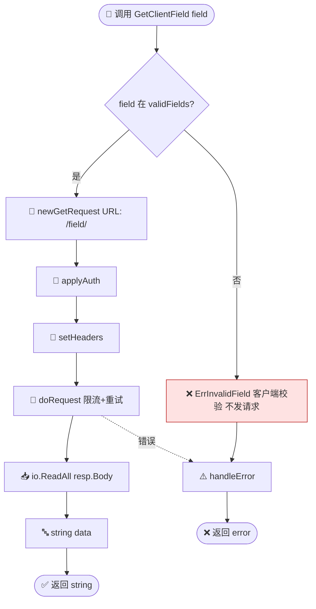
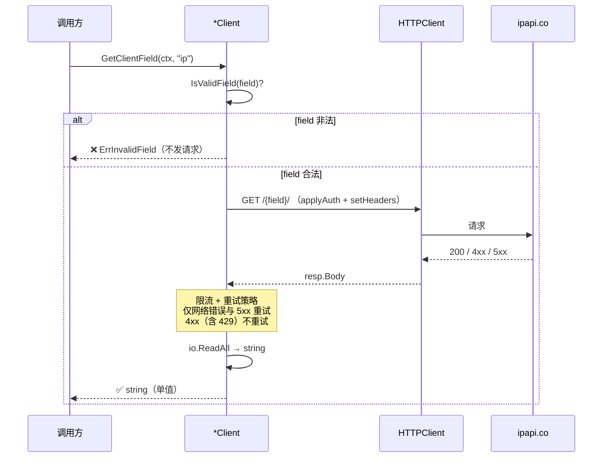

# GetClientField 🎯📡

> 查询客户端出口 IP 的单个字段。

::: tip 🚀 最轻量的自我探测
想知道"我的公网 IP"或"我的时区"，`GetClientField` 是最省的路径：不传 IP、只取一个字段、返回纯文本字符串。典型用法：`client.GetClientField(ctx, "ip")`。
:::

## 签名

```go
func (c *Client) GetClientField(ctx context.Context, field string) (string, error)
```

## 端点

```
GET https://ipapi.co/{field}/
```

## 参数

| 参数 | 类型 | 说明 |
|------|------|------|
| `ctx` | `context.Context` | 超时/取消 |
| `field` | `string` | 字段名 |

## 返回

- `string`：字段值
- `error`

## 内部流程

::: tip 🎨 一图抵千言
`GetClientField` 与 `GetField` 几乎同构，唯一区别是 URL 不含 IP 段（`/{field}/` vs `/{ip}/{field}/`）。两者都不校验 IP，只校验 `field` 白名单。
:::



这张图展示"调用方视角"的端到端往返：从无 IP 输入，到 HTTP 请求/重试/单值返回的时序关系。



这张图展示"选型决策树"视角：什么时候该用 `GetClientField` 而不是兄弟方法。

```mermaid
flowchart TD
    Q([查谁？]) -->|我自己| Me{要几个字段?}
    Q -->|任意 IP| Ip{要几个字段?}

    Me -->|单字段| CF[✅ GetClientField]
    Me -->|全量| MAll{要结构化还是原始?}
    MAll -->|结构化 *IPInfo| MCI[GetClientIPInfo]
    MAll -->|原始 []byte| MCR[GetClientIPInfoRaw]

    Ip -->|单字段| GF[GetField]
    Ip -->|全量| IAll{要结构化还是原始?}
    IAll -->|结构化 *IPInfo| GII[GetIPInfo]
    IAll -->|原始 []byte| GIR[GetIPInfoRaw]

    classDef pick fill:#dcfce7,stroke:#15803d,stroke-width:2px
    class CF pick
```

::: warning ⚠️ 单字段≠更快的网络
`GetClientField` 省的是"序列化与解析"的开销，不是网络往返——它仍是一次完整 HTTP 请求。若要多个字段，[`GetClientIPInfo`](./get-client-ip-info) 一次往返拿全量通常更划算。
:::

## 示例

```go
// 只想知道自己公网 IP
myIP, _ := client.GetClientField(ctx, "ip")
fmt.Println("我的 IP:", myIP)

// 自己的时区
tz, _ := client.GetClientField(ctx, "timezone")
```

## 错误

| 错误 | 条件 |
|------|------|
| `ErrInvalidField` | `field` 非法（客户端校验） |

## 与 GetField 的区别

| 维度 | `GetField` | `GetClientField` |
|------|------------|------------------|
| 端点 | `/{ip}/{field}/` | `/{field}/` |
| 目标 | 指定 IP | 客户端出口 IP |
| IP 校验 | ❌ 不校验（同 `GetClientField`） | ❌ 不校验 |
| field 校验 | ✅ `validFields` 白名单 | ✅ `validFields` 白名单 |
| 典型场景 | 查任意 IP 的某字段 | 查"我自己"的某字段 |

::: details 🧭 四种查询方法选型矩阵
| 需求 | 推荐方法 |
|------|----------|
| 查任意 IP 全量 | [`GetIPInfo`](./get-ip-info) |
| 查任意 IP 原始字节 | [`GetIPInfoRaw`](./get-ip-info-raw) |
| 查任意 IP 单字段 | [`GetField`](./get-field) |
| 查我自己全量 | [`GetClientIPInfo`](./get-client-ip-info) |
| 查我自己原始字节 | [`GetClientIPInfoRaw`](./get-client-ip-info-raw) |
| 查我自己单字段 | `GetClientField` ✅ |
:::

## 下一步

- 📖 看 [`GetField`](./get-field)
- 📡 学 [客户端 IP 概念](/guide/client-ip)
- 🧪 看 [单字段示例](/examples/single-field)
