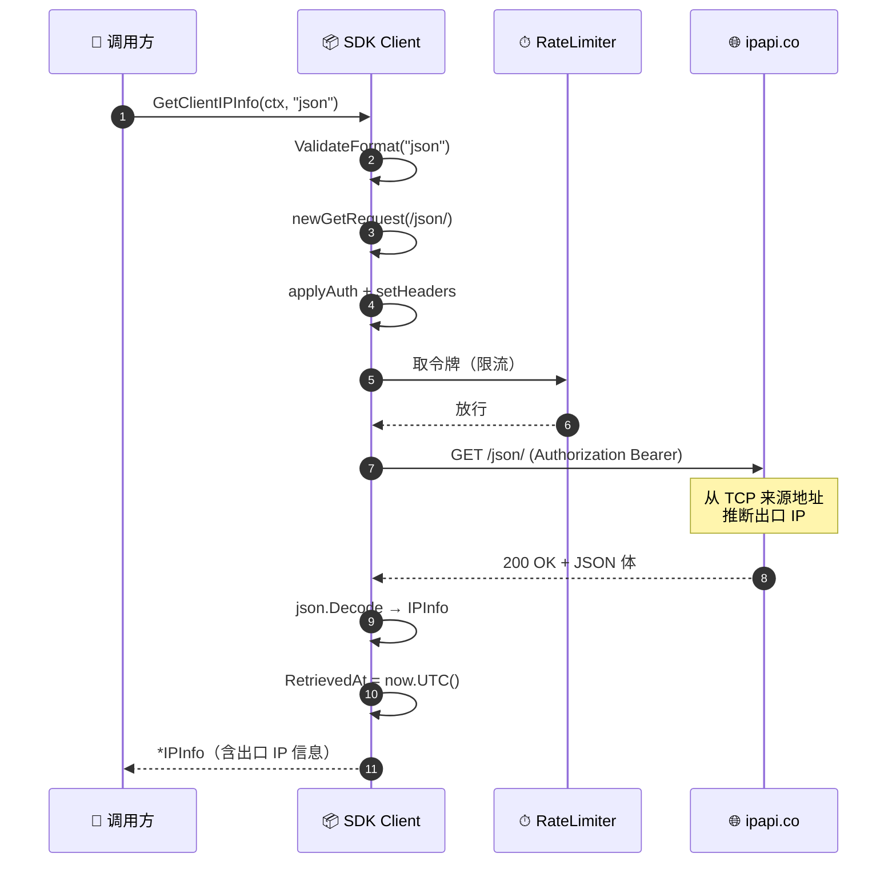
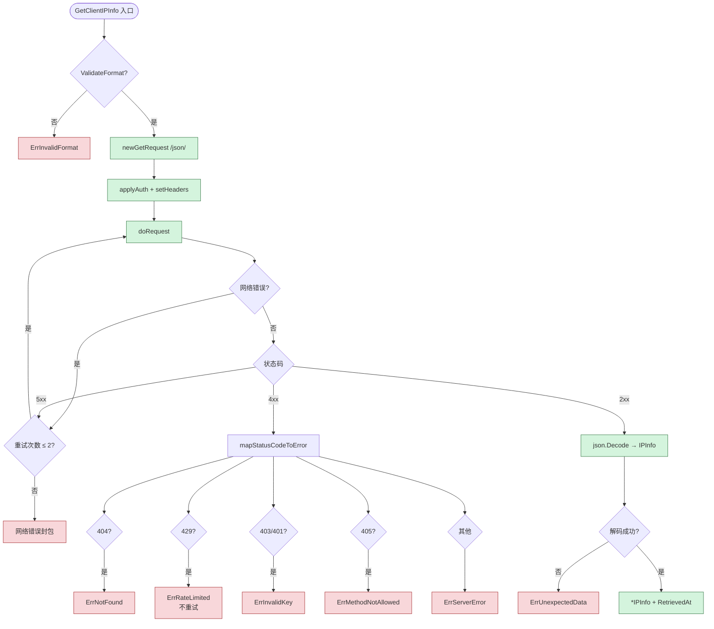
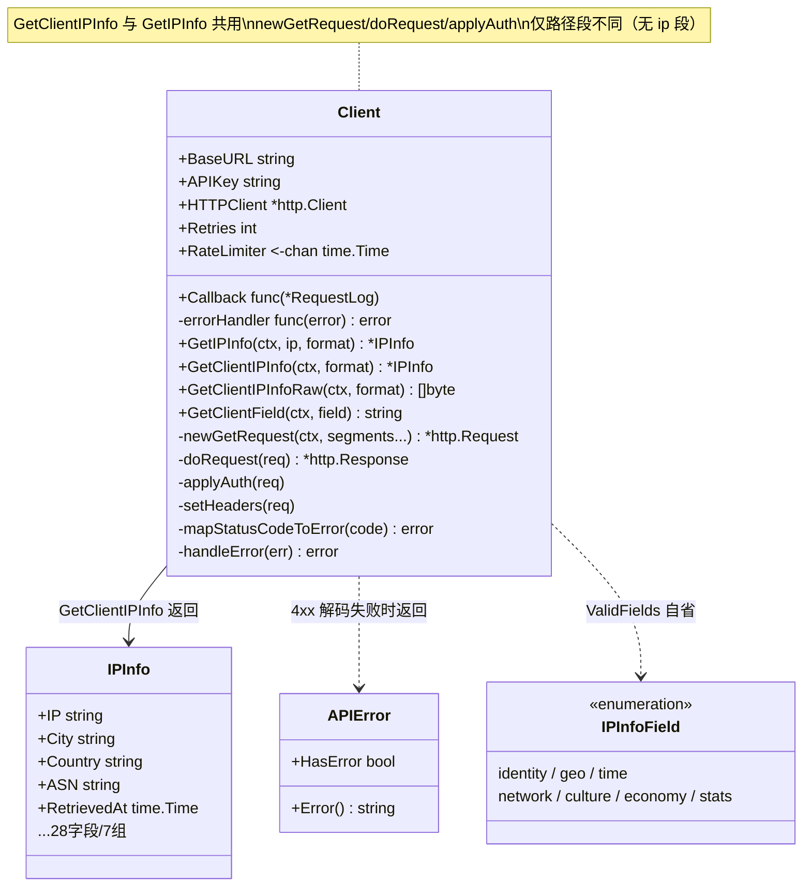

# GetClientIPInfo 📡

> 查询客户端（调用方）出口 IP 的完整信息。

::: tip 🚀 自我探测
`GetClientIPInfo` 不传 IP，路径里只有 `/{format}/`，服务端用**调用方出口 IP** 作为查询目标。常用于"我的公网 IP 是什么"场景。
:::

## 签名

```go
func (c *Client) GetClientIPInfo(ctx context.Context, format string) (*IPInfo, error)
```

## 端点

```
GET https://ipapi.co/{format}/
```

路径无 IP，服务端用调用方出口 IP。

## 请求时序

::: tip 🎨 一图抵千言
由于不传 IP，时序比 `GetIPInfo` 简洁：省去 `ValidateIP`，只校验 `format`。服务端从 TCP 连接的来源地址推断出口 IP。
:::



这张图展示**错误与重试决策视角**：从入口校验到响应解码，每一步可能产生什么错误、哪些错误会被重试。



::: warning ⚠ 重试边界
`doRequest` 仅对**网络错误**与 **5xx** 重试（最多 `Retries=2`，即最多 3 次请求）；**429（限流）与其它 4xx 不重试**，直接经 `mapStatusCodeToError` 映射为哨兵错误。详见 [`errors`](./errors) 与 [`client`](./client)。
:::

## 参数

| 参数 | 类型 | 说明 |
|------|------|------|
| `ctx` | `context.Context` | 超时/取消 |
| `format` | `string` | 传 `"json"` 才能解码为 `IPInfo` |

## 返回

- `*IPInfo`
- `error`

这张图展示**类型与方法的静态结构视角**：`GetClientIPInfo` 在 `*Client` 上的位置，以及它与"客户端 IP 系列"其它方法、`IPInfo`/`APIError` 类型、内部链路的依赖关系。



::: details 🔍 客户端 IP 系列方法对照
| 方法 | 返回 | 路径段 | 用途 |
|------|------|--------|------|
| [`GetClientIPInfo`](./get-client-ip-info) | `*IPInfo` | `/{format}/` | 结构化（仅 json 可解码） |
| [`GetClientIPInfoRaw`](./get-client-ip-info-raw) | `[]byte` | `/{format}/` | 任意格式原始字节 |
| [`GetClientField`](./get-client-field) | `string` | `/{field}/` | 单字段 |
:::

## 示例

```go
info, err := client.GetClientIPInfo(ctx, "json")
if err != nil {
	log.Fatal(err)
}
fmt.Printf("我的公网 IP: %s (%s)\n", info.IP, info.City)
```

## 与 GetIPInfo 的区别

| 维度 | `GetIPInfo` | `GetClientIPInfo` |
|------|-------------|-------------------|
| 端点 | `/{ip}/{format}/` | `/{format}/` |
| 校验 | `ValidateIP` + `ValidateFormat` | 仅 `ValidateFormat` |
| 目标 | 任意 IP | 调用方出口 IP |

## ⚠ 注意

返回的是 **SDK 所在机器** 的出口 IP，不是终端用户 IP。终端用户 IP 需从请求头取再用 `GetIPInfo` 查。详见 [客户端 IP 检测](/guide/client-ip)。

::: danger 🚨 常见误用
若你在**服务端**调用 `GetClientIPInfo`，拿到的是**你的服务器**出口 IP，不是访问你网站的终端用户 IP。要查终端用户，应：
1. 从 HTTP 请求头（`X-Forwarded-For` / `X-Real-IP` / `RemoteAddr`）取真实 IP
2. 用 [`GetIPInfo`](./get-ip-info) 查询该 IP
:::

::: details 🔧 服务端查终端用户的正确姿势
```go
func handler(w http.ResponseWriter, r *http.Request) {
    // 1. 从请求头/RemoteAddr 取终端用户 IP
    userIP := extractUserIP(r) // 解析 XFF/X-Real-IP

    // 2. 用 GetIPInfo 查终端用户 IP，而不是 GetClientIPInfo
    info, err := client.GetIPInfo(r.Context(), userIP, "json")
    if err != nil {
        http.Error(w, err.Error(), 500)
        return
    }
    json.NewEncoder(w).Encode(info)
}

func extractUserIP(r *http.Request) string {
    if xff := r.Header.Get("X-Forwarded-For"); xff != "" {
        return strings.Split(xff, ",")[0]
    }
    if xri := r.Header.Get("X-Real-IP"); xri != "" {
        return xri
    }
    ip, _, _ := net.SplitHostPort(r.RemoteAddr)
    return ip
}
```
:::

## 下一步

- 📖 看 [`GetClientIPInfoRaw`](./get-client-ip-info-raw)
- 📡 学 [客户端 IP 概念](/guide/client-ip)
- 🧪 看 [客户端 IP 示例](/examples/lookup-client-ip)
