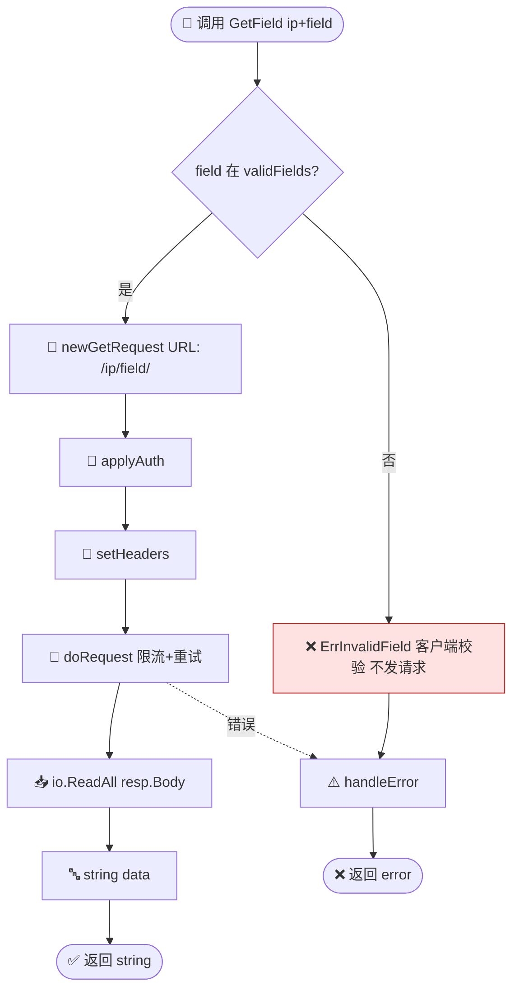
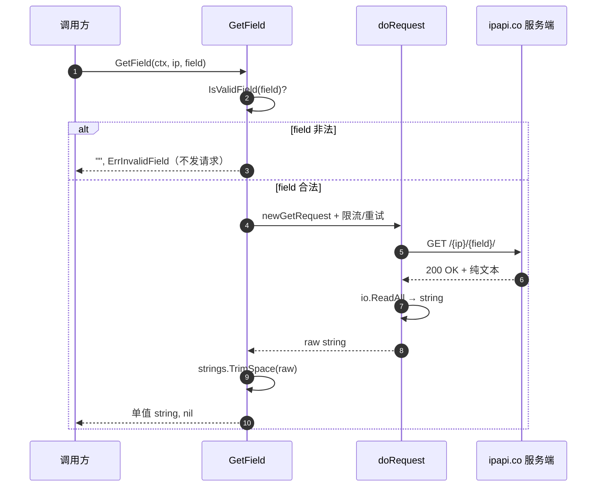

# GetField 🎯

> 查询指定 IP 的单个字段，返回纯文本字符串。

::: tip 🚀 单字段查询
当你只需要一个字段（如 `country_code` 或 `asn`），`GetField` 比拉取完整 `IPInfo` 更轻量。客户端会先校验字段名是否在白名单（`validFields`），非法字段**不发请求**直接报错。
:::

## 签名

```go
func (c *Client) GetField(ctx context.Context, ip, field string) (string, error)
```

## 端点

```
GET https://ipapi.co/{ip}/{field}/
```

## 参数

| 参数 | 类型 | 说明 |
|------|------|------|
| `ctx` | `context.Context` | 超时/取消 |
| `ip` | `string` | IPv4/IPv6 |
| `field` | `string` | 字段名，见下表 |

## 返回

- `string`：字段值（纯文本）
- `error`

::: tip 💡 注意：不校验 IP 格式
`GetField` 只校验 `field` 是否合法（查 `validFields`），**不**调 `ValidateIP`。IP 格式错误由服务端返回。这是有意为之——某些字段查询对 IP 容错性更高。
:::

## 合法字段（28 个）

`ip` `network` `version` `city` `region` `region_code` `country` `country_name` `country_code` `country_code_iso3` `country_capital` `country_tld` `continent_code` `in_eu` `postal` `latitude` `longitude` `latlong` `timezone` `utc_offset` `languages` `country_calling_code` `currency` `currency_name` `country_area` `country_population` `asn` `org` `hostname`

按类别速查：

| 类别 | 常用字段 |
|------|----------|
| 🌐 网络标识 | `ip` `network` `version` `asn` `org` `hostname` |
| 📍 地理位置 | `city` `region` `region_code` `postal` `latitude` `longitude` `latlong` |
| 🏳 国家/地区 | `country` `country_name` `country_code` `country_code_iso3` `country_capital` `country_tld` `continent_code` `in_eu` |
| 🕐 时区 | `timezone` `utc_offset` |
| 💱 货币 | `currency` `currency_name` `country_calling_code` |
| 📊 其它 | `languages` `country_area` `country_population` |

详见 [字段总览](./fields)。

## 示例

```go
country, _ := client.GetField(ctx, "8.8.8.8", "country_code")
fmt.Println(country) // US

asn, _ := client.GetField(ctx, "8.8.8.8", "asn")
fmt.Println(asn) // AS15169
```

## 内部流程

::: tip 🎨 一图抵千言
`GetField` 的校验顺序与 `GetIPInfo` 不同：先查 `validFields` 白名单，**不**校验 IP 格式。返回值是 `string`，无解码步骤。
:::



下面这张时序图展示 `GetField` 在运行期与 `doRequest`、服务端、`TrimSpace` 之间的交互顺序与返回路径，补充上图静态调用链所不能体现的"时序与责任边界"视角。



下面这张决策树聚焦 `field` 合法性分支与各类返回/错误落点，从"输入校验"视角收束上文，便于快速判断"为什么没发请求"或"为什么拿到 error"。

```mermaid
flowchart TD
    In([输入: field]) --> Chk{IsValidField}
    Chk -->|否| Inv[❌ ErrInvalidField<br/>客户端守卫 不发请求]
    Chk -->|是| Req[🔗 发起 GET /{ip}/{field}/]
    Req --> Net{网络层}
    Net -->|5xx/超时| Retry[🔄 IsRetryableError<br/>重试 ≤3 次]
    Net -->|429| RL[⛔ ErrRateLimited<br/>不重试]
    Net -->|200| Trim[🔤 TrimSpace → 单值 string]
    Retry -->|仍失败| SrvErr[❌ ErrServerError]
    Retry -->|成功| Trim
    Trim --> Ok([✅ 返回 string])
    RL --> ErrOut([❌ 返回 error])
    SrvErr --> ErrOut
    Inv --> ErrOut

    classDef guard fill:#fee2e2,stroke:#b91c1c
    classDef ok fill:#dcfce7,stroke:#15803d
    class Inv guard
    class Ok ok
```

::: details 🔍 为什么不校验 IP？
`GetIPInfo` 调 `ValidateIP`，而 `GetField` 只校验 `field`。这是有意设计：某些字段查询（如 `ip` 本身、`asn`）对 IP 容错性更高，把 IP 合法性判断交给服务端，避免客户端过度拦截。红底节点即客户端侧的唯一守卫——`validFields` 白名单。
:::

## 错误

| 错误 | 条件 |
|------|------|
| `ErrInvalidField` | `field` 不在白名单（**客户端校验，不发请求**） |
| `ErrReservedIP` | 保留地址 |
| `ErrRateLimited` | 429 |

## 完整 vs 单字段

::: warning 💡 配额省钱小窍门
需要 **≥3 个字段**时，用 [`GetIPInfo`](./get-ip-info) 一次拿全量更划算——一次请求消耗一份配额。逐个 `GetField` 会按字段数累计请求。详见 [字段概念](/guide/field-concept)。
:::

| 需要字段数 | 推荐方法 | 请求数 | 说明 |
|------------|----------|--------|------|
| 1 个 | `GetField` | 1 | 最省，单字段直返 |
| 2 个 | `GetField` ×2 或 `GetIPInfo` | 2 / 1 | 视配额预算权衡 |
| ≥3 个 | `GetIPInfo` | 1 | 一次拿全量，最省配额 |

## 下一步

- 📖 看 [`GetClientField`](./get-client-field)
- 📋 看 [字段总览](./fields)
- 🧪 看 [单字段示例](/examples/single-field)
