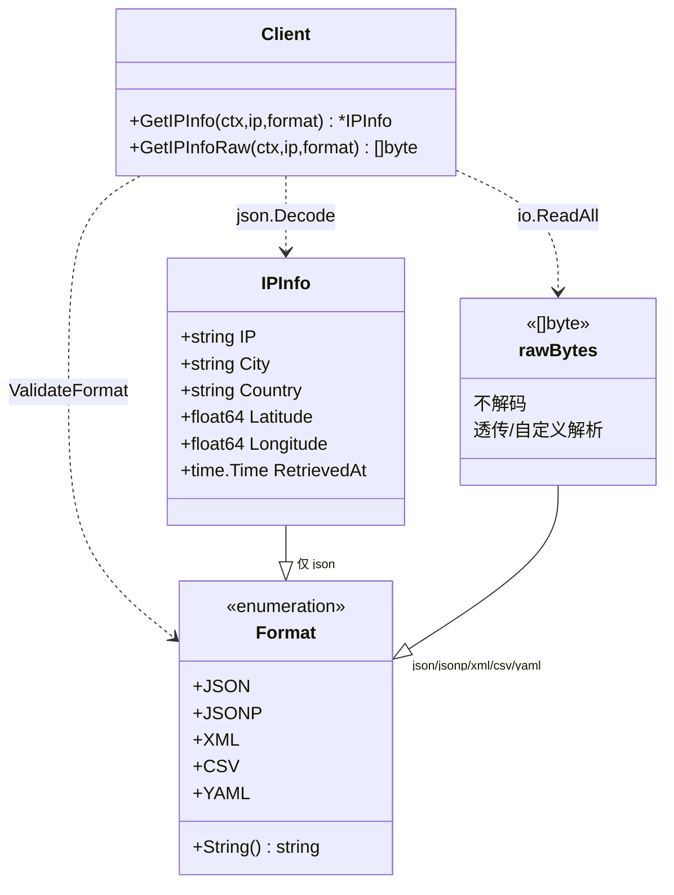
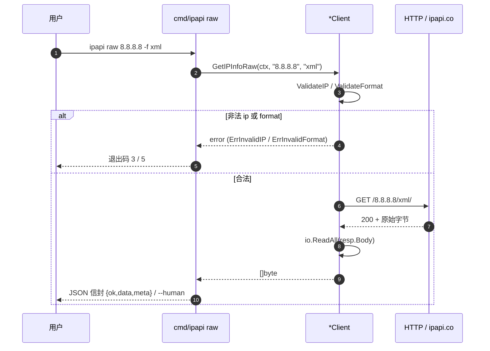

# GetIPInfoRaw 🧱

> 查询指定 IP，返回原始响应字节。用于 XML/CSV/YAML/JSONP。

::: tip 🎯 何时选它
当你需要的不是强类型结构，而是**原始字节**——透传给下游、自定义解析、或要 XML/CSV/YAML/JSONP 格式——就用 `GetIPInfoRaw`。它与 [`GetIPInfo`](./get-ip-info) 同端点，区别只在返回形态。
:::

## 签名

```go
func (c *Client) GetIPInfoRaw(ctx context.Context, ip string, format string) ([]byte, error)
```

## 端点

```
GET https://ipapi.co/{ip}/{format}/
```

与 [`GetIPInfo`](./get-ip-info) 同端点，区别在返回**原始字节**而非结构体。

## 两种调用形态对照

| 维度 | [`GetIPInfo`](./get-ip-info) | `GetIPInfoRaw` |
|------|------------------------------|----------------|
| 返回类型 | `*IPInfo`（强类型） | `[]byte`（原始字节） |
| 解码步骤 | `json.Decode` | `io.ReadAll`（不解码） |
| 支持格式 | 仅 `json` | `json`/`jsonp`/`xml`/`csv`/`yaml` |
| 典型场景 | 业务逻辑直接消费 | 透传 / 自定义解析 / 非 JSON |
| `RetrievedAt` | ✅ SDK 自动填 | ❌ 无（无结构体） |

## 类型关系视角

下面这张类图展示 `IPInfo`、`[]byte` 与 `Format` 三者的静态关系：同一端点按 `format` 分叉，`GetIPInfo` 走强类型解码，`GetIPInfoRaw` 走原始字节直读。



::: details 🧩 怎么读这张图
`Client` 依赖 `Format`（校验）、依赖 `IPInfo`（解码）与 `rawBytes`（直读）。底部两条实线标注各自支持的格式范围：`IPInfo` 只对应 `json`，`rawBytes` 覆盖全部五种格式——这正是选 `GetIPInfoRaw` 的核心理由。
:::

## 参数

| 参数 | 类型 | 说明 |
|------|------|------|
| `ctx` | `context.Context` | 超时/取消 |
| `ip` | `string` | IPv4/IPv6 |
| `format` | `string` | `json`/`jsonp`/`xml`/`csv`/`yaml` |

## 返回

- `[]byte`：原始响应体
- `error`

## 示例

```go
xmlData, err := client.GetIPInfoRaw(ctx, "8.8.8.8", string(ipapi.FormatXML))
if err != nil {
	log.Fatal(err)
}
fmt.Println(string(xmlData))

csvData, _ := client.GetIPInfoRaw(ctx, "8.8.8.8", string(ipapi.FormatCSV))
yamlData, _ := client.GetIPInfoRaw(ctx, "8.8.8.8", string(ipapi.FormatYAML))
```

JSONP 需配 [`WithCallback`](./with-callback)：

```go
client := ipapi.NewClient(ipapi.WithCallback("cb"))
data, _ := client.GetIPInfoRaw(ctx, "8.8.8.8", string(ipapi.FormatJSONP))
// cb({"ip":"8.8.8.8",...})
```

## 内部流程

```mermaid
flowchart TD
    Start([🎯 调用 GetIPInfoRaw]) --> VIP{ValidateIP}
    VIP -->|非法| E1[❌ ErrInvalidIP]
    VIP -->|合法| VFmt{ValidateFormat}
    VFmt -->|非法| E2[❌ ErrInvalidFormat]
    VFmt -->|合法| Build[🔗 newGetRequest 拼接 URL]
    Build --> Auth[🔐 applyAuth]
    Auth --> UA[📝 setHeaders]
    UA --> Do[🔄 doRequest 限流+重试]
    Do --> Read[📥 io.ReadAll resp.Body]
    Read --> Out([✅ 返回 []byte])
    E1 --> HE[⚠️ handleError]
    E2 --> HE
    Do -.错误.-> HE
    HE --> ErrOut([❌ 返回 error])

    classDef raw fill:#fef3c7,stroke:#d97706
    class Read,Out raw
```

::: tip 🎨 一图抵千言
与 [`GetIPInfo`](./get-ip-info) 对比，黄底节点是关键分叉：这里**没有 `json.Decode`**，直接 `io.ReadAll` 读原始字节后返回。
:::

## 时序视角

下面这张时序图展示一次 `raw` 子命令调用从 CLI 入口到原始字节返回的全过程，重点在 `format` 分支如何决定最终的响应形态。



::: warning 🔄 格式决定端点路径，不决定解码
`format` 同时拼进 URL（`/8.8.8.8/{format}/`）和决定服务端返回形态，但 SDK **不做任何解码**——`json` 与 `xml` 走的是同一条 `io.ReadAll` 路径，差别只在 URL 后缀。若要解码为结构体，仅 `json` 可走 [`GetIPInfo`](./get-ip-info)。
:::

```
1. ValidateIP(ip)
2. ValidateFormat(format)
3. newGetRequest → applyAuth → setHeaders → doRequest
4. io.ReadAll(resp.Body) → []byte
5. handleError
```

注意：**没有** `json.Decode` 步骤，直接读原始字节。

## 何时用

- ✅ XML / CSV / YAML / JSONP 格式
- ✅ 需要自定义解析逻辑
- ✅ 透传给其它系统

::: details 📋 各格式返回示例
```xml
<!-- FormatXML -->
<?xml version="1.0" encoding="UTF-8"?>
<ApiResponse><ip>8.8.8.8</ip><city>Mountain View</city>...</ApiResponse>
```

```csv
<!-- FormatCSV -->
ip,city,country,latitude,longitude,timezone
8.8.8.8,Mountain View,US,37.4056,-122.0775,America/Los_Angeles
```

```yaml
# FormatYAML
ip: 8.8.8.8
city: Mountain View
country: US
```

```javascript
// FormatJSONP（需 WithCallback("cb")）
cb({"ip":"8.8.8.8","city":"Mountain View",...})
```
:::

若用 JSON 且要强类型，用 [`GetIPInfo`](./get-ip-info)。

::: warning ⚠️ JSONP 必须配回调
传 `format=jsonp` 时，若 `Client` 未设 `Callback`，服务端可能返回未包裹的 JSON。务必通过 [`WithCallback`](./with-callback) 设置回调名。
:::

## 下一步

- 📖 看 [`GetIPInfo`](./get-ip-info)
- 🎨 学 [多格式响应](/guide/formats)
- 🧪 看 [多格式示例](/examples/raw-formats)
