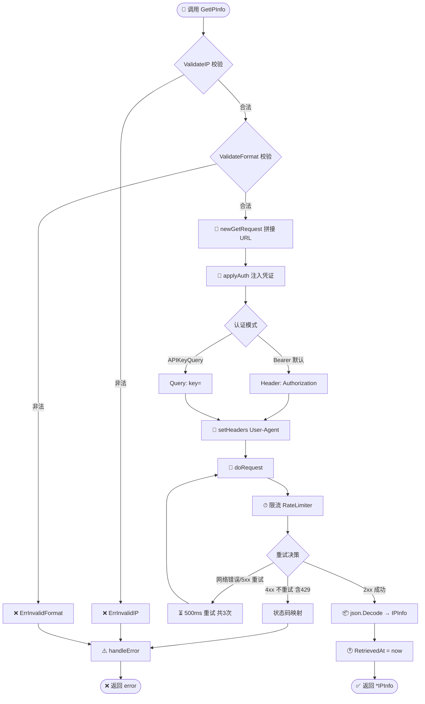
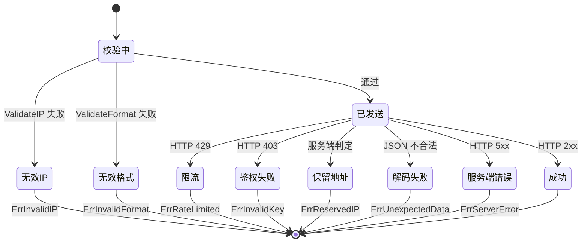

# GetIPInfo 🌐

> 查询指定 IP 的完整信息，返回强类型 `*IPInfo`。

::: tip 🚀 核心入口
`GetIPInfo` 是 SDK 中最常用的方法：一次请求拿到 28 个字段的完整地理信息，并解码为强类型结构体。需要原始字节或非 JSON 格式时，改用 [`GetIPInfoRaw`](./get-ip-info-raw)。
:::

## 签名

```go
func (c *Client) GetIPInfo(ctx context.Context, ip string, format string) (*IPInfo, error)
```

## 端点

```
GET https://ipapi.co/{ip}/{format}/
```

仅当 `format == "json"` 时能解码为 `IPInfo`；其它格式请用 [`GetIPInfoRaw`](./get-ip-info-raw)。

::: warning ⚠️ 格式约束
`GetIPInfo` 内部固定走 `json.Decode`。若传 `xml`/`csv`/`yaml`/`jsonp`，解码会失败并返回 `ErrUnexpectedData`。非 JSON 格式请改用 [`GetIPInfoRaw`](./get-ip-info-raw)。
:::

## 参数

| 参数 | 类型 | 说明 |
|------|------|------|
| `ctx` | `context.Context` | 超时/取消控制 |
| `ip` | `string` | IPv4 或 IPv6 |
| `format` | `string` | 响应格式，传 `"json"` |

## 返回

- `*IPInfo`：完整地理信息，[`RetrievedAt`](./models) 已填入查询时刻
- `error`：经 [`handleError`](./errors) 包装

::: info 📦 返回结构亮点
- `*IPInfo` 包含 28 个字段（地理、网络、货币、时区等）
- `Postal` 是 `*string`（部分国家无邮编，指针可区分"空"与"无"）
- `RetrievedAt` 在解码成功后由 SDK 写入 `time.Now().UTC()`，便于缓存与对账
:::

## 示例

```go
client := ipapi.NewClient()
ctx, cancel := context.WithTimeout(context.Background(), 5*time.Second)
defer cancel()

info, err := client.GetIPInfo(ctx, "8.8.8.8", "json")
if err != nil {
	log.Fatal(err)
}
fmt.Printf("%s, %s\n", info.City, info.CountryName)
```

## 内部流程



::: tip 🎨 一图抵千言
上图展示 `GetIPInfo` 从入参校验到返回结构体的完整链路。注意重试仅覆盖**网络错误与 5xx**，4xx（含 429 限流）直接走状态码映射，不重试。
:::

```
1. ValidateIP(ip)        → ErrInvalidIP
2. ValidateFormat(format) → ErrInvalidFormat
3. newGetRequest(ctx, BaseURL, ip, format)
4. applyAuth(req)         注入 Key/回调
5. setHeaders(req)        User-Agent
6. doRequest(req)         限流/重试/状态码映射
7. json.Decode → IPInfo
8. info.RetrievedAt = now
9. handleError(err)
```

## 错误



| 错误 | 条件 |
|------|------|
| `ErrInvalidIP` | `ip` 格式非法 |
| `ErrInvalidFormat` | `format` 非法 |
| `ErrReservedIP` | 保留地址 |
| `ErrRateLimited` | 429 |
| `ErrInvalidKey` | 403 |
| `ErrUnexpectedData` | JSON 解码失败 |
| `ErrServerError` | 5xx |

::: details 🔄 重试策略详解
- **触发条件**：仅网络错误（`HTTPClient.Do` 返回 err）或 HTTP `5xx`
- **不重试**：4xx（含 `429` 限流）—— 限流需退避而非重试，4xx 是客户端错误重试无意义
- **默认次数**：`Retries = 2`，即首次 + 2 次重试 = **共 3 次请求**
- **间隔**：固定 `500ms`（`defaultRetryDelay`）
- **耗尽后**：返回 `"request failed after N retries"` 或 `"server error after N retries"`
:::

## 下一步

- 📖 看 [`GetIPInfoRaw`](./get-ip-info-raw)
- 🧪 看 [查询指定 IP 示例](/examples/lookup-specific-ip)
- 🗺 看 [`IPInfo` 结构](./models)
