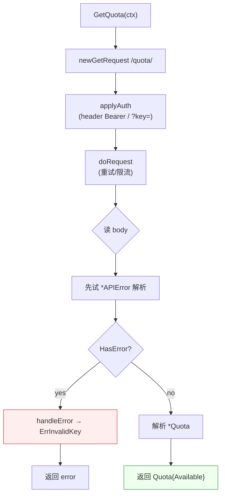

# GetQuota 📊🔑

> 查询当前 API key 的剩余 IP 查询配额。

::: tip 🚀 配额监控利器
`GetQuota` 对应 ipapi.co 的 `GET /quota/` endpoint——这是一个**官方 api-doc 未文档化、但稳定可用**的隐藏接口。配合定时任务可在配额耗尽前发出告警，避免生产环境突发 429。
:::

## 签名

```go
func (c *Client) GetQuota(ctx context.Context) (*Quota, error)
```

## 端点

```
GET https://ipapi.co/quota/
```

## 参数

| 参数 | 类型 | 说明 |
|------|------|------|
| `ctx` | `context.Context` | 超时/取消 |

无需 IP 参数，认证复用 `Client` 的 `APIKey` + `APIKeyMode`（与查询接口完全一致）。

## 返回

- `*Quota`：`{ Available string }`，`Available` 的三种取值见下表
- `error`：无效 key 时为 `ErrInvalidKey`，可被 `errors.Is` 匹配

### `Available` 取值

| 场景 | HTTP | 响应体 | `Available` | `AvailableInt()` |
|------|------|--------|-------------|-------------------|
| 有效 key | 200 | `{"available":"12345"}` | `"12345"` | `12345, true` |
| 未配置 key | 200 | `{"available":"API key needed"}` | `"API key needed"` | `0, false` |
| 无效/过期 key | 200 | `{"error":true,"reason":"Invalid Key",...}` | （返回 error） | — |

::: warning ⚠️ /quota/ 永远返回 200
与查询接口不同，`/quota/` 即使 key 无效也返回 HTTP 200，错误信息编码在 JSON body 的 `error` 字段里。`GetQuota` 内部会先尝试 `*APIError` 解析，识别为 `ErrInvalidKey`；"API key needed" 不视为错误（请求本身成功），由调用方决定是否 actionable。
:::

## 内部流程



## 示例

### 基础用法

```go
client := ipapi.NewClient(ipapi.WithAPIKey("your-key"))
q, err := client.GetQuota(ctx)
if err != nil {
    log.Fatal(err)
}
if n, ok := q.AvailableInt(); ok {
    fmt.Printf("剩余配额: %d 次\n", n)
} else {
    fmt.Println("状态:", q.Available) // "API key needed" 等
}
```

### 配额告警（低于阈值告警）

```go
q, _ := client.GetQuota(ctx)
if n, ok := q.AvailableInt(); ok && n < 1000 {
    alertSlack("ipapi 配额仅剩 %d，请及时充值", n)
}
```

### 搭配 CLI

```bash
ipapi quota                       # JSON 信封
ipapi quota -H                    # 人类可读
IPAPI_API_KEY=xxx ipapi quota | jq '.data.available'
```

## 错误处理

| `errors.Is` 匹配 | 触发条件 | retryable |
|---|---|---|
| `ErrInvalidKey` | API key 无效/过期 | 否 |
| `ErrUnexpectedData` | 响应非 JSON | 否 |
| `ErrServerError` | 5xx（罕见） | 是 |
| `ErrRateLimited` | 429 | 是 |

## 相关

- [Quota 数据模型](/api/models#quota)
- [CLI `quota` 命令](/cli/command-quota)
- [配额监控 cookbook](/cookbook/quota-monitoring)
- [认证机制](/guide/auth-concept)
