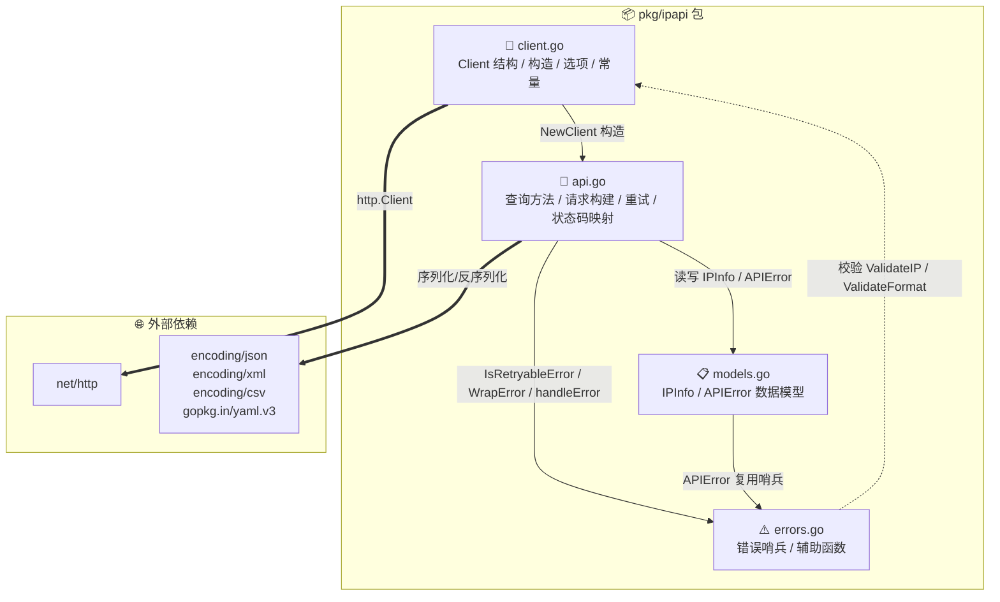
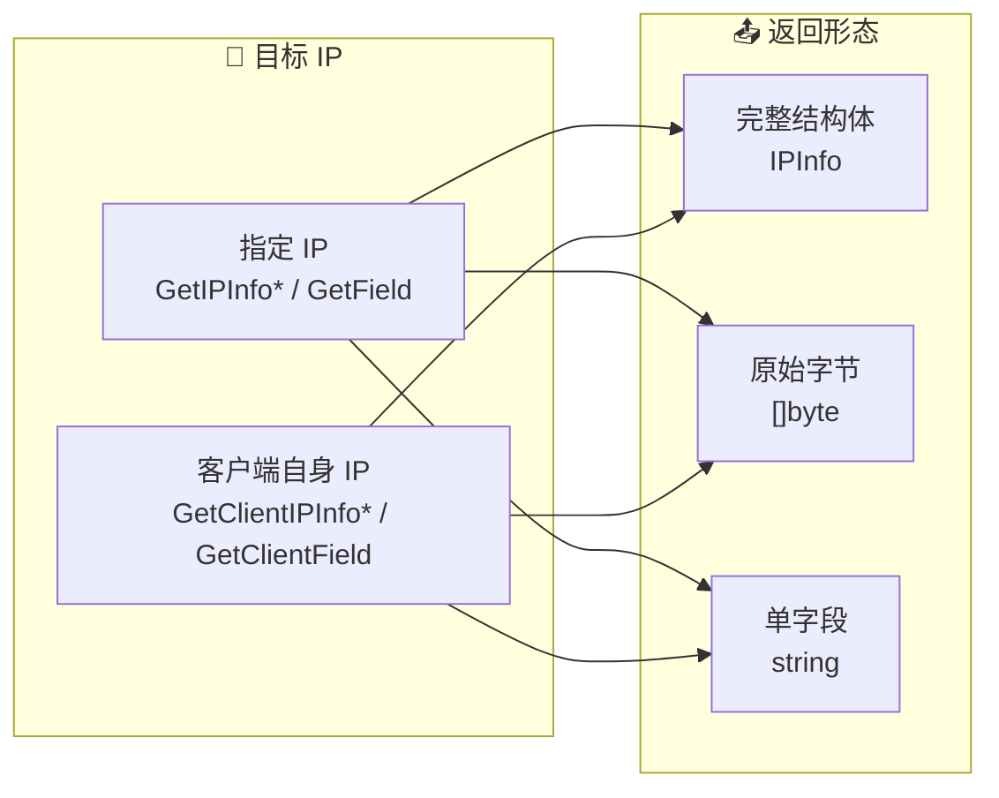

# 📦 ipapi 包总览

> `github.com/cyberspacesec/ipapi.co-skills/pkg/ipapi`

## 包简介

`ipapi` 包是 ipapi.co IP 地理位置 API 的 Go 客户端。它提供线程安全的 `Client`、6 个查询方法、5 种响应格式、10 个错误哨兵值，以及函数式选项配置。

::: tip 💡 一图抵千言
下面的模块依赖图展示了 `pkg/ipapi` 内四个源文件的职责分工与调用关系，帮你快速建立全局心智模型。
:::



::: info 🎯 设计要点
- **client.go** 是地基：定义 `Client`、`Format`、`APIKeyMode`、`ClientOption` 与默认常量，其余文件都围绕它展开。
- **api.go** 是主干：6 个查询方法统一走 `doRequest`（限流 → 重试 → 状态码映射），并通过 `applyAuth`、`newGetRequest` 组装请求。
- **models.go** 与 **errors.go** 是横切关注点：被 `api.go` 读写，彼此也存在引用（`APIError` 复用哨兵错误）。
:::

## 文件构成

| 文件 | 行数 | 职责 |
|------|------|------|
| [`client.go`](./client) | 129 | Client 结构、构造、选项、常量 |
| [`api.go`](./methods) | 307 | 查询方法、请求构建、重试、状态码映射 |
| [`models.go`](./models) | 96 | IPInfo、APIError 数据模型 |
| [`errors.go`](./errors) | 39 | 错误处理与辅助函数 |

### 能力矩阵 🧩

| 能力维度 | 取值 | 数量 | 对应位置 |
|----------|------|------|----------|
| 查询方法 | `GetIPInfo` / `GetIPInfoRaw` / `GetField` / `GetClientIPInfo` / `GetClientIPInfoRaw` / `GetClientField` | 6 | `api.go` |
| 响应格式 | `json` / `jsonp` / `xml` / `csv` / `yaml` | 5 | `client.go` `Format` |
| 认证方式 | Bearer Header（默认）/ `?key=` Query | 2 | `client.go` `APIKeyMode` |
| 错误哨兵 | `ErrInvalidIP` 等 | 10 | `errors.go` |
| 配置选项 | `WithAPIKey` 等 | 10 | `client.go` |

::: details 📁 源文件行数说明
表中行数为参考值，会随版本演进变化。如需查看最新源码，可访问 [GitHub 仓库](https://github.com/cyberspacesec/ipapi.co-skills/blob/main/pkg/ipapi/) 对应文件。
:::

## 核心类型

| 类型 | 说明 | 文档 |
|------|------|------|
| `Client` | HTTP 客户端 | [→](./client) |
| `IPInfo` | 完整 IP 信息结构体 | [→](./models) |
| `APIError` | 服务端错误结构体 | [→](./models) |
| `Format` | 响应格式类型 | [→](./client) |
| `APIKeyMode` | 认证方式枚举 | [→](./client) |
| `ClientOption` | 配置函数类型 | [→](./options) |

## 核心函数

| 函数 | 说明 | 文档 |
|------|------|------|
| `NewClient` | 构造客户端 | [→](./new-client) |
| `ValidateIP` | 校验 IP 格式 | [→](./validate-ip) |
| `ValidateFormat` | 校验格式 | [→](./validate-format) |
| `IsRetryableError` | 判断可重试 | [→](./is-retryable) |
| `WrapError` | 包装错误 | [→](./wrap-error) |

## 核心方法（6 个）

| 方法 | 说明 | 文档 |
|------|------|------|
| `GetIPInfo` | 指定 IP 完整信息 | [→](./get-ip-info) |
| `GetIPInfoRaw` | 指定 IP 原始响应 | [→](./get-ip-info-raw) |
| `GetField` | 指定 IP 单字段 | [→](./get-field) |
| `GetClientIPInfo` | 客户端 IP 完整信息 | [→](./get-client-ip-info) |
| `GetClientIPInfoRaw` | 客户端 IP 原始响应 | [→](./get-client-ip-info-raw) |
| `GetClientField` | 客户端 IP 单字段 | [→](./get-client-field) |

6 个方法沿两条正交维度划分：**目标 IP**（指定 IP / 客户端自身 IP）× **返回形态**（完整结构体 / 原始字节 / 单字段字符串）。



::: tip 🔍 方法命名规律
- 前缀 `Get` = 指定 IP；前缀 `GetClient` = 查询调用方自身出口 IP。
- 后缀 无 = 返回 `IPInfo` 结构体；后缀 `Raw` = 返回原始 `[]byte`；后缀 `Field` = 返回单字段 `string`。
掌握这两个维度，6 个方法的语义即可一键推导。
:::

## 选项函数（5 个）

| 选项 | 说明 | 文档 |
|------|------|------|
| `WithAPIKey` | 设 API Key | [→](./with-api-key) |
| `WithAPIKeyQuery` | query 参数认证 | [→](./with-api-key-query) |
| `WithCustomHTTPClient` | 自定义 HTTP 客户端 | [→](./with-custom-http-client) |
| `WithErrorHandler` | 自定义错误处理 | [→](./with-error-handler) |
| `WithCallback` | JSONP 回调 | [→](./with-callback) |
| `WithBaseURL` | 覆盖 API 基地址 | [→](./with-base-url) |
| `WithUserAgent` | 覆盖 UA 头 | [→](./with-user-agent) |
| `WithRetries` | 重试次数 | [→](./with-retries) |
| `WithTimeout` | 单请求超时 | [→](./with-timeout) |
| `WithRateLimiter` | 客户端侧限流 | [→](./with-rate-limiter) |

### 选项决策表 🤔

| 场景 | 推荐选项 | 说明 |
|------|----------|------|
| 生产环境默认认证 | `WithAPIKey` | 走 Bearer Header，密钥不落入 URL/日志 |
| 受限网络必须 query 认证 | `WithAPIKeyQuery` | 改用 `?key=`，便于代理/网关透传 |
| 需要自定义超时/传输层 | `WithCustomHTTPClient` | 注入自研 `http.Client` |
| 统一错误日志/上报 | `WithErrorHandler` | 拦截错误做侧车处理 |
| 跨域脚本拿到 JSONP | `WithCallback` | 配合 `FormatJSONP` 使用 |

::: warning ⚠️ 认证方式选择
`WithAPIKey`（Header）与 `WithAPIKeyQuery`（Query）二选一，后设置者覆盖前者。**优先使用 Header 模式**：query 参数会把 API Key 暴露在 URL、访问日志与 Referer 中，存在泄露风险。
:::

## 快速导入

```go
import "github.com/cyberspacesec/ipapi.co-skills/pkg/ipapi"
```

::: info 🚀 30 秒上手
最小可用示例：构造客户端 → 查询指定 IP → 读取字段。
:::

```go
package main

import (
    "fmt"
    "log"

    "github.com/cyberspacesec/ipapi.co-skills/pkg/ipapi"
)

func main() {
    c, err := ipapi.NewClient(ipapi.WithAPIKey("YOUR_API_KEY"))
    if err != nil {
        log.Fatal(err)
    }

    info, err := c.GetIPInfo(c, "8.8.8.8")
    if err != nil {
        log.Fatal(err)
    }
    fmt.Printf("国家: %s, 城市: %s\n", info.Country, info.City)
}
```

::: details 📚 进阶：原始响应与单字段
- 拿原始字节（按格式序列化）：`c.GetIPInfoRaw(c, "8.8.8.8", ipapi.FormatJSON)`
- 拿单字段字符串：`c.GetField(c, "8.8.8.8", "country")`
- 查自身出口 IP：把方法名里的 `GetIPInfo` 换成 `GetClientIPInfo`，且不需传 IP 参数。
:::

## 下一步

- 🧭 先看 [Client](./client)
- 📖 浏览 [方法详解](./methods)
- 🧪 跑 [示例](/examples/basic-usage)
