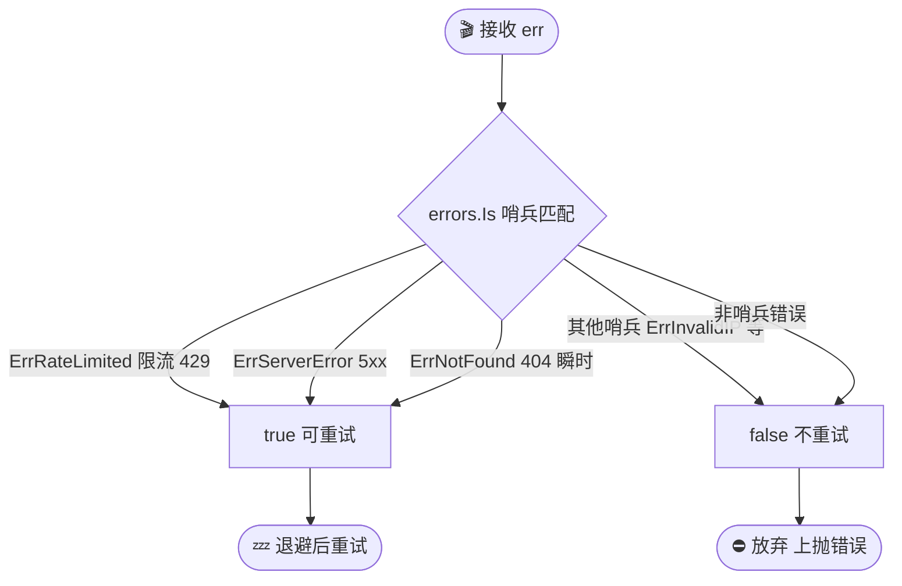
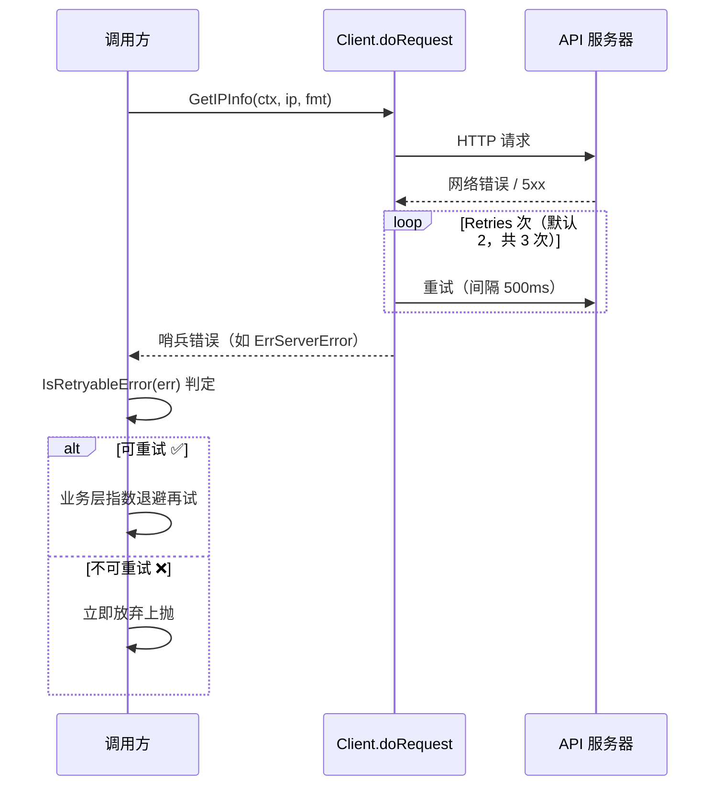

# IsRetryableError

> 判断错误是否值得重试。

## 签名

```go
func IsRetryableError(err error) bool
```

## 作用

返回 `true` 的错误：

- [`ErrRateLimited`](./errors)（限流）
- [`ErrServerError`](./errors)（5xx）
- [`ErrNotFound`](./errors)（404，瞬时）

::: tip 🎨 一图抵千言
`IsRetryableError` 的判定逻辑：三类哨兵错误放行重试，其余立即放弃。
:::



::: warning ⚠️ 429 与 4xx 的关键差异
`ErrRateLimited`（对应 HTTP 429）虽属 4xx，但被**单独标记为可重试**——因为限流是暂时的，稍后重试很可能成功。其余 4xx（如 400/401/403）通常是请求本身的永久性问题，重试无意义。
:::

| 哨兵错误 | HTTP 状态 | 是否重试 | 原因 |
|----------|-----------|----------|------|
| `ErrRateLimited` | 429 | ✅ 是 | 限流瞬时，稍后恢复 |
| `ErrServerError` | 5xx | ✅ 是 | 服务端临时故障 |
| `ErrNotFound` | 404 | ✅ 是 | 资源瞬时缺失 |
| `ErrInvalidIP` | 400 | ❌ 否 | IP 格式永久错误 |
| `ErrUnauthorized` | 401 | ❌ 否 | 认证永久失败 |
| `ErrForbidden` | 403 | ❌ 否 | 权限永久拒绝 |

## 实现

```go
func IsRetryableError(err error) bool {
	return errors.Is(err, ErrRateLimited) ||
		errors.Is(err, ErrServerError) ||
		errors.Is(err, ErrNotFound)
}
```

## 示例

### 业务层重试

```go
var info *ipapi.IPInfo
for attempt := 0; attempt < 3; attempt++ {
	info, err = client.GetIPInfo(ctx, ip, "json")
	if err == nil {
		break
	}
	if !ipapi.IsRetryableError(err) {
		break // 不可重试，放弃
	}
	time.Sleep(time.Duration(1<<attempt) * time.Second) // 指数退避
}
```

### 跳过非重试错误

```go
for _, ip := range ips {
	info, err := client.GetIPInfo(ctx, ip, "json")
	if err != nil && !ipapi.IsRetryableError(err) {
		continue // 客户端错误（如 ErrInvalidIP），直接跳过
	}
}
```

## 与内置重试的关系

`doRequest` 已对**网络错误和 5xx**自动重试 `Retries` 次。`IsRetryableError` 用于：

- 业务层做**更复杂**的退避策略
- 区分「该重试」与「该放弃」
- 限流（`ErrRateLimited`）的长时间退避



::: details 🔍 内置重试 vs 业务层重试，何时用哪个？
- **内置重试（`doRequest`）**：已覆盖网络错误和 5xx，默认 `Retries=2`（共 3 次请求），间隔 500ms。开箱即用，零配置。
- **业务层重试**：需要更长退避（如限流后等 10s）、跨请求编排（批量 IP 中跳过永久错误）、或自定义退避曲线（指数/抖动）时使用。
- **二者叠加**：内置重试先扛住瞬时抖动，业务层再用 `IsRetryableError` 做策略性兜底，互不冲突。
:::

::: warning ⚠️ 4xx 不在内置重试范围
`doRequest` 只重试**网络错误和 5xx**，4xx（含 429 限流）**不会被内置重试**。若需要对 429 做长时间退避，必须在业务层调用 `IsRetryableError` 自行处理。
:::

## 下一步

- 🔄 学 [重试与限流](/guide/retry-concept)
- 🛡 看 [错误类型](./errors)
- 📖 看 [`WrapError`](./wrap-error)
