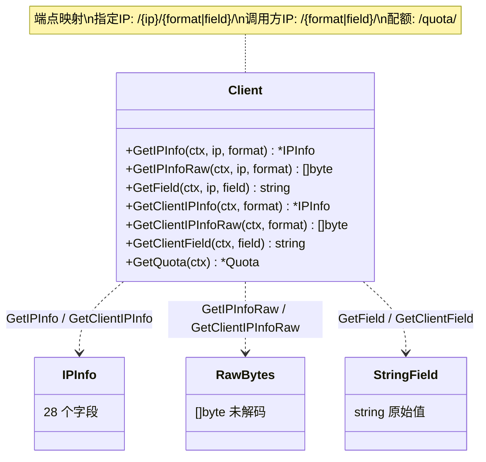
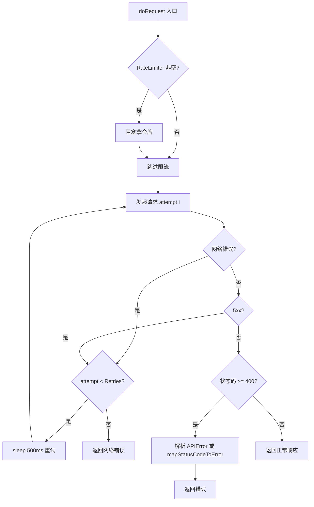
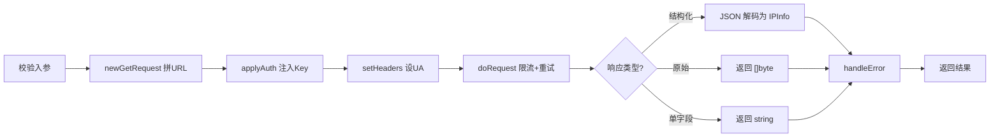

# 🔧 API 方法

> `pkg/ipapi/api.go` — 6 个查询方法 + 1 个配额方法与请求基础设施。

## 方法总览

| 方法 | 端点 | 返回 | 文档 |
|------|------|------|------|
| `GetIPInfo(ctx, ip, format)` | `GET /{ip}/{format}/` | `*IPInfo` | [→](./get-ip-info) |
| `GetIPInfoRaw(ctx, ip, format)` | `GET /{ip}/{format}/` | `[]byte` | [→](./get-ip-info-raw) |
| `GetField(ctx, ip, field)` | `GET /{ip}/{field}/` | `string` | [→](./get-field) |
| `GetClientIPInfo(ctx, format)` | `GET /{format}/` | `*IPInfo` | [→](get-client-ip-info) |
| `GetClientIPInfoRaw(ctx, format)` | `GET /{format}/` | `[]byte` | [→](get-client-ip-info-raw) |
| `GetClientField(ctx, field)` | `GET /{field}/` | `string` | [→](get-client-field) |
| `GetQuota(ctx)` | `GET /quota/` | `*Quota` | [→](get-quota) |

::: tip 🎨 一图抵千言
6 个查询方法按「目标 IP」与「返回类型」两个维度划分：左半边查指定 IP，右半边查调用方 IP；每半边的三个方法分别返回结构化、原始字节、单字段。`GetQuota` 独立成线，查询 API key 剩余配额。
:::



## 内部基础设施

### newGetRequest

```go
func newGetRequest(ctx context.Context, baseURL string, segments ...string) (*http.Request, error)
```

拼接 `baseURL` + 路径段 + `/`，创建 GET 请求。用 `path.Join` 处理 IPv6 冒号。

```go
// newGetRequest(ctx, "https://ipapi.co/", "8.8.8.8", "json")
// → GET https://ipapi.co/8.8.8.8/json/
```

### doRequest

```go
func (c *Client) doRequest(req *http.Request) (*http.Response, error)
```

核心调度：
1. 限流：`RateLimiter` 非空则阻塞拿令牌
2. 重试：循环 `0..Retries`，仅网络错误/5xx 重试，间隔 500ms
3. 错误映射：`StatusCode >= 400` 时解析 `APIError` 或调 `mapStatusCodeToError`

::: tip 🎨 一图抵千言
`doRequest` 是所有 6 个方法的统一执行管道，三段式处理：限流放行 → 重试循环 → 错误映射。
:::



### applyAuth

```go
func (c *Client) applyAuth(req *http.Request)
```

注入 API Key（Header/Query）与 JSONP 回调。详见 [`WithAPIKey`](./with-api-key)。

### setHeaders

```go
func (c *Client) setHeaders(req *http.Request)
```

设置 `User-Agent`。

### mapStatusCodeToError

```go
func (c *Client) mapStatusCodeToError(code int) error
```

HTTP 状态码到哨兵错误的兜底映射：

| 状态码 | 错误 | 含义 |
|--------|------|------|
| 400 | `ErrServerError` | 请求格式错误 |
| 403 | `ErrInvalidKey` | API Key 无效 |
| 404 | `ErrNotFound` | 资源不存在 |
| 405 | `ErrMethodNotAllowed` | 方法不允许 |
| 429 | `ErrRateLimited` | 触发限流 |
| 500 | `ErrServerError` | 服务端内部错误 |
| 其它 | `unexpected status code: N` | 未预期状态码 |

::: warning ⚠️ 4xx 不重试
`doRequest` 仅对**网络错误和 5xx** 重试。4xx（含 429 限流）被视为客户端错误，不重试——因为重试同样会失败，反而可能加剧限流惩罚。
:::

## 合法字段

`validFields` map 包含 28 个合法字段名，供 [`GetField`](./get-field) / [`GetClientField`](./get-client-field) 校验。完整清单见 [字段总览](./fields)。

## 通用流程

所有方法遵循相同模式：

```
校验入参 → newGetRequest → applyAuth → setHeaders → doRequest → 解码/raw → handleError
```

::: tip 🎨 一图抵千言
所有 6 个方法共享同一条调用链，差异仅在「入参校验」和「响应解码」两端。
:::



详见各方法文档。

## 下一步

- 📖 逐个看方法：[`GetIPInfo`](./get-ip-info) 等
- 🗂 看 [字段总览](./fields)
- 🧭 学 [字段查询概念](/guide/field-concept)
