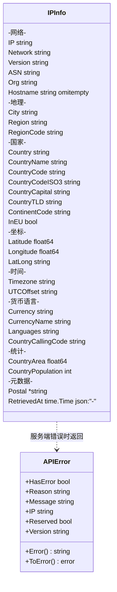
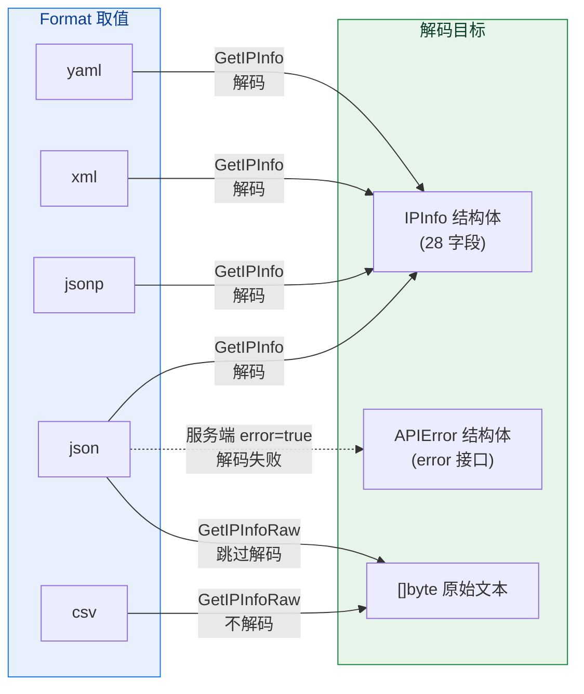
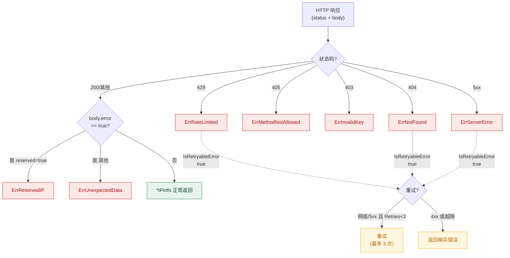

# 🗃 数据模型

> `pkg/ipapi/models.go` — `IPInfo` 与 `APIError` 结构体及辅助方法。

## IPInfo

完整的 IP 地理信息结构体，JSON 解码目标：

```go
type IPInfo struct {
	IP                 string    `json:"ip"`
	Network            string    `json:"network"`
	Version            string    `json:"version"`
	City               string    `json:"city"`
	Region             string    `json:"region"`
	RegionCode         string    `json:"region_code"`
	Country            string    `json:"country"`
	CountryName        string    `json:"country_name"`
	CountryCode        string    `json:"country_code"`
	CountryCodeISO3    string    `json:"country_code_iso3"`
	CountryCapital     string    `json:"country_capital"`
	CountryTLD         string    `json:"country_tld"`
	ContinentCode      string    `json:"continent_code"`
	InEU               bool      `json:"in_eu"`
	Postal             *string   `json:"postal"`
	Latitude           float64   `json:"latitude"`
	Longitude          float64   `json:"longitude"`
	LatLong            string    `json:"latlong"`
	Timezone           string    `json:"timezone"`
	UTCOffset          string    `json:"utc_offset"`
	CountryCallingCode string    `json:"country_calling_code"`
	Currency           string    `json:"currency"`
	CurrencyName       string    `json:"currency_name"`
	Languages          string    `json:"languages"`
	CountryArea        float64   `json:"country_area"`
	CountryPopulation  int       `json:"country_population"`
	ASN                string    `json:"asn"`
	Org                string    `json:"org"`
	Hostname           string    `json:"hostname,omitempty"`
	RetrievedAt        time.Time `json:"-"`
}
```

字段含义按类别见：
- [网络字段](./field-network)
- [地理字段](./field-geo)
- [国家字段](./field-country)
- [坐标字段](./field-coord)
- [时间字段](./field-time)
- [货币/语言](./field-currency)
- [ASN 字段](./field-asn)
- [统计字段](./field-stats)

::: tip 🎨 一图抵千言
`IPInfo` 共 28 个字段，按语义分 8 组。下图展示分组归属与字段类型。
:::



::: tip 🌐 视角二：Format 与结构体的类型关系
这张图展示 5 种 `Format` 如何映射到不同的解码目标——`json`/`jsonp`/`xml`/`yaml` 解码进 [`IPInfo`](#ipinfo) 或 [`APIError`](#apierror)，而 `csv` 是纯文本无法解码。
:::



::: tip 🧭 视角三：从 APIError 到哨兵错误的决策树
这张图展示 `*Client` 内部 [`mapStatusCodeToError`](./client) 与 [`APIError`](#apierror) 的优先级：先看 HTTP 状态码（4xx 不重试、5xx 可重试），再看响应体 `error=true`，最后落到具体哨兵错误。
:::



::: details 📐 三张图的分工
| 图 | 视角 | 回答的问题 |
|----|------|------------|
| 上方 classDiagram | 结构 | `IPInfo` 28 字段怎么分组？类型是什么？ |
| 视角二 flowchart-LR | 类型 | 5 种 `Format` 各解码到哪个结构体？ |
| 视角三 flowchart-TD | 行为 | 一个响应如何决定成正常结果还是某个哨兵错误？能否重试？ |
:::

### 关键设计

- `Postal *string`：用指针，因为部分国家无邮政编码，需区分「空」与「无」。
- `RetrievedAt time.Time`：`json:"-"`，不参与序列化，由 SDK 填入查询时刻。
- `Hostname`：`omitempty`，可选 add-on 字段。

::: warning ⚠️ Postal 必须用 GetPostal 访问
`Postal` 是 `*string`，直接 `.Postal` 解引用在 nil 时会 panic。务必用 [`GetPostal`](#getpostal) 安全访问，或先判 nil。

```go
// ❌ 危险：nil 时 panic
fmt.Println(*info.Postal)

// ✅ 安全
fmt.Println(info.GetPostal())
```
:::

| 字段 | 类型 | 特殊标记 | 设计原因 |
|------|------|----------|----------|
| `Postal` | `*string` | — | 区分「空字符串」与「无邮政编码」 |
| `RetrievedAt` | `time.Time` | `json:"-"` | SDK 填查询时刻，不参与序列化 |
| `Hostname` | `string` | `omitempty` | 可选 add-on，无值则省略 |
| `InEU` | `bool` | — | 布尔直接零值即「不在 EU」，语义明确 |

## IPInfo 方法

### ParseLatLong

```go
func (info *IPInfo) ParseLatLong() (float64, float64, error)
```

解析 `LatLong` 字符串 `"lat,lon"` 为两个 `float64`。

```go
lat, lon, err := info.ParseLatLong()
// lat=37.4056, lon=-122.0775
```

详见 [坐标字段](./field-coord) / [示例](/examples/parse-latlong)。

### GetPostal

```go
func (info *IPInfo) GetPostal() string
```

安全获取 `Postal`，`nil` 时返回空字符串，避免空指针。

```go
fmt.Println(info.GetPostal()) // 不用判 nil
```

## APIError

服务端错误结构体：

```go
type APIError struct {
	HasError bool   `json:"error"`
	Reason   string `json:"reason"`
	Message  string `json:"message"`
	IP       string `json:"ip"`
	Reserved bool   `json:"reserved"`
	Version  string `json:"version"`
}
```

### Error 方法

```go
func (e *APIError) Error() string
```

实现 `error` 接口，区分保留 IP：

```go
// 普通错误
"ipapi error: <Message> (reason: <Reason>)"
// 保留 IP
"ipapi error: <Message> (reason: <Reason>, ip: <IP>, reserved: true)"
```

::: details 🔍 APIError 字段速查
| 字段 | 含义 | 示例 |
|------|------|------|
| `HasError` | 是否有错 | `true` |
| `Reason` | 错误原因短码 | `"RateLimited"` |
| `Message` | 人类可读说明 | `"You exceeded the limit..."` |
| `IP` | 出错的 IP | `"127.0.0.1"` |
| `Reserved` | 是否保留 IP | `true` |
| `Version` | API 版本 | `"1.0"` |

`Reserved=true` 时 `Error()` 输出会附带 `ip` 与 `reserved` 字段，便于排查保留 IP（如 `127.0.0.1`、`10.x`）的查询。
:::

### ToError

```go
func (e *APIError) ToError() error
```

返回 `e` 自身（保留兼容性）。

## ValidateIP

```go
func ValidateIP(ip string) error
```

用 `net.ParseIP` 校验 IP 格式，非法返回 [`ErrInvalidIP`](./errors)。详见 [ValidateIP 文档](./validate-ip)。

## 下一步

- 📋 看 [字段总览](./fields)
- 🛡 看 [错误类型](./errors)
- 🧪 看 [经纬度解析示例](/examples/parse-latlong)
