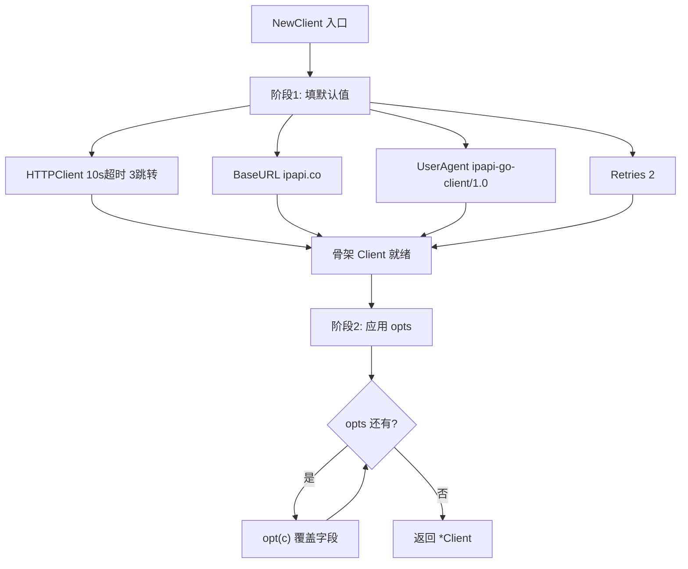
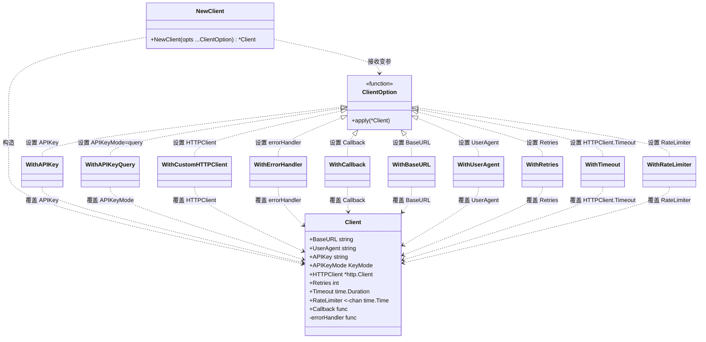
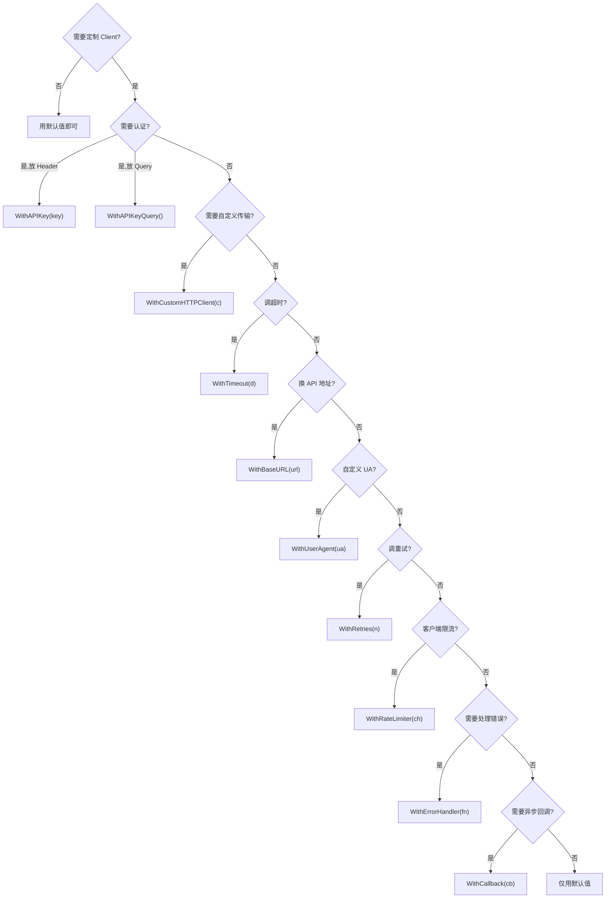

# NewClient

> 构造 `Client` 实例，应用函数式选项。

## 签名

```go
func NewClient(opts ...ClientOption) *Client
```

## 参数

| 参数 | 类型 | 说明 |
|------|------|------|
| `opts` | `...ClientOption` | 零个或多个选项函数 |

## 返回

- `*Client`：配置好的客户端

## 默认值

```go
c := &Client{
	HTTPClient: &http.Client{
		Timeout: 10 * time.Second,            // defaultTimeout
		CheckRedirect: <最多3跳转>,            // maxRedirects
	},
	BaseURL:   "https://ipapi.co/",          // defaultBaseURL
	UserAgent: "ipapi-go-client/1.0",
	Retries:   2,
}
for _, opt := range opts {
	opt(c)  // 依次应用选项
}
```

::: tip 🎨 一图抵千言
`NewClient` 的执行分两阶段：先填默认值构造骨架，再依次应用 opts 覆盖。
:::



下面这张类图展示 `NewClient` 与 `ClientOption` 的接口关系视角——选项如何作为函数式回调挂接到 `Client` 字段。



::: details 🔍 ClientOption 的本质
`ClientOption` 是 `func(*Client)` 的别名。每个 `WithXxx` 返回一个闭包，在 `NewClient` 第二阶段被 `opt(c)` 调用，直接对 `Client` 字段赋值——这就是"后者覆盖前者"的根因。详见 [选项函数](./options)。
:::

::: info 💡 默认值总览
| 字段 | 默认值 | 常量 |
|------|--------|------|
| 超时 | 10s | `defaultTimeout` |
| 最大跳转 | 3 | `maxRedirects` |
| 基地址 | `https://ipapi.co/` | `defaultBaseURL` |
| UA | `ipapi-go-client/1.0` | — |
| 重试次数 | 2 | — |
| APIKey | `""`（匿名） | — |
| APIKeyMode | `APIKeyHeader` | — |
:::

## 示例

### 最简

```go
client := ipapi.NewClient()
```

### 带配置

```go
client := ipapi.NewClient(
	ipapi.WithAPIKey("key"),
	ipapi.WithCustomHTTPClient(&http.Client{Timeout: 30 * time.Second}),
	ipapi.WithErrorHandler(logErr),
)
```

## 选项应用顺序

选项按传入顺序应用，**后者覆盖前者**：

```go
// 最后一个 WithAPIKey 生效
client := ipapi.NewClient(
	ipapi.WithAPIKey("old"),
	ipapi.WithAPIKey("new"), // 生效
)
```

::: warning ⚠️ 顺序敏感
因为每个 `ClientOption` 直接赋值覆盖字段，多个选项作用于同一字段时，**最后传入的那个胜出**。配置顺序要语义清晰：先打基础（如 `WithCustomHTTPClient`），再设认证（`WithAPIKey`），最后挂回调（`WithErrorHandler`）。

```go
// ✅ 推荐顺序：传输 → 认证 → 回调
ipapi.NewClient(
    ipapi.WithCustomHTTPClient(c),
    ipapi.WithAPIKey(os.Getenv("IPAPI_KEY")),
    ipapi.WithErrorHandler(logErr),
)
```
:::

## 复用建议

::: tip 🚀 复用单例
`NewClient` 返回的实例线程安全，应在应用启动时创建一次，全局复用。不要每次请求都新建——会丢失连接池复用。

```go
// 全局单例
var ipapiClient = ipapi.NewClient(ipapi.WithAPIKey(os.Getenv("IPAPI_KEY")))
```
:::

## 创建后调整

部分字段导出，可创建后改：

```go
client := ipapi.NewClient()
client.Retries = 5
client.RateLimiter = time.Tick(time.Second)
```

但首选选项式初始化。

下面这张决策树展示"该选哪个选项"的配置视角——按需求分支到合适的 `WithXxx`。



::: warning ⚠️ 选项不是全配才好
按需挂载即可。最常见组合是 `WithAPIKey` + `WithCustomHTTPClient`；错误处理与回调是高级场景，缺省时 SDK 会用内置的 `mapStatusCodeToError` 与 `handleError` 兜底。
:::

## 下一步

- 🧩 看 [选项函数](./options)
- 🧭 学 [Client 概念](/guide/client-concept)
- 📖 看 [`Client` 结构](./client)
