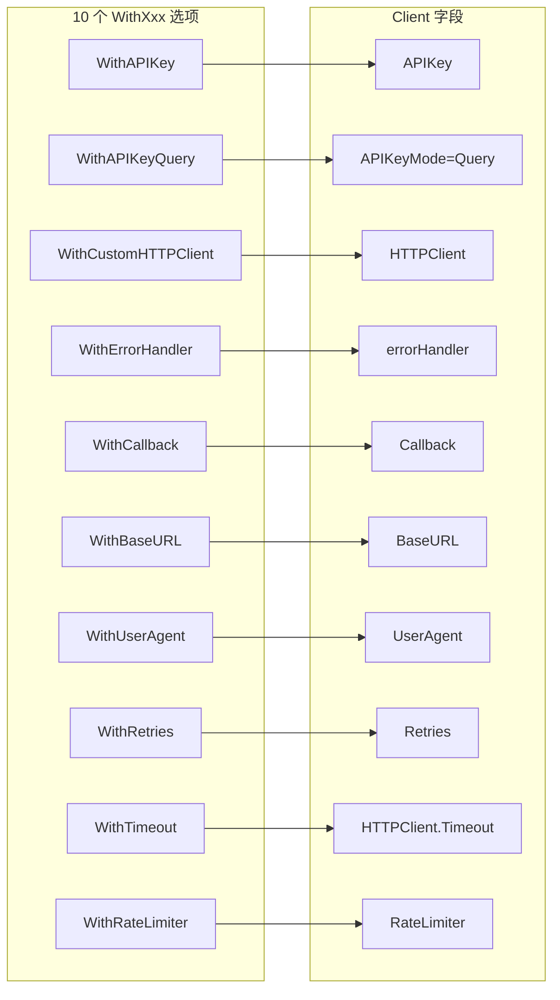
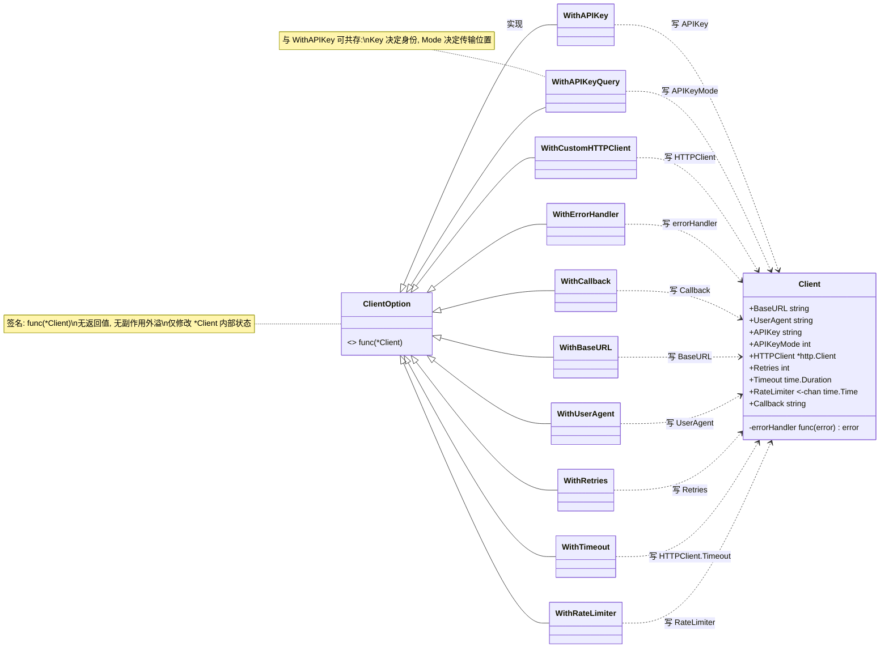
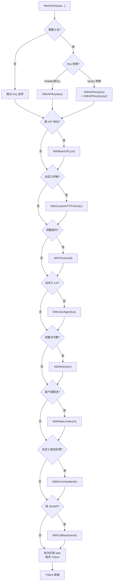

# 🧩 选项函数 Options

> `ClientOption` 函数式选项，用于配置 `Client`。

## 类型

```go
type ClientOption func(*Client)
```

每个选项是一个修改 `*Client` 的函数，`NewClient` 依次应用。

## 选项列表

| 选项 | 作用 | 文档 |
|------|------|------|
| `WithAPIKey(key)` | 设置 API Key | [→](./with-api-key) |
| `WithAPIKeyQuery()` | 改用 query 参数认证 | [→](./with-api-key-query) |
| `WithCustomHTTPClient(c)` | 替换底层 HTTP 客户端 | [→](./with-custom-http-client) |
| `WithErrorHandler(h)` | 注入错误处理回调 | [→](./with-error-handler) |
| `WithCallback(name)` | 设置 JSONP 回调 | [→](./with-callback) |
| `WithBaseURL(url)` | 覆盖 API 基础地址 | [→](./with-base-url) |
| `WithUserAgent(ua)` | 覆盖 User-Agent 头 | [→](./with-user-agent) |
| `WithRetries(n)` | 设置重试次数 | [→](./with-retries) |
| `WithTimeout(d)` | 设置单请求超时 | [→](./with-timeout) |
| `WithRateLimiter(ch)` | 客户端侧限流 | [→](./with-rate-limiter) |

::: tip 🎨 一图抵千言
10 个选项各自作用于 `Client` 的不同字段，下图标注作用目标。
:::



::: info 📋 选项作用目标对照
| 选项 | 目标字段 | 类型 | 空值/边界处理 |
|------|----------|------|---------------|
| `WithAPIKey` | `APIKey` | `string` | — |
| `WithAPIKeyQuery` | `APIKeyMode` | 改为 `APIKeyQuery` | — |
| `WithCustomHTTPClient` | `HTTPClient` | `*http.Client` | — |
| `WithErrorHandler` | `errorHandler` | `func(error) error` | — |
| `WithCallback` | `Callback` | `string` | — |
| `WithBaseURL` | `BaseURL` | `string` | 空串忽略，保留默认 |
| `WithUserAgent` | `UserAgent` | `string` | 空串忽略，保留默认 |
| `WithRetries` | `Retries` | `int` | 负数视为 0 |
| `WithTimeout` | `HTTPClient.Timeout` | `time.Duration` | ≤0 忽略，保留默认 |
| `WithRateLimiter` | `RateLimiter` | `<-chan time.Time` | nil 显式关闭限流 |
:::

下图展示「类关系视角」：[`ClientOption`](./options) 与 [`Client`](./new-client) 的结构关系，以及 5 个 `WithXxx` 选项如何共享同一函数签名、分别覆盖不同字段。



::: warning ⚠️ 选项之间无顺序保证
`NewClient(opts ...ClientOption)` 按传入顺序依次应用。后传的选项可覆盖先传的（例如两个 `WithAPIKey` 后者胜出）。如需稳定行为，请勿重复设置同一字段。
:::

## 组合示例

```go
client := ipapi.NewClient(
    ipapi.WithAPIKey(os.Getenv("IPAPI_KEY")),
    ipapi.WithBaseURL("https://proxy.example.com/"),  // 走代理
    ipapi.WithUserAgent("my-app/2.0"),                // 自定义 UA
    ipapi.WithTimeout(30*time.Second),                // 单请求超时
    ipapi.WithRetries(3),                              // 最多请求 4 次
    ipapi.WithRateLimiter(time.Tick(500*time.Millisecond)), // 客户端限流
    ipapi.WithErrorHandler(func(err error) error {
        log.Printf("ipapi error: %v", err)
        return err
    }),
)
```

## 为什么用函数式选项

- ✅ **可组合**：任意搭配
- ✅ **默认值清晰**：不传就用默认
- ✅ **向后兼容**：新增选项不破坏旧代码
- ✅ **可读**：参数有名

下图展示「决策视角」：初始化一个 [`Client`](./new-client) 时，如何按需选择选项——每条路径对应一种常见组合。



::: details 🔍 何时该用哪个选项
- 仅调公开 API、有 Key：[`WithAPIKey`](./with-api-key) 足矣
- 走代理 / 自定义镜像：加 [`WithBaseURL`](./with-base-url)
- 自定义 UA（服务端统计/区分调用方）：加 [`WithUserAgent`](./with-user-agent)
- 调重试次数（弱网/高可用）：加 [`WithRetries`](./with-retries)
- 只调超时不动 CheckRedirect：加 [`WithTimeout`](./with-timeout)，比 `WithCustomHTTPClient` 更轻
- 自定义 Transport（代理、TLS、连接池）：加 [`WithCustomHTTPClient`](./with-custom-http-client)（推荐先于 `WithTimeout` 应用）
- 客户端侧限流（避免触发 429）：加 [`WithRateLimiter`](./with-rate-limiter)
- 统一日志或错误转换：加 [`WithErrorHandler`](./with-error-handler)
- 取 JSONP 响应：加 [`WithCallback`](./with-callback)
:::

对比「配置结构体」方式：

```go
// ❌ 不灵活，新增字段要改所有调用方
client := ipapi.NewClient(ipapi.Config{APIKey: "...", Timeout: 30})

// ✅ 选项式
client := ipapi.NewClient(ipapi.WithAPIKey("..."))
```

::: details 🔍 函数式选项 vs 配置结构体 深度对比
| 维度 | 函数式选项 ✅ | 配置结构体 ❌ |
|------|--------------|----------------|
| 向后兼容 | 新增选项不影响旧调用 | 加字段破坏零值结构体初始化 |
| 默认值 | 不传即用默认，显式清晰 | 零值可能与默认冲突 |
| 可组合 | 任意搭配、可条件传入 | 需先构造完整结构体 |
| 可读性 | 参数有名 `WithAPIKey(...)` | 字段赋值 `Config{APIKey:...}` |
| 适用场景 | SDK 库、可选参数多 | 内部代码、配置固定 |

本 SDK 选择函数式选项，正是为了在 5 个可选项场景下兼顾兼容性与可读性。
:::

## 选项 vs 直接赋值字段

`Client` 字段大多导出，初始化后仍可直接改：

```go
client := ipapi.NewClient()
client.Retries = 5
client.RateLimiter = time.Tick(time.Second)
```

但**初始化时首选选项**——可组合、可读、可与默认值清晰分离。运行期动态调整（如临时改 `Timeout`）再直接赋字段。

::: warning ⚠️ WithTimeout 与 WithCustomHTTPClient 的顺序
`WithTimeout` 修改现有 `*http.Client` 的 `Timeout` 字段，**不替换**整个 client。若同时用 `WithCustomHTTPClient`，应先传它、再传 `WithTimeout`，让超时落在自定义 client 上。顺序反了，`WithTimeout` 会作用于默认 client、随后被 `WithCustomHTTPClient` 替换掉。
:::

## 下一步

- 🏗 看 [`NewClient`](./new-client)
- 🧭 学 [Client 概念](/guide/client-concept)
- 🔒 学 [认证机制](/guide/auth-concept)
