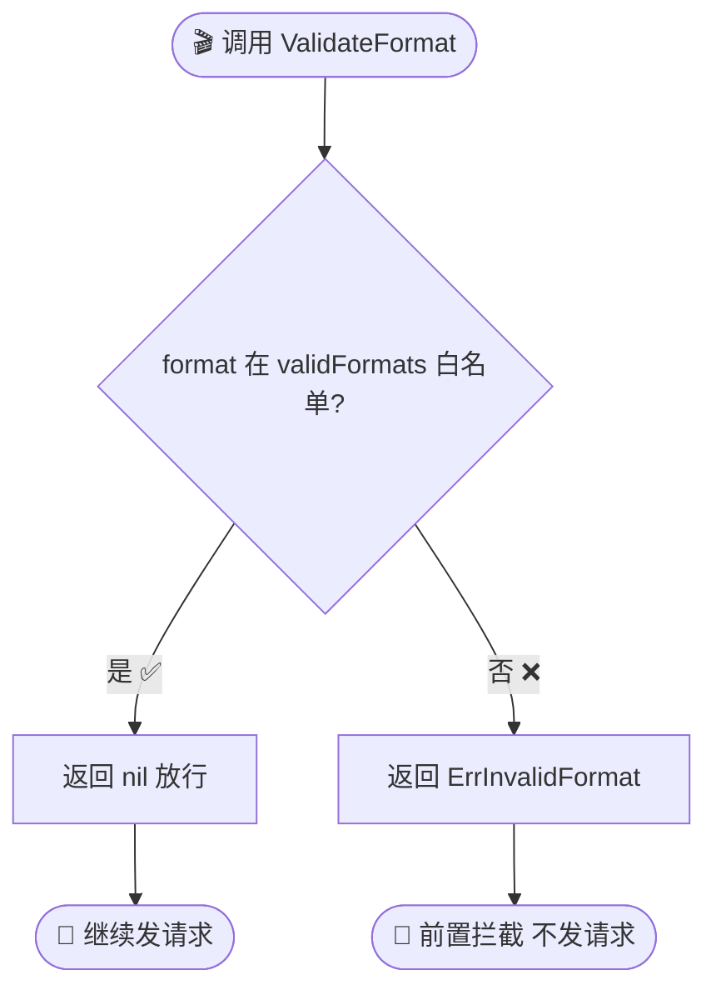
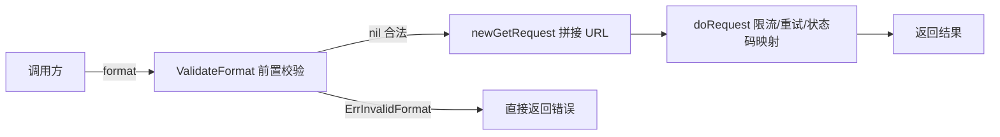

# ValidateFormat

> 校验响应格式合法性。

## 签名

```go
func ValidateFormat(format string) error
```

## 作用

查 `validFormats` 白名单，判断 `format` 是否为 5 种合法格式之一。合法返回 `nil`，否则 [`ErrInvalidFormat`](./errors)。

::: tip 🎨 一图抵千言
`ValidateFormat` 的判定流程：一次白名单查找决定放行还是拦截。
:::



::: info 💡 白名单的 5 种合法格式
- `json` — 默认结构化格式
- `jsonp` — 浏览器跨域回调
- `xml` — 传统 SOAP 风格
- `csv` — 表格/数据加工
- `yaml` — 配置文件友好
:::

## 实现

```go
var validFormats = map[Format]struct{}{
	FormatJSON: {}, FormatJSONP: {}, FormatXML: {}, FormatCSV: {}, FormatYAML: {},
}

func ValidateFormat(format string) error {
	if _, ok := validFormats[Format(format)]; !ok {
		return ErrInvalidFormat
	}
	return nil
}
```

## 示例

```go
ipapi.ValidateFormat("json")  // nil
ipapi.ValidateFormat("yaml")  // nil
ipapi.ValidateFormat("toml")  // ErrInvalidFormat
ipapi.ValidateFormat("")      // ErrInvalidFormat
```

| 输入 | 返回值 | 说明 |
|------|--------|------|
| `"json"` / `"jsonp"` / `"xml"` / `"csv"` / `"yaml"` | `nil` | 白名单内，放行 |
| `"toml"` / `"ini"` / 其他自定义 | `ErrInvalidFormat` | 白名单外，拦截 |
| `""` 空字符串 | `ErrInvalidFormat` | 空值不属于任何合法格式 |

## 在 SDK 内部

`GetIPInfo` / `GetIPInfoRaw` / `GetClientIPInfo` / `GetClientIPInfoRaw` 在发请求前调用，**前置拦截**非法格式。

::: warning ⚠️ 前置拦截的价值
`ValidateFormat` 在**请求发出之前**就拦下非法格式，避免了一次无效的网络往返，也避免了下游服务器返回无法解析的响应体。
:::



::: details 🔍 为什么用 map 而不是 switch
`validFormats` 用 `map[Format]struct{}` 实现 O(1) 查找，新增格式只需加一行映射，无需改分支逻辑。`struct{}` 占零字节，比 `bool` 更省内存。
:::

## 主动调用

```go
if err := ipapi.ValidateFormat(userFormat); err != nil {
	return err
}
client.GetIPInfoRaw(ctx, ip, userFormat)
```

## 推荐用常量

避免手写格式字符串出错，用 [`Format`](./client#格式常量) 常量：

```go
client.GetIPInfo(ctx, ip, string(ipapi.FormatJSON))
```

## 下一步

- 📖 看 [`ValidateIP`](./validate-ip)
- 🛡 看 [`ErrInvalidFormat`](./errors)
- 🎨 学 [响应格式概念](/guide/format-concept)
