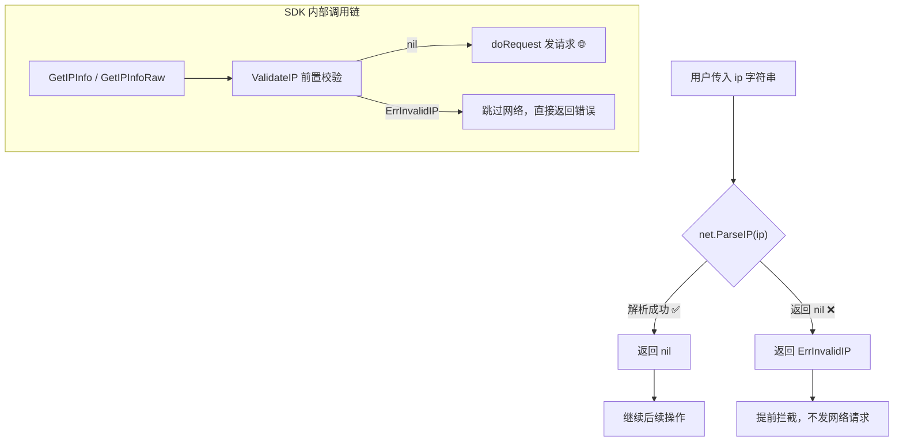

# ValidateIP

> 校验 IP 地址格式合法性。

## 签名

```go
func ValidateIP(ip string) error
```

## 作用

用 `net.ParseIP` 判断 `ip` 能否解析为合法 IPv4/IPv6。合法返回 `nil`，否则返回 [`ErrInvalidIP`](./errors)。

::: tip 🎨 一图抵千言
`ValidateIP` 的校验流程，以及它在 SDK 请求链路中的前置拦截位置。
:::



## 校验结果对照

| 输入 | `net.ParseIP` | 返回 |
|------|--------------|------|
| `8.8.8.8` | ✅ 非 nil | `nil` |
| `2001:4860:4860::8888` | ✅ 非 nil | `nil` |
| `999.999.999.999` | ❌ nil | `ErrInvalidIP` |
| `not.an.ip` | ❌ nil | `ErrInvalidIP` |
| `10.0.0.1`（私有） | ✅ 非 nil | `nil`（格式合法） |

## 实现

```go
func ValidateIP(ip string) error {
	if net.ParseIP(ip) == nil {
		return ErrInvalidIP
	}
	return nil
}
```

## 示例

```go
ipapi.ValidateIP("8.8.8.8")              // nil
ipapi.ValidateIP("2001:4860:4860::8888") // nil
ipapi.ValidateIP("999.999.999.999")      // ErrInvalidIP
ipapi.ValidateIP("not.an.ip")            // ErrInvalidIP
```

## 在 SDK 内部

[`GetIPInfo`](./get-ip-info) / [`GetIPInfoRaw`](./get-ip-info-raw) 在发请求前调用，非法 IP 直接返回错误，**不发网络请求**。

::: tip 💡 不校验保留地址
`ValidateIP` 只判格式，不判保留/私有。`10.0.0.1` 格式合法返回 `nil`，但查询会返回 [`ErrReservedIP`](./errors)（服务端判断）。本地预判保留用 `net.IP.IsPrivate()` 等。
:::

::: warning ⚠️ 两道关口的分工
| 关口 | 位置 | 判定 | 返回错误 |
|------|------|------|---------|
| 格式校验 | 客户端 `ValidateIP` | `net.ParseIP` | `ErrInvalidIP` |
| 保留校验 | 服务端 ipapi.co | 查询时判定 | `ErrReservedIP` |
格式合法不代表能查到结果。私有/回环/多播等保留地址会通过第一关但被服务端拒绝。
:::

::: details 📖 本地预判保留地址的常用方法
```go
ip := net.ParseIP(userInput)
if ip == nil {
    return ipapi.ErrInvalidIP
}
// 本地预判，避免无效请求
if ip.IsPrivate() || ip.IsLoopback() || ip.IsMulticast() || ip.IsUnspecified() {
    // 这些会被服务端返回 ErrReservedIP
    // 可提前返回或跳过查询
}
```
提前预判可省一次网络往返，对高 QPS 场景尤其有用。
:::

## 主动调用

在调用 SDK 前预校验用户输入：

```go
if err := ipapi.ValidateIP(userInput); err != nil {
	return fmt.Errorf("请输入合法 IP: %w", err)
}
info, _ := client.GetIPInfo(ctx, userInput, "json")
```

## 下一步

- 📖 看 [`ValidateFormat`](./validate-format)
- 🛡 看 [`ErrInvalidIP`](./errors)
- 🌐 学 [IPv4](/guide/ipv4) / [IPv6](/guide/ipv6)
