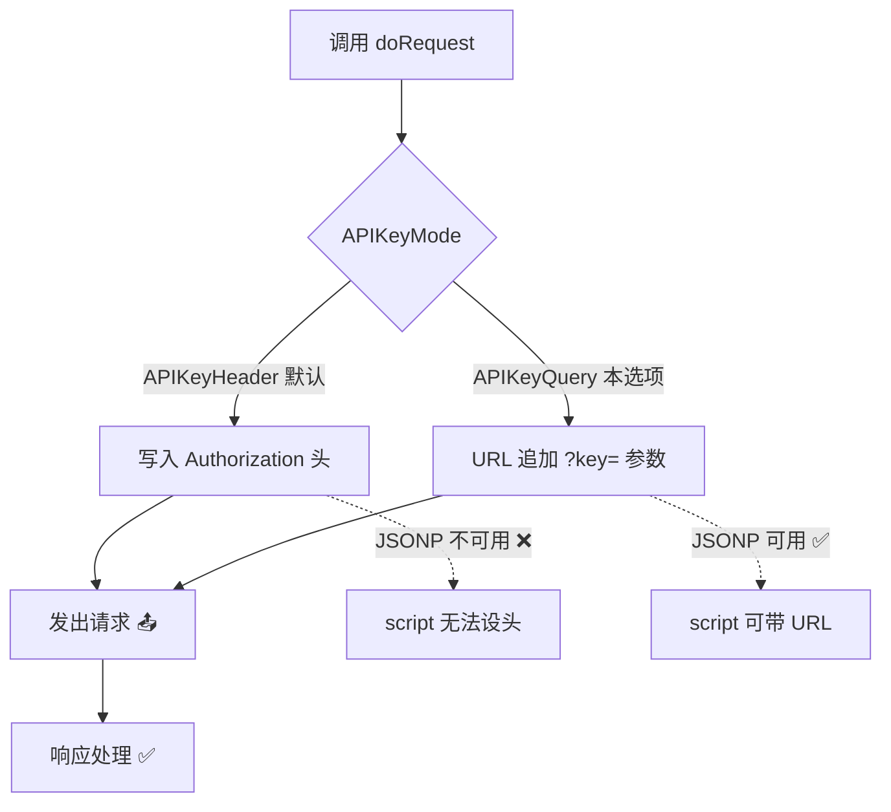
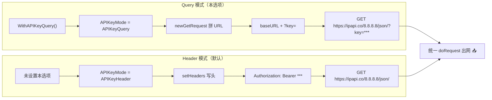
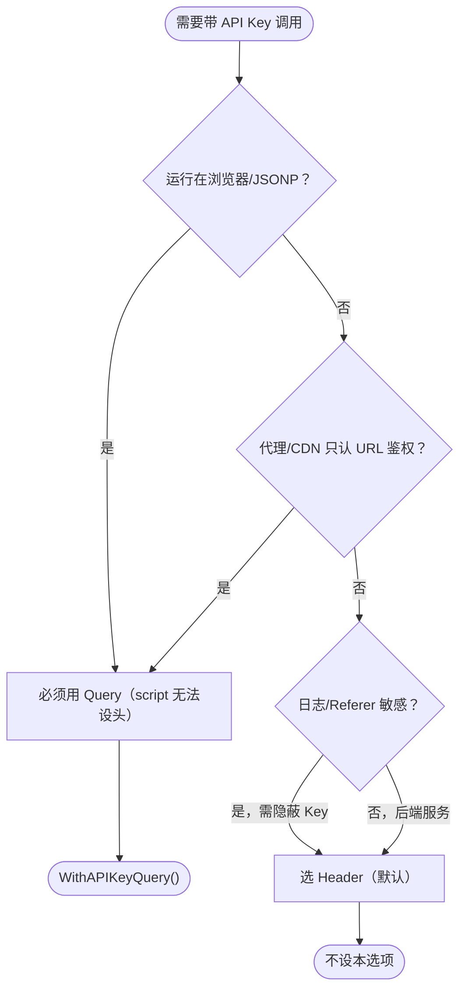

# WithAPIKeyQuery

> 切换 API Key 认证为 `?key=` 查询参数方式。

## 签名

```go
func WithAPIKeyQuery() ClientOption
```

## 作用

设置 `Client.APIKeyMode = APIKeyQuery`。配合 [`WithAPIKey`](./with-api-key)，请求 URL 会带：

```
https://ipapi.co/8.8.8.8/json/?key=<key>
```

::: tip 🎨 一图抵千言
下图对比两种认证模式下 `applyAuth` 的分流路径。
:::



::: tip 🎨 一图抵千言
下图展示 **配置到出网的全链路视角**：从 [`WithAPIKeyQuery`](./with-api-key-query) 配置 `APIKeyMode`，到 [`newGetRequest`](./with-api-key-query) 拼 `?key=`，再到对比 Header 模式的最终 URL 形态。
:::



## 示例

```go
client := ipapi.NewClient(
	ipapi.WithAPIKey("your_api_key"),
	ipapi.WithAPIKeyQuery(),
)
```

## 与默认 Header 模式对比

| 维度 | Header（默认） | Query |
|------|---------------|-------|
| 位置 | `Authorization` 头 | `?key=` URL 参数 |
| 日志泄露 | 不易 | 易出现在访问日志 |
| 前端可见 | 否 | 是 |
| JSONP 可用 | ❌ | ✅ |

## 何时用

- 📞 JSONP 场景（`<script>` 无法设头）
- 🚪 某些代理/CDN 只支持 URL 鉴权
- 🔧 调试时方便直接看 URL

::: tip 🎨 一图抵千言
下图展示 **选型决策树视角**：按运行环境与日志敏感度反推应选哪种模式。
:::



::: info 📊 两种模式速查
**Header**：默认、隐蔽、JSONP 不可用、适合后端服务。
**Query**：URL 暴露、JSONP 可用、适合前端/受限代理。
:::

::: warning ⚠️ 安全权衡
Query 方式 Key 会出现在 URL、日志、Referer。仅在必要时用，且用受限/临时 Key。
:::

::: details 🔍 Key 泄露路径分析
- **访问日志**：反向代理/Nginx 默认记录完整 URL
- **Referer 头**：用户点外链时 Key 会被带向第三方站点
- **浏览器历史**：本地留痕，共享设备可见
- **CDN 缓存**：部分 CDN 可能缓存带 Key 的 URL
建议：用 Query 时务必配合短期/受限 Key，并定期轮换。
:::

## 内部

```go
func WithAPIKeyQuery() ClientOption {
	return func(c *Client) {
		c.APIKeyMode = APIKeyQuery
	}
}
```

`applyAuth` 据 `APIKeyMode` 分支。

## 下一步

- 🔒 学 [认证机制](/guide/auth-concept)
- 📖 看 [`WithAPIKey`](./with-api-key)
- 📞 学 [JSONP 回调](/guide/jsonp)
