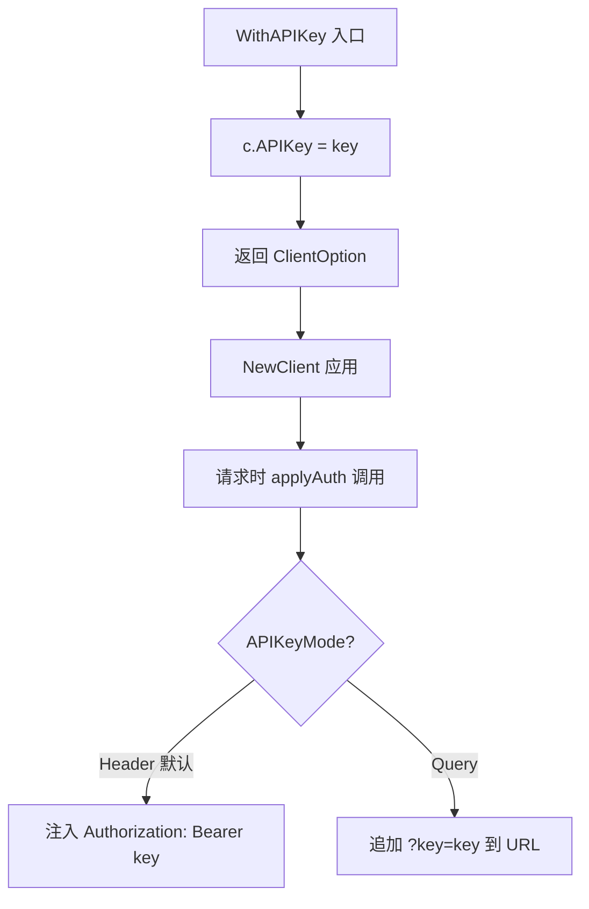
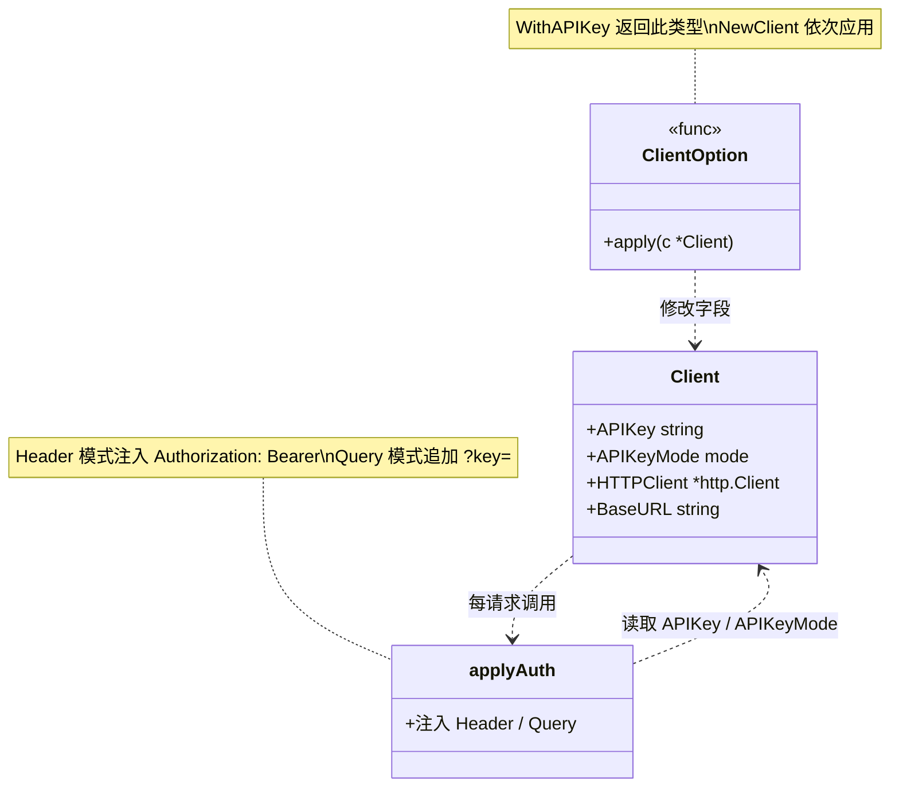

# WithAPIKey

> 设置 API Key，默认以 Bearer Header 认证。

## 签名

```go
func WithAPIKey(key string) ClientOption
```

## 作用

设置 `Client.APIKey` 字段。配合默认的 `APIKeyHeader` 模式，请求会带：

```
Authorization: Bearer <key>
```

::: tip 🎨 一图抵千言
`WithAPIKey` 只设 `APIKey` 字段；实际注入由 `applyAuth` 在每次请求时按 `APIKeyMode` 分支完成。
:::



下方这张时序图展示「一次请求从环境变量到 HTTP Header」的运行时调用链视角，补充上图静态分支所看不到的时序与参与者。

```mermaid
sequenceDiagram
    participant Env as os.Getenv
    participant Opt as WithAPIKey
    participant Cli as *Client
    participant Auth as applyAuth
    participant HTTP as HTTPClient
    Env->>Opt: key string
    Opt->>Cli: c.APIKey = key
    Note over Cli: APIKeyMode 默认 Header
    Cli->>Auth: doRequest 触发
    Auth->>Cli: 读取 APIKey / APIKeyMode
    Auth->>HTTP: setHeaders Authorization: Bearer key
    HTTP-->>Cli: 响应
```

::: details 🔍 applyAuth 注入时机
`applyAuth` 由 `doRequest` → `newGetRequest` 链路在每次请求时调用，而非 `WithAPIKey` 触发。这意味着 `APIKey` 写入后，所有后续请求都会自动带上认证——直到你用新 Key 重建 Client 或切换 `APIKeyMode`。
:::

::: info 💡 两种认证模式对照
| 模式 | 注入位置 | 触发方式 |
|------|----------|----------|
| `APIKeyHeader`（默认） | `Authorization: Bearer <key>` 头 | 仅 `WithAPIKey` |
| `APIKeyQuery` | URL `?key=<key>` 参数 | `WithAPIKey` + `WithAPIKeyQuery` |
:::

下方这张类图展示参与认证的「类型与字段关系」视角，便于理解各符号在 SDK 中的归属与协作。



::: warning ⚠️ 仅设字段，不发请求
`WithAPIKey` 只写 `Client.APIKey`，不触发任何网络调用；认证注入发生在后续 [`GetIPInfo`](./get-ip-info) 等方法执行时。在 `NewClient` 之后、第一次请求之前替换 Key 不会留下残留请求。
:::

## 示例

```go
client := ipapi.NewClient(
	ipapi.WithAPIKey("your_api_key"),
)
```

从环境变量取（推荐）：

```go
client := ipapi.NewClient(
	ipapi.WithAPIKey(os.Getenv("IPAPI_KEY")),
)
```

::: info 📋 取值来源对照
| 来源 | 推荐度 | 示例 |
|------|--------|------|
| 环境变量 | ✅ 推荐 | `os.Getenv("IPAPI_KEY")` |
| 密钥管理服务 | ✅ 生产首选 | Vault / Secrets Manager |
| 配置文件 | ⚠️ 谨慎 | 需加入 `.gitignore` |
| 源码硬编码 | ❌ 禁止 | `"ak_live_xxx"` |
:::

## 与 WithAPIKeyQuery 配合

默认 Header 模式。要改 query 参数模式，加 [`WithAPIKeyQuery`](./with-api-key-query)：

```go
client := ipapi.NewClient(
	ipapi.WithAPIKey("key"),
	ipapi.WithAPIKeyQuery(), // ?key=...
)
```

## 内部

```go
func WithAPIKey(key string) ClientOption {
	return func(c *Client) {
		c.APIKey = key
	}
}
```

`applyAuth` 在每个请求时据此注入认证。

## 安全

::: danger 🔐 勿硬编码
不要把 Key 写进源码/提交 Git。用环境变量或密钥管理服务。
:::

::: details 🔑 密钥管理最佳实践
- **环境变量**：`os.Getenv("IPAPI_KEY")`，配合 `.env` 或 secrets manager。
- **密钥管理服务**：HashiCorp Vault、AWS Secrets Manager、GCP Secret Manager 等。
- **CI/CD**：把 Key 放进仓库 Secrets，运行时注入，绝不写进代码或配置文件。
- **轮换**：定期换 Key，旧 Key 失效后立即从代码库清除引用。
- **日志脱敏**：打印请求时屏蔽 `Authorization` 头，避免日志泄露。

```go
// ✅ 推荐：环境变量
client := ipapi.NewClient(ipapi.WithAPIKey(os.Getenv("IPAPI_KEY")))

// ❌ 危险：硬编码
client := ipapi.NewClient(ipapi.WithAPIKey("ak_live_1234567890"))
```
:::

## 下一步

- 🔒 学 [认证机制](/guide/auth-concept)
- 📖 看 [`WithAPIKeyQuery`](./with-api-key-query)
- 🧪 看 [带 API Key 示例](/examples/with-api-key)
