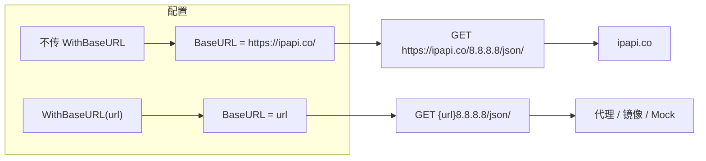

# WithBaseURL

> 覆盖 SDK 默认的 API 基础地址（`https://ipapi.co/`）。

## 签名

```go
func WithBaseURL(url string) ClientOption
```

## 作用

设置 `Client.BaseURL`，所有请求 URL 都以它为前缀拼接。默认值 `https://ipapi.co/`。

::: tip 🎨 一图抵千言
`WithBaseURL` 决定请求去往哪个后端，下图展示默认与自定义两条路径。
:::



## 边界处理

| 输入 | 行为 |
|------|------|
| 非空字符串 | 写入 `BaseURL` |
| 空字符串 `""` | **忽略**，保留默认 `https://ipapi.co/` |

空串忽略的设计让你能安全地透传可选配置——`cfg.BaseURL` 为空时不会意外清空默认值。

```go
base := os.Getenv("IPAPI_BASE_URL") // 可能为空
client := ipapi.NewClient(ipapi.WithBaseURL(base)) // 空则保留默认
```

## 示例

```go
// 走自建镜像
client := ipapi.NewClient(ipapi.WithBaseURL("https://ipapi-mirror.internal/"))

// 走带 key 的代理
client := ipapi.NewClient(
    ipapi.WithBaseURL("https://proxy.example.com/"),
    ipapi.WithAPIKey(os.Getenv("IPAPI_KEY")),
)
```

## 尾部斜杠

`BaseURL` 末尾应带斜杠（`https://ipapi.co/`），SDK 拼接形如 `{baseURL}{ip}/{format}/`。不带斜杠会导致 `{base}8.8.8.8/json/` 这样的拼接异常。

::: warning ⚠️ 必须带尾部斜杠
```go
WithBaseURL("https://proxy.example.com/")  // ✅
WithBaseURL("https://proxy.example.com")   // ❌ 缺斜杠，拼接出错
```
:::

## 内部

```go
func WithBaseURL(url string) ClientOption {
    return func(c *Client) {
        if url != "" {
            c.BaseURL = url
        }
    }
}
```

## 下一步

- 🏗 看 [`NewClient`](./new-client)
- 🔧 看 [`WithTimeout`](./with-timeout)
- 🧭 看 [Client 概念](/guide/client-concept)
