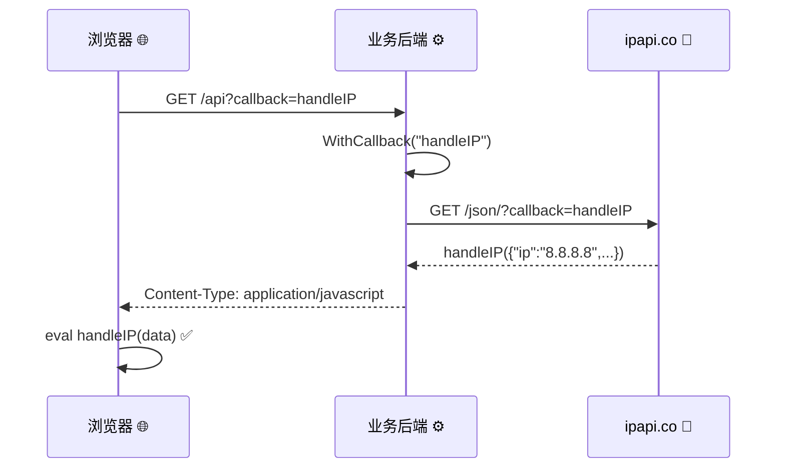
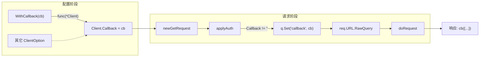
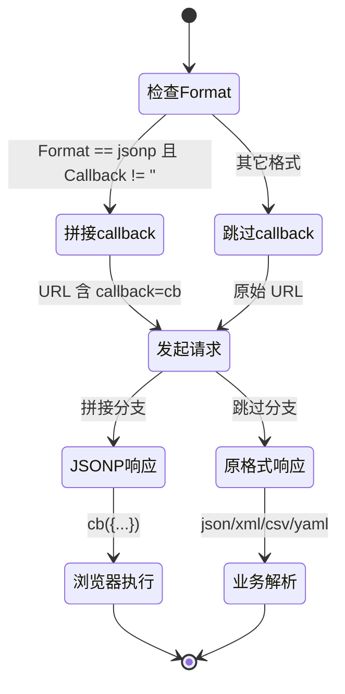

# WithCallback

> 设置 JSONP 回调函数名，配合 `FormatJSONP` 使用。

## 签名

```go
func WithCallback(callback string) ClientOption
```

## 作用

设置 `Client.Callback` 字段。使用 `FormatJSONP` 格式时，[`applyAuth`](./with-callback) 会在 URL 加 `?callback=<name>`，响应变成：

```
<callback>({"ip":"8.8.8.8",...})
```

::: tip 🎨 一图抵千言
JSONP 回调从客户端发起到响应解析的完整时序。
:::



::: info 📞 为什么 JSONP 需要回调
`<script>` 标签跨域加载 JS 时无法设 `Authorization` 头，且响应必须能被浏览器直接执行。JSONP 用函数调用包裹 JSON 数据，让浏览器自动调用你预先定义的处理函数，从而绕过同源策略限制。
:::

上面的时序图聚焦于跨进程调用。下面这张图换成 **SDK 内部视角**，展示 `WithCallback` 如何作为 `ClientOption` 注入到 `*Client`，并在请求阶段被 `applyAuth` 读取后拼入 URL。



::: details 📍 字段写入时机
`WithCallback` 只在配置阶段写入 `Client.Callback` 字符串字段，不触碰 HTTP 客户端、超时、重试等其它配置。真正把回调名拼进 URL 的逻辑在每次请求的 [`applyAuth`](./with-callback) 内部完成，因此切换格式或重试请求时回调名会持续生效。
:::

## 示例

```go
client := ipapi.NewClient(
	ipapi.WithCallback("handleIP"),
)
data, _ := client.GetIPInfoRaw(ctx, "8.8.8.8", string(ipapi.FormatJSONP))
fmt.Println(string(data))
// handleIP({"ip":"8.8.8.8","city":"Mountain View",...})
```

## 仅 JSONP 有效

`Callback` 只在 `FormatJSONP` 时生效，其它格式忽略。

::: warning ⚠️ 格式与回调的生效矩阵
| 格式 | Callback 参数 | 响应 |
|------|---------------|------|
| `json` | 忽略 | 纯 JSON |
| `jsonp` | ✅ 生效 | `cb({...})` |
| `xml/csv/yaml` | 忽略 | 原格式 |
配置 Callback 但用 `json` 格式，不会报错，只是不生效。
:::

下面这张状态图展示 **格式决策视角**：根据 `Format` 与 `Callback` 是否为空，请求与响应走向哪个分支，可对照上面的生效矩阵阅读。



::: warning ⚠️ 容易踩的坑
设置了 `WithCallback` 却忘了把 `Format` 设成 `FormatJSONP`，是最常见的"回调没生效"原因。状态图里走的是 `跳过callback` 分支——回调名被静默忽略，响应仍是纯 JSON，前端 `<script>` 加载会因不是合法 JS 表达式而报语法错误。
:::

::: details 🔒 回调名安全提示
- 回调名会被直接拼进响应作为 JS 标识符，**务必校验**来源
- 只允许字母/数字/下划线/点号，拒绝其它字符以防 XSS
- 服务端透传场景应做白名单校验，而非原样转发用户输入
:::

## 服务端透传示例

```go
func handler(w http.ResponseWriter, r *http.Request) {
	cb := r.URL.Query().Get("callback")
	c := ipapi.NewClient(ipapi.WithCallback(cb))
	data, _ := c.GetClientIPInfoRaw(r.Context(), string(ipapi.FormatJSONP))
	w.Header().Set("Content-Type", "application/javascript")
	w.Write(data)
}
```

## 内部

```go
func WithCallback(callback string) ClientOption {
	return func(c *Client) {
		c.Callback = callback
	}
}
```

`applyAuth`：

```go
if c.Callback != "" {
	q := req.URL.Query()
	q.Set("callback", c.Callback)
	req.URL.RawQuery = q.Encode()
}
```

## 与认证配合

JSONP 用 `<script>` 加载，无法设 Header。需带 Key 时用 [`WithAPIKeyQuery`](./with-api-key-query)：

```go
client := ipapi.NewClient(
	ipapi.WithAPIKey(os.Getenv("IPAPI_KEY")),
	ipapi.WithAPIKeyQuery(),
	ipapi.WithCallback("cb"),
)
```

## 下一步

- 📞 学 [JSONP 回调](/guide/jsonp)
- 📖 看 [`WithAPIKeyQuery`](./with-api-key-query)
- 🧪 看 [JSONP 示例](/examples/jsonp)
