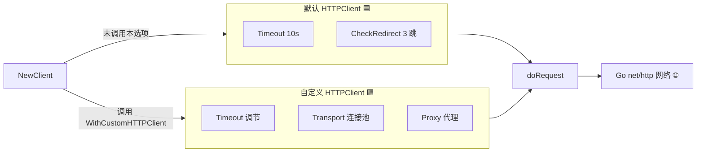
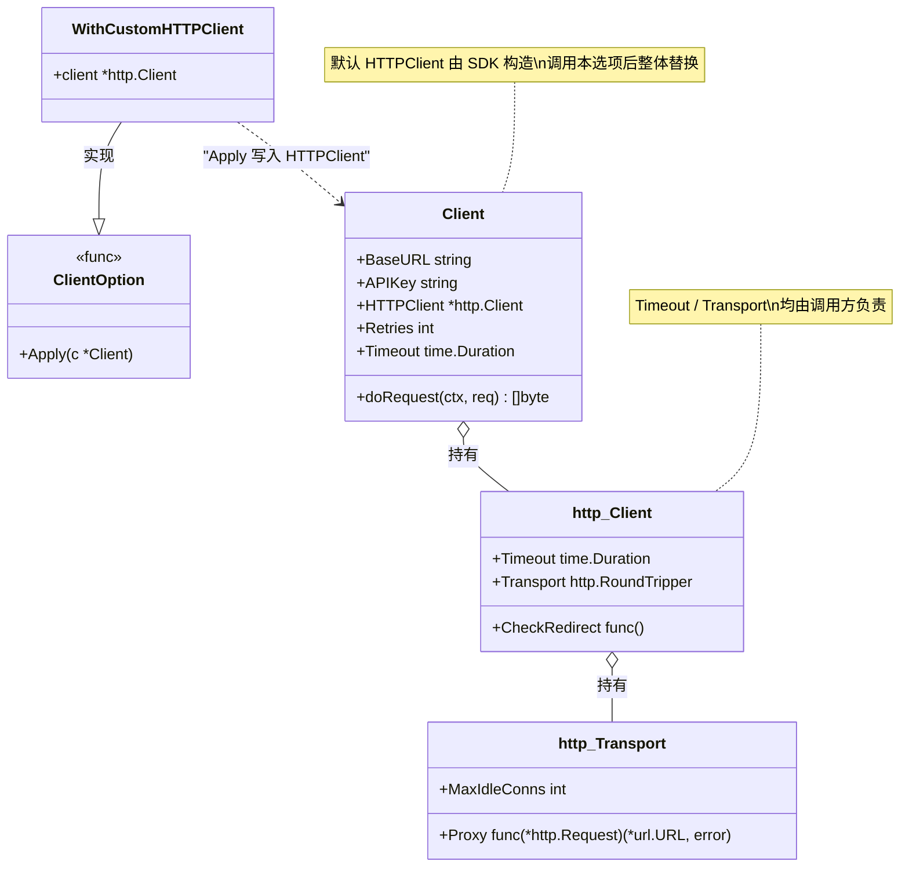
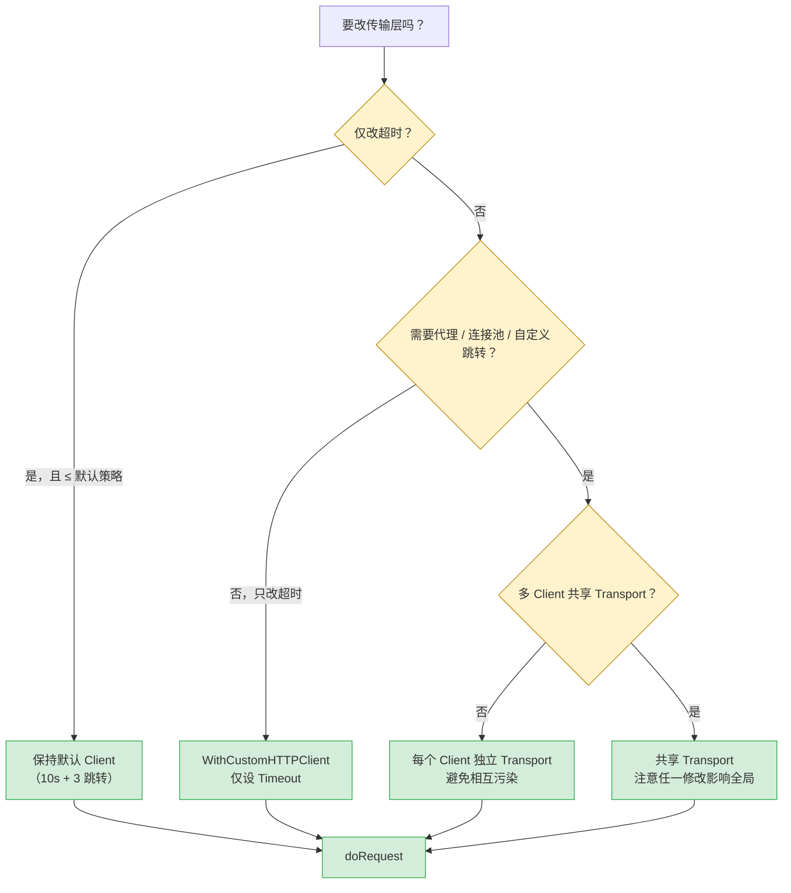

# WithCustomHTTPClient

> 替换底层 `*http.Client`，定制超时、代理、连接池等。

## 签名

```go
func WithCustomHTTPClient(client *http.Client) ClientOption
```

## 作用

设置 `Client.HTTPClient` 字段，覆盖默认的 10s 超时 + 3 跳转限制客户端。

::: tip 🎨 一图抵千言
`WithCustomHTTPClient` 如何替换默认客户端，影响后续所有请求的传输层。
:::



下面这张类图展示**注入视角**：`WithCustomHTTPClient` 作为 `ClientOption` 如何改写 `*Client` 的 `HTTPClient` 字段，进而决定 `Timeout` 与 `Transport` 的归属。



## 默认 vs 自定义对照

| 维度 | 默认 Client | 自定义 Client |
|------|------------|--------------|
| 超时 | 固定 10s | 任意 |
| 跳转限制 | 3 次 | 需自行设 `CheckRedirect` |
| 连接池 | 默认 | 可调 `MaxIdleConns` |
| 代理 | 无 | 可配 `Transport.Proxy` |

## 示例

### 调超时

```go
client := ipapi.NewClient(
	ipapi.WithCustomHTTPClient(&http.Client{
		Timeout: 30 * time.Second,
	}),
)
```

### 连接池

```go
client := ipapi.NewClient(
	ipapi.WithCustomHTTPClient(&http.Client{
		Timeout: 15 * time.Second,
		Transport: &http.Transport{
			MaxIdleConns:        100,
			MaxIdleConnsPerHost: 20,
			IdleConnTimeout:     90 * time.Second,
		},
	}),
)
```

### 代理

```go
proxyURL, _ := url.Parse("http://proxy:8080")
client := ipapi.NewClient(
	ipapi.WithCustomHTTPClient(&http.Client{
		Transport: &http.Transport{Proxy: http.ProxyURL(proxyURL)},
	}),
)
```

下面这张决策树展示**选择视角**：何时需要本选项、何时保持默认即可，避免无谓的覆盖。



::: details 🔍 决策依据
默认客户端已内置 10s 超时与 3 次跳转限制，覆盖绝大多数查询场景。只有当需要更长超时、代理、连接池调优或自定义 `CheckRedirect` 时才动用本选项。可参考 [`Client`](./) 字段定义与 [`WithAPIKey`](./with-api-key) 等其他选项的组合方式。
:::

## 内部

```go
func WithCustomHTTPClient(client *http.Client) ClientOption {
	return func(c *Client) {
		c.HTTPClient = client
	}
}
```

## 默认客户端（被替换的）

```go
&http.Client{
	Timeout: 10 * time.Second,
	CheckRedirect: func(req *http.Request, via []*http.Request) error {
		if len(via) >= maxRedirects { // 3
			return fmt.Errorf("stopped after %d redirects", maxRedirects)
		}
		return nil
	},
}
```

## 注意

- 替换后**丢失**默认的跳转限制，需自行设 `CheckRedirect`
- 多个 `Client` 共享同一 `Transport` 可复用连接池

::: warning ⚠️ 替换即重置
`WithCustomHTTPClient` 是**整体替换**，不是合并。你传入的 `*http.Client` 会完全覆盖默认实例，包括超时、跳转策略、Transport。若只想要更长超时而保留跳转限制，需在自定义 Client 里一并设 `CheckRedirect`。
:::

::: danger 🚨 共享 Transport 的坑
多个 `Client` 共享同一个 `*http.Transport` 时连接池会被复用，但**任一 Client 的 Transport 修改都会影响所有**。生产环境建议为不同用途（不同超时/代理）的 Client 配置独立 Transport，避免相互污染。
:::

::: details 📖 常用 Transport 参数速查
```go
&http.Transport{
    MaxIdleConns:        100,   // 全局最大空闲连接
    MaxIdleConnsPerHost: 20,    // 单 host 最大空闲连接
    IdleConnTimeout:     90 * time.Second, // 空闲超时
    TLSHandshakeTimeout: 10 * time.Second, // TLS 握手超时
    ExpectContinueTimeout: 1 * time.Second,
    DisableCompression:  false,
}
```
高并发查询建议 `MaxIdleConnsPerHost` 至少等于并发数，避免频繁建连。
:::

## 下一步

- 🛠 学 [自定义 HTTP 客户端](/guide/custom-http)
- ⏱ 学 [Context 超时](/guide/context)
- 🧪 看 [高级示例](/examples/advanced-usage)
