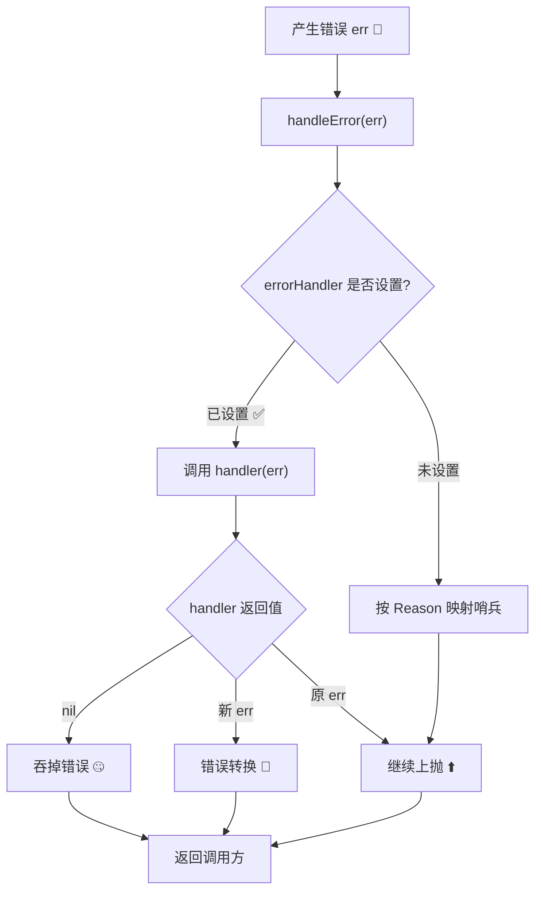
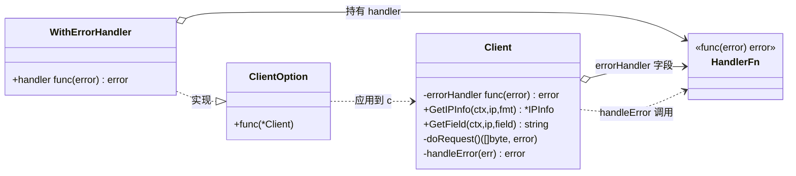

# WithErrorHandler

> 注入全局错误处理回调，在错误返回调用方前拦截。

## 签名

```go
func WithErrorHandler(handler func(error) error) ClientOption
```

## 作用

设置 `Client.errorHandler`。每个方法在返回错误前调用 [`handleError`](./errors)，若设了 handler 则**优先**调它。

::: tip 🎨 一图抵千言
`errorHandler` 注入后，错误在返回调用方前的分流路径。
:::



下面这张时序图展示**运行时调用序列**视角：从构造期注入 `errorHandler`，到请求期 `doRequest` 出错后被 `handleError` 拦截、转交自定义 `fn`、最终返回调用方的完整链路。

```mermaid
sequenceDiagram
    participant App as 调用方
    participant Opt as WithErrorHandler(fn)
    participant Cli as *Client
    participant Do as doRequest
    participant HD as handleError
    participant Fn as handler fn

    Note over App,Opt: 构造期：注入回调
    App->>Opt: WithErrorHandler(fn)
    Opt->>Cli: c.errorHandler = fn
    Note over Cli: errorHandler 已就位 ✅

    Note over App,Do: 请求期：发起调用
    App->>Cli: GetIPInfo(ctx, ip, "json")
    Cli->>Do: doRequest(...)
    Do--xCli: 返回 err（网络/5xx/解析失败）

    Note over Cli,Fn: 拦截期：分流到自定义 handler
    Cli->>HD: handleError(err)
    HD->>Fn: handler(err)
    alt 返回 nil
        Fn-->>HD: nil
        HD-->>Cli: nil（吞掉 🤐）
    else 返回新 err
        Fn-->>HD: newErr
        HD-->>Cli: newErr（转换 🔄）
    else 返回原 err
        Fn-->>HD: err
        HD-->>Cli: err（原样上抛 ⬆️）
    end

    Note over App,Cli: 返回期：交付调用方
    Cli-->>App: 最终 err（或 nil）
```

## 回调契约对照

| 入参 | 出参 | 典型用法 |
|------|------|---------|
| 原始 `error` | 原错误 | 日志记录、监控上报 |
| 原始 `error` | `nil` | 吞掉特定错误 |
| 原始 `error` | 新错误 | 错误转换/包装 |

## 回调契约

```go
func(err error) error
```

- 入参：原始错误
- 返回：处理后的错误（可返回 `nil` 吞掉，或返回新错误转换）

## 示例

### 日志记录

```go
client := ipapi.NewClient(
	ipapi.WithErrorHandler(func(err error) error {
		log.Printf("ipapi error: %v", err)
		return err // 继续向上抛
	}),
)
```

### 监控上报

```go
ipapi.WithErrorHandler(func(err error) error {
	sentry.CaptureException(err)
	if apiErr, ok := err.(*ipapi.APIError); ok {
		metrics.IncCounter(apiErr.Reason)
	}
	return err
})
```

### 吞掉特定错误

```go
ipapi.WithErrorHandler(func(err error) error {
	if errors.Is(err, ipapi.ErrReservedIP) {
		return nil // 保留地址不当错误
	}
	return err
})
```

### 错误转换

```go
ipapi.WithErrorHandler(func(err error) error {
	if errors.Is(err, ipapi.ErrRateLimited) {
		return ErrTooBusy // 转成业务错误
	}
	return err
})
```

## 内部

下面这张类图展示**结构关系**视角：[`WithErrorHandler`](./with-error-handler) 作为 [`ClientOption`](./new-client) 如何把 `handler` 注入 `Client.errorHandler`，以及 `Client` 与 `handleError`/内部方法之间的持有与调用关系。



```go
func WithErrorHandler(handler func(error) error) ClientOption {
	return func(c *Client) {
		c.errorHandler = handler
	}
}
```

`handleError`：

```go
func (c *Client) handleError(err error) error {
	if c.errorHandler != nil {
		return c.errorHandler(err)  // 优先
	}
	// ... 否则按 Reason 映射哨兵
}
```

::: warning ⚠️ handler 优先级
设了 handler 后，`handleError` **不再**做 `Reason → 哨兵` 映射。若你仍想要哨兵匹配，需在 handler 内自行调用，或返回原 err。
:::

::: danger 🚫 不要吞掉所有错误
返回 `nil` 会**完全消除**该错误，调用方拿到的 `err=nil` 会误以为成功，但 `info` 仍为 nil，极易触发 nil 指针 panic。仅吞掉你**明确无害**的特定哨兵错误（如 `ErrReservedIP`），永远不要无脑 `return nil`。
:::

::: details 💡 在 handler 内保留哨兵映射
若既要拦截又想保留哨兵匹配能力，可在 handler 内手动映射：
```go
ipapi.WithErrorHandler(func(err error) error {
    log.Printf("ipapi error: %v", err)
    // 保留原始错误，让调用方仍可用 errors.Is 判断
    return err
})
```
或对特定错误做转换后，转换后的错误也应支持 `errors.Is` 链，否则会破坏调用方的 switch 判断。
:::

::: tip 🎯 典型场景速查
- **可观测性**：日志 + Sentry + Metrics 上报，原样返回 err
- **业务适配**：把 `ErrRateLimited` 转成业务侧的 `ErrTooBusy`
- **容错降级**：吞掉 `ErrReservedIP` 等非致命错误
- **统一封装**：用 `WrapError` 加操作上下文
:::

## 下一步

- 🛡 学 [错误处理概念](/guide/error-concept)
- 📖 看 [`handleError`](./errors)
- 🧪 看 [自定义错误处理示例](/examples/custom-error)
