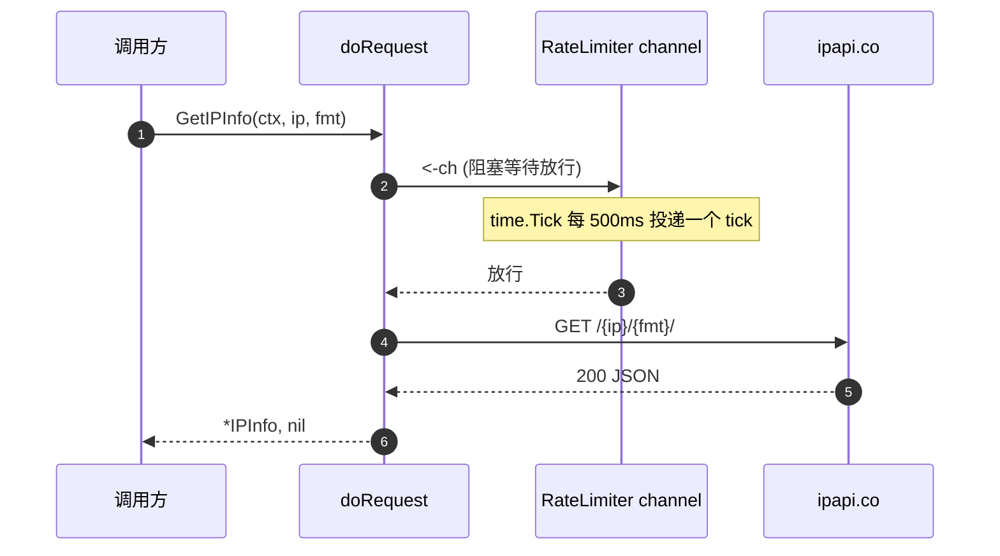

# WithRateLimiter

> 安装客户端侧节流阀：每次请求前阻塞接收一次 channel，从而限制全局请求速率。

## 签名

```go
func WithRateLimiter(ch <-chan time.Time) ClientOption
```

## 作用

设置 `Client.RateLimiter`，`doRequest` 在发起每次请求前会从 `ch` 接收一次（阻塞直到放行）。传入 `time.Tick` 创建的 channel 即可按固定速率放行。默认 `nil`（不限流）。

::: tip 🎨 一图抵千言
限流器在请求链路最前端把关，超过速率的请求排队等待。
:::



## 边界处理

| 输入 | 行为 |
|------|------|
| 非 nil channel | 写入 `RateLimiter`，每次请求前阻塞接收 |
| `nil` | 写入 `RateLimiter = nil`，**显式关闭限流** |

`nil` 允许的设计：先装一个限流器、再用 `WithRateLimiter(nil)` 关掉，或在测试中显式禁用。

## 示例

```go
// 限制为每秒 1 个请求
client := ipapi.NewClient(
    ipapi.WithRateLimiter(time.Tick(time.Second)),
)

// 每 500ms 一个请求（低于免费层 1 req/s 时更安全）
client := ipapi.NewClient(
    ipapi.WithRateLimiter(time.Tick(500*time.Millisecond)),
)

// 显式关闭限流
client := ipapi.NewClient(
    ipapi.WithRateLimiter(time.Tick(time.Second)),
    ipapi.WithRateLimiter(nil), // 后者生效 → 不限流
)
```

## 限流 vs 重试

::: info 📡 两道防线，作用不同
| 机制 | 阶段 | 防的是 |
|------|------|--------|
| `WithRateLimiter` | 请求**前** | 主动节流，避免触发 429 |
| `WithRetries` | 请求**失败后** | 兜底恢复已发生的瞬时故障 |

最佳实践：**限流在前预防，重试在后兜底**。免费层 IP 查询建议 `time.Tick(time.Second)` 起步，配合 `WithRetries(2)` 应对偶发 5xx。
:::

::: warning ⚠️ 限流器不解决 429 重试
`RateLimiter` 只控发出速率。一旦真的被 ipapi.co 返回 429，`doRequest` 不会重试（4xx 不重试），而是直接返回 `ErrRateLimited`。控速要靠限流器，别指望重试。
:::

## 自定义限流策略

`time.Tick` 是最简单的固定速率。若需令牌桶、突发配额等更复杂策略，传入任意符合 `<-chan time.Time` 的 channel：

```go
// 用 golang.org/x/time/rate 的令牌桶（需自行适配为 channel）
ch := make(chan time.Time, 1)
go func() {
    limiter := rate.NewLimiter(rate.Every(time.Second), 5) // 5 突发
    for {
        if limiter.Wait(context.Background()) == nil {
            ch <- time.Now()
        }
    }
}()
client := ipapi.NewClient(ipapi.WithRateLimiter(ch))
```

::: details ⚙️ 限流器是只读 channel
`WithRateLimiter` 接收 `<-chan time.Time`（只读方向），SDK 只消费不生产。channel 的生命周期与生产逻辑完全由你掌控，SDK 不会 close 它。
:::

## 内部

```go
func WithRateLimiter(ch <-chan time.Time) ClientOption {
    return func(c *Client) {
        c.RateLimiter = ch
    }
}
```

`doRequest` 内：

```go
if c.RateLimiter != nil {
    <-c.RateLimiter // 阻塞至放行
}
// ... 发起请求
```

## 下一步

- 🏗 看 [`NewClient`](./new-client)
- 🔄 看 [`WithRetries`](./with-retries)
- ⏱️ 看 [`WithTimeout`](./with-timeout)
- 🧭 看 [重试与限流](/guide/retry-concept)
