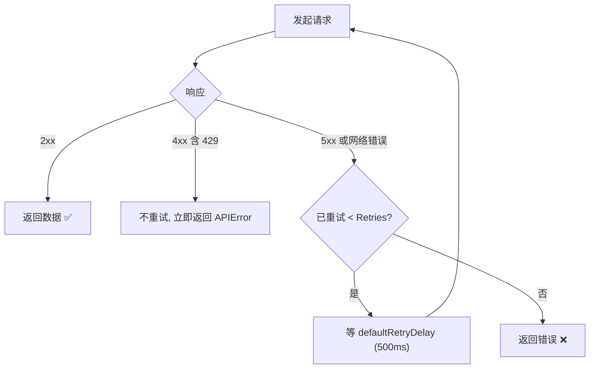

# WithRetries

> 设置网络错误与 HTTP 5xx 的自动重试次数。默认 2（最多请求 3 次）。

## 签名

```go
func WithRetries(n int) ClientOption
```

## 作用

设置 `Client.Retries`，`doRequest` 在网络错误或 HTTP 5xx 时按此次数重试。默认 `2`，即一次请求最多发起 `Retries+1 = 3` 次 HTTP 调用。

::: tip 🎨 一图抵千言
重试只覆盖「瞬时故障」，4xx（含 429）永不重试。
:::



## 边界处理

| 输入 | 行为 |
|------|------|
| 正整数 `n > 0` | 写入 `Retries = n` |
| `0` | 写入 `Retries = 0`（不重试，仅请求一次） |
| 负数 `n < 0` | **视为 0** |

## 示例

```go
// 弱网环境多给两次机会
client := ipapi.NewClient(ipapi.WithRetries(5)) // 最多请求 6 次

// 高吞吐、宁可失败也别等
client := ipapi.NewClient(ipapi.WithRetries(0)) // 只请求一次

// 负数安全
client := ipapi.NewClient(ipapi.WithRetries(-1)) // 实际 Retries = 0
```

## 重试的边界

::: warning ⚠️ 这些情况**不**重试
| 情况 | 行为 | 原因 |
|------|------|------|
| HTTP 4xx（含 429） | 立即返回 | 客户端错误，重试也不会变 |
| `context.Canceled` | 立即返回 | 调用方主动取消 |
| 校验错误（无效 IP/字段/格式） | 立即返回 | 本地校验，未发请求 |
| 网络错误 / 5xx | 重试至多 `Retries` 次 | 瞬时故障可能恢复 |
:::

## 重试间隔

固定 `defaultRetryDelay = 500ms`，不指数退避。ipapi.co 的瞬时故障多为短抖动，固定间隔足够；若需更复杂退避策略，用 [`WithCustomHTTPClient`](./with-custom-http-client) 接入自带退避的 Transport，或用 [`WithErrorHandler`](./with-error-handler) 自行编排。

::: details 📐 为什么不指数退避
- ipapi.co 限流返回的是 429（4xx，不重试），不会因重试放大被限流
- 5xx 通常是短时抖动，500ms 后多数已恢复
- 固定间隔实现简单、行为可预测，便于排查

如遇持续 5xx，应检查 [`WithBaseURL`](./with-base-url) 是否指向健康后端，或调高 `Retries` 兜底。
:::

## 内部

```go
func WithRetries(n int) ClientOption {
    return func(c *Client) {
        if n < 0 {
            n = 0
        }
        c.Retries = n
    }
}
```

## 下一步

- 🏗 看 [`NewClient`](./new-client)
- ⏱️ 看 [`WithTimeout`](./with-timeout)
- 📡 看 [`WithRateLimiter`](./with-rate-limiter)
- 🧭 看 [重试与限流](/guide/retry-concept)
