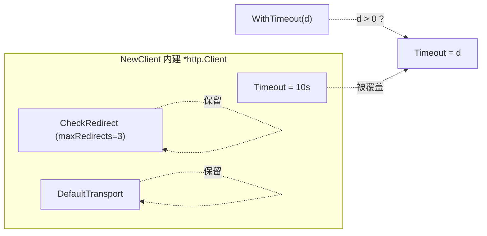

# WithTimeout

> 设置单次 HTTP 请求的超时（默认 10s）。就地修改现有 `*http.Client`，不替换它。

## 签名

```go
func WithTimeout(d time.Duration) ClientOption
```

## 作用

修改 `Client.HTTPClient.Timeout`，控制单次请求（含连接、TLS、读响应体）的最大耗时。默认 `10s`。

与 [`WithCustomHTTPClient`](./with-custom-http-client) 的区别：`WithTimeout` **就地改 Timeout 字段**，保留 `CheckRedirect` / `Transport` 等其余配置；`WithCustomHTTPClient` 则替换整个 client。

::: tip 🎨 一图抵千言
`WithTimeout` 只改一个字段，不动 client 的其余结构。
:::



## 边界处理

| 输入 | 行为 |
|------|------|
| `d > 0` | 写入 `HTTPClient.Timeout = d` |
| `d <= 0` | **忽略**，保留默认 |
| `HTTPClient == nil` | **跳过**（防御性，正常不会发生） |

## 示例

```go
// 弱网延长到 30s
client := ipapi.NewClient(ipapi.WithTimeout(30 * time.Second))

// 高并发缩短到 2s 快失败
client := ipapi.NewClient(ipapi.WithTimeout(2 * time.Second))
```

## 与 WithCustomHTTPClient 的顺序

::: warning ⚠️ 同时用时，顺序很重要
`WithTimeout` 改的是「当前」的 `*http.Client`。若用 `WithCustomHTTPClient` 替换了 client，`WithTimeout` 必须在它**之后**应用才能落到自定义 client 上。

```go
// ✅ 正确：自定义 client 在前，超时落在它上面
ipapi.NewClient(
    ipapi.WithCustomHTTPClient(custom),
    ipapi.WithTimeout(15*time.Second),
)

// ❌ 错误：WithTimeout 作用于默认 client，随后被替换
ipapi.NewClient(
    ipapi.WithTimeout(15*time.Second),
    ipapi.WithCustomHTTPClient(custom),  // 替换掉，超时丢失
)
```
:::

只调超时、不需要自定义 Transport/CheckRedirect 时，**优先用 `WithTimeout`**，比 `WithCustomHTTPClient(&http.Client{Timeout: d})` 更简洁。

## 内部

```go
func WithTimeout(d time.Duration) ClientOption {
    return func(c *Client) {
        if d > 0 && c.HTTPClient != nil {
            c.HTTPClient.Timeout = d
        }
    }
}
```

## 下一步

- 🏗 看 [`NewClient`](./new-client)
- 🔄 看 [`WithRetries`](./with-retries)
- 🚚 看 [`WithCustomHTTPClient`](./with-custom-http-client)
- 🧭 看 [Client 概念](/guide/client-concept)
