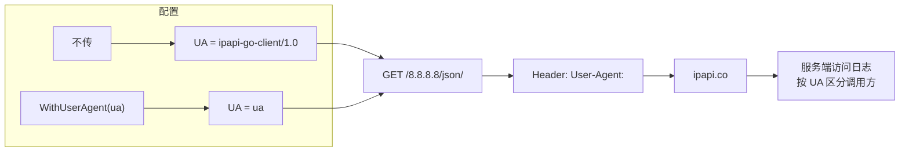

# WithUserAgent

> 覆盖 SDK 默认的 `User-Agent` 请求头（`ipapi-go-client/1.0`）。

## 签名

```go
func WithUserAgent(ua string) ClientOption
```

## 作用

设置 `Client.UserAgent`，每次请求的 `setHeaders` 会写入 `User-Agent` 头。默认 `ipapi-go-client/1.0`。

::: tip 🎨 一图抵千言
`WithUserAgent` 让服务端能识别调用方，下图展示同一请求的不同 UA 落点。
:::



## 边界处理

| 输入 | 行为 |
|------|------|
| 非空字符串 | 写入 `UserAgent` |
| 空字符串 `""` | **忽略**，保留默认 |

## 示例

```go
// 让服务端日志能识别你的应用
client := ipapi.NewClient(ipapi.WithUserAgent("acme-analytics/3.2"))

// 多服务复用同一 Key 时按 UA 区分配额
client := ipapi.NewClient(
    ipapi.WithAPIKey(os.Getenv("IPAPI_KEY")),
    ipapi.WithUserAgent("svc-report/1.0"),
)
```

## 为什么自定义 UA

- 📊 **服务端统计**：ipapi.co 控制台按 UA 聚合调用来源
- 🔍 **排障**：多服务共用 Key 时，日志能定位是哪个调用方
- 🤝 **礼貌标识**：让服务方知道如何联系你（如 `org-contact@example.com`）

::: details 🔒 UA 安全提示
UA 是用户可控的明文头，服务端不应基于它做鉴权。仅用于统计与排障。真正的鉴权永远走 [`WithAPIKey`](./with-api-key)。
:::

## 内部

```go
func WithUserAgent(ua string) ClientOption {
    return func(c *Client) {
        if ua != "" {
            c.UserAgent = ua
        }
    }
}
```

`setHeaders`：

```go
if c.UserAgent != "" {
    req.Header.Set("User-Agent", c.UserAgent)
}
```

## 下一步

- 🏗 看 [`NewClient`](./new-client)
- 🌐 看 [`WithBaseURL`](./with-base-url)
- 🧭 看 [Client 概念](/guide/client-concept)
