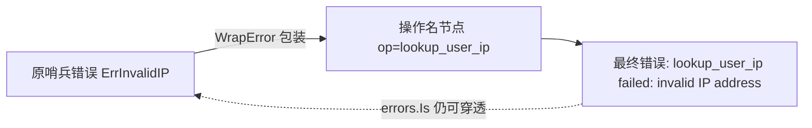
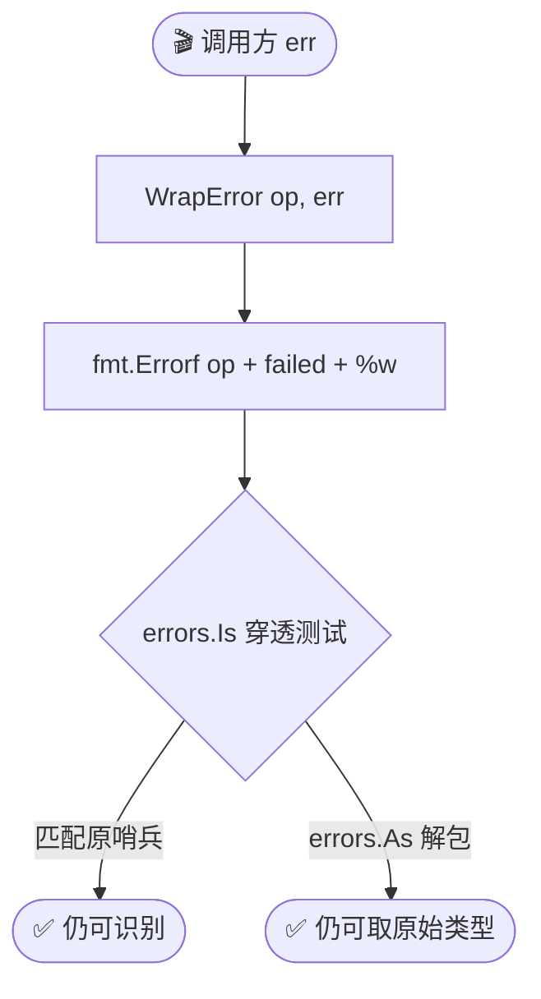
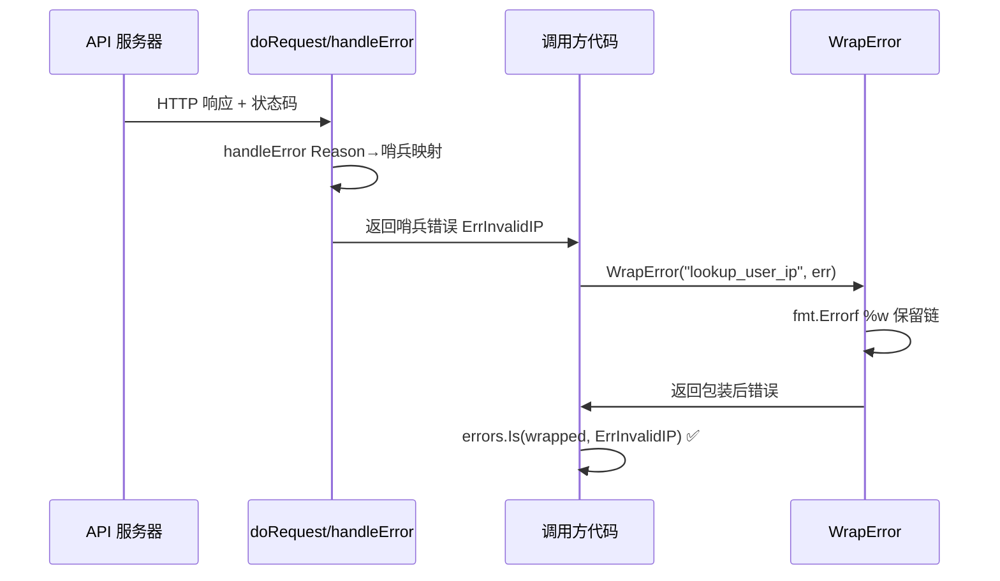

# WrapError

> 给错误加操作名上下文，保留错误链。

## 签名

```go
func WrapError(op string, err error) error
```

## 作用

把 `err` 包装成 `"<op> failed: <err>"`，用 `%w` 保留原错误，`errors.Is`/`errors.As` 仍可穿透。

::: tip 🎨 一图抵千言
`WrapError` 在错误链上插入一层操作名节点，但不切断 `errors.Is` 的穿透。
:::





::: info 🔗 %w 与 %v 的区别
- `%w`（wrap）：保留错误链，`errors.Is`/`errors.As` 可穿透到原哨兵。
- `%v`（value）：仅字符串拼接，错误链断裂，无法再用 `errors.Is` 匹配原错误。
`WrapError` 选用 `%w`，确保哨兵识别能力不丢失。
:::

## 实现

```go
func WrapError(op string, err error) error {
	return fmt.Errorf("%s failed: %w", op, err)
}
```

## 示例

```go
info, err := client.GetIPInfo(ctx, ip, "json")
if err != nil {
	return ipapi.WrapError("lookup_user_ip", err)
}
// 错误消息: "lookup_user_ip failed: invalid IP address"

// 仍可匹配哨兵
if errors.Is(wrappedErr, ipapi.ErrInvalidIP) {
	// true
}
```

## 用途

- 🏷 给错误加业务上下文（哪个操作失败）
- 🔗 保留错误链，不破坏 `errors.Is`
- 📋 日志可读性

::: tip 💡 错误链的"洋葱"结构
多次 `WrapError` 会层层包裹，形成 `op3 failed: op2 failed: op1 failed: invalid IP address`。日志里一眼看出错误传播路径，而 `errors.Is(err, ErrInvalidIP)` 仍能命中最内层的哨兵。
:::

## 与 handleError 区别

| 函数 | 时机 | 作用 |
|------|------|------|
| `handleError` | SDK 内部，每次返回前 | Reason→哨兵映射 + 自定义 handler |
| `WrapError` | 调用方，按需 | 加操作名 |

`WrapError` 是给**调用方**用的工具，不影响 SDK 内部行为。



::: warning ⚠️ 别用 fmt.Errorf %v 静默吞链
如果调用方自行用 `fmt.Errorf("%s failed: %v", op, err)` 包装，错误链会断裂，`errors.Is` 将永远返回 `false`。要加操作名上下文，请统一用 `WrapError`。
:::

## 下一步

- 🛡 学 [错误处理概念](/guide/error-concept)
- 📖 看 [`IsRetryableError`](./is-retryable)
- 📖 看 [错误类型](./errors)
