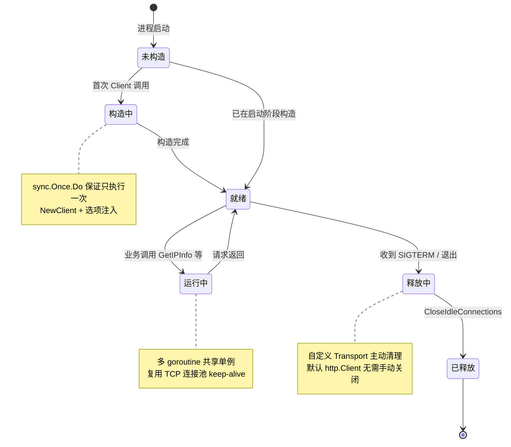
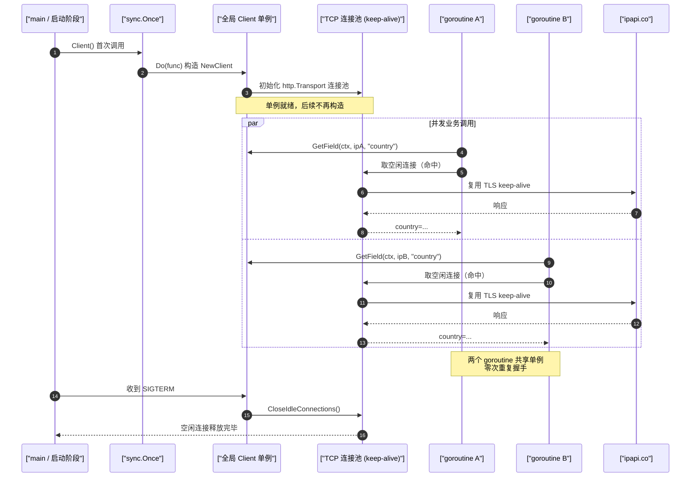

# ✅ 客户端生命周期管理

> 全局单例复用：应用启动时创建，退出时释放。一次构造，处处复用。

## 📌 背景

`ipapi.Client` 内部持有一个 `*http.Client`，后者又通过 `http.Transport` 维护着 **TCP 连接池**。每次新建 `Client` 都会重建这整套底层设施，而每次请求都重新走 TCP + TLS 握手，代价远高于复用一条已建好的 keep-alive 连接。

为什么客户端生命周期管理很重要：

- 🚀 **性能**：复用连接池可避免每次请求都重新握手，延迟可降低数十到数百毫秒。
- 💸 **配额**：`ipapi.co` 对免费层有每分钟/每日请求次数限制，连接重建不会消耗配额，但短连接在高并发下更容易触发 `429 Too Many Requests`。
- 🧹 **资源**：自定义 `Transport`、`RateLimiter`、`errorHandler` 等都是依附于 `Client` 的资源，无序创建会造成 goroutine 与文件描述符泄漏。
- 🧪 **可测性**：单例让依赖注入与 Mock 替换变得简单——只需替换一处。

::: info 📊 单例 vs 每请求新建 对比
| 维度 | 全局单例 | 每请求新建 |
| --- | --- | --- |
| TCP/TLS 握手 | 复用 keep-alive，省 | 每次重做，贵 |
| 延迟 | 低（数十 ms 省） | 高 |
| 文件描述符 | 稳定 | TIME_WAIT 堆积 |
| 连接池复用 | ✅ | ❌ |
| 资源释放 | 退出时一次性 | 易泄漏 |
| 可测性 | 依赖注入简单 | 难 |
:::

一句话原则：**一个进程一个 `Client`，应用启动时构造，退出时释放。**

::: tip 🎨 一图抵千言
下图展示 `Client` 的完整生命周期：应用启动时通过 `sync.Once` 构造单例（含连接池），运行期多个 goroutine 共用，退出阶段 graceful shutdown 释放自定义 Transport 资源。
:::



::: tip 🎨 一图抵千言
上图是**状态视角**，下面这张时序图换**交互视角**：多个 goroutine 并发打到同一个单例 `Client`，复用同一条 keep-alive 连接，避免重复握手——这正是"单例复用"在运行期的真实收益。
:::



## ✅ 建议

### 1. 用 `sync.Once` 构造全局单例

`NewClient` 是轻量的，但底层 `http.Client` 与 `Transport` 不是。用 `sync.Once` 保证只构造一次，并发安全：

```go
package iplookup

import (
    "context"
    "sync"
    "time"

    "github.com/cyberspacesec/ipapi-co-skills/pkg/ipapi"
)

var (
    globalClient *ipapi.Client
    once         sync.Once
)

// Client 返回进程级单例客户端。
// 首次调用时构造，后续调用直接复用。
func Client() *ipapi.Client {
    once.Do(func() {
        globalClient = ipapi.NewClient(
            ipapi.WithAPIKey("YOUR_API_KEY"),
        )
    })
    return globalClient
}

// 业务代码任意位置调用
func LookupCountry(ctx context.Context, ip string) (string, error) {
    return Client().GetField(ctx, ip, "country_name")
}
```

### 2. 应用启动阶段构造，而非首次请求时

把构造挪到 `main` 的初始化阶段，配合 graceful shutdown 释放。这样首请求不背冷启动开销，关闭时也能主动释放连接：

```go
func main() {
    ctx, stop := signal.NotifyContext(context.Background(),
        os.Interrupt, syscall.SIGTERM)
    defer stop()

    // 启动阶段：构造单例
    c := iplookup.Client()

    // 运行阶段：复用单例
    country, err := iplookup.LookupCountry(ctx, "8.8.8.8")
    if err != nil {
        log.Fatalf("lookup failed: %v", err)
    }
    fmt.Println("country:", country)

    // 退出阶段：等待主流程结束，底层连接随 Transport 关闭
    <-ctx.Done()
    shutdown()
}

func shutdown() {
    // 默认 http.Client 无显式 Close；
    // 若注入了自定义 Transport，在此调用 CloseIdleConnections() 释放空闲连接。
    if t, ok := iplookup.CustomTransport(); ok {
        t.CloseIdleConnections()
    }
    log.Println("ipapi client released")
}
```

### 3. 注入自定义 `http.Client` 时，主动管理其生命周期

当通过 `WithCustomHTTPClient` 注入自定义传输层（如带代理、自定义 TLS、连接池调优），释放责任就落到了你头上。务必在退出时清理：

```go
var (
    customTransport *http.Transport
    globalClient    *ipapi.Client
    once            sync.Once
)

func Client() *ipapi.Client {
    once.Do(func() {
        customTransport = &http.Transport{
            MaxIdleConns:        100,
            MaxIdleConnsPerHost: 10,
            IdleConnTimeout:     90 * time.Second,
        }
        globalClient = ipapi.NewClient(
            ipapi.WithAPIKey("YOUR_API_KEY"),
            ipapi.WithCustomHTTPClient(&http.Client{
                Transport: customTransport,
                Timeout:   10 * time.Second,
            }),
        )
    })
    return globalClient
}

func CustomTransport() (*http.Transport, bool) {
    return customTransport, customTransport != nil
}

func Close() {
    if customTransport != nil {
        customTransport.CloseIdleConnections() // 释放连接池中的空闲连接
    }
}
```

> 💡 默认 `http.Client`（SDK 内部构造的）使用的是 `http.DefaultTransport`，属于全局共享资源，**不需要**也无法手动关闭——这正是“单例复用”带来的隐式好处。

::: details 🔧 资源释放对照表
| 资源类型 | 是否需手动释放 | 释放方式 | 说明 |
| --- | --- | --- | --- |
| 默认 `http.Client`（SDK 构造） | ❌ 否 | — | 基于 `http.DefaultTransport`，全局共享 |
| 自定义 `*http.Transport` | ✅ 是 | `CloseIdleConnections()` | 注入方负责清理空闲连接 |
| `time.NewTicker` 限流器 | ✅ 是 | `ticker.Stop()` | 防止定时器泄漏 |
| `WithErrorHandler` 回调 | ❌ 否 | — | 无状态，随 Client 自然回收 |
:::

## ❌ 反模式

### ❌ 每次请求都新建一个 Client

```go
// 反模式：每个请求都构造一次，连接池根本没机会复用
func Lookup(ctx context.Context, ip string) (string, error) {
    c := ipapi.NewClient(ipapi.WithAPIKey("YOUR_API_KEY"))
    return c.GetField(ctx, ip, "country_name")
}
```

后果：每次请求都走完整 TLS 握手，延迟飙升；高并发下短连接堆积，文件描述符与 TIME_WAIT 占用快速上升。

### ❌ 在循环或热路径里调用 `sync.Once` 之外的新建逻辑

```go
// 反模式：循环里反复 NewClient，相当于把单例白做了
for _, ip := range ips {
    c := ipapi.NewClient(ipapi.WithAPIKey("YOUR_API_KEY"))
    _, _ = c.GetField(ctx, ip, "country")
}
```

正确做法是在循环外取到单例，循环内只调用方法。

### ❌ 把单例放进短生命周期对象里

```go
// 反模式：handler 每次请求都新建，Client 又跟着重建
type Handler struct {
    client *ipapi.Client
}

func NewHandler() *Handler {
    return &Handler{
        client: ipapi.NewClient(ipapi.WithAPIKey("YOUR_API_KEY")),
    }
}
```

如果 `Handler` 本身是请求级的，`Client` 也就退化成了请求级。应让 `Handler` 持有**全局单例的引用**，而不是自建。

### ❌ 注入了自定义 Transport 却从不释放

```go
// 反模式：注入了 Transport，但退出时不 CloseIdleConnections
ipapi.NewClient(
    ipapi.WithCustomHTTPClient(&http.Client{
        Transport: &http.Transport{ /* 自定义连接池 */ },
    }),
)
// ... 程序退出，连接池里的空闲连接无人清理
```

自定义 `Transport` 不会自动随 GC 关闭，需在 shutdown 阶段显式 `CloseIdleConnections()`。

### ❌ 多个 goroutine 各自持有一份“单例”

```go
// 反模式：每个 goroutine 自己 once.Do，结果 once 是局部变量，根本没起到单例作用
func worker(ip string) {
    var (
        c    *ipapi.Client
        once sync.Once // 局部变量，每次调用 worker 都新建一个
    )
    once.Do(func() { c = ipapi.NewClient(...) })
    c.GetField(ctx, ip, "country")
}
```

`sync.Once` 必须是**包级或长生命周期**的变量，否则单例不成立。

## ✅ 检查清单

- [ ] 全进程只通过一个 `ipapi.Client` 单例访问 API（`sync.Once` 包裹构造）。
- [ ] `sync.Once` / 单例变量定义在**包级**，而非函数局部。
- [ ] 客户端在**应用启动阶段**构造，而非首请求时冷启动。
- [ ] 业务代码复用单例引用，不在循环 / 热路径 / 请求级对象里重新 `NewClient`。
- [ ] 使用了 `WithCustomHTTPClient` 时，对应的 `*http.Transport` 被妥善持有并在退出时 `CloseIdleConnections()`。
- [ ] 配合 `signal.NotifyContext` 实现 graceful shutdown，退出时释放自定义资源。
- [ ] 默认 `http.Client`（SDK 内部构造）不做手动关闭——不重复造轮子。
- [ ] 单元测试通过依赖注入替换 Client，而非全局变量的副作用。
- [ ] 高并发场景下确认连接复用（如抓包或 metrics 看到 keep-alive 命中）。

## 🔗 相关

- 指南：[客户端概念](../guide/client-concept) · [自定义 HTTP 客户端](../guide/custom-http) · [重试机制](../guide/retry-concept) · [上下文与超时](../guide/context)
- API：[NewClient](../api/new-client) · [Client 结构体](../api/client) · [WithCustomHTTPClient](../api/with-custom-http-client) · [WithAPIKey](../api/with-api-key) · [WithErrorHandler](../api/with-error-handler) · [请求方法](../api/methods)
- 最佳实践：[最佳实践总览](../reference/index)
