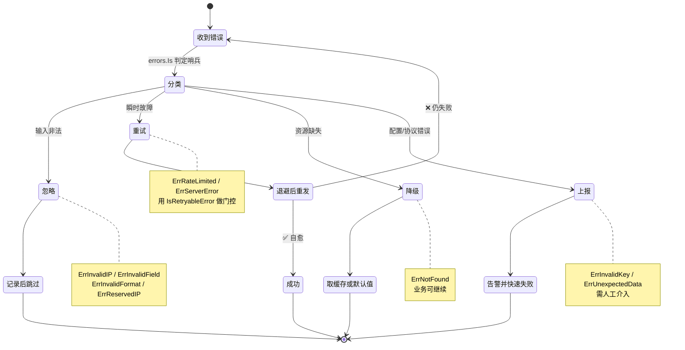
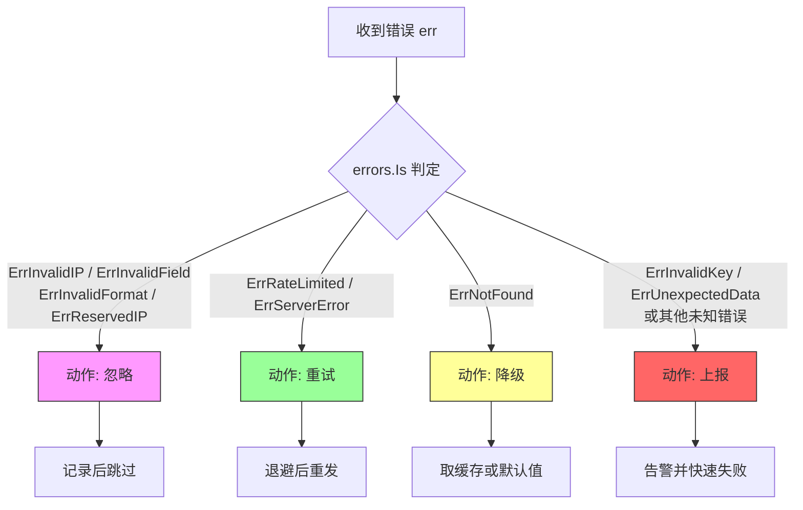

# ✅ 错误处理策略

> 按错误类型分级处理：**忽略 / 重试 / 降级 / 上报**

## 📌 背景

调用 `ipapi.co` 时，并非所有错误都该一视同仁。一次查询失败可能源于：

- 🌐 网络抖动（瞬时，可恢复）
- 🚦 触发限流（`429`，需退避后重试）
- 🔑 API Key 无效（配置问题，重试无用）
- 🚫 保留 IP / 非法 IP（输入问题，永久失败）
- 💥 服务端 5xx（临时故障）

如果把 `ErrInvalidKey` 也无脑重试，只会浪费配额、放大故障；如果把 `ErrRateLimited` 直接抛给上层，又会让本可自愈的请求白白失败。**分级处理**的核心在于：让每种错误去到它该去的地方——能自愈的自愈，该降级的降级，该告警的告警。

::: tip 🎨 一图抵千言
下面的状态图展示了 SDK 哨兵错误如何按"可恢复性"分流到四个动作。核心判断点是「**重试能否改变结果**」——不能则忽略/上报，能则退避重试。
:::



`pkg/ipapi` 已提供分级所需的所有原语：

| 原语 | 作用 |
| --- | --- |
| `errors.Is(err, ErrRateLimited)` | 哨兵错误判定，支持 `fmt.Errorf("%w")` 解包 |
| `IsRetryableError(err)` | 内置可重试判定（限流 / 5xx / 404） |
| `WithErrorError(handler)` | 注入自定义错误处理函数，集中分流 |
| `WrapError(op, err)` | 包装操作名，保留错误链路 |

## 💡 建议

### 1. 先分类，再决策

用一张决策表把错误映射到四个动作：

| 错误类型 | 动作 | 理由 | 是否可重试 |
| --- | --- | --- | --- |
| `ErrInvalidIP` / `ErrInvalidField` / `ErrInvalidFormat` | **忽略**（记录后跳过） | 输入非法，重试结果不变 | ❌ 否 |
| `ErrReservedIP` | **忽略**（视为无数据） | 保留 IP 本就无地理位置 | ❌ 否 |
| `ErrRateLimited` / `ErrServerError` | **重试**（带退避） | 瞬时故障，可自愈 | ✅ 是 |
| `ErrNotFound` | **降级**（用缓存 / 默认值） | 资源不存在，但业务可继续 | ❌ 否 |
| `ErrInvalidKey` / `ErrUnexpectedData` | **上报**（告警 + 快速失败） | 配置或协议错误，需人工介入 | ❌ 否 |

::: info 🔍 哨兵错误速查
SDK 共定义 10 个哨兵错误，覆盖输入校验、配额、协议、服务端四类故障。完整列表见 [错误类型总览](../api/errors)，可用 `errors.Is(err, ipapi.ErrXxx)` 精确判定。
:::

### 2. 用 `WithErrorHandler` 集中分流

把分级逻辑收口在一处，避免每个调用点都写一长串 `if`：

::: tip 🎨 一图抵千言
下面的流程图展示了 `classify` 函数的决策路径——从错误入口到四个动作出口，每条分支都对应一个 `errors.Is` 判定。
:::



```go
package main

import (
	"context"
	"errors"
	"fmt"
	"log/slog"
	"time"

	"example.com/ipapi"
)

// 分级动作枚举
type action int

const (
	actionIgnore action = iota
	actionRetry
	actionFallback
	actionAlert
)

func classify(err error) action {
	switch {
	case errors.Is(err, ipapi.ErrInvalidIP),
		errors.Is(err, ipapi.ErrInvalidField),
		errors.Is(err, ipapi.ErrInvalidFormat),
		errors.Is(err, ipapi.ErrReservedIP):
		return actionIgnore
	case errors.Is(err, ipapi.ErrRateLimited),
		errors.Is(err, ipapi.ErrServerError):
		return actionRetry
	case errors.Is(err, ipapi.ErrNotFound):
		return actionFallback
	default: // ErrInvalidKey / ErrUnexpectedData / 未知错误
		return actionAlert
	}
}

func main() {
	client := ipapi.NewClient(
		ipapi.WithAPIKey("YOUR_KEY"),
		// 集中错误分流：记录动作后原样透传，由调用方执行对应策略
		ipapi.WithErrorHandler(func(err error) error {
			switch classify(err) {
			case actionIgnore:
				slog.Warn("忽略不可恢复错误", "err", err)
			case actionRetry:
				slog.Info("可重试错误", "err", err)
			case actionFallback:
				slog.Warn("触发降级", "err", err)
			case actionAlert:
				slog.Error("需上报错误", "err", err)
				// 这里可接入 Sentry / Prometheus / 钉钉告警
			}
			return err
		}),
	)

	_ = client
}
```

### 3. 重试：退避 + 上限，只重试可重试错误

直接复用 SDK 内置的 `IsRetryableError`，并用指数退避：

```go
// LookupWithRetry 在可重试错误上做指数退避，最多尝试 maxAttempts 次。
func LookupWithRetry(ctx context.Context, c *ipapi.Client, ip string, maxAttempts int) (*ipapi.IPInfo, error) {
	var backoff = 500 * time.Millisecond
	var lastErr error

	for i := 0; i < maxAttempts; i++ {
		info, err := c.GetIPInfo(ctx, ip, "json")
		if err == nil {
			return info, nil
		}
		lastErr = err

		// 非可重试错误（如 ErrInvalidKey）立即放弃，不浪费配额
		if !ipapi.IsRetryableError(err) {
			return nil, ipapi.WrapError("LookupWithRetry", err)
		}

		select {
		case <-ctx.Done():
			return nil, ctx.Err()
		case <-time.After(backoff):
			backoff *= 2 // 指数退避
		}
	}
	return nil, ipapi.WrapError("LookupWithRetry", lastErr)
}
```

> 💡 SDK 的 `Client.Retries` 字段已在底层对**网络错误和 5xx** 做了固定 `500ms` 间隔的重试。上面这层应用级重试主要兜底 `429 限流`（底层不重试限流，需退避后再请求）。

### 4. 降级：失败时返回缓存或默认值

当 `ErrNotFound` 或重试耗尽时，让业务继续而非崩溃：

```go
var cache sync.Map // key=ip, value=*IPInfo

// LookupWithFallback 查询失败时回退到缓存，缓存也没有则返回安全默认值。
func LookupWithFallback(ctx context.Context, c *ipapi.Client, ip string) *ipapi.IPInfo {
	if v, ok := cache.Load(ip); ok {
		return v.(*ipapi.IPInfo) // 命中缓存，直接返回
	}

	info, err := c.GetIPInfo(ctx, ip, "json")
	if err != nil {
		// 降级一：可重试错误 → 用过期缓存（宁可旧数据也不要空）
		if ipapi.IsRetryableError(err) {
			if v, ok := cache.Load(ip); ok {
				slog.Warn("使用过期缓存降级", "ip", ip, "err", err)
				return v.(*ipapi.IPInfo)
			}
		}
		// 降级二：彻底失败 → 返回安全默认值，业务可继续
		slog.Error("查询失败，使用默认值", "ip", ip, "err", err)
		return &ipapi.IPInfo{IP: ip} // 仅保留 IP，其余字段为零值
	}

	cache.Store(ip, info)
	return info
}
```

### 5. 上报：用 `WrapError` 保留链路，接入告警

对于 `ErrInvalidKey`、`ErrUnexpectedData` 这类需人工介入的错误，务必包装操作上下文再上报：

```go
info, err := c.GetIPInfo(ctx, ip, "json")
if err != nil {
	// 保留原始错误链路（%w），同时附加操作名
	wrapped := ipapi.WrapError(fmt.Sprintf("GetIPInfo(%s)", ip), err)

	if errors.Is(err, ipapi.ErrInvalidKey) || errors.Is(err, ipapi.ErrUnexpectedData) {
		// 上报到监控：错误链路会被完整记录
		alertErr(wrapped)
	}
	return nil, wrapped
}
```

> ⚠️ `WrapError` 内部用 `fmt.Errorf("%s failed: %w", op, err)`，**保留了 `%w` 包装**，下游仍可用 `errors.Is` / `errors.As` 解包判定。

::: details 🔧 四种动作的落地清单
| 动作 | 关键 API | 落地位置 |
| --- | --- | --- |
| 忽略 | `slog.Warn` + `errors.Is` 判定 | `WithErrorHandler` 回调 |
| 重试 | `IsRetryableError` + 指数退避 | 业务层 `LookupWithRetry` |
| 降级 | 缓存 `sync.Map` + 安全默认值 | `LookupWithFallback` |
| 上报 | `WrapError` + 告警通道 | 调用点 + 集中 handler |
:::

## 🚫 反模式

### ❌ 无脑重试所有错误

```go
// 错误：ErrInvalidKey 重试一万次还是无效，只会触发更严重的限流
for i := 0; i < 5; i++ {
    if _, err := c.GetIPInfo(ctx, ip, "json"); err != nil {
        time.Sleep(time.Second)
        continue
    }
    break
}
```

**问题**：对 `ErrInvalidKey`、`ErrInvalidIP` 这类永久错误重试毫无意义，还会把一次性失败放大成配额雪崩。应先 `IsRetryableError(err)` 判定。

### ❌ 用字符串匹配判定错误

```go
// 错误：依赖错误信息文案，一旦上游改措辞就失效
if strings.Contains(err.Error(), "rate limit") {
    // ...
}
```

**问题**：文案不可靠。应使用哨兵错误 `errors.Is(err, ipapi.ErrRateLimited)`，详见 [错误概念](../guide/error-concept)。

### ❌ 吞掉错误返回零值而不记录

```go
// 错误：静默丢弃，故障无从溯源
info, _ := c.GetIPInfo(ctx, ip, "json")
return info // 失败时返回零值 *IPInfo，调用方无法区分"真无数据"还是"查询失败"
```

**问题**：即便决定降级，也至少要 `slog` 记录原因，否则线上故障无人知晓。

### ❌ 在错误处理里丢失原始链路

```go
// 错误：用 %v 而非 %w，errors.Is 将失效
return fmt.Errorf("lookup failed: %v", err)
```

**问题**：`%v` 是字符串拼接，不保留包装关系。下游所有 `errors.Is` 判定全部失效，分级逻辑随之崩塌。正确做法见 SDK 的 `WrapError`（使用 `%w`）。

### ❌ 重试不退避， hammer 服务端

```go
// 错误：限流时还密集重试，只会让 429 更严重
for i := 0; i < 5; i++ {
    if _, err := c.GetIPInfo(ctx, ip, "json"); err == nil {
        break
    }
}
```

**问题**：限流场景下应**指数退避**，给服务端恢复时间。无间隔重试是 DDoS 自己的供应商。

## ✅ 检查清单

- [ ] 每个错误处理分支都先用 `errors.Is` 分类，而非字符串匹配
- [ ] 重试前用 `IsRetryableError(err)` 过滤，永久错误立即放弃
- [ ] 重试采用指数退避，且尊重 `ctx.Done()` 支持取消
- [ ] 降级路径有缓存或安全默认值，业务不因单次查询失败而中断
- [ ] 降级时仍通过 `slog` 记录错误原因，便于事后溯源
- [ ] `ErrInvalidKey` / `ErrUnexpectedData` 等配置类错误接入告警通道
- [ ] 错误包装统一用 `WrapError` 或 `fmt.Errorf("%w")`，保留链路可解包
- [ ] 通过 `WithErrorHandler` 集中分流，调用点不重复写分级逻辑
- [ ] 重试次数有上限，避免无限循环拖垮调用方
- [ ] 限流（`ErrRateLimited`）单独走退避路径，不与普通重试混用

## 🔗 相关

- 指南
  - [错误概念](../guide/error-concept) — 哨兵错误与 `errors.Is` 原理
  - [重试概念](../guide/retry-concept) — 底层重试机制与 `Client.Retries`
  - [客户端概念](../guide/client-concept) — `Client` 结构与选项
- API 参考
  - [IsRetryableError](../api/is-retryable)
  - [WrapError](../api/wrap-error)
  - [WithErrorHandler](../api/with-error-handler)
  - [错误类型总览](../api/errors)
- 最佳实践
  - [客户端生命周期](./client-lifecycle)
  - [密钥管理](./secret-management)
