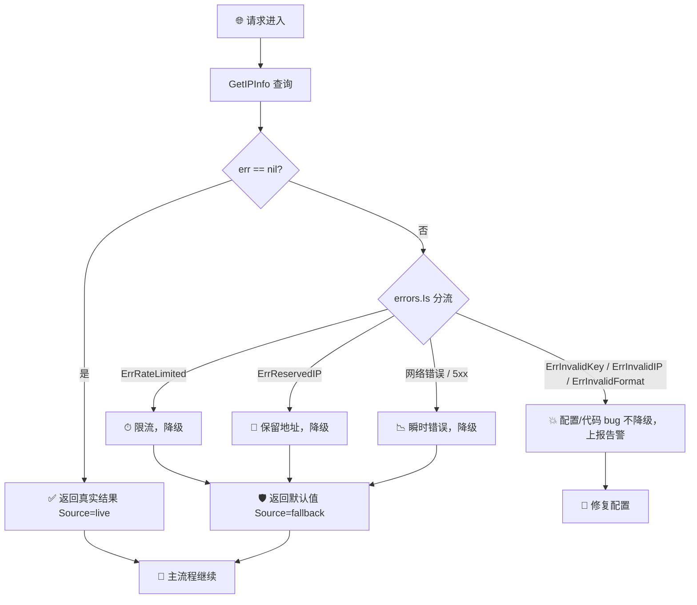
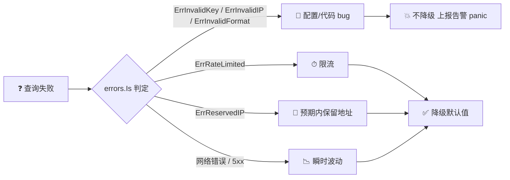
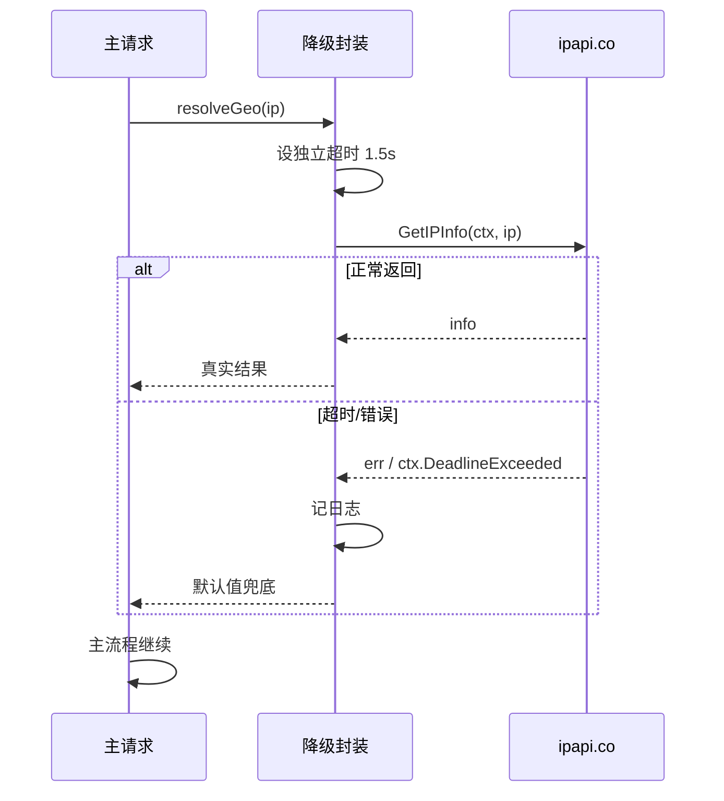
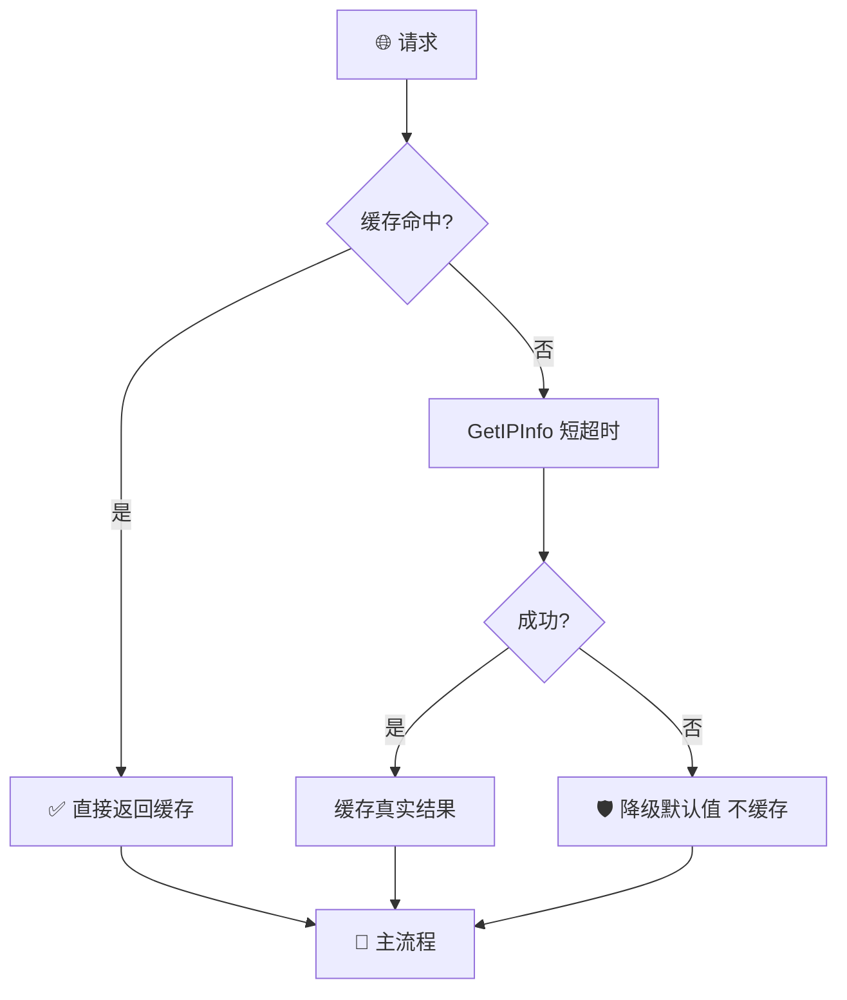

# ✅ 优雅降级

> IP 查询是「锦上添花」而非「雪中送炭」。当 ipapi.co 不可用时，用默认值兜底，保证主流程继续跑。

## 背景

地理定位、货币本地化、时区显示这类能力，通常只是业务链路上的**增强信息**，不是核心事务。比如电商结算页要展示用户所在国家的货币——查不到时显示一个默认货币（USD），用户照样能下单。

如果把 ipapi.co 调用当成强依赖，会出现这些麻烦：

- 🌐 **网络抖动即雪崩**：ipapi.co 偶发 5xx 或超时，导致整条请求链失败，用户连基本功能都用不了。
- 💥 **错误冒泡到顶层**：一个非关键查询的错误被层层 `return err`，最终让一个本可成功的 HTTP 请求变成 500。
- 📉 **可用性被弱依赖拖垮**：核心服务的 SLA 被 IP 查询这种辅助调用的可用性「平均掉」。
- 🧊 **冷启动体验差**：服务刚起来缓存未预热，第一批用户全看到报错而不是降级后的可用界面。

优雅降级的核心思想是：**区分「必需」与「可选」**。ipapi.co 的结果在绝大多数场景下属于可选——失败时给一个合理的默认值，记一条日志，主流程继续。

::: tip 🎨 一图抵千言
下面是降级策略的全景图：查询失败时按错误类型分流，要么降级、要么上报。
:::



## 建议

### 1. 区分可降级字段，预定义默认值

先想清楚：你的业务用了 `IPInfo` 的哪些字段？每个字段查不到时该回退到什么？把这些默认值集中定义，避免散落在代码各处。

::: info 📊 常用字段默认值参考
| 字段 | 默认值 | 业务影响 |
|------|--------|----------|
| `CountryCode` | `US` | 区域路由、合规口径 |
| `CountryName` | `United States` | 展示文案 |
| `Currency` | `USD` | 价格展示 |
| `Timezone` | `America/Los_Angeles` | 时间显示 |
| `Languages` | `en` | 界面语言 |
:::

```go
// defaultGeo 集中管理所有可降级字段的兜底值
type defaultGeo struct {
	CountryCode string
	CountryName string
	Currency    string
	Timezone    string
	Languages   string
}

var fallback = defaultGeo{
	CountryCode: "US",
	CountryName: "United States",
	Currency:    "USD",
	Timezone:    "America/Los_Angeles",
	Languages:   "en",
}
```

### 2. 包装一个「降级查询」函数

把「查询 + 失败兜底 + 记录」封装成一层薄薄的封装，业务代码只管调用、不操心错误。

```go
// resolveGeo 查询 IP 地理信息，失败时返回默认值，永不返回 error。
func resolveGeo(ctx context.Context, client *ipapi.Client, ip string) *ipapi.IPInfo {
	info, err := client.GetIPInfo(ctx, ip, "json")
	if err != nil {
		// 记录但不抛出——这是可降级调用
		log.Printf("ip lookup failed for %s, using fallback: %v", ip, err)

		fallbackIP := ip
		if fallbackIP == "" {
			fallbackIP = "0.0.0.0"
		}
		return &ipapi.IPInfo{
			IP:          fallbackIP,
			Country:     fallback.CountryCode,
			CountryName: fallback.CountryName,
			CountryCode: fallback.CountryCode,
			Currency:    fallback.Currency,
			Timezone:    fallback.Timezone,
			Languages:   fallback.Languages,
			RetrievedAt: time.Now().UTC(),
		}
	}
	return info
}
```

调用方变得极其干净，主流程里看不到任何 `if err != nil`：

```go
func renderCheckout(ctx context.Context, client *ipapi.Client, userIP string) *Page {
	geo := resolveGeo(ctx, client, userIP) // 永远非 nil
	return &Page{
		Currency: geo.Currency, // 失败也是 "USD"
		Timezone: geo.Timezone,
	}
}
```

### 3. 用 errors.Is 区分「该降级」与「该上报」

并非所有错误都该静默兜底。**配置错误**（如 `ErrInvalidKey`）是 bug，应该尽快暴露；**运行时错误**（如限流、5xx）才适合降级。



```go
func resolveGeo(ctx context.Context, client *ipapi.Client, ip string) *ipapi.IPInfo {
	info, err := client.GetIPInfo(ctx, ip, "json")
	if err == nil {
		return info
	}

	switch {
	case errors.Is(err, ipapi.ErrInvalidKey),
		errors.Is(err, ipapi.ErrInvalidIP),
		errors.Is(err, ipapi.ErrInvalidFormat):
		// 配置/编程错误：不降级，直接 panic 或上报告警，逼着尽快修
		log.Panicf("non-degradable ipapi error (fix config!): %v", err)

	case errors.Is(err, ipapi.ErrRateLimited):
		log.Printf("rate limited, degrading for %s", ip)
		return defaultFor(ip)

	case errors.Is(err, ipapi.ErrReservedIP):
		// 保留地址本来就没有地理信息，降级最自然
		return defaultFor(ip)

	default:
		// 网络错误、5xx、解析失败等：降级 + 记录
		log.Printf("ipapi transient error for %s, degrading: %v", ip, err)
		return defaultFor(ip)
	}
}

func defaultFor(ip string) *ipapi.IPInfo {
	if ip == "" {
		ip = "0.0.0.0"
	}
	return &ipapi.IPInfo{
		IP:          ip,
		CountryCode: fallback.CountryCode,
		Currency:    fallback.Currency,
		Timezone:    fallback.Timezone,
		RetrievedAt: time.Now().UTC(),
	}
}
```

::: tip 🧭 降级决策树
`ErrInvalidKey` / `ErrInvalidIP` / `ErrInvalidFormat` → **不降级**，是配置或代码 bug。
`ErrRateLimited` / `ErrServerError` / `ErrNotFound` / 网络错误 → **降级**，属于运行时波动。
`ErrReservedIP` → **降级**，本来就拿不到地理信息。
:::

### 4. 给降级结果打标记，便于观测与缓存区分

降级返回的数据「不是真实查询结果」，下游（缓存、metrics、A/B 实验）需要知道这一点。在 `IPInfo` 之外加一个标记，或者用 `context` 传递。

```go
type geoResult struct {
	Info     *ipapi.IPInfo
	Source   string // "live" | "fallback"
}

func resolveGeo(ctx context.Context, client *ipapi.Client, ip string) geoResult {
	info, err := client.GetIPInfo(ctx, ip, "json")
	if err != nil {
		log.Printf("degrading for %s: %v", ip, err)
		return geoResult{Info: defaultFor(ip), Source: "fallback"}
	}
	return geoResult{Info: info, Source: "live"}
}
```

下游消费时可以分别统计真实命中率、降级率：

```go
r := resolveGeo(ctx, client, ip)
metrics.GeoLookup.WithLabelValues(r.Source).Inc()
cache.Set(ip, r.Info, ttlFor(r.Source)) // 降级数据缓存更短
```

### 5. 用超时 + context 控制降级时机

ipapi.co 卡住时，你要的是「快速失败 → 立刻降级」，而不是干等。用 `context.WithTimeout` 给查询一个硬上限，超时自动走兜底。



```go
func resolveGeo(client *ipapi.Client, ip string) *ipapi.IPInfo {
	// 给 IP 查询单独一个短超时，别让它拖垮外层请求
	ctx, cancel := context.WithTimeout(context.Background(), 1500*time.Millisecond)
	defer cancel()

	info, err := client.GetIPInfo(ctx, ip, "json")
	if err != nil {
		log.Printf("ip lookup degraded (ctx err=%v): %v", ctx.Err(), err)
		return defaultFor(ip)
	}
	return info
}
```

::: warning ⏱ 别共享外层长超时
外层 HTTP 请求可能有 30s 超时，但 IP 查询不该等那么久。给它独立的 1–2s 超时，超时即降级，把剩余时间预算留给真正的核心调用。
:::

### 6. 配合本地缓存，减少对远端的直接依赖

降级是最后一道防线，缓存是第一道。把成功结果短暂缓存，命中缓存时连 ipapi.co 都不用调，自然也谈不上降级。

::: tip 🛡 缓存与降级的分层防御
| 防线 | 机制 | 作用 |
|------|------|------|
| 第 1 道 | 本地缓存（LRU/网段） | 命中即返回，根本不调远端 |
| 第 2 道 | 短超时 context | 远端卡住时快速失败 |
| 第 3 道 | 降级默认值 | 失败也有兜底，主流程不挂 |
:::



```go
func resolveGeo(client *ipapi.Client, cache *lru.Cache, ip string) *ipapi.IPInfo {
	if v, ok := cache.Get(ip); ok {
		return v.(*ipapi.IPInfo) // 缓存命中，无需远端
	}

	ctx, cancel := context.WithTimeout(context.Background(), 1500*time.Millisecond)
	defer cancel()

	info, err := client.GetIPInfo(ctx, ip, "json")
	if err != nil {
		log.Printf("degrading for %s: %v", ip, err)
		return defaultFor(ip) // 失败不缓存，下次重试真实查询
	}

	cache.Add(ip, info) // 只缓存真实成功的结果
	return info
}
```

## 反模式

::: details 📋 反模式速查表（点击展开）
| 反模式 | 危害 | 正确做法 |
|--------|------|----------|
| 错误原样冒泡 | 弱依赖拖垮主流程 500 | 降级封装，永不返回 error |
| 返回 nil 当默认 | 下游空指针 panic | 返回填充默认值的 IPInfo |
| 静默吞所有错误 | API Key 错也降级，静默失效 | 区分配置错误与运行时错误 |
| 降级结果混缓存 | 错误数据固化 1 小时 | 降级数据不缓存或短 TTL |
| 降级路径同步重试 | 串行重试放大延迟 | 重试交 SDK，降级要快 |
| 保留 IP 报错 | 预期内结果当故障 | `ErrReservedIP` 走降级 |
:::

### ❌ 把错误原样冒泡到顶层

```go
// 反模式：IP 查询失败让整个结算接口 500
func buildCheckout(ctx context.Context, client *ipapi.Client, ip string) (*Order, error) {
	geo, err := client.GetIPInfo(ctx, ip, "json")
	if err != nil {
		return nil, err // 💥 弱依赖拖垮主流程
	}
	return &Order{Currency: geo.Currency}, nil
}
```

结算本身能成功，却因为一个货币展示查询失败而整体失败。

### ❌ 用空值当默认值，引发空指针

```go
// 反模式：失败时返回 nil，调用方忘了判空就 panic
func getCurrency(client *ipapi.Client, ip string) *ipapi.IPInfo {
	info, err := client.GetIPInfo(context.Background(), ip, "json")
	if err != nil {
		return nil // 💥 下游 geo.Currency 直接 nil 解引用
	}
	return info
}
```

降级函数应**永不返回 nil**——要么返回真实结果，要么返回填充了默认值的 `IPInfo`。

### ❌ 静默吞掉所有错误

```go
// 反模式：所有错误都降级，连 ErrInvalidKey 也吞了
info, err := client.GetIPInfo(ctx, ip, "json")
if err != nil {
	return defaultFor(ip) // 💥 API Key 配错了你都不知道，线上一直走兜底
}
```

配置类错误（`ErrInvalidKey` 等）必须上报告警，否则系统会「静默失效」——表面上还在工作，其实全靠默认值硬撑。

### ❌ 降级结果和真实结果混在一起缓存

```go
// 反模式：降级数据被缓存，导致后续请求拿不到真实数据
info, err := client.GetIPInfo(ctx, ip, "json")
if err != nil {
	info = defaultFor(ip)
}
cache.Set(ip, info, time.Hour) // 💥 把 US 兜底值缓存 1 小时
```

降级数据要么不缓存，要么用更短 TTL 并打标记，避免错误数据「固化」在缓存里。

### ❌ 在降级路径里同步阻塞重试

```go
// 反模式：降级函数里又同步重试 N 次，放大延迟
if err != nil {
	for i := 0; i < 5; i++ {
		info, err = client.GetIPInfo(ctx, ip, "json") // 💥 串行重试，请求越来越慢
		if err == nil { break }
		time.Sleep(time.Second)
	}
}
```

降级讲究「快」。重试交给 SDK 内置的 `Retries` 或异步任务，降级路径本身要尽快返回默认值。

### ❌ 对保留 IP 也报错而不是降级

```go
// 反模式：把 ErrReservedIP 当成普通错误处理
if errors.Is(err, ipapi.ErrReservedIP) {
	return nil, err // 💥 保留地址本就无地理信息，应直接降级
}
```

`ErrReservedIP` 是**预期内**的结果（localhost、私有网段等），最自然的处理就是降级到默认值，而非当作故障。

## 检查清单

- [ ] 已列出业务用到的 `IPInfo` 字段，并为每个字段定义了兜底默认值
- [ ] 降级封装函数**永不返回 `nil`**，失败时返回填充了默认值的 `IPInfo`
- [ ] 用 `errors.Is` 区分了「该降级」与「该上报」的错误（`ErrInvalidKey` 等不降级）
- [ ] `ErrReservedIP` 走降级路径，而非当作故障
- [ ] 降级路径有独立短超时（1–2s），不共享外层长超时
- [ ] 降级结果打了 `live` / `fallback` 标记，便于 metrics 与缓存区分
- [ ] 降级数据不进缓存或使用更短 TTL，避免错误数据固化
- [ ] 降级触发时记录了日志（含 IP、错误类型），方便统计降级率
- [ ] 配合本地缓存，命中缓存时直接返回，减少对 ipapi.co 的直接依赖
- [ ] 主流程代码中已无 `IPInfo` 查询相关的 `if err != nil`，错误处理收敛在降级封装内

## 相关

- 📖 [错误处理概念](../guide/error-concept) — 哨兵错误与 `errors.Is` 分支
- 🔄 [重试与限流](../guide/retry-concept) — 内置重试与 `IsRetryableError`
- ⏱ [超时策略](./timeout-strategy) — 分层超时设计
- 🛡 [错误处理策略](./error-handling-strategy) — 分级错误处理
- 📖 [错误 API 参考](../api/errors) — `APIError`、`IsRetryableError`、`WrapError`
- 📖 [`WithErrorHandler`](../api/with-error-handler) — 全局错误回调钩子
- 📖 [`GetIPInfo`](../api/get-ip-info) — 主查询方法签名
