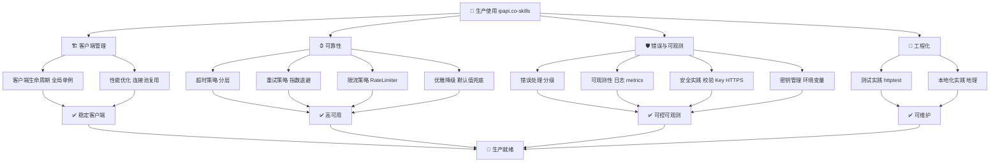
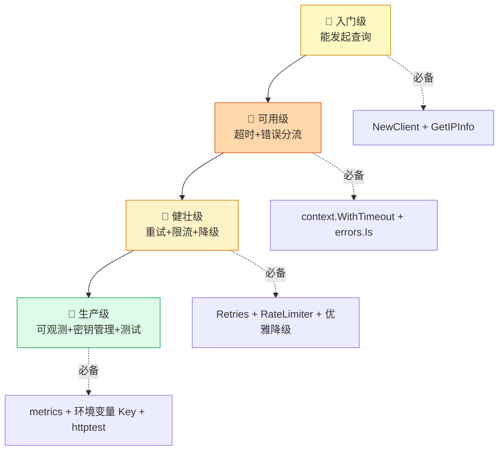

# ✅ 最佳实践

> 生产环境使用 ipapi.co-skills 的建议。

::: tip 🎨 一图抵千言
下面是最佳实践的全景图，按「客户端管理 → 可靠性 → 错误可观测 → 工程化」四大维度组织。
:::

::: info 📊 实践成熟度阶梯
从「能跑」到「生产就绪」，分四级阶梯——你处在哪一级？
:::

## 🏗 客户端管理

::: info 📦 维度说明
客户端是所有调用的入口，管理好生命周期与连接复用，是性能与稳定性的基础。
:::

- [客户端生命周期管理](./client-lifecycle) — 全局单例复用
- [性能优化](./performance) — 连接池与复用

## ⏱ 可靠性

::: warning 🛡 维度说明
可靠性四件套：超时控制上限、重试覆盖瞬时错误、限流防过载、降级保主流程。
:::

| 实践 | 一句话 | 解决的问题 |
|------|--------|------------|
| [超时策略](./timeout-strategy) | 分层超时 | 调用卡死拖垮链路 |
| [重试策略](./retry-strategy) | 内置 + 指数退避 | 瞬时网络错误 |
| [限流策略](./rate-limit-strategy) | RateLimiter 通道 | 突发流量打爆配额 |
| [优雅降级](./graceful-degradation) | 失败用默认值 | 弱依赖拖垮主流程 |

## 🛡 错误与可观测

::: danger 🔒 维度说明
错误与可观测是生产的「眼睛」与「保险丝」：分级处理避免静默失效，可观测让你看见降级率，安全与密钥管理守住底线。
:::

- [错误处理策略](./error-handling-strategy) — 分级处理
- [可观测性](./observability) — 日志与 metrics
- [安全实践](./security) — 校验、Key、HTTPS
- [密钥管理](./secret-management) — 环境变量

## 🧪 工程化

::: tip 🧪 维度说明
工程化保证代码可测、可演进：测试实践用 httptest 模拟远端，本地化实践按地理定制体验。
:::

- [测试实践](./testing) — httptest 模拟
- [本地化实践](./localization) — 按地理本地化

## 🚀 下一步

::: details 🧭 不知从哪开始？按场景选
| 你的场景 | 推荐先读 |
|----------|----------|
| 第一次接入 | [客户端生命周期](./client-lifecycle) → [超时策略](./timeout-strategy) |
| 线上偶发超时 | [重试策略](./retry-strategy) → [优雅降级](./graceful-degradation) |
| 想看降级率 | [可观测性](./observability) → [错误处理策略](./error-handling-strategy) |
| 担心 Key 泄露 | [密钥管理](./secret-management) → [安全实践](./security) |
| 要做国际化 | [本地化实践](./localization) |
| 想写单测 | [测试实践](./testing) |
:::

- 📖 看 [指南](../guide/intro)
- ❓ 看 [FAQ](../faq/
- 🍳 看 [Cookbook](../cookbook/
