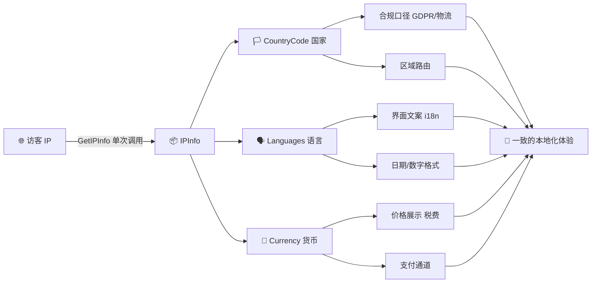
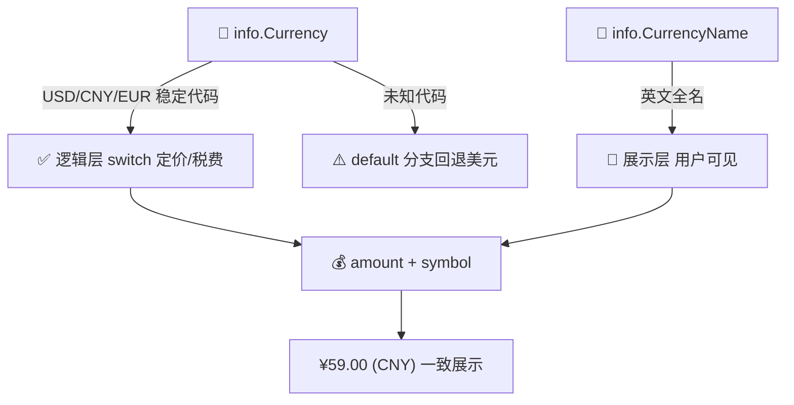
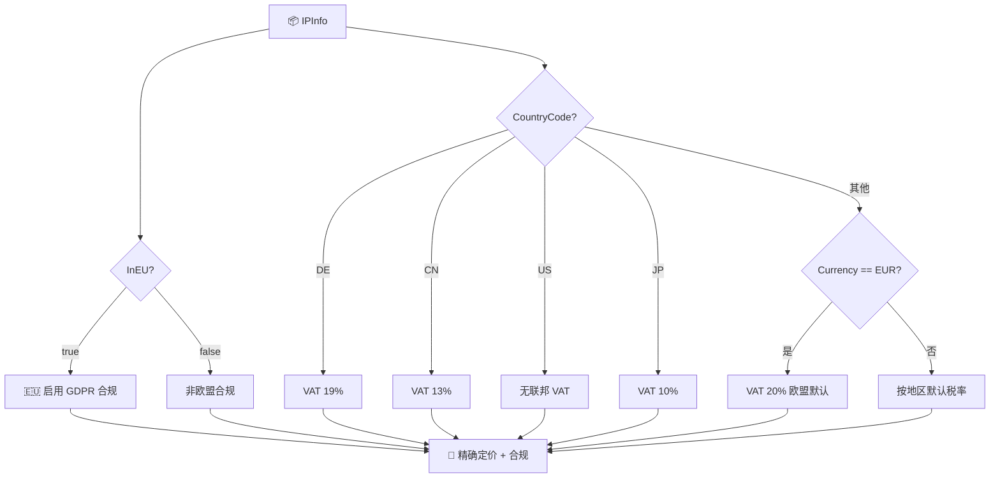
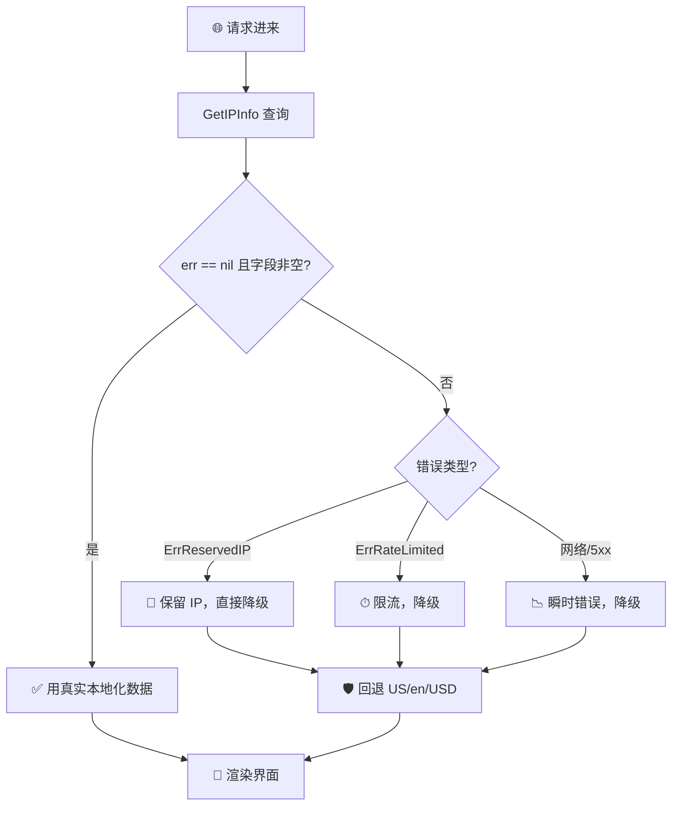

# ✅ 本地化实践

> 按 `country` / `languages` / `currency` 做地理本地化。

## 🌍 背景

本地化不是“把界面翻译一下”那么简单。一个面向全球用户的产品，至少要解决三件事：

- 🏳 **国家**：决定合规口径（如 GDPR/欧盟）、物流可达性、内容区域路由。
- 🗣 **语言**：决定界面文案、日期/数字格式、错误提示语言。
- 💱 **货币**：决定价格展示、税费计算、支付通道选择。

三者**强相关**但又**不完全一致**——例如瑞士有四种官方语言，欧盟多国共用欧元，部分国家货币代码与语言主区不匹配。如果只取其中一个字段做本地化决策，很容易出现“德语界面配美元价格”这种割裂体验。

ipapi.co-skills 的 `IPInfo` 一次性返回 `country` / `country_code` / `languages` / `currency` / `currency_name` 等字段，可以基于访客 IP 在**单次请求**内拿到本地化所需的全部原始数据。本文讲怎么用得对、用得稳。

::: tip 🎨 一图抵千言
下面的流程图展示了「一次请求 → 三要素 → 多场景本地化」的完整链路。
:::



## 💡 建议

### 1. 一次请求拿全本地化数据

本地化的三要素来自同一次 `GetIPInfo` 调用，**不要**为每个字段分别发请求。`GetIPInfo` 返回的 `IPInfo` 已包含 `Country`、`CountryCode`、`Languages`、`Currency`、`CurrencyName`，避免 N 次往返。

::: info 📊 单次 vs 多次请求对照
| 方式 | 请求数 | 延迟 | 配额消耗 | 适用场景 |
|------|--------|------|----------|----------|
| ✅ `GetIPInfo` 一次拿全 | 1 | 低 | 1 | 凑齐本地化三要素 |
| ⚠️ `GetField` × 3 | 3 | 高 3 倍 | 3 | 只在需单字段且响应体敏感时 |
:::

```go
package main

import (
	"context"
	"fmt"
	"log"

	"github.com/cyberspacesec/ipapi-go/pkg/ipapi"
)

func main() {
	client := ipapi.NewClient(ipapi.WithAPIKey("YOUR_API_KEY"))

	info, err := client.GetIPInfo(context.Background(), "8.8.8.8", "json")
	if err != nil {
		log.Fatalf("查询失败: %v", err)
	}

	// 一次拿到本地化三要素
	locale := Locale{
		CountryCode: info.CountryCode, // "US"
		Languages:   info.Languages,   // "en"
		Currency:    info.Currency,    // "USD"
	}
	fmt.Printf("本地化配置: %+v\n", locale)
}

// Locale 封装本地化所需的地理信息。
type Locale struct {
	CountryCode string
	Languages   string
	Currency    string
}
```

### 2. 解析 `languages` 字段（逗号分隔多语言）

`Languages` 是逗号分隔的字符串（如 `"en,zh"` 或 `"de,fr,it"`），表示该国官方语言。取**首选语言**应切分后取第一个，而不是把整个串当语言标签。

```go
// PreferredLanguage 返回首选语言代码（如 "en"）。
// 若字段为空，回退到默认值。
func PreferredLanguage(info *ipapi.IPInfo, fallback string) string {
	if info == nil || info.Languages == "" {
		return fallback
	}
	for _, l := range strings.Split(info.Languages, ",") {
		l = strings.TrimSpace(l)
		if l != "" {
			return l // 第一个非空即首选
		}
	}
	return fallback
}

// SupportedLanguages 返回该国全部官方语言代码。
func SupportedLanguages(info *ipapi.IPInfo) []string {
	if info == nil || info.Languages == "" {
		return nil
	}
	parts := strings.Split(info.Languages, ",")
	out := make([]string, 0, len(parts))
	for _, l := range parts {
		if l = strings.TrimSpace(l); l != "" {
			out = append(out, l)
		}
	}
	return out
}
```

### 3. 用货币代码（ISO 4217）而非货币名做逻辑判断

`Currency` 是稳定的 ISO 4217 代码（`USD`、`CNY`、`EUR`），适合做 switch 与映射；`CurrencyName` 是英文全名（`United States dollar`），只适合展示给用户。**逻辑层永远用代码，展示层才用全名。**

::: tip 🔒 代码 vs 全名取舍
| 字段 | 取值示例 | 稳定性 | 适用层 |
|------|----------|--------|--------|
| `Currency` | `USD` / `CNY` / `EUR` | ✅ ISO 4217 标准，稳定 | 逻辑层 switch/映射 |
| `CurrencyName` | `United States dollar` | ⚠️ 英文全名，可能变动 | 展示层文案 |
:::



```go
// PriceForCurrency 按访客货币返回本地化价格。
func PriceForCurrency(currency string) (amount float64, symbol string) {
	switch currency {
	case "USD":
		return 9.99, "$"
	case "CNY":
		return 59.0, "¥"
	case "EUR":
		return 8.99, "€"
	case "JPY":
		return 1200, "¥"
	default:
		return 9.99, "$" // 未知货币回退到美元
	}
}

info, _ := client.GetIPInfo(ctx, ip, "json")
amount, symbol := PriceForCurrency(info.Currency)
fmt.Printf("%s%.2f (%s)\n", symbol, amount, info.CurrencyName)
```

### 4. 组合 country + currency 做合规与定价决策

单看 `Currency` 不够——欧元区多国共用 `EUR`，但税率、物流、合规要求不同。把 `CountryCode`（ISO 2 位）和 `Currency` 一起用，才能做精确的区域决策。

::: warning ⚠️ 单字段判定的陷阱
| 判定依据 | 误判风险 | 示例 |
|----------|----------|------|
| 仅 `Currency == "EUR"` | ❌ 高 | 无法区分 DE/FR/IT，税率不同 |
| 仅 `CountryCode` | ⚠️ 中 | 漏掉欧盟整体合规口径 |
| `CountryCode` + `Currency` + `InEU` | ✅ 低 | 精确到国 + 区域合规 |
:::



```go
// TaxRule 根据国家与货币返回税率策略。
type TaxRule struct {
	VATRate float64
	NeedsGDPR bool
}

func TaxRuleFor(info *ipapi.IPInfo) TaxRule {
	rule := TaxRule{}
	if info == nil {
		return rule
	}
	// 欧盟成员国统一需要 GDPR 合规
	if info.InEU {
		rule.NeedsGDPR = true
	}
	switch info.CountryCode {
	case "DE":
		rule.VATRate = 0.19
	case "CN":
		rule.VATRate = 0.13
	case "US":
		rule.VATRate = 0 // 美国无联邦 VAT
	case "JP":
		rule.VATRate = 0.10
	default:
		// 货币为 EUR 的默认按欧盟标准税率
		if info.Currency == "EUR" {
			rule.VATRate = 0.20
		}
	}
	return rule
}
```

### 5. 缓存本地化结果，避免重复查询

本地化数据**变化频率极低**（国家货币、官方语言几乎不变），按 IP 或 IP 段做缓存可大幅减少 API 调用。建议用 `CountryCode` 或 IP 的 /24 网段作为缓存键。

```go
type LocaleCache struct {
	mu sync.RWMutex
	m  map[string]Locale
}

func (c *LocaleCache) GetOrCreate(client *ipapi.Client, ip string) (Locale, error) {
	key := cacheKey(ip) // 例如取 IP 的 /24 前缀

	c.mu.RLock()
	if loc, ok := c.m[key]; ok {
		c.mu.RUnlock()
		return loc, nil
	}
	c.mu.RUnlock()

	info, err := client.GetIPInfo(context.Background(), ip, "json")
	if err != nil {
		return Locale{}, err
	}
	loc := Locale{
		CountryCode: info.CountryCode,
		Languages:   info.Languages,
		Currency:    info.Currency,
	}

	c.mu.Lock()
	c.m[key] = loc
	c.mu.Unlock()
	return loc, nil
}
```

### 6. 失败时优雅回退到默认区域

IP 查询可能失败（保留 IP、限流、网络错误）。本地化**永远要有默认值**，不能让一个 IP 查询失败把整页界面拖垮。

::: danger 🚨 没有默认值 = 单点故障
一个 IP 查询失败就让整页白屏，等于把「雪中送炭」的辅助调用当成了核心依赖。本地化结果必须永远有兜底。
:::



```go
func ResolveLocale(client *ipapi.Client, ip string) Locale {
	info, err := client.GetIPInfo(context.Background(), ip, "json")
	if err != nil || info == nil || info.CountryCode == "" {
		// 回退到默认区域（如美国/英语/美元）
		return Locale{CountryCode: "US", Languages: "en", Currency: "USD"}
	}
	return Locale{
		CountryCode: info.CountryCode,
		Languages:   info.Languages,
		Currency:    info.Currency,
	}
}
```

## 🚫 反模式

::: details 📋 反模式速查表（点击展开）
| 反模式 | 症状 | 正确做法 |
|--------|------|----------|
| 每字段单独请求 | 3 次往返，配额浪费 | `GetIPInfo` 一次拿全 |
| `Languages` 整串当标签 | `i18n.SetLocale("de,fr,it")` 匹配不到 | 切分取首个非空 |
| 用货币全名做 switch | 依赖英文全名，易拼写错 | 用 `Currency` ISO 代码 |
| 只看 `Currency` 判区域 | EUR 覆盖 20 国无法区分 | 结合 `CountryCode`/`InEU` |
| 不缓存每次都查 | 本地化数据几乎不变却重复请求 | 按 IP/网段缓存 |
| 不处理空值/失败 | 保留 IP 时字段空导致 panic | 检查 err + nil + 默认回退 |
:::

### ❌ 为每个本地化字段单独请求

```go
// 错误：三次往返，浪费配额且增加延迟
country, _ := client.GetField(ctx, ip, "country")
langs, _ := client.GetField(ctx, ip, "languages")
currency, _ := client.GetField(ctx, ip, "currency")
```

应一次性 `GetIPInfo` 拿到全部字段。`GetField` 适合**只需要单个字段**且关心响应体大小的场景，不适合凑齐本地化三要素。

### ❌ 把 `Languages` 整串当语言标签

```go
// 错误：info.Languages 可能是 "de,fr,it"，直接用会匹配不到任何翻译包
i18n.SetLocale(info.Languages)
```

应切分取首选：`strings.Split(info.Languages, ",")[0]`。

### ❌ 用货币全名做 switch

```go
// 错误：依赖英文全名，易拼写错、不国际通用
switch info.CurrencyName {
case "United States dollar": // ...
case "Chinese yuan":         // 名称可能变动
}
```

应使用稳定的 `info.Currency`（ISO 4217 代码）。

### ❌ 只看 `Currency` 判定区域

```go
// 错误：EUR 覆盖 20 国，无法区分德/法/意
if info.Currency == "EUR" {
	applyEuropeanPricing()
}
```

应结合 `CountryCode` 或 `InEU` 做精确判定。

### ❌ 不缓存，每次请求都查 IP

```go
// 错误：本地化数据几乎不变，却每个 HTTP 请求都调用一次 API
func handler(w http.ResponseWriter, r *http.Request) {
	info, _ := client.GetIPInfo(ctx, clientIP(r), "json")
	render(w, info)
}
```

应按 IP/网段缓存，TTL 设为小时级甚至天级。

### ❌ 不处理空值与查询失败

```go
// 错误：假定 info 一定非空、字段一定有值
info, _ := client.GetIPInfo(ctx, ip, "json")
fmt.Println(info.CountryCode) // 保留 IP 时 info.CountryCode 可能为空
```

应检查 `err`、`info == nil`、字段空值，并提供默认区域回退。

## ✅ 检查清单

- [ ] 用单次 `GetIPInfo` 一次性获取 country/languages/currency，不为每字段单独请求
- [ ] 切分 `Languages` 字段取首选语言，而非整串当语言标签
- [ ] 逻辑层用 `Currency`（ISO 4217 代码），展示层才用 `CurrencyName`
- [ ] 区域/合规决策同时使用 `CountryCode` 与 `Currency`，不单看货币
- [ ] 用 `InEU` 字段做 GDPR/欧盟合规判断，而非手工枚举国家
- [ ] 按 IP 或 /24 网段缓存本地化结果，TTL 设为小时级以上
- [ ] 查询失败或字段为空时，回退到默认区域（如 US/en/USD）
- [ ] 处理保留 IP（`ErrReservedIP`）场景，跳过本地化直接用默认值
- [ ] 展示价格时同时输出货币符号与代码（`¥59.00 (CNY)`），避免歧义
- [ ] 对未知货币/国家有明确的默认分支，不静默走错路径
- [ ] 本地化逻辑可单测：用 httptest 构造不同 country/currency 响应验证分支

## 🔗 相关

- 📖 [快速开始](../guide/getting-started) — 客户端初始化与首次查询
- 📖 [字段概念](../guide/field-concept) — 理解 IPInfo 各字段含义
- 📡 [国家字段](../api/field-country) — `Country` / `CountryCode` / `InEU` 详解
- 💱 [货币与语言字段](../api/field-currency) — `Currency` / `Languages` / `CountryCallingCode`
- 🧩 [IPInfo 模型](../api/models) — 完整结构体定义
- ⚙️ [GetIPInfo 方法](../api/get-ip-info) — 单次查询入口
- 🛡 [优雅降级](./graceful-degradation) — 失败时回退默认值
- ⏱ [限流策略](./rate-limit-strategy) — 控制本地化查询频率
