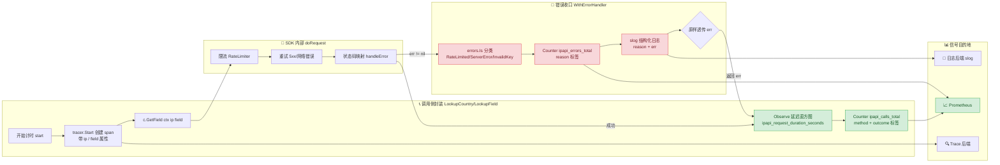
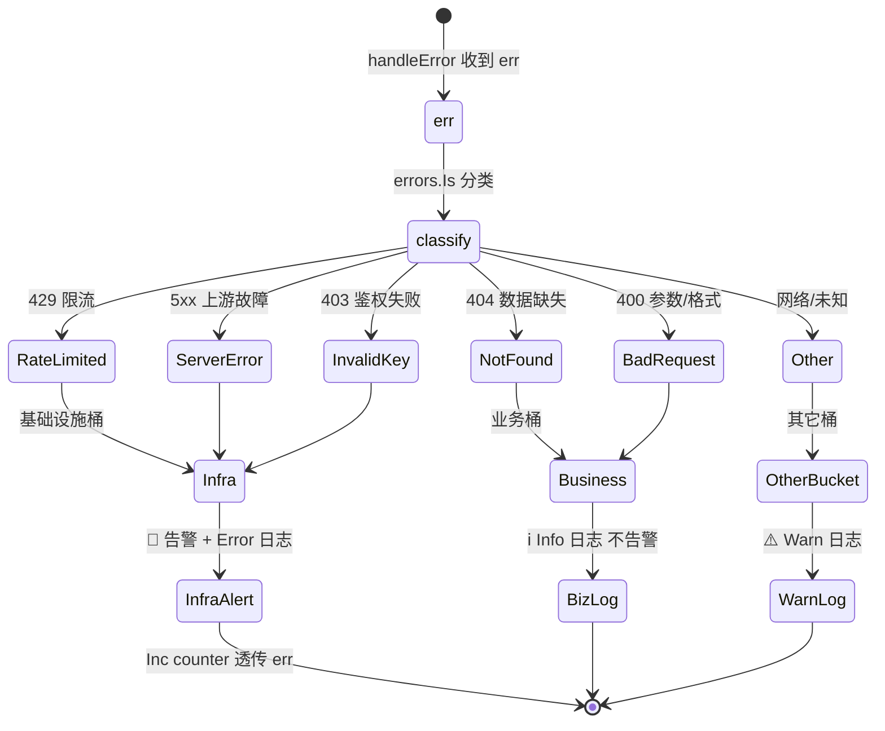

# ✅ 可观测性：WithErrorHandler 接日志与 Metrics

> 把 SDK 的每一次调用都变成可度量的信号：错误进日志，调用进计数器，延迟进直方图。

## 📌 背景

`ipapi.co-skills` 的所有请求方法（`GetIPInfo`、`GetField`、`GetClientIPInfo` 等）在内部都会经过 `c.handleError(err)` 这道关口。通过 [`WithErrorHandler`](../api/with-error-handler) 注入一个自定义函数，你就拿到了**所有错误流出的统一收口**——这正是接日志和 metrics 的天然切点。

为什么可观测性这件事必须由调用方来做：

- 🔍 **SDK 不带日志框架**：SDK 本身零依赖、零输出，不会替你打 log，也不会写 Prometheus。日志和 metrics 的 sink 是业务基础设施，应由业务侧决定。
- 🧭 **错误需要分类**：`ErrRateLimited`、`ErrServerError`、`ErrNotFound`、`ErrInvalidKey` 对运维的含义完全不同——限流要扩容/退避，鉴权失败要告警，404 可能只是数据缺失。统一收口才能按 `errors.Is` 分类上报。
- 📈 **配额是隐性资源**：`ipapi.co` 免费层有每分钟/每日配额，`429` 是真实的成本信号。不接 metrics 就无从回答“我们离配额上限还差多远”。
- ⏱ **延迟是体验底线**：上游抖动、重试放大、网络毛刺，只有直方图能刻画分布，百分位（p95/p99）才反映真实体验。
- 🧯 **故障可定位**：一次 `GetField` 失败，到底是参数错（`ErrInvalidField`）、网络断（`request failed after N retries`）、还是上游 5xx？没有结构化日志就只能靠猜。

一句话原则：**用 `WithErrorHandler` 统一错误出口，用包装函数统一调用入口，日志与 metrics 都在这两个收口里打。**

::: tip 🎨 一图抵千言
下图展示一次 SDK 调用如何在两个收口（调用侧封装 + `WithErrorHandler`）完成日志、metrics、trace 三类信号埋点。
:::



::: warning ⚠️ 两个收口缺一不可
`WithErrorHandler` 只覆盖**错误**路径（成功调用不经过它）；调用侧封装覆盖**全部**调用。只有两个收口都打点，才能算出错误率 = 错误数 / 总调用数。
:::

## ✅ 建议

### 1. 用 `WithErrorHandler` 接错误日志

`WithErrorHandler` 接收的函数签名是 `func(error) error`——它**可以观察错误，也可以转换错误**。最朴素的用法是：原样记录，原样返回，不改变控制流。

```go
package iplookup

import (
    "errors"
    "log/slog"

    "github.com/cyberspacesec/ipapi-co-skills/pkg/ipapi"
)

// NewObservableClient 构造一个带日志收口的客户端。
func NewObservableClient(apiKey string, logger *slog.Logger) *ipapi.Client {
    return ipapi.NewClient(
        ipapi.WithAPIKey(apiKey),
        ipapi.WithErrorHandler(func(err error) error {
            // 不吞错误，只观察：记录后原样透传
            if err == nil {
                return nil
            }
            switch {
            case errors.Is(err, ipapi.ErrRateLimited):
                logger.Warn("ipapi rate limited",
                    slog.String("reason", "rate_limited"),
                    slog.String("err", err.Error()))
            case errors.Is(err, ipapi.ErrServerError):
                logger.Error("ipapi server error",
                    slog.String("reason", "server_error"),
                    slog.String("err", err.Error()))
            case errors.Is(err, ipapi.ErrInvalidKey):
                logger.Error("ipapi auth invalid",
                    slog.String("reason", "invalid_key"),
                    slog.String("err", err.Error()))
            default:
                logger.Warn("ipapi request failed",
                    slog.String("reason", "other"),
                    slog.String("err", err.Error()))
            }
            return err // 关键：透传，不要返回 nil
        }),
    )
}
```

> 💡 `handleError` 会先调用你的 handler（若设置），若 handler 返回 `nil` 则错误被吞掉。除非你有意降级，否则**务必原样返回 `err`**，避免把真实错误掩盖成成功。

### 2. 在 handler 里同时上报 metrics

同一个收口里顺手打计数器，错误分类与日志保持一致，指标维度对齐：

```go
import (
    "github.com/prometheus/client_golang/prometheus"
    "github.com/prometheus/client_golang/prometheus/promauto"
)

var (
    ipapiErrors = promauto.NewCounterVec(
        prometheus.CounterOpts{
            Name: "ipapi_errors_total",
            Help: "Total ipapi errors by reason.",
        },
        []string{"reason"},
    )
)

func NewObservableClient(apiKey string, logger *slog.Logger) *ipapi.Client {
    return ipapi.NewClient(
        ipapi.WithAPIKey(apiKey),
        ipapi.WithErrorHandler(func(err error) error {
            if err == nil {
                return nil
            }
            reason := "other"
            switch {
            case errors.Is(err, ipapi.ErrRateLimited):
                reason = "rate_limited"
            case errors.Is(err, ipapi.ErrServerError):
                reason = "server_error"
            case errors.Is(err, ipapi.ErrNotFound):
                reason = "not_found"
            case errors.Is(err, ipapi.ErrInvalidIP),
                errors.Is(err, ipapi.ErrInvalidField),
                errors.Is(err, ipapi.ErrInvalidFormat):
                reason = "bad_request"
            case errors.Is(err, ipapi.ErrInvalidKey):
                reason = "invalid_key"
            }
            ipapiErrors.WithLabelValues(reason).Inc()
            logger.Warn("ipapi error", "reason", reason, "err", err.Error())
            return err
        }),
    )
}
```

### 3. 用包装函数接调用维度（次数 + 延迟）

`WithErrorHandler` 只覆盖**错误**路径，成功调用不会经过它。要统计总调用量与延迟分布，需在调用侧包一层。把 SDK 方法藏进自己的薄封装，metrics 就集中在一处：

```go
var (
    ipapiCalls = promauto.NewCounterVec(
        prometheus.CounterOpts{
            Name: "ipapi_calls_total",
            Help: "Total ipapi calls by method and outcome.",
        },
        []string{"method", "outcome"},
    )
    ipapiLatency = promauto.NewHistogramVec(
        prometheus.HistogramOpts{
            Name:    "ipapi_request_duration_seconds",
            Help:    "ipapi request latency in seconds.",
            Buckets: prometheus.DefBuckets,
        },
        []string{"method"},
    )
)

// LookupCountry 是 GetField 的薄封装，集中打点。
func LookupCountry(ctx context.Context, c *ipapi.Client, ip string) (string, error) {
    start := time.Now()
    out, err := c.GetField(ctx, ip, "country_name")
    ipapiLatency.WithLabelValues("GetField").Observe(time.Since(start).Seconds())

    outcome := "success"
    if err != nil {
        outcome = "error"
    }
    ipapiCalls.WithLabelValues("GetField", outcome).Inc()
    return out, err
}
```

调用方一律走 `LookupCountry`，禁止散落裸调 `c.GetField`，否则 metrics 会漏点。

### 4. 区分业务错误与基础设施错误

并非所有 `err != nil` 都该告警。把“业务上合理”的错误（如查询保留 IP、查不到字段）与“基础设施异常”（如 5xx、网络断、鉴权失败）分桶，避免告警风暴：

::: info 📊 哨兵错误 → reason 标签 → 告警级别 映射
| 哨兵错误 | HTTP 来源 | reason 标签 | 桶 | 告警 |
|----------|----------|------------|-----|------|
| `ErrRateLimited` | 429 | `rate_limited` | 基础设施 | ⚠️ 扩容/退避 |
| `ErrServerError` | 5xx | `server_error` | 基础设施 | 🔴 告警 |
| `ErrInvalidKey` | 403 | `invalid_key` | 基础设施 | 🔴 紧急 |
| `ErrNotFound` | 404 | `not_found` | 业务 | ℹ️ 记录 |
| `ErrReservedIP` | 400 | `business` | 业务 | ℹ️ 记录 |
| `ErrInvalidIP` / `ErrInvalidField` / `ErrInvalidFormat` | 400 | `bad_request` | 业务 | ℹ️ 记录 |
| 其它 | 网络/未知 | `other` | 其它 | ⚠️ 关注 |
:::

::: tip 🎨 一图抵千言
错误分桶的状态流转：进入 handler 后按 `errors.Is` 分类，业务桶静默记录，基础设施桶触发告警。
:::



```go
switch {
case errors.Is(err, ipapi.ErrReservedIP), errors.Is(err, ipapi.ErrNotFound):
    // 业务上可预期：保留 IP / 不存在，记录但不告警
    logger.Info("ipapi non-fatal", "reason", "business", "err", err.Error())
    ipapiErrors.WithLabelValues("business").Inc()
case errors.Is(err, ipapi.ErrInvalidKey), errors.Is(err, ipapi.ErrServerError):
    // 基础设施级：必须告警
    logger.Error("ipapi infra failure", "reason", "infra", "err", err.Error())
    ipapiErrors.WithLabelValues("infra").Inc()
default:
    logger.Warn("ipapi call failed", "reason", "other", "err", err.Error())
    ipapiErrors.WithLabelValues("other").Inc()
}
```

### 5. 给请求打 trace，把 IP/字段带上

在调用侧封装里把业务上下文（查询的 IP、字段）写进日志的 `slog` 字段或 trace span，定位问题时一查到底：

```go
func LookupField(ctx context.Context, c *ipapi.Client, ip, field string) (string, error) {
    ctx, span := tracer.Start(ctx, "ipapi.GetField")
    defer span.End()
    span.SetAttributes(
        attribute.String("ipapi.ip", ip),
        attribute.String("ipapi.field", field),
    )

    start := time.Now()
    out, err := c.GetField(ctx, ip, field)
    dur := time.Since(start)
    ipapiLatency.WithLabelValues("GetField").Observe(dur.Seconds())

    if err != nil {
        span.RecordError(err)
        logger.Warn("ipapi GetField failed",
            "ip", ip, "field", field, "dur_ms", dur.Milliseconds(), "err", err.Error())
    }
    return out, err
}
```

> 🧩 注意：不要把 API Key、Authorization 头写进日志或 span 属性。详见 [密钥管理](./secret-management)。

## ❌ 反模式

::: warning ⚠️ 反模式速览
| 反模式 | 后果 | 正确做法 |
|--------|------|----------|
| handler 吞错误返回 nil | 数据污染无从告警 | 原样透传 err |
| handler 做重活（重试/HTTP） | 放大延迟/死锁 | 轻量同步，重活交队列 |
| 字符串匹配错误类型 | 文案变更即脆断 | errors.Is 哨兵 |
| 只统计错误不统计成功 | 算不出错误率 | 调用侧封装打总计数 |
| 标签口径不统一 | 指标被拆成多条序列 | 收口到统一封装 |
| 循环里重复注册 collector | panic: duplicate | 包级 promauto 注册一次 |
:::

### ❌ 在 handler 里吞掉错误

```go
// 反模式：记录后返回 nil，调用方以为成功
ipapi.WithErrorHandler(func(err error) error {
    logger.Error("ipapi failed", "err", err.Error())
    return nil // 被吞了！
})
```

后果：`GetField` 返回 `("", nil)`，上游逻辑当作“查到了空字符串”，数据污染且无从告警。handler 要么原样返回 `err`，要么返回一个明确的降级错误。

::: details 📖 何时允许 handler 吞错误？
只有一种场景：你**有意降级**，且用明确的哨兵错误替换原错误，让上游能识别"这是降级值"。例如查询失败时返回一个标记为 `ErrDegraded` 的降级结果，让业务走默认分支。即便如此，也要在 handler 里把原始错误完整记进日志，避免丢失现场。
:::

### ❌ 在 handler 里做副作用重的逻辑（重试、HTTP 调用）

```go
// 反模式：在错误回调里再发一次 HTTP，阻塞调用方
ipapi.WithErrorHandler(func(err error) error {
    if errors.Is(err, ipapi.ErrRateLimited) {
        notifySlack(...) // 网络调用，可能再失败、再超时
        retryQueue.Enqueue(...)
    }
    return err
})
```

`handleError` 在请求的关键路径上同步执行。塞入重逻辑会放大延迟、可能死锁。handler 应只做**轻量、同步、非阻塞**的记录与计数，重活交给后台 worker 或队列。

### ❌ 用字符串匹配判断错误类型

```go
// 反模式：靠 Error() 字符串内容分流
if strings.Contains(err.Error(), "rate limit") {
    ipapiErrors.WithLabelValues("rate_limited").Inc()
}
```

`Error()` 文案随时可能调整，字符串匹配是脆的。应始终用 `errors.Is(err, ipapi.ErrRateLimited)`，依赖哨兵错误与 `%w` 包装链。详见 [错误处理概念](../guide/error-concept)。

### ❌ 成功路径不打点，只统计错误

```go
// 反模式：只在 handler 里计数，成功调用一无所有
ipapi.WithErrorHandler(func(err error) error {
    ipapiErrors.WithLabelValues(reason).Inc()
    return err
})
// 没有 ipapiCalls 之类的总调用计数
```

只有错误计数、没有总调用计数，就算不出**错误率**（错误/总调用），也无法回答“调用变少是因为流量降了还是全在失败”。务必在调用侧封装里同时打成功与失败。

### ❌ 每个调用点各打各的 metrics，标签口径不一

```go
// 反模式：A 模块用 "get_field"，B 模块用 "GetField"，C 模块干脆不传 method
ipapiCalls.WithLabelValues("get_field", outcome).Inc()
ipapiCalls.WithLabelValues("GetField", outcome).Inc()
```

标签值大小写、命名不统一，metrics 会被拆成多条序列，聚合时全是坑。统一收口到一个封装函数/接口里，标签取值集中定义。

### ❌ 把 metrics handler 重复注册导致 panic

```go
// 反模式：在循环里或多次 NewClient 时重复 promauto.NewCounterVec
for i := 0; i < workers; i++ {
    c := ipapi.NewClient(
        ipapi.WithErrorHandler(func(err error) error {
            // 每个 worker 都注册一次同名指标 → panic: duplicate metrics collector
            promauto.NewCounterVec(...)
            return err
        }),
    )
}
```

Prometheus collector 是进程级单例，必须用 `promauto` 在包级 `var` 块里注册一次，handler 只 `Inc()`。配合 [客户端生命周期单例](./client-lifecycle) 一起做，只构造一个 client、一套指标。

## ✅ 检查清单

- [ ] 通过 [`WithErrorHandler`](../api/with-error-handler) 注入了统一的错误收口函数。
- [ ] handler 内部**原样透传** `err`，不吞错误（除非有意降级并返回明确错误）。
- [ ] 错误用 `errors.Is` 分类（`ErrRateLimited` / `ErrServerError` / `ErrInvalidKey` / `ErrNotFound` 等），不用字符串匹配。
- [ ] 业务错误与基础设施错误**分桶**，告警只对基础设施级触发。
- [ ] handler 只做轻量、同步、非阻塞的记录与计数，无重试、无外发 HTTP。
- [ ] 在调用侧用薄封装统一打**总调用计数**和**延迟直方图**（成功 + 失败都打）。
- [ ] 调用方一律走封装函数，禁止散落裸调 SDK 方法，避免漏点。
- [ ] metrics 标签（method/outcome/reason 等）取值集中定义、大小写统一。
- [ ] Prometheus collector 在包级 `var` 用 `promauto` 注册一次，不在 handler 或循环里重复注册。
- [ ] 日志/trace 带上业务上下文（IP、字段、耗时），但**绝不**记录 API Key 或 Authorization 头。
- [ ] 配合 [`sync.Once` 单例](./client-lifecycle) 构造客户端，handler 与指标随单例只初始化一次。

## 🔗 相关

- 指南：[错误处理概念](../guide/error-concept) · [重试与限流](../guide/retry-concept) · [客户端概念](../guide/client-concept) · [上下文与超时](../guide/context)
- API：[WithErrorHandler](../api/with-error-handler) · [WrapError](../api/wrap-error) · [IsRetryableError](../api/is-retryable) · [错误类型](../api/errors) · [请求方法](../api/methods)
- 最佳实践：[最佳实践总览](../reference/index) · [客户端生命周期管理](./client-lifecycle) · [密钥管理](./secret-management)
- FAQ：[自定义错误处理器](../faq/custom-error-handler) · [APIError 与 error](../faq/error-vs-apierror) · [429 限流](../faq/rate-limit-429)
