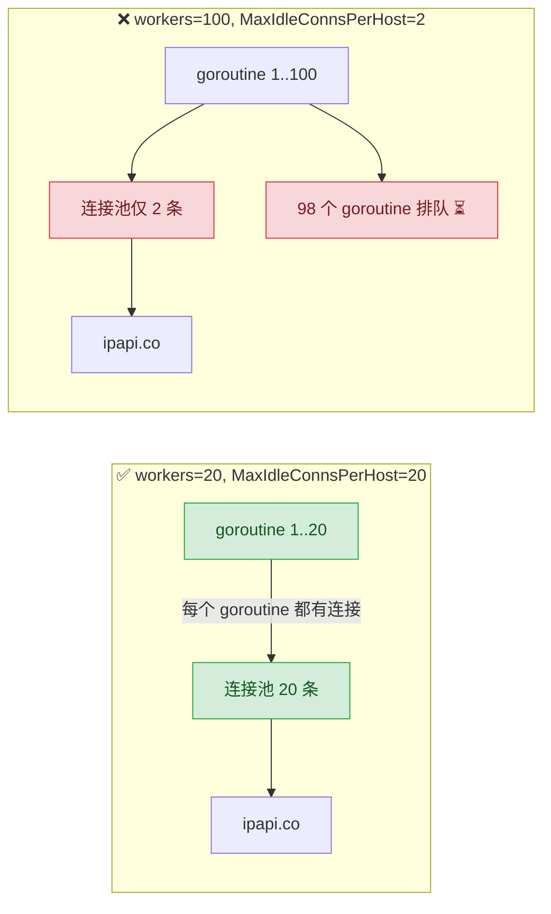

# ✅ 性能优化

> 连接池复用、单例长驻、按需取字段——把每一次 API 调用的延迟和配额都花在刀刃上。

## 📌 背景

ipapi.co 是一个远程 HTTP API，每次查询都要走完整的网络链路：DNS 解析 → TCP 握手 → TLS 握手 → 请求/响应 → 连接回收。在高频查询场景下，真正决定吞吐与延迟的往往不是 API 本身的处理速度，而是你的 Go 客户端如何**复用连接**与**减少无效请求**。

性能优化之所以重要：

- 🚀 **延迟**：一次 TLS 握手通常耗费几十到数百毫秒，复用 keep-alive 连接可把这部分开销摊薄到接近为零。
- 💸 **配额**：ipapi.co 免费层有每日请求次数限制，单字段多次查询会快速烧光配额，而 `GetIPInfo` 一次即可拿全。
- 🔁 **重试放大**：默认 `Retries=2` 意味着每次失败最多发 3 次请求，连接不复用会让重试的代价雪上加霜。
- 🧵 **并发**：批量查询时，连接池大小直接决定并发上限；池太小会让 goroutine 排队等连接，并发形同虚设。

一句话原则：**一个进程一个 `Client`、连接池按并发调优、能一次拿全就别分多次。**

::: tip 🎨 一图抵千言
下图标注一次 IP 查询链路上的全部性能优化点：连接池复用、单例长驻、字段查询合并、限流控速、worker 并发对齐。
:::

```mermaid
flowchart TD
    subgraph App["🚀 应用层"]
        A1["业务调用 LookupCountry"]
        A2{"需要几个字段?"}
        A3["1 个: GetField"]
        A4["≥2 个: GetIPInfo 一次拿全 ✅"]
    end

    subgraph Client["🧱 Client 单例 sync.Once"]
        B1["复用同一个 ipapi.Client"]
        B2["连接池长期存活 keep-alive"]
    end

    subgraph Transport["🌐 http.Transport 调优"]
        C1["MaxIdleConnsPerHost ≥ 并发数"]
        C2["MaxConnsPerHost 熔断保护"]
        C3["IdleConnTimeout 90s"]
    end

    subgraph Concurrency{"⚡ 批量并发"}
        D1["worker pool workers ≤ MaxIdleConnsPerHost"]
        D2["RateLimiter 控 QPS 防 429"]
    end

    subgraph Retry["🔁 重试门控"]
        E1["默认 Retries=2 共 3 次"]
        E2["IsRetryableError 4xx 不重试"]
    end

    subgraph Remote["🌍 ipapi.co"]
        F1["TLS 握手 复用后摊薄"]
        F2["配额消耗"]
    end

    A1 --> A2
    A2 -->|"1"| A3
    A2 -->|"≥2 省 quota"| A4
    A3 --> B1
    A4 --> B1
    B1 --> B2 --> C1
    C1 --> C2 --> C3
    C3 --> D1
    D1 --> D2
    D2 --> E1
    E1 --> E2
    E2 --> F1
    F1 --> F2

    classDef opt fill:#d4edda,stroke:#28a745,color:#155724
    class A4,B1,B2,C1,D1,D2,E2 opt
```

::: warning ⚠️ 性能优化的优先级
**单例复用 > 连接池调优 > 字段合并 > 并发限流**。先解决"每次新建 Client"这种致命问题，再调连接池旋钮，最后才考虑批量并发。颠倒顺序往往收效甚微。
:::

## ✅ 建议

### 1. 复用单例 Client，让连接池长期存活

`ipapi.Client` 内部持有 `*http.Client`，后者通过 `http.Transport` 维护 TCP 连接池。每次 `NewClient` 都会重建这套设施，让 keep-alive 归零。用 `sync.Once` 构造进程级单例：

```go
package iplookup

import (
    "context"
    "sync"

    "github.com/cyberspacesec/ipapi-co-skills/pkg/ipapi"
)

var (
    globalClient *ipapi.Client
    once         sync.Once
)

func Client() *ipapi.Client {
    once.Do(func() {
        globalClient = ipapi.NewClient(
            ipapi.WithAPIKey("YOUR_API_KEY"),
        )
    })
    return globalClient
}

func LookupCountry(ctx context.Context, ip string) (string, error) {
    return Client().GetField(ctx, ip, "country_name")
}
```

> 💡 单例的核心收益不是省构造开销，而是让底层连接池有机会被多次请求复用。详见 [客户端生命周期管理](./client-lifecycle)。

### 2. 按并发量调优连接池

默认 `http.Client` 使用 `http.DefaultTransport`，其 `MaxIdleConnsPerHost` 仅为 2——高并发下绝大多数请求都会新建连接。批量或高 QPS 场景下，通过 `WithCustomHTTPClient` 注入调优后的 `Transport`：

```go
import (
    "net/http"
    "time"

    "github.com/cyberspacesec/ipapi-co-skills/pkg/ipapi"
)

func newTunedClient() *ipapi.Client {
    transport := &http.Transport{
        MaxIdleConns:        100, // 全局最大空闲连接
        MaxIdleConnsPerHost: 20,  // 每个 host 的空闲连接（关键！默认仅 2）
        MaxConnsPerHost:     50,  // 每个 host 的最大连接上限（限并发）
        IdleConnTimeout:     90 * time.Second,
        TLSHandshakeTimeout: 5 * time.Second,
        ResponseHeaderTimeout: 8 * time.Second,
    }
    return ipapi.NewClient(
        ipapi.WithAPIKey("YOUR_API_KEY"),
        ipapi.WithCustomHTTPClient(&http.Client{
            Transport: transport,
            Timeout:   10 * time.Second,
        }),
    )
}
```

调参要点：

- `MaxIdleConnsPerHost` 是最关键的旋钮——它决定了能复用多少条到 `ipapi.co` 的 keep-alive 连接，应 ≥ 你的预期并发数。
- `MaxConnsPerHost` 限制并发连接上限，可作为熔断保护，避免突发流量打爆远端。
- `IdleConnTimeout` 不宜过短，否则空闲连接还没被下次请求复用就被回收，等于白建。

::: info 📊 http.Transport 关键参数对照
| 参数 | 默认值 | 作用 | 调优建议 |
|------|--------|------|----------|
| `MaxIdleConns` | 无限 | 全局空闲连接上限 | 100（兜底） |
| `MaxIdleConnsPerHost` | **2** ⚠️ | 每 host 空闲连接数 | ≥ 预期并发数 |
| `MaxConnsPerHost` | 无限 | 每 host 总连接上限 | 50（熔断） |
| `IdleConnTimeout` | 90s | 空闲连接回收时间 | 保持 90s |
| `TLSHandshakeTimeout` | 10s | TLS 握手超时 | 5s |
| `ResponseHeaderTimeout` | 0 | 等响应头超时 | 8s（防慢攻击） |
| `Timeout`（Client 级） | 0 | 整笔请求超时 | 10s |
:::

::: warning ⚠️ 默认 MaxIdleConnsPerHost=2 是最大陷阱
`http.DefaultTransport` 的 `MaxIdleConnsPerHost` 仅为 2。高并发下，第 3 个及以后的请求都必须**新建连接**，TLS 握手开销被无限放大。这是"明明用了 Client 却还是慢"的头号原因。
:::

### 3. 共享 Transport，多 Client 复用同一连接池

若应用中需要多个 `Client`（例如不同 API Key、不同超时策略），让它们共享同一个 `*http.Transport`，连接池就能跨 Client 复用：

```go
var sharedTransport = &http.Transport{
    MaxIdleConns:        100,
    MaxIdleConnsPerHost: 20,
    IdleConnTimeout:     90 * time.Second,
}

func newClient(apiKey string, timeout time.Duration) *ipapi.Client {
    return ipapi.NewClient(
        ipapi.WithAPIKey(apiKey),
        ipapi.WithCustomHTTPClient(&http.Client{
            Transport: sharedTransport,
            Timeout:   timeout,
        }),
    )
}
```

### 4. 一次拿全，避免单字段多次查询

`GetField` 每次调用都消耗 **1 次配额**。若你需要 2 个以上字段，逐个 `GetField` 会让配额成倍上涨。改为一次 `GetIPInfo` 取全部：

```go
// ✅ 一次拿到 city、country、asn，只消耗 1 次配额
info, err := Client().GetIPInfo(ctx, "8.8.8.8", "json")
if err != nil {
    return err
}
fmt.Println(info.City, info.CountryCode, info.ASN)
```

| 方式 | 配额消耗 | 返回 |
|------|----------|------|
| 3 次 `GetField` | 3 次 | 3 个字符串 |
| 1 次 `GetIPInfo` | 1 次 | 30+ 字段的完整 `*IPInfo` |

::: tip 💡 判定阈值
需要 ≥ 2 个字段时，`GetIPInfo` 在配额与延迟上都更优；只需 1 个字段且不关心其余信息时，`GetField` 流量更小。详见 [字段查询概念](../guide/field-concept)。
:::

### 5. 批量查询用并发 + 限流 + worker pool

ipapi.co 无原生批量端点，「批量」即多次单查。串行慢，无脑并发会触发 429。正确组合是：复用单例 Client + `RateLimiter` 限流 + worker pool 控制并发：

```go
func batchLookup(ctx context.Context, ips []string, workers int) ([]*ipapi.IPInfo, error) {
    client := Client() // 复用单例，连接池已被调优

    jobs := make(chan string, len(ips))
    out := make(chan *ipapi.IPInfo, len(ips))

    // worker pool：并发数 = workers，与 MaxIdleConnsPerHost 对齐
    var wg sync.WaitGroup
    for w := 0; w < workers; w++ {
        wg.Add(1)
        go func() {
            defer wg.Done()
            for ip := range jobs {
                info, err := client.GetIPInfo(ctx, ip, "json")
                if err == nil {
                    out <- info
                }
            }
        }()
    }
    for _, ip := range ips {
        jobs <- ip
    }
    close(jobs)
    wg.Wait()
    close(out)

    results := make([]*ipapi.IPInfo, 0, len(ips))
    for info := range out {
        results = append(results, info)
    }
    return results, nil
}
```

关键点：

- ✅ `workers` 数量应 ≤ `MaxIdleConnsPerHost`，否则多余 goroutine 排队等连接，并发收益被吃掉。
- ✅ 用 `RateLimiter` 控整体 QPS，避免触发 `429`。
- ✅ 传入 `ctx`，支持超时取消与 graceful shutdown。

::: tip 🎨 一图抵千言
workers 数量必须与 `MaxIdleConnsPerHost` 对齐：左图配置正确，连接刚好够用；右图 workers 远超连接池，多余 goroutine 空转等连接。
:::



### 6. 主动关闭响应体，避免连接复用失败

SDK 内部已 `defer resp.Body.Close()`，但若你在上层自行读取 raw 响应（如 `GetIPInfoRaw`），务必读尽并关闭 body——未读完的 body 会让连接无法被回收到池中：

```go
data, err := Client().GetIPInfoRaw(ctx, "8.8.8.8", "csv")
if err != nil {
    return err
}
// data 已由 SDK 内部 io.ReadAll 读尽并 Close，连接可正常回收
fmt.Println(string(data))
```

### 7. 合理设置重试，避免重试放大延迟

默认 `Retries=2`（共 3 次请求），固定退避 500ms。对延迟敏感场景，可降低重试次数或用 `IsRetryableError` 在业务层精细控制：

```go
client := Client()
client.Retries = 1 // 延迟敏感，减少重试放大

// 或业务层自行指数退避
for attempt := 0; attempt < 3; attempt++ {
    info, err := client.GetIPInfo(ctx, ip, "json")
    if err == nil {
        return info, nil
    }
    if !ipapi.IsRetryableError(err) {
        return nil, err // 4xx 不可恢复，立即放弃
    }
    time.Sleep(time.Duration(1<<attempt) * time.Second)
}
```

::: details 📖 重试放大的代价测算
默认 `Retries=2` 意味着每次失败最多发 3 次请求，间隔 500ms。最坏情况下单次查询耗时 = 3 × (超时 + 500ms 退避)。在批量场景下，假设 100 个 IP 同时失败重试，瞬时请求数会从 100 飙到 300，极易触发 `429` 限流，形成"重试 → 限流 → 重试"的雪崩。

| Retries | 单次最坏请求数 | 单次最坏延迟（超时 10s） | 适用场景 |
|---------|----------------|--------------------------|----------|
| 0 | 1 | 10s | 延迟极度敏感 |
| 1 | 2 | ~20.5s | 在线交互 |
| 2（默认） | 3 | ~31s | 通用后台 |
| 3 | 4 | ~41.5s | 容忍延迟但求成功率 |
:::

## ❌ 反模式

::: warning ⚠️ 反模式速览
| 反模式 | 代价 | 修复 |
|--------|------|------|
| 每次请求新建 Client | TLS 握手归零 | sync.Once 单例 |
| 默认 Transport 跑高并发 | MaxIdleConnsPerHost=2 卡死 | 注入调优 Transport |
| 单字段多次查询 | 3 倍配额 + 延迟 | GetIPInfo 一次拿全 |
| workers 远超连接池 | goroutine 空转 | workers ≤ MaxIdleConnsPerHost |
| 无限流裸跑并发 | 触发 429 雪崩 | RateLimiter 控速 |
| Transport 不释放 | 空闲连接泄漏 | shutdown 调 CloseIdleConnections |
:::

### ❌ 每次请求都新建 Client

```go
// ❌ 连接池每次都从零开始，keep-alive 完全失效
func Lookup(ctx context.Context, ip string) (string, error) {
    c := ipapi.NewClient(ipapi.WithAPIKey("YOUR_API_KEY"))
    return c.GetField(ctx, ip, "country_name")
}
```

后果：每次请求都走完整 TCP + TLS 握手，延迟飙升；高并发下短连接堆积，文件描述符与 TIME_WAIT 快速上升。

### ❌ 用默认 Transport 跑高并发

```go
// ❌ 默认 MaxIdleConnsPerHost=2，10 个 goroutine 有 8 个在等连接
client := ipapi.NewClient(ipapi.WithAPIKey("YOUR_API_KEY"))
var wg sync.WaitGroup
for _, ip := range ips {
    wg.Add(1)
    go func(addr string) {
        defer wg.Done()
        client.GetIPInfo(ctx, addr, "json")
    }(ip)
}
```

后果：并发被连接池瓶颈卡死，goroutine 虽多但实际 QPS 上不去。应注入调优后的 `Transport`。

### ❌ 单字段多次查询烧配额

```go
// ❌ 3 次请求 = 3 次配额
city, _ := client.GetField(ctx, ip, "city")
country, _ := client.GetField(ctx, ip, "country_name")
asn, _ := client.GetField(ctx, ip, "asn")
```

后果：配额消耗 3 倍，延迟也是 3 倍。改为一次 `GetIPInfo` 即可。

### ❌ worker 数远超连接池容量

```go
// ❌ workers=100 但 MaxIdleConnsPerHost=2，98 个 goroutine 空转等连接
transport := &http.Transport{MaxIdleConnsPerHost: 2}
client := ipapi.NewClient(ipapi.WithCustomHTTPClient(
    &http.Client{Transport: transport, Timeout: 10 * time.Second},
))
batchLookup(ctx, ips, 100) // workers 远超连接池
```

后果：并发收益被连接池吃掉，还可能因连接反复建拆导致性能更差。workers 应与 `MaxIdleConnsPerHost` 对齐。

### ❌ 无限流裸跑高并发

```go
// ❌ 不设 RateLimiter，瞬时打满触发 429
var wg sync.WaitGroup
for _, ip := range ips {
    wg.Add(1)
    go func(addr string) {
        defer wg.Done()
        client.GetIPInfo(ctx, addr, "json")
    }(ip)
}
```

后果：触发 `ErrRateLimited`（HTTP 429），重试进一步放大流量，可能被临时封禁。应设 `client.RateLimiter = time.Tick(...)`。

### ❌ 注入自定义 Transport 却从不释放

```go
// ❌ 程序退出，连接池里的空闲连接无人清理
ipapi.NewClient(
    ipapi.WithCustomHTTPClient(&http.Client{
        Transport: &http.Transport{MaxIdleConns: 100},
    }),
)
// ... 退出，未调用 CloseIdleConnections()
```

自定义 `Transport` 不会随 GC 自动关闭，应在 shutdown 阶段显式 `CloseIdleConnections()`。

## ✅ 检查清单

- [ ] 全进程通过 `sync.Once` 单例复用同一个 `ipapi.Client`，不在请求路径里 `NewClient`。
- [ ] 高并发场景下通过 `WithCustomHTTPClient` 注入自定义 `*http.Transport`。
- [ ] `MaxIdleConnsPerHost` ≥ 预期并发数（默认值 2 远远不够）。
- [ ] `MaxConnsPerHost` 作为熔断保护，避免突发流量打爆远端。
- [ ] 多个 Client 共享同一 `*http.Transport`，实现跨 Client 连接复用。
- [ ] 需要 ≥ 2 个字段时用 `GetIPInfo` 一次拿全，而非多次 `GetField`。
- [ ] 批量查询用 worker pool，`workers` 数量 ≤ `MaxIdleConnsPerHost`。
- [ ] 高 QPS 场景设 `client.RateLimiter` 控速，避免触发 429。
- [ ] 延迟敏感场景调低 `Retries` 或用 `IsRetryableError` 精细控制重试。
- [ ] 自定义 `Transport` 在 shutdown 阶段调用 `CloseIdleConnections()` 释放空闲连接。
- [ ] 所有调用传入 `context.Context`，支持超时取消与 graceful shutdown。

## 🔗 相关

- 指南：[客户端概念](../guide/client-concept) · [自定义 HTTP 客户端](../guide/custom-http) · [字段查询概念](../guide/field-concept) · [批量查询](../guide/batch) · [重试与限流](../guide/retry-concept) · [上下文与超时](../guide/context)
- API：[NewClient](../api/new-client) · [Client 结构体](../api/client) · [WithCustomHTTPClient](../api/with-custom-http-client) · [GetIPInfo](../api/get-ip-info) · [GetField](../api/get-field) · [IsRetryableError](../api/is-retryable) · [请求方法](../api/methods)
- 最佳实践：[最佳实践总览](../reference/index) · [客户端生命周期管理](./client-lifecycle)
