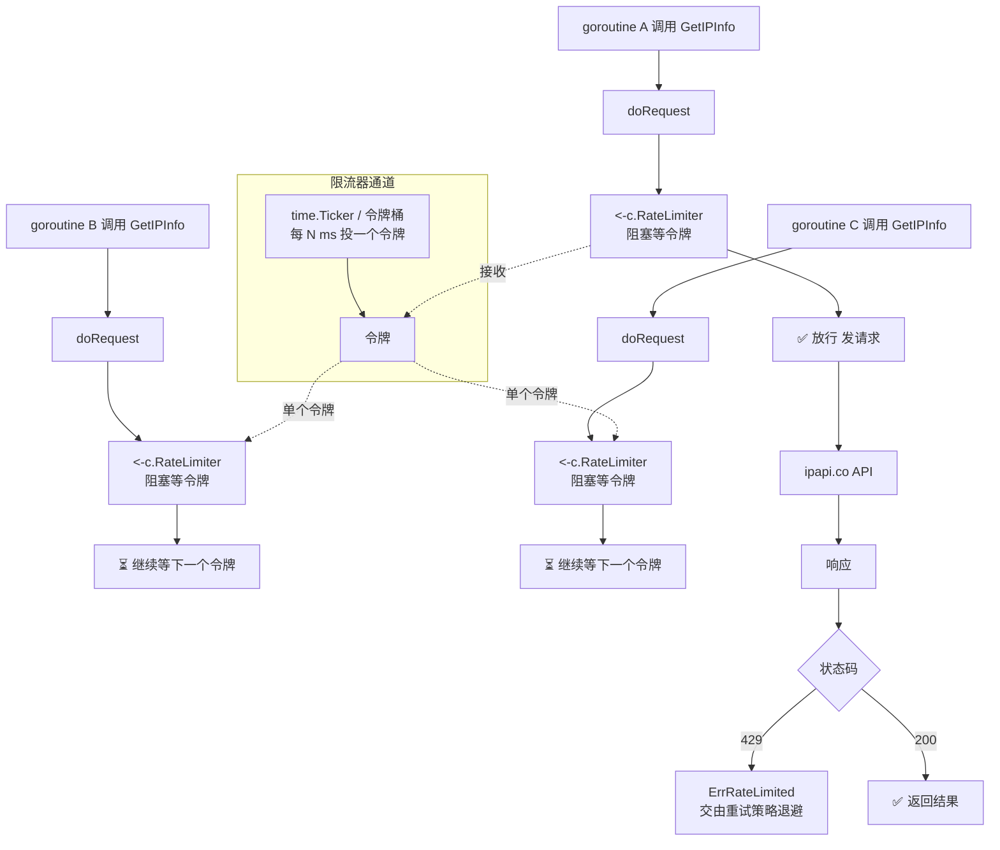
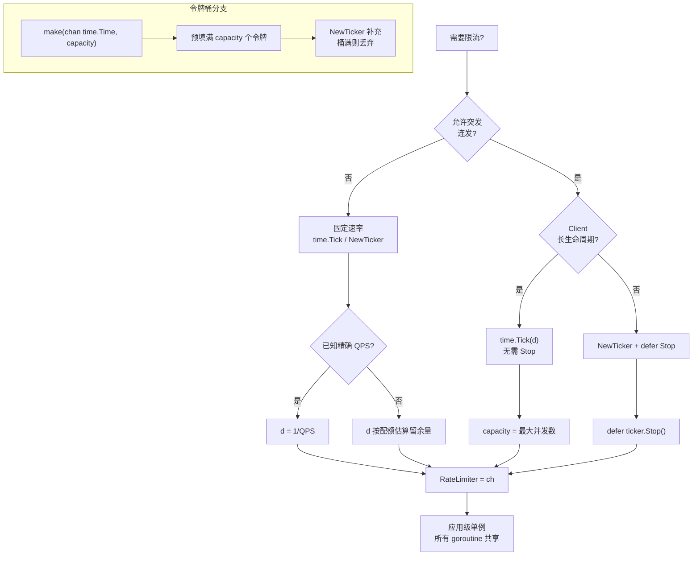

# ✅ 限流策略

> 通过 `Client.RateLimiter` 通道控制请求速率，避免触发 ipapi.co 的 429 限流。

## 背景

ipapi.co 对每个 API Key 设有请求配额。一旦超出，服务端会返回 `HTTP 429 Too Many Requests`，SDK 会将其映射为 [`ErrRateLimited`](../api/errors#errratelimited)。此时即使立即重试，也只会再次撞上配额墙，形成「请求 → 429 → 重试 → 429」的恶性循环，浪费带宽并拖慢整体吞吐。

限流的本质是**主动让请求慢下来**，而不是被动等服务器拒绝。ipapi.co-skills 在 `Client` 上暴露了一个 `RateLimiter <-chan time.Time` 字段：每次发起请求前，`doRequest` 都会执行 `<-c.RateLimiter` 阻塞，直到从通道里取到一个「令牌」才放行。这种基于通道的设计天然适配 Go 的并发模型，多个 goroutine 可以安全地共享同一个 `Client`，限流器会自动串行化它们的请求。

::: tip 🎨 一图抵千言
下图展示 `doRequest` 在发起请求前如何通过 `<-c.RateLimiter` 阻塞拿令牌。多个 goroutine 共享同一个 `Client`，限流器自动串行化它们的请求。
:::



::: tip 🎨 一图抵千言
下图按「是否需要突发 / 是否长生命周期」两个维度，帮你快速选定限流模型。
:::



::: warning ⚠️ 选型决策一句话
- 严格匀速、长生命周期服务 → `time.Tick`
- 严格匀速、短生命周期/测试 → `NewTicker` + `defer Stop`
- 偶尔突发、长期平均 → 令牌桶（带缓冲通道）
- 高可用长队列 → 令牌桶预填满 + 外层 `select` 监听 `ctx.Done()`
:::

## 建议

### 1. 固定速率（`time.Tick`）— 最简单

::: info 🎯 选型速查
| 模型 | 实现 | 适用场景 | 突发支持 |
| --- | --- | --- | --- |
| 固定速率 | `time.Tick` / `NewTicker` | 严格每秒 N 请求 | ❌ |
| 令牌桶 | 带缓冲通道 | 偶尔连发 + 长期平均 | ✅ |
| 带超时等待 | `select` + `ctx` | 高可用长队列 | ✅ |
:::

如果你需要**严格的每秒 N 个请求**，用 `time.Tick` 每隔固定间隔投递一个令牌即可：

```go
package main

import (
	"context"
	"time"

	"github.com/cyberspacesec/ipapi-go/pkg/ipapi"
)

func main() {
	// 每 200ms 放行一个请求 → 5 QPS
	limiter := time.Tick(200 * time.Millisecond)

	client := ipapi.NewClient(
		ipapi.WithAPIKey("YOUR_API_KEY"),
	)
	client.RateLimiter = limiter

	// 多个 goroutine 并发调用，实际仍按 5 QPS 串行放行
	ips := []string{"8.8.8.8", "1.1.1.1", "9.9.9.9"}
	for _, ip := range ips {
		go func(ip string) {
			info, err := client.GetIPInfo(context.Background(), ip, "json")
			// 处理 info / err ...
			_ = info
			_ = err
		}(ip)
	}

	time.Sleep(2 * time.Second)
}
```

::: warning 关于 time.Tick
`time.Tick` 在底层创建一个无法被 GC 回收的 ticker，适合长生命周期的全局 `Client`。如果 `Client` 是短生命周期对象，请改用 `time.NewTicker` 并在用完后 `defer ticker.Stop()`，把 `ticker.C` 赋给 `RateLimiter`。
:::

### 2. 令牌桶（带缓冲通道）— 支持突发

固定速率无法应对「偶尔需要短时间内连发多个请求」的场景。令牌桶允许你**累积一定额度的令牌用于突发**，同时维持长期平均速率：

```go
package main

import (
	"context"
	"time"

	"github.com/cyberspacesec/ipapi-go/pkg/ipapi"
)

// NewTokenBucket 返回一个令牌桶限流器。
// capacity: 桶容量（最大突发请求数）
// refillEvery: 每隔多久补充一个令牌
func NewTokenBucket(capacity int, refillEvery time.Duration) <-chan time.Time {
	bucket := make(chan time.Time, capacity)
	// 预填满令牌，允许起始突发
	for i := 0; i < capacity; i++ {
		bucket <- time.Now()
	}
	go func() {
		ticker := time.NewTicker(refillEvery)
		defer ticker.Stop()
		for t := range ticker.C {
			// 桶满时投递会阻塞，此处用非阻塞写避免泄露 goroutine
			select {
			case bucket <- t:
			default: // 桶已满，丢弃本次补充
			}
		}
	}()
	return bucket
}

func main() {
	// 桶容量 10（最多突发 10 个），每 100ms 补一个 → 平均 10 QPS
	client := ipapi.NewClient(ipapi.WithAPIKey("YOUR_API_KEY"))
	client.RateLimiter = NewTokenBucket(10, 100*time.Millisecond)

	_ = client.GetIPInfo(context.Background(), "8.8.8.8", "json")
}
```

::: tip 突发 ≠ 无限
令牌桶的 `capacity` 决定了**最大瞬时并发**。把它设得远超服务端允许的并发数，限流就形同虚设。一个保守的起点：`capacity` 等于你计划的最大并发 goroutine 数。
:::

### 3. 配合 context 做超时控制

`<-c.RateLimiter` 是**无超时**的阻塞——如果令牌迟迟不来，请求会一直卡住。在高可用场景，给等待加上上限：

```go
// 取令牌时最多等 2 秒，超时则放弃本次请求
select {
case <-client.RateLimiter:
	// 拿到令牌，继续发请求
case <-ctx.Done():
	return nil, ctx.Err()
case <-time.After(2 * time.Second):
	return nil, fmt.Errorf("rate limiter wait timeout")
}
```

> 注意：上面的模式需要你自己包一层 `doRequest`，或在调用业务方法前先消耗令牌。SDK 内置的 `<-c.RateLimiter` 不感知 `ctx`，因此对于长队列场景，建议用令牌桶预填满，避免无限阻塞。

::: warning ⚠️ 内置限流不感知 context
SDK 内置的 `<-c.RateLimiter` 是纯通道接收，不感知 `ctx`，无法被取消打断。上面的 `select` 模式需要你**自己包一层**或在调用业务方法前先消耗令牌。长队列场景建议用令牌桶预填满，避免无限阻塞。
:::

::: details 🚀 进阶：可取消限流器封装
若想让限流器本身支持取消，可封装一个带缓冲的通道，配合 `ctx` 在外层 `select` 中使用。核心思路：用 `time.NewTicker` 投递令牌到带缓冲通道，业务侧用 `select` 同时监听令牌与 `ctx.Done()`。
:::

### 4. 把限流器做成可复用资源

限流器是有状态的，应该**跨请求复用**，而不是每次调用新建。把它和 `Client` 一起作为应用级单例：

```go
// 全局共享一个限流器，所有调用共用同一配额
var limiter = NewTokenBucket(10, 100*time.Millisecond)

func newClient() *ipapi.Client {
	c := ipapi.NewClient(ipapi.WithAPIKey("YOUR_API_KEY"))
	c.RateLimiter = limiter
	return c
}
```

## 反模式

- ❌ **用 `time.Tick(0)` 或一个永远不投递的通道**：`doRequest` 会永久阻塞，所有请求假死。生产环境务必确认通道会持续投递令牌。
- ❌ **给每个 goroutine 单独建一个限流器**：限流的意义是约束**总速率**。每人一个限流器等于没限流，N 个 goroutine 会发出 N 倍速率的请求，照样触发 429。
- ❌ **令牌桶容量设得过大**：`make(chan time.Time, 100000)` 看似「攒一波大的」，实则把长期配额一次性挥霍，随后服务端会以 429 教你做人。容量应贴近真实并发需求。
- ❌ **触发 429 后立即重试且不退避**：`ErrRateLimited` 表示配额已耗尽，此时再快也是浪费。应配合[重试策略](./retry-strategy)做指数退避，或读取服务端的 `Retry-After` 头。
- ❌ **把 `RateLimiter` 设为 `nil` 又跑高并发**：`nil` 通道的接收会**永久阻塞**。要么赋一个真实通道，要么完全不要设置该字段（保持零值时 SDK 会跳过限流步骤）。
- ❌ **遗忘 `ticker.Stop()`**：用 `time.NewTicker` 创建的限流器如果不显式停止，底层定时器无法被 GC，长期运行的服务会泄漏 goroutine。
- ❌ **在限流器关闭后继续发请求**：往已 `close` 的通道接收会立即返回零值，限流失效；从已 `close` 的 `ticker.C` 接收也会立即返回，行为不符合预期。请让限流器与 `Client` 同生命周期。

## 检查清单

- [ ] 已明确服务端配额，并将限流速率设定在其**之下**（留出安全余量）
- [ ] 选定了合适的限流模型：固定速率（`time.Tick`/`NewTicker`）或令牌桶（带缓冲通道）
- [ ] 限流器为**应用级单例**，被所有请求共享，而非每次新建
- [ ] 令牌桶的 `capacity` 与计划的最大并发 goroutine 数匹配，未设过大
- [ ] 使用 `time.NewTicker` 时在销毁路径上调用了 `ticker.Stop()`
- [ ] `Client.RateLimiter` 指向一个会持续投递令牌的通道，而非 `nil`、已关闭或永不投递的通道
- [ ] 已为「等待令牌」环节考虑超时/取消（`context` 或 `time.After`），避免无限阻塞
- [ ] 限流与[重试策略](./retry-strategy)协同：429 时退避而非盲撞
- [ ] 高并发压测下确认实际 QPS 落在预期区间，且未出现 429

## 相关

- 📖 [客户端概念](../guide/client-concept) — `Client` 字段与构造
- 📖 [重试概念](../guide/retry-concept) — 与限流联动的重试退避
- 📖 [Context 用法](../guide/context) — 为等待令牌加超时
- 📚 [Client 结构体](../api/client) — `RateLimiter` 字段定义
- 📚 [错误类型](../api/errors) — `ErrRateLimited` 的识别与处理
- 📚 [IsRetryable](../api/is-retryable) — 判断限流错误是否可重试
- 🍳 [限流 + 重试组合示例](../cookbook/rate-limit-by-country) — 完整可运行配方
- ✅ [重试策略](./retry-strategy) — 指数退避与 429 处理
- ✅ [超时策略](./timeout-strategy) — 分层超时设计
