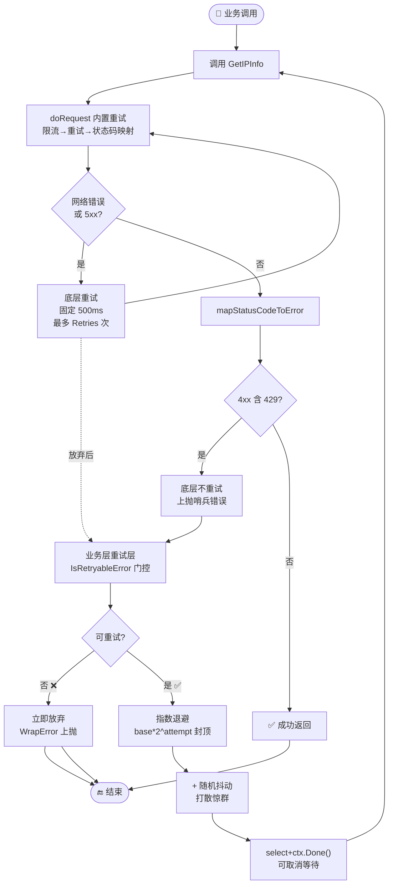
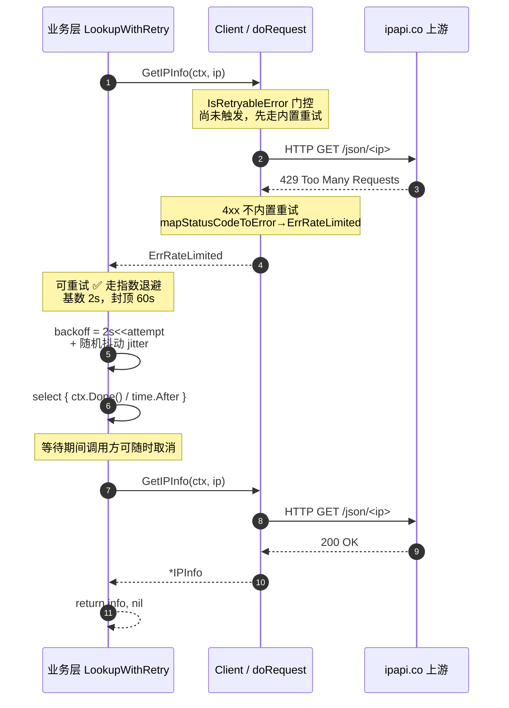

# ✅ 重试策略

> 内置重试兜底网络抖动，业务层指数退避应对限流与持续故障。两层叠加，既不放过瞬时错误，也不在 429 上死磕。

## 📌 背景

`ipapi.co` 是一个公网 HTTP 服务，请求链路上任何一环都可能出问题：本地 DNS 抖一下、运营商路由绕路、上游网关 5xx、被风控判为异常流量返回 429。如果每次抖动都直接把错误抛给调用方，业务的可用性就完全绑死在网络的瞬时稳定性上。

`Client` 内部已经内置了一层重试（见 [`doRequest`](../api/methods)），但这层重试有边界：

- 🔄 只重试**网络错误**与 **5xx 服务端错误**，且固定退避 `500ms`，最多 `Retries` 次（默认 2 次）。
- 🚫 **不重试 4xx**——`429 Too Many Requests` 会通过 [`mapStatusCodeToError`](../api/methods) 映射成 [`ErrRateLimited`](../api/errors) 后直接返回，因为固定 `500ms` 的退避对限流来说太短，硬重试只会火上浇油。
- ⏱ 退避是**固定**的，没有抖动（jitter），高并发下容易引发「惊群」。

因此生产环境需要在内置重试之上，再叠一层**业务层指数退避**：用 [`IsRetryableError`](../api/is-retryable) 判断是否值得重试，用递增 + 抖动的等待时间应对限流与持续故障，并用 `context` 给整条重试链路设一个总 deadline。

一句话原则：**内置重试负责「抖一下就好」的瞬时错误，业务层退避负责「需要等一会儿」的限流与持续故障。**

::: tip 🎨 一图抵千言
下图展示两层重试的协作流程：底层 `doRequest` 兜底瞬时网络错误（固定 500ms），业务层叠加指数退避 + 抖动应对限流与持续 5xx。注意 4xx（含 429）在底层**不重试**，直接上抛给业务层。
:::



## ✅ 建议

### 1. 保留默认内置重试，不要轻易关闭

`NewClient` 默认 `Retries = 2`（共 3 次请求），固定退避 `500ms`。这一层几乎零成本，能挡掉绝大多数一次性的网络抖动，生产环境建议保留：

```go
client := ipapi.NewClient(
    ipapi.WithAPIKey(os.Getenv("IPAPI_KEY")),
)
// 不动 Retries，使用默认值 2
```

只在两种情况下考虑调小：一是你已经在业务层做了完整的指数退避（避免双重重试放大请求量），二是配额极度紧张、宁可快速失败也不想多打一次请求。

```go
// 业务层已做指数退避，关闭内置重试避免请求放大
client := ipapi.NewClient(ipapi.WithAPIKey(os.Getenv("IPAPI_KEY")))
client.Retries = 0
```

::: details 📊 两层重试何时开关
| 你的场景 | 内置 Retries | 业务层重试 | 理由 |
| --- | --- | --- | --- |
| 通用生产 | 默认 2 ✅ | 叠加 | 各管一层，互不干扰 |
| 业务层已做完整退避 | 设 0 | 保留 | 避免双重计数请求放大 |
| 配额极度紧张 | 设 0 | 关闭 | 快速失败，宁可少打 |
| 仅临时排查问题 | 设 0 | 关闭 | 隔离重试噪音便于定位 |
:::

### 2. 业务层叠一层指数退避 + 抖动

针对限流（`ErrRateLimited`）和持续 5xx（`ErrServerError`），固定 `500ms` 不够，需要更长的退避。用 [`IsRetryableError`](../api/is-retryable) 做门控，遇到不可重试错误（如 `ErrInvalidIP`、`ErrInvalidKey`）立即放弃：

```go
package iplookup

import (
    "context"
    "math/rand"
    "time"

    "github.com/cyberspacesec/ipapi-co-skills/pkg/ipapi"
)

// LookupWithRetry 在内置重试之上叠加业务层指数退避。
// maxAttempts 为业务层尝试次数（不含内置重试），建议 3~5。
func LookupWithRetry(ctx context.Context, client *ipapi.Client, ip string, maxAttempts int) (*ipapi.IPInfo, error) {
    var info *ipapi.IPInfo
    var err error

    base := 500 * time.Millisecond
    maxBackoff := 30 * time.Second

    for attempt := 0; attempt < maxAttempts; attempt++ {
        // context 在每一步都检查，保证整条链路有总 deadline
        if err = ctx.Err(); err != nil {
            return nil, err
        }

        info, err = client.GetIPInfo(ctx, ip, "json")
        if err == nil {
            return info, nil
        }

        // 不可重试（如 ErrInvalidIP / ErrInvalidKey）立即放弃，不要浪费时间
        if !ipapi.IsRetryableError(err) {
            return nil, ipapi.WrapError("LookupWithRetry", err)
        }

        // 指数退避：base * 2^attempt，封顶 maxBackoff
        backoff := base << uint(attempt)
        if backoff > maxBackoff {
            backoff = maxBackoff
        }
        // 抖动：[0.5*backoff, 1.5*backoff)，打散并发重试，避免惊群
        jitter := time.Duration(rand.Int63n(int64(backoff))) - backoff/2
        backoff += jitter
        if backoff < 0 {
            backoff = 0
        }

        // 用 context 控制等待，而不是 time.Sleep，保证可被取消
        select {
        case <-ctx.Done():
            return nil, ctx.Err()
        case <-time.After(backoff):
        }
    }

    return nil, ipapi.WrapError("LookupWithRetry", err)
}
```

::: tip 💡 为什么用 `select` 而不是 `time.Sleep`
`time.Sleep` 无法被 `context` 取消，请求方已经放弃时你还在傻等。用 `select` + `ctx.Done()` 能在调用方撤销时立刻退出，释放 goroutine。
:::

### 3. 限流要退避得更久，最好读 `Retry-After` 的语义

`ErrRateLimited` 对应 HTTP 429，意味着「你现在打太快了」。对这类错误，指数退避的**起始基数要更大**、封顶要更长，给服务端足够的喘息时间：

```go
// 限流单独走更激进的退避基数
if errors.Is(err, ipapi.ErrRateLimited) {
    // 限流：从 2s 起步，最长退到 60s
    backoff := (2 * time.Second) << uint(attempt)
    if backoff > 60*time.Second {
        backoff = 60 * time.Second
    }
    // 其余抖动 + select 等待逻辑同上
}
```

::: warning ⚠️ 关于 Retry-After
`ipapi.co` 的 429 响应体是 `APIError`，并不一定带标准 `Retry-After` 头。上面的代码用固定基数 + 指数增长做保守估计。如果你的代理或网关能解析到 `Retry-After`，优先用那个值。
:::

从时序视角看，一次受 429 限流的调用会经历「请求—被拒—退避等待—带抖动重试—成功」的完整往返。下图把客户端、内置重试层与上游服务端的交互时序展开：



::: details 📐 不同错误类型的退避基数对照
| 错误 | 起始基数 | 封顶 | 原因 |
| --- | --- | --- | --- |
| `ErrServerError`（5xx） | 500ms | 30s | 瞬时故障，恢复快 |
| `ErrRateLimited`（429） | 2s | 60s | 配额耗尽，需更长喘息 |
| 网络错误（内置层兜底） | 500ms 固定 | Retries 次 | 不交给业务层 |
| `ErrInvalidIP` / `ErrInvalidKey` | 不重试 | — | 永久错误，立即放弃 |
:::

### 4. 用 `context` 给整条重试链路设总 deadline

单次重试的退避叠加起来很容易超过调用方的容忍时间。在外层包一个带 deadline 的 `context`，让「等不到就算了」变成确定性而非概率事件：

```go
ctx, cancel := context.WithTimeout(ctx, 10*time.Second)
defer cancel()

info, err := LookupWithRetry(ctx, client, ip, 5)
if err != nil {
    // 兜底降级：用缓存 / 默认值 / 上一次成功结果
    return fallback, ipapi.WrapError("lookup", err)
}
```

这与 [超时策略](./timeout-strategy) 是一对：分层超时负责「单次请求多久」，重试策略负责「整体多久」，两者必须协同。

### 5. 给重试加上限流，别让退避变成放大器

退避期间如果上游持续故障，所有等待中的 goroutine 会在退避结束后**同一时刻**重试，形成二次尖峰。两层防护：

- 🎲 **抖动**（上文 `jitter`）已经打散了重试时刻。
- 🚦 **`RateLimiter`** 在每次请求前阻塞拿令牌，从根本上限速。

```go
client := ipapi.NewClient(ipapi.WithAPIKey(os.Getenv("IPAPI_KEY")))
// 最多 5 QPS，从入口限流
client.RateLimiter = time.Tick(200 * time.Millisecond)
```

详见 [限流策略](./rate-limit-strategy)。

## ❌ 反模式

### ❌ 关掉内置重试却不加业务层退避

```go
client := ipapi.NewClient(ipapi.WithAPIKey(os.Getenv("IPAPI_KEY")))
client.Retries = 0 // 关了内置重试
// 然后业务层直接调用，没有任何重试
info, err := client.GetIPInfo(ctx, ip, "json")
```

一次网络抖动就直接失败。关掉内置重试的前提是「你在业务层补上了等价或更好的退避」，否则只是把脆弱性暴露给上层。

### ❌ 对所有错误无脑重试

```go
for attempt := 0; attempt < 5; attempt++ {
    info, err := client.GetIPInfo(ctx, ip, "json")
    if err == nil {
        break
    }
    time.Sleep(time.Second) // 不管什么错都重试
}
```

`ErrInvalidIP`、`ErrInvalidKey` 这类**客户端错误是不可恢复的**——IP 格式不对、Key 无效，重试一万次结果也一样，白白浪费配额和时间。永远用 [`IsRetryableError`](../api/is-retryable) 做门控，遇到不可重试错误立即放弃。

### ❌ 固定退避、无抖动

```go
time.Sleep(1 * time.Second) // 每次都等 1s
```

固定退避在低并发没问题，但在高并发下所有失败请求会在**完全相同的时刻**重试，形成周期性尖峰，反而加重上游压力。务必加抖动（`jitter`），哪怕只是 `rand.Int63n` 级别的简单抖动。

### ❌ 用 `time.Sleep` 而非 `select` + `ctx.Done()`

```go
time.Sleep(backoff) // 调用方已经放弃了，你还在等
```

调用方超时或主动取消后，`time.Sleep` 无法被打断，goroutine 会继续空等到睡醒才退出，造成 goroutine 堆积。用 `select` 监听 `ctx.Done()` 才能在取消时立即返回。

### ❌ 退避无上限

```go
backoff := base << uint(attempt) // 永远翻倍，没有封顶
```

`attempt` 一大，`backoff` 会指数爆炸到天文数字（还会因 `time.Duration` 溢出变成负数）。必须封顶到一个合理上限（如 30s 或 60s）。

### ❌ 内置重试 + 业务层重试双重计数，请求放大

```go
client.Retries = 5                      // 内置 5 次
for attempt := 0; attempt < 5; attempt++ { // 业务层再 5 次
    info, err := client.GetIPInfo(ctx, ip, "json")
    // ...
}
```

最坏情况一次逻辑请求会变成 `6 * 5 = 30` 次实际 HTTP 请求，瞬间打爆配额。两层重试要么分工（内置管瞬时、业务管限流），要么关掉一层。如果都开，业务层的 `maxAttempts` 要相应调小。

## 📋 检查清单

- [ ] 保留 `Client` 默认 `Retries = 2`，或在业务层有等价退避时显式设为 0
- [ ] 业务层用 [`IsRetryableError`](../api/is-retryable) 做门控，不可重试错误立即放弃
- [ ] 退避采用指数增长（`base * 2^attempt`）并封顶（如 30s）
- [ ] 退避叠加随机抖动（jitter），打散并发重试时刻
- [ ] 限流（`ErrRateLimited`）使用更大的退避基数与更长封顶
- [ ] 用 `select` + `ctx.Done()` 替代 `time.Sleep`，保证可取消
- [ ] 外层用 `context.WithTimeout` 给整条重试链路设总 deadline
- [ ] 配合 [`RateLimiter`](../api/client) 从入口限速，避免退避后二次尖峰
- [ ] 内置重试与业务层重试的乘积不超过配额预算，避免请求放大
- [ ] 重试失败后有兜底降级（缓存 / 默认值），不把错误直接抛给终端用户

## 🔗 相关

- 🔄 指南：[重试与限流](../guide/retry-concept) — 内置重试机制与 `RateLimiter` 协同
- 🧩 API：[`IsRetryableError`](../api/is-retryable) — 判断错误是否值得重试
- 🛡 API：[错误类型](../api/errors) — `ErrRateLimited` / `ErrServerError` / `ErrNotFound`
- 🧱 API：[`Client` 字段](../api/client) — `Retries`、`RateLimiter`
- ⏱ 最佳实践：[超时策略](./timeout-strategy) — 分层超时，与本页协同
- 🚦 最佳实践：[限流策略](./rate-limit-strategy) — `RateLimiter` 通道
- 🧯 最佳实践：[优雅降级](./graceful-degradation) — 重试失败后的兜底
