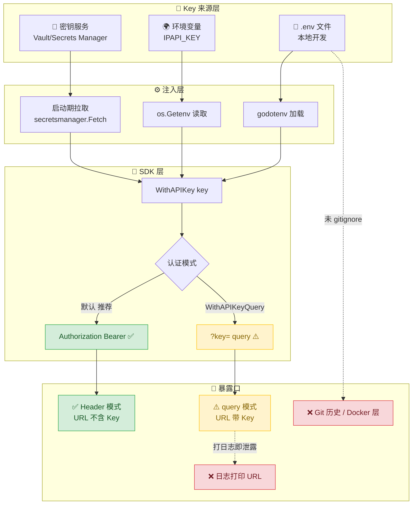
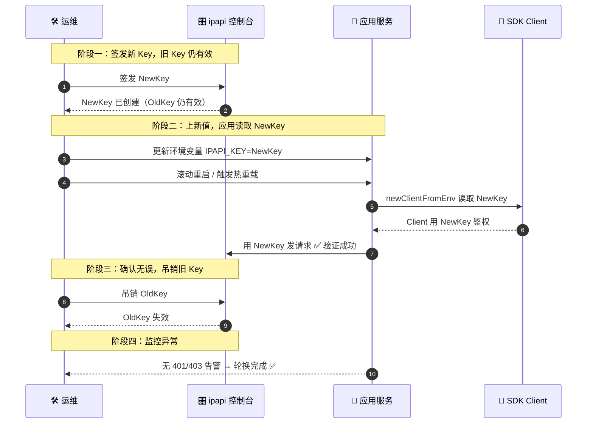

# ✅ 密钥管理

> API Key 是访问 ipapi.co 的身份证。泄露 = 被盗用配额、被冻结账户。本文讲怎么安全地存、用、轮换 Key。

## 📌 背景

ipapi.co 通过 API Key 识别你的账户并计费配额。Key 一旦泄露，攻击者可以：

- 💸 盗用你的付费配额，产生账单
- 🚫 触发限流甚至封禁，导致你的服务不可用
- 🕵️ 关联到你的账户身份，留下审计污点

代码里最常见的泄露途径不是黑客攻击，而是**把 Key 写死在源码里然后提交进 Git**。一旦进了历史记录，删一行没用——Key 永远躺在 `git log` 里。

::: tip 🎨 一图抵千言
下图展示一条 API Key 从"签发"到"注入到 SDK"的完整保密链路，以及每个环节常见的泄露口子。
:::



::: tip 🗝 核心原则
Key 与代码**物理分离**。代码只负责从某个外部来源读取，不负责"知道"Key 是什么。
:::

## ✅ 建议

::: info 📊 三种 Key 来源方式对照
| 来源 | 适用环境 | 轮换能力 | 审计能力 | 推荐度 |
|------|----------|----------|----------|--------|
| `.env` 文件 | 本地开发 | ❌ 手动 | ❌ 无 | ⚠️ 仅本地 |
| CI 明文 secret | CI/CD 引导 | ❌ 不轮换 | ❌ 弱 | ⚠️ 临时 |
| 环境变量 | 容器/K8s | 🔄 可重启注入 | 🟡 中 | ✅ 常用 |
| 密钥管理服务 | 生产 | ✅ 原生支持 | ✅ 强 | ✅✅ 推荐 |
:::

### 1. 用环境变量注入 🌍

最简单也最有效。Key 不进源码，从运行环境读取：

```go
package main

import (
	"log"
	"os"

	"github.com/cyberspacesec/ipapi.co-skills/pkg/ipapi"
)

func main() {
	key := os.Getenv("IPAPI_KEY")
	if key == "" {
		log.Fatal("IPAPI_KEY 未设置：拒绝以匿名模式启动生产服务")
	}

	client := ipapi.NewClient(
		ipapi.WithAPIKey(key), // 默认走 Bearer Header，更安全
	)
	_ = client
}
```

::: tip 📝 `.env` 与 `.gitignore`
本地开发用 `.env` 文件配合 `godotenv`，但**务必**把 `.env` 加入 `.gitignore`，只提交一份脱敏的 `.env.example`：

```bash
# .env.example（可提交）
IPAPI_KEY=replace_me_with_real_key

# .env（绝不提交）
IPAPI_KEY=sk_live_9f3c...real_key_here
```
:::

### 2. 生产环境用密钥管理服务 🏦

环境变量在本地够用，但在 K8s / 云上更推荐托管服务，支持审计、轮换、细粒度权限：

| 平台 | 服务 |
|------|------|
| AWS | Secrets Manager / SSM Parameter Store |
| GCP | Secret Manager |
| Azure | Key Vault |
| Kubernetes | Sealed Secrets / External Secrets Operator |
| 通用 | HashiCorp Vault |

启动时拉取，注入到环境或直接传给客户端：

```go
// 伪代码：从 AWS Secrets Manager 拉取
secret, err := secretsmanager.Fetch("prod/ipapi/key")
if err != nil {
    log.Fatalf("拉取密钥失败: %v", err)
}

client := ipapi.NewClient(
    ipapi.WithAPIKey(secret["IPAPI_KEY"]),
)
```

::: warning ⛓ 别用 CI 的明文变量当长期方案
GitHub Actions / GitLab CI 的 `secrets` 适合引导，但**不轮换、无审计**。生产负载应迁移到专用密钥服务。
:::

### 3. 定期轮换 Key 🔄

轮换 = 主动失效旧 Key、签发新 Key，把"泄露窗口"压缩到最短。

- 📅 设一个周期（建议 30–90 天），到点换 Key
- 🔄 **双 Key 重叠期**：先上新 Key（服务已读新值），再吊销旧 Key，避免切换瞬间断流
- 🗑 旧 Key 立即在 ipapi.co 控制台吊销，不要只是"不再使用"

::: tip 🎨 一图抵千言
双 Key 重叠期是无损轮换的关键——旧 Key 在新 Key 上线并验证成功之前始终保持可用，避免切换瞬间断流。
:::



```go
// 支持热重载的封装：改环境变量后重启即可，无需重新发版
func newClientFromEnv() (*ipapi.Client, error) {
    key := os.Getenv("IPAPI_KEY")
    if key == "" {
        return nil, errors.New("IPAPI_KEY 未设置")
    }
    return ipapi.NewClient(ipapi.WithAPIKey(key)), nil
}
```

::: details 📖 历史泄露扫描命令速查
仓库历史里如果已经泄露过，靠删一行没用。用以下命令快速扫描并吊销：

```bash
# 扫描 Git 历史中的 Key 字面量（粗扫）
git log -p | grep -iE "key=|bearer |sk_live_" | head -50

# 用 gitleaks 做专项扫描（推荐）
gitleaks detect --source . --report-path leaks.json

# 扫描 Docker 镜像层
docker history --no-trunc your-image:tag | grep -i key
```

发现泄露后：**先去 ipapi.co 控制台吊销 Key，再清理历史**。仅清理历史而不吊销，旧 Key 仍可用。
:::

::: tip ⏱ 最小权限
轮换时顺手检查：这个 Key 是不是只给了 IP 查询权限？不要用一个"全能 Key"跑所有服务。
:::

### 4. 默认走 Header 模式 🛡

本库默认 `APIKeyHeader` 模式，Key 放在 `Authorization` 头里，**不会**出现在 URL / 访问日志 / Referer 中。除非 CDN/JSONP 等场景必须，别切到 query 模式：

```go
client := ipapi.NewClient(
    ipapi.WithAPIKey(os.Getenv("IPAPI_KEY")),
    // 不加 WithAPIKeyQuery() —— 保持 Header 模式
)
```

::: info 📊 Header vs Query 认证模式对照
| 维度 | Bearer Header（默认） | ?key= Query |
|------|----------------------|-------------|
| Key 位置 | `Authorization` 请求头 | URL query 参数 |
| URL 是否含 Key | ❌ 不含 | ⚠️ 含 `?key=` |
| Nginx access log | ✅ 不记录 Key | ❌ 会记录 Key |
| CDN / 浏览器历史 | ✅ 不留存 | ❌ 会留存 |
| JSONP 跨域场景 | ❌ 受 CORS 限制 | ✅ 适合 |
| 安全推荐度 | ✅✅ 优先 | ⚠️ 仅必要时 |
:::

### 5. 失败要明确报错 ❗

Key 缺失时**不要静默降级**为匿名请求——那会掩盖配置错误，让你以为配额很高其实很低。启动期校验，缺失即 fail fast。

## 🚫 反模式

::: warning ⚠️ 反模式速览
| 反模式 | 后果 | 修复 |
|--------|------|------|
| 硬编码 Key | 进 Git 历史/镜像层 | 改 `os.Getenv` |
| Key 进 query 还打日志 | URL 全链路泄露 | 保持 Header + 脱敏日志 |
| 提交 `.env` | 一条 `git add .` 泄露 | `.gitignore` + 吊销轮换 |
| 多环境共用 Key | 一处泄露全炸 | dev/staging/prod 独立 Key |
| 静默回退匿名 | 掩盖配置错误 | 启动期 fail fast |
:::

### ❌ 硬编码 Key

```go
// 千万别这样
client := ipapi.NewClient(
    ipapi.WithAPIKey("sk_live_9f3c2a1b8d7e4f60"), // 写死，且会被提交
)
```

Key 会进 Git 历史、Docker 镜像层、构建日志。删了也没用。

### ❌ 把 Key 放进 query 参数还打日志

```go
// url 里的 ?key=xxx 会被 Nginx/CDN/浏览器历史全记一遍
client := ipapi.NewClient(
    ipapi.WithAPIKey("xxx"),
    ipapi.WithAPIKeyQuery(), // ⚠️ Key 进入 URL
)
log.Printf("请求 %s", req.URL.String()) // ❌ 把带 Key 的 URL 打进日志
```

### ❌ 提交 `.env`

`.env` 没 `.gitignore`，一条 `git add .` 就泄露了。即使删了，历史里还在——**立刻去 ipapi.co 控制台吊销并轮换**。

### ❌ 用同一个 Key 跑所有环境

dev / staging / prod 共用一个 Key，一个环境泄露全炸。每个环境独立 Key、独立配额。

### ❌ 静默回退匿名

```go
key := os.Getenv("IPAPI_KEY")
if key == "" {
    // ❌ 默默用匿名，配额爆了才发现
    return ipapi.NewClient()
}
```

配置错误应该大声失败，不该悄悄降级。

## 📋 检查清单

- [ ] 代码中**没有**任何字面量 API Key，全部走 `os.Getenv` 或密钥服务
- [ ] `.env` 已加入 `.gitignore`，仓库里只有 `.env.example`
- [ ] 启动时校验 Key 非空，缺失即 `log.Fatal` / 返回错误
- [ ] 生产环境使用 Secrets Manager / Vault 等托管服务，而非 CI 明文变量
- [ ] 认证走默认 Header 模式，未使用 `WithAPIKeyQuery`（除非有明确理由）
- [ ] 日志中**不会**打印含 Key 的完整 URL
- [ ] 设定了 30–90 天的 Key 轮换周期并有日历提醒
- [ ] 轮换走双 Key 重叠流程：先上新值再吊销旧值
- [ ] dev / staging / prod 使用相互独立的 Key
- [ ] 仓库历史中扫描过泄露（`git log -p | grep -i key=` 或 gitleaks），泄露的 Key 已吊销

## 🔗 相关

- 🔒 [认证机制](../guide/auth-concept) — Header vs Query 两种模式详解
- 📖 [`WithAPIKey`](../api/with-api-key) — 设置 API Key 的选项函数
- 📖 [`WithAPIKeyQuery`](../api/with-api-key-query) — 切换为 query 参数模式（慎用）
- 🧱 [`NewClient`](../api/new-client) — 构造客户端实例
- 🚨 [错误概念](../guide/error-concept) / [`ErrInvalidKey`](../api/errors) — Key 失效时的错误识别
- 🧪 [带 API Key 示例](../examples/with-api-key) — 完整可运行示例
- 🛡 [安全实践](./security) — 校验、HTTPS 等综合安全建议
