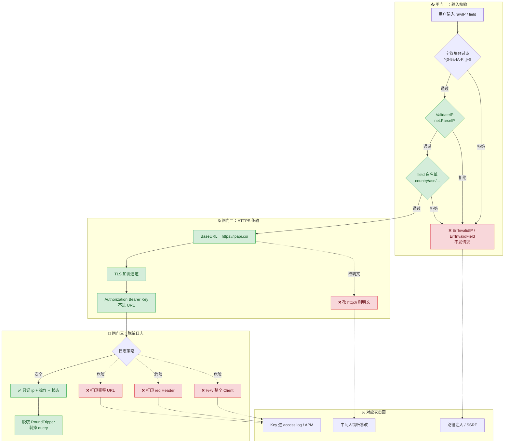
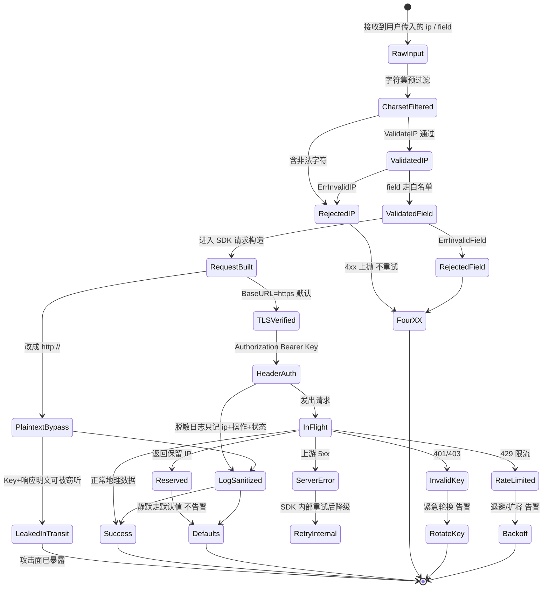

# ✅ 安全实践

> 输入校验、Key 不入日志、强制 HTTPS——三道闸门挡住最常见的接入事故。

## 📌 背景

接一个 IP 归属接口看似简单，但生产事故往往不在"业务逻辑"，而在三个被忽视的边界：

- 🩹 **输入未校验**：把用户传入的字符串直接拼进请求路径，轻则 400/404 刷屏，重则路径注入、SSRF。
- 🔑 **Key 入日志**：一次 `log.Printf(req.URL.String())`，API Key 就跟着 Nginx access log、APM 采样、崩溃堆栈一起进了可观测性管道，再难回收。
- 🔓 **明文传输**：HTTP 请求里的 Key、查询目标 IP、归属性数据全可被中间人窃听或篡改。

这三件事的共同点是：**代码能跑、测试能过、CI 绿灯**，却在生产里慢慢出血。本库在 SDK 层已经默认兜底了一部分（默认 HTTPS、默认 Header 鉴权、内置 `ValidateIP` / `ValidateFormat`），但安全是端到端的责任——SDK 兜底，**调用方仍需正确使用**。

::: tip 🛡 安全三角
校验输入 → 不泄 Key → 走 HTTPS。三者缺一，另两者都会被绕过：明文通道里校验再严也会被篡改，HTTPS 通道里 Key 进了日志照样泄露。
:::

::: tip 🎨 一图抵千言
下图是 SDK 调用链路上的三道安全闸门：输入校验（防 SSRF/路径注入）、HTTPS 传输（防窃听篡改）、脱敏日志（防 Key 泄露），以及每道闸门对应的攻击面。
:::



::: tip 🎨 一图抵千言
上图是闸门与攻击面的静态拓扑；下图换成**状态视角**——一笔 IP 查询从"原始输入"到"安全返回 / 拒绝 / 降级"的生命周期，标注每一步的状态流转与终止条件，便于在排查"为什么没发出请求"或"为什么走了默认值"时快速定位所处阶段。
:::



## ✅ 建议

### 1. 用 SDK 自带校验，别自己拼字符串 🧱

`GetIPInfo` / `GetField` 等方法在发请求**前**就会调用 `ValidateIP` 与字段白名单校验，非法输入直接返回 `ErrInvalidIP` / `ErrInvalidField`，**根本不会发出网络请求**。这是抵御路径注入的第一道闸门：

```go
package main

import (
	"errors"
	"fmt"
	"log"

	"github.com/cyberspacesec/ipapi.co-skills/pkg/ipapi"
)

func lookupCountry(ctx context.Context, rawIP string) (string, error) {
	// SDK 内部已对 ip 做 net.ParseIP 校验；
	// 对 field 做白名单校验。非法输入在此被拦截，不发请求。
	country, err := client.GetField(ctx, rawIP, "country_name")
	if err != nil {
		if errors.Is(err, ipapi.ErrInvalidIP) {
			// 用户输入脏数据，按 4xx 对待，不要重试
			return "", fmt.Errorf("非法 IP 输入: %w", err)
		}
		return "", fmt.Errorf("查询失败: %w", err)
	}
	return country, nil
}
```

需要脱离 SDK 方法、自己校验时（例如先校验再决定是否查），直接用导出的校验函数：

```go
// 手动预校验：避免把脏数据带进业务流程
if err := ipapi.ValidateIP(userInput); err != nil {
	return errors.New("请输入合法的 IPv4/IPv6 地址")
}
if err := ipapi.ValidateFormat(format); err != nil {
	return errors.New("不支持的响应格式")
}
```

::: warning 🧱 字段走白名单，别走用户输入
`GetField` 的 `field` 参数是写死的白名单（`country`、`asn`、`latlong`…）。**永远不要**把外部输入当 `field` 传进来——即便 SDK 会拦截，也会消耗一次错误链路。业务侧应映射自己的枚举到合法字段。
:::

### 2. 限定来源 IP 的字符集 ✏️

`net.ParseIP` 会拒绝 `"8.8.8.8'; DROP TABLE--"` 这类注入串，但业务层最好更早过滤——在网关 / 框架层就用正则限定为 IPv4/IPv6 字符集，避免脏数据进入日志、缓存键、SQL：

```go
// 一个轻量的 IPv4/IPv6 字符集预过滤（不替代 ParseIP，只是挡住明显脏数据）
var ipCharRe = regexp.MustCompile(`^[0-9a-fA-F:.]+$`)

func sanitizeIP(raw string) (string, error) {
	raw = strings.TrimSpace(raw)
	if !ipCharRe.MatchString(raw) {
		return "", errors.New("IP 含非法字符")
	}
	if err := ipapi.ValidateIP(raw); err != nil {
		return "", err
	}
	return raw, nil
}
```

### 3. Key 永远不入日志 🚿

本库默认 `APIKeyHeader` 模式，Key 放在 `Authorization` 头里，**不出现在 URL**。但仍有两个泄露口子要堵：

- **自己打日志时别 `Print(req.URL.String())` 或 `%+v` 整个 request**——如果切到 `WithAPIKeyQuery()` 模式，URL 里就带 Key。
- **错误处理 / 中间件日志**：拦截器、APM、`http.RoundTrip` 包装层很容易顺手把请求头打出去。

正确做法：日志只打"操作 + 状态 + 目标 IP"，**绝不打完整 URL、不打 Authorization 头**：

```go
// ✅ 安全：只记录操作语义，不含 Key
resp, err := client.GetIPInfo(ctx, ip, "json")
if err != nil {
    log.Printf("lookup ip=%s err=%v", ip, err) // err 里不会有 Key
    return err
}
log.Printf("lookup ip=%s country=%s", ip, resp.CountryName)
```

如需记录请求用于排障，写一个脱敏的 `RoundTripper`，只留方法、路径（不含 query）和状态码：

```go
type sanitizingTransport struct{ base http.RoundTripper }

func (t sanitizingTransport) RoundTrip(req *http.Request) (*http.Response, error) {
	// 打日志前剥掉 query（query 模式下会含 ?key=）
	safeURL := req.URL.Scheme + "://" + req.URL.Host + req.URL.Path
	log.Printf("ipapi call method=%s path=%s", req.Method, safeURL)
	return t.base.RoundTrip(req)
}

client := ipapi.NewClient(
	ipapi.WithAPIKey(os.Getenv("IPAPI_KEY")),
	ipapi.WithCustomHTTPClient(&http.Client{
		Transport: sanitizingTransport{base: http.DefaultTransport},
		Timeout:   10 * time.Second,
	}),
)
```

### 4. 默认就是 HTTPS，别改 BaseURL 到 http:// 🔒

SDK 默认 `BaseURL = "https://ipapi.co/"`。HTTPS 同时保护三件事：传输中的 API Key（Header 模式）、被查询的目标 IP、返回的地理归属数据。**除非本地 mock 测试**，永远不要把 BaseURL 改回 `http://`：

```go
// ✅ 生产：保持默认 https://ipapi.co/
client := ipapi.NewClient(ipapi.WithAPIKey(key))

// ✅ 仅本地测试：指向自己的 httptest server
ts := httptest.NewServer(mock)
client := ipapi.NewClient(
	ipapi.WithBaseURL(ts.URL), // ts.URL 是 http://127.0.0.1:xxx，仅测试用
)
```

::: danger 🚫 别用 http:// 对真实端点
把 `BaseURL` 改成 `http://ipapi.co/` 等于让 Key 走明文、让响应可被篡改。即便你的反向代理在入口做了 TLS 卸载，SDK 到 ipapi.co 这一跳仍必须是 HTTPS——SDK 默认就是，别覆盖。
:::

::: details 📖 反向代理 TLS 卸载与 SDK 的关系
常见误解："我的入口 Nginx 已经做了 HTTPS，SDK 用 http 也安全。" 错。Nginx 的 TLS 卸载只保护**用户到 Nginx**这一跳，Nginx 到上游（包括 SDK 到 ipapi.co）是另一条独立连接。如果 SDK 这一跳走 http，Key 和响应在 Nginx 到 ipapi.co 之间仍是明文，可被同网段嗅探或中间人篡改。

```
用户 ──HTTPS──> Nginx(卸载TLS) ──http??──> ipapi.co
                        ↑
                  SDK 这一跳若走 http 则裸奔
```

正确做法：SDK 到 ipapi.co 这跳始终保持默认 `https://ipapi.co/`，与入口 Nginx 是否卸载 TLS 无关。
:::

### 5. 给请求套上超时与上下文 ⏱

没有超时的请求会被慢攻击 / 半开连接拖垮。构造 `Client` 时用 `context` 控制每笔调用的最长等待，并配合 SDK 默认的 10s HTTP 超时：

```go
ctx, cancel := context.WithTimeout(parentCtx, 3*time.Second)
defer cancel()

info, err := client.GetIPInfo(ctx, ip, "json")
if err != nil {
	if errors.Is(err, context.DeadlineExceeded) {
		// 超时按降级处理，别无限重试
	}
}
```

详见 [上下文与超时](../guide/context)。

### 6. 处理保留 IP 与可疑输入 🕵️

`GetIPInfo` 对保留 IP（私网、环回、链路本地等）会返回 `ErrReservedIP` / `APIError.Reserved=true`。对这类输入，业务侧应**直接走默认值**，不要重试也不要当错误抛给终端用户：

::: info 📊 安全相关错误的处理决策
| 错误 | 含义 | 重试？ | 告警？ | 业务动作 |
|------|------|--------|--------|----------|
| `ErrInvalidIP` | IP 格式非法 | ❌ 否 | ❌ 否 | 返回 4xx 给调用方 |
| `ErrInvalidField` | 字段不在白名单 | ❌ 否 | ❌ 否 | 修业务枚举 |
| `ErrReservedIP` | 保留 IP（私网/环回） | ❌ 否 | ❌ 否 | 走默认值，静默 |
| `ErrInvalidKey` | Key 失效/无权限 | ❌ 否 | 🔴 是 | 紧急轮换 Key |
| `ErrRateLimited` | 触发限流 | ❌ 否（SDK 不重试 4xx） | ⚠️ 是 | 退避/扩容 |
| `ErrServerError` | 上游 5xx | ✅ SDK 内部重试 | ⚠️ 是 | 降级 |
:::

```go
info, err := client.GetIPInfo(ctx, ip, "json")
switch {
case errors.Is(err, ipapi.ErrReservedIP):
	// 保留 IP：用默认地理/语言，不打告警
	return defaults, nil
case errors.Is(err, ipapi.ErrInvalidIP):
	return defaults, fmt.Errorf("非法 IP: %w", err)
case err != nil:
	return defaults, err
}
return info, nil
```

## 🚫 反模式

::: warning ⚠️ 反模式速览
| 反模式 | 风险 | 修复 |
|--------|------|------|
| 外部输入直拼路径 | SSRF / 路径注入 | 走 SDK GetIPInfo |
| 日志打印完整请求 | Key 泄露 | 只记操作语义 |
| BaseURL 改明文 http | Key + 响应被窃听 | 保持默认 https |
| query 模式 + 标准日志 | URL 带 Key 全链路留痕 | 仅 JSONP 用且脱敏 |
| 静默吞校验错误 | 无限重试刷屏 | 4xx 上抛不重试 |
:::

### ❌ 把外部输入直接拼进路径

```go
// 用户可控的 ip 没校验就拼 URL
resp, _ := http.Get("https://ipapi.co/" + ip + "/json/")
```

绕过 SDK 校验等于绕过白名单。`../../`、编码绕过、SSRF 都从这里进来。永远走 `client.GetIPInfo(ctx, ip, format)`。

### ❌ 日志里打印完整请求

```go
log.Printf("请求 %s", req.URL.String())        // query 模式下 ?key=xxx 泄露
log.Printf("请求头 %+v", req.Header)            // Authorization: Bearer xxx 泄露
fmt.Printf("client=%+v", client)                // 结构体里有 APIKey 字段，泄露
```

`Client` 结构体的 `APIKey` 是明文字段，`%+v` 一打就出来。日志只记操作语义。

### ❌ 覆盖 BaseURL 为明文 http

```go
client := ipapi.NewClient(
	ipapi.WithAPIKey(key),
	ipapi.WithBaseURL("http://ipapi.co/"), // ❌ Key 与响应全明文
)
```

### ❌ 切到 query 模式还走标准日志

```go
client := ipapi.NewClient(
	ipapi.WithAPIKey(key),
	ipapi.WithAPIKeyQuery(), // Key 进 URL
)
// Nginx access log、CDN 日志、浏览器历史全记一遍 ?key=
```

query 模式仅在 JSONP / 老 CDN 场景必须时才用，且必须配套脱敏日志。详见 [认证机制](../guide/auth-concept)。

### ❌ 静默吞掉校验错误

```go
info, _ := client.GetIPInfo(ctx, badIP, "json")
// 把空结果当下游故障，无限重试 → 刷屏 + 配额浪费
```

校验错误是**输入问题**，应 4xx 对待、向调用方上抛，不进重试链路。

## 📋 检查清单

- [ ] 所有 IP 查询走 `client.GetIPInfo` / `client.GetField` 等 SDK 方法，未手拼 URL
- [ ] 外部输入在业务层做字符集预过滤 + `ipapi.ValidateIP` 双重校验
- [ ] `GetField` 的 `field` 参数来自业务侧枚举，**不接受**外部输入
- [ ] 日志中**不打印**完整 URL（含 query）、不打印请求头、不 `%+v` 整个 `Client`
- [ ] 自定义 `RoundTripper` / 拦截器输出前已脱敏 query 与 Authorization
- [ ] 生产 `BaseURL` 保持默认 `https://ipapi.co/`，仅在测试用 `httptest` 覆盖
- [ ] 默认走 `APIKeyHeader` 模式，未启用 `WithAPIKeyQuery()`（除非 JSONP/CDN 必需且已脱敏）
- [ ] 每笔请求带 `context.WithTimeout`，超时按降级而非无限重试
- [ ] `ErrReservedIP` 走默认值分支，不当错误抛给终端用户
- [ ] `ErrInvalidIP` / `ErrInvalidField` 走 4xx 链路，不进重试
- [ ] 仓库已扫描过历史泄露（`git log -p | grep -iE "key=|bearer "` 或 gitleaks），泄露 Key 已吊销

## 🔗 相关

- 🔒 [认证机制](../guide/auth-concept) — Header vs Query 两种模式与安全取舍
- 🧱 [自定义 HTTP 客户端](../guide/custom-http) — 注入脱敏 Transport 的正确姿势
- 🚨 [错误概念](../guide/error-concept) — 校验与保留 IP 错误的识别
- 🚦 [保留 IP](../guide/reserved-ip) — 私网/环回地址的处理
- ⏱ [上下文与超时](../guide/context) — 分层超时与取消
- 📖 [`ValidateIP`](../api/validate-ip) · [`ValidateFormat`](../api/validate-format) — 内置校验函数
- 📖 [`WithAPIKey`](../api/with-api-key) · [`WithAPIKeyQuery`](../api/with-api-key-query) — 鉴权模式选项
- 📖 [`WithCustomHTTPClient`](../api/with-custom-http-client) — 注入自定义 Transport
- 📖 [`ErrInvalidIP`](../api/errors) · [`ErrInvalidField`](../api/errors) · [`ErrReservedIP`](../api/errors) — 安全相关错误
- 🛡 [密钥管理](./secret-management) — Key 的存储、轮换与注入（本篇的姊妹篇）
- 🏠 [最佳实践总览](../reference/index)
