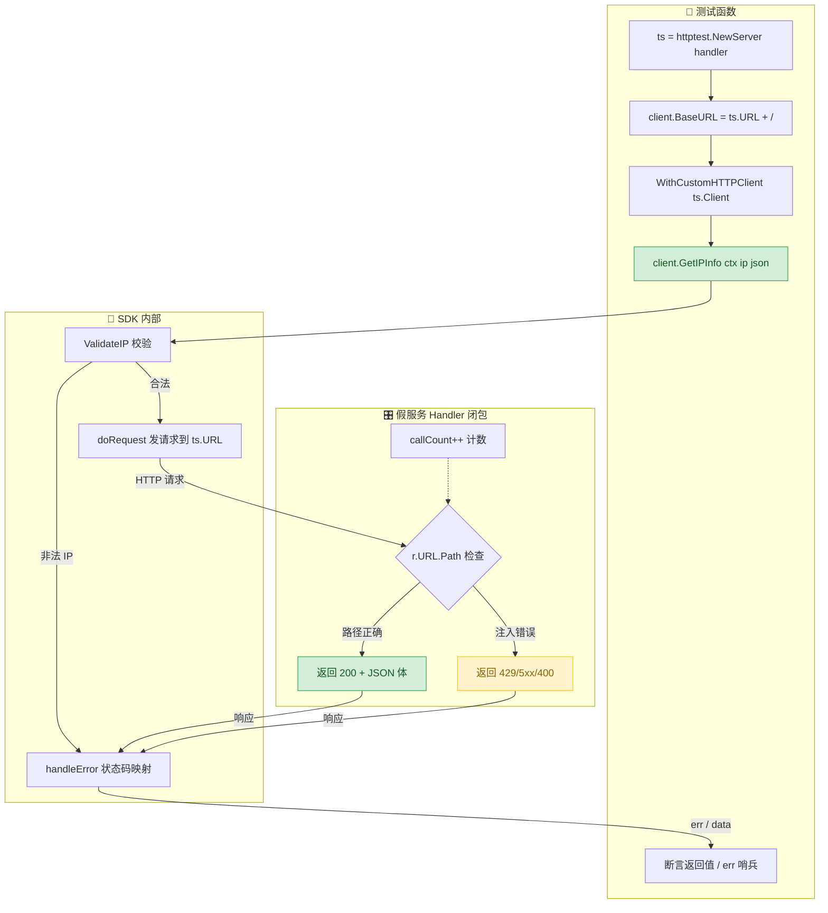
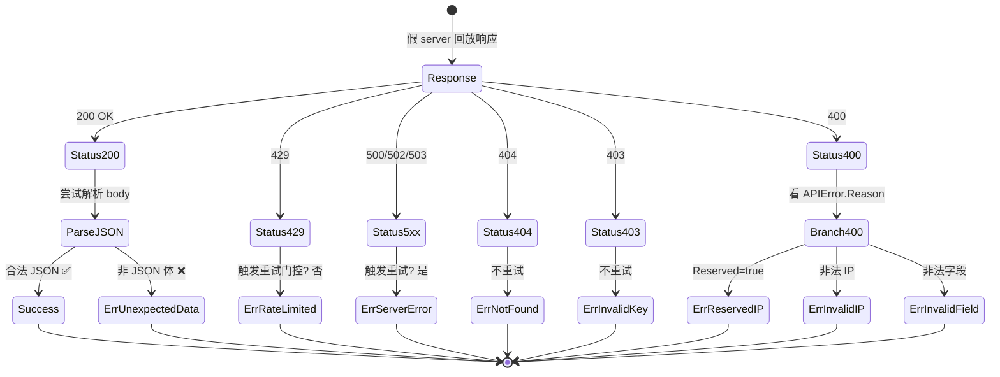

# ✅ 测试实践

> 用 `httptest.NewServer` 在进程内模拟整个 `ipapi.co`，让测试零网络、零配额、零 flaky。本地起一个假服务，断言请求路径与头部，回放固定响应体，错误分支、重试逻辑、限流映射都能被确定性覆盖。

## 📌 背景

`ipapi.co` 是一个公网 HTTP 服务，这意味着任何「直接打真实 API」的测试都带着三重原罪：

- 🌐 **网络依赖** — CI 环境可能没有外网，或者 DNS 抖一下测试就挂。这类失败和被测代码无关，却会让提交变红，腐蚀团队对测试套件的信任。
- 💰 **配额消耗** — 每次真实请求都吃免费额度或付费配额。跑一次 `go test ./...` 就把当天额度烧光，是测试套件最常见的「慢性失血」。
- 🎲 **不确定性** — 同一个 IP 的 `city`、`asn` 字段可能随上游数据库更新而变。基于真实返回值写断言，测试今天过、明天红，这就是 flaky test 的典型成因。

正确做法是**把网络这条边从测试里摘掉**：用标准库的 `net/http/httptest` 起一个进程内的假服务，让 `Client` 把请求发到这个假服务上。这样：

- ✅ 零网络、零配额，CI 里随便跑、跑多少次都不花钱。
- ✅ 响应体由你写死，断言可以精确到字段值，不会因上游数据变化而 flaky。
- ✅ 能构造真实 API 难以复现的边界场景：429 限流、5xx 故障、保留 IP、非法 JSON、连接被掐断、重试 N 次后才成功……
- ✅ 能反向断言「客户端发出了正确的请求」——路径是 `/8.8.8.8/json/`、`User-Agent` 带上了 `ipapi-go-client/1.0`、`Authorization` 是 `Bearer <key>`。

SDK 自身的全部测试就是这么做的，本页把这套模式提炼成可复用的实践。

一句话原则：**测试只验证「你的代码如何与 HTTP 语义交互」，不验证「真实 ipapi.co 此刻返回什么」。**

::: tip 🎨 一图抵千言
下图展示 httptest 的标准测试策略：BaseURL 指向进程内假服务，请求与断言在闭包内双向验证。
:::



::: tip 💡 双向断言
假 server 既是"响应回放器"也是"请求断言器"：在 handler 闭包里同时验证客户端发对了路径/头部，又回放固定响应。这是 httptest 模式的精髓。
:::

## ✅ 建议

### 1. 用 `httptest.NewServer` 起假服务，`BaseURL` 指向它

`Client` 的 `BaseURL` 是可注入的（见 [`Client` 字段](../api/client)）。把 `BaseURL` 指向 `httptest.Server` 的地址，所有请求就会进到你的 handler 里：

```go
func TestGetIPInfo_Success(t *testing.T) {
    ts := httptest.NewServer(http.HandlerFunc(func(w http.ResponseWriter, r *http.Request) {
        // 反向断言：客户端发出的请求路径必须正确
        if r.URL.Path != "/8.8.8.8/json/" {
            t.Errorf("unexpected path: %s", r.URL.Path)
        }
        w.Header().Set("Content-Type", "application/json")
        fmt.Fprint(w, `{"ip":"8.8.8.8","city":"Mountain View","country":"US"}`)
    }))
    defer ts.Close()

    client := ipapi.NewClient(ipapi.WithCustomHTTPClient(ts.Client()))
    client.BaseURL = ts.URL + "/" // 注意末尾斜杠

    info, err := client.GetIPInfo(context.Background(), "8.8.8.8", "json")
    if err != nil {
        t.Fatal(err)
    }
    if info.IP != "8.8.8.8" {
        t.Errorf("expected 8.8.8.8, got %s", info.IP)
    }
}
```

::: tip 💡 为什么用 `ts.Client()` 而不是默认 `http.Client`
`WithCustomHTTPClient(ts.Client())` 让 `Client` 复用测试服务器的传输层配置（TLS、连接池、超时语义都和测试服务器匹配），避免「服务器起了 HTTPS、客户端却用 HTTP 打」之类的低级错配。详见 [自定义 HTTP 客户端](../guide/custom-http)。
:::

::: warning ⚠️ `BaseURL` 末尾要带斜杠
`ipapi.co` 的路径约定是 `/<ip>/<format>/`，`newGetRequest` 会在 `BaseURL` 后拼接段。写 `client.BaseURL = ts.URL + "/"`（带末尾斜杠）才能拼出 `/8.8.8.8/json/`，否则路径会多一层或少一层，handler 里的路径断言就会失败。
:::

### 2. 每个测试一个独立 server，`defer ts.Close()` 收尾

`httptest.NewServer` 会占用一个真实监听端口。每个测试函数起自己的 server、结束时 `defer ts.Close()`，保证测试之间互不干扰、端口不泄漏：

```go
func TestGetField_Country(t *testing.T) {
    ts := httptest.NewServer(http.HandlerFunc(func(w http.ResponseWriter, r *http.Request) {
        if r.URL.Path != "/8.8.8.8/country/" {
            t.Errorf("unexpected path: %s", r.URL.Path)
        }
        fmt.Fprint(w, "US") // 单字段接口返回的是纯文本，不是 JSON
    }))
    defer ts.Close()

    client := ipapi.NewClient(ipapi.WithCustomHTTPClient(ts.Client()))
    client.BaseURL = ts.URL + "/"

    result, err := client.GetField(context.Background(), "8.8.8.8", "country")
    if err != nil {
        t.Fatal(err)
    }
    if result != "US" {
        t.Errorf("expected US, got %s", result)
    }
}
```

不要在多个测试之间共享同一个全局 server——不同用例对状态（调用计数、错误注入）的期望会互相串扰，调试时极难定位。

### 3. 用闭包变量做请求侧断言与状态计数

`http.HandlerFunc` 是个闭包，能捕获外层变量。用这个能力做两件事：**断言请求侧**（路径、头部、查询参数）和**计数调用次数**（验证重试逻辑）。

```go
func TestRetry_5xxThenSuccess(t *testing.T) {
    callCount := 0
    ts := httptest.NewServer(http.HandlerFunc(func(w http.ResponseWriter, r *http.Request) {
        callCount++
        if callCount == 1 {
            w.WriteHeader(http.StatusBadGateway) // 首次 502，触发内置重试
            return
        }
        w.Header().Set("Content-Type", "application/json")
        fmt.Fprint(w, `{"ip":"8.8.8.8","city":"Mountain View"}`)
    }))
    defer ts.Close()

    client := ipapi.NewClient(ipapi.WithCustomHTTPClient(ts.Client()))
    client.BaseURL = ts.URL + "/"
    client.Retries = 2

    info, err := client.GetIPInfo(context.Background(), "8.8.8.8", "json")
    if err != nil {
        t.Fatal(err)
    }
    if callCount != 2 { // 首次失败 + 重试成功 = 2 次
        t.Errorf("expected 2 calls, got %d", callCount)
    }
    if info.IP != "8.8.8.8" {
        t.Errorf("expected 8.8.8.8, got %s", info.IP)
    }
}
```

闭包计数是验证 [`doRequest`](../api/methods) 内置重试机制最直接的手段：`callCount == 1 + Retries` 即重试耗尽，`callCount < 1 + Retries` 即中途成功。

### 4. 用 `errors.Is` 断言哨兵错误，不要断言错误字符串

SDK 暴露的是一组哨兵错误（见 [错误类型](../api/errors)）：`ErrRateLimited`、`ErrServerError`、`ErrNotFound`、`ErrInvalidIP`、`ErrReservedIP` 等。断言用 `errors.Is`，而不是 `err.Error() == "..."`：

```go
func TestRateLimited(t *testing.T) {
    ts := httptest.NewServer(http.HandlerFunc(func(w http.ResponseWriter, r *http.Request) {
        w.WriteHeader(http.StatusTooManyRequests) // 429
        json.NewEncoder(w).Encode(ipapi.APIError{
            HasError: true,
            Reason:   "RateLimited",
            Message:  "API rate limit exceeded",
        })
    }))
    defer ts.Close()

    client := ipapi.NewClient(ipapi.WithCustomHTTPClient(ts.Client()))
    client.BaseURL = ts.URL + "/"

    _, err := client.GetIPInfo(context.Background(), "8.8.8.8", "json")
    if !errors.Is(err, ipapi.ErrRateLimited) {
        t.Errorf("expected ErrRateLimited, got %v", err)
    }
}
```

字符串断言会在 [`WrapError`](../api/wrap-error) 包一层、或错误信息里追加 IP/状态码时脆断。`errors.Is` 走的是哨兵比较，哪怕错误被 `fmt.Errorf("%w", ...)` 包裹过依然成立（[`IsRetryableError`](../api/is-retryable) 的实现也基于此）。

### 5. 覆盖错误分支：4xx、5xx、非法 JSON、保留 IP

真实 API 难以稳定复现的边界，用假 server 构造却只需改一行 `WriteHeader`。下表给出最小构造方式与期望错误：

| 场景 | handler 写法 | 期望错误 |
| --- | --- | --- |
| 限流 | `w.WriteHeader(429)` + `APIError{Reason:"RateLimited"}` | `ErrRateLimited` |
| 服务端故障 | `w.WriteHeader(500)` | `ErrServerError`（且触发重试） |
| 资源不存在 | `w.WriteHeader(404)` | `ErrNotFound` |
| 非法 Key | `w.WriteHeader(403)` + `APIError{Reason:"Invalid Key"}` | `ErrInvalidKey` |
| 保留 IP | `w.WriteHeader(400)` + `APIError{Reason:"Reserved IP Address",Reserved:true}` | `ErrReservedIP` |
| 非法 JSON | `fmt.Fprint(w, "not json")` | `ErrUnexpectedData` |

```go
func TestUnexpectedData(t *testing.T) {
    ts := httptest.NewServer(http.HandlerFunc(func(w http.ResponseWriter, r *http.Request) {
        w.Header().Set("Content-Type", "application/json")
        fmt.Fprint(w, `this is not valid json`) // 合法 200，但体不是 JSON
    }))
    defer ts.Close()

    client := ipapi.NewClient(ipapi.WithCustomHTTPClient(ts.Client()))
    client.BaseURL = ts.URL + "/"

    _, err := client.GetIPInfo(context.Background(), "8.8.8.8", "json")
    if !errors.Is(err, ipapi.ErrUnexpectedData) {
        t.Errorf("expected ErrUnexpectedData, got %v", err)
    }
}
```

::: tip 💡 「200 + 坏体」是必须测的分支
真实 `ipapi.co` 偶尔会在 200 状态码下返回非 JSON 体（代理劫持、上游错误页）。`ErrUnexpectedData` 这条分支只能靠这种构造覆盖，用真实 API 几乎碰不到，却是最容易在生产里咬人的场景。
:::

::: tip 🎨 一图抵千言
不同 HTTP 状态码在 `handleError` 中映射为不同哨兵错误，测试用例按状态码逐条覆盖。
:::



### 6. 客户端校验逻辑无需起 server，直接断言

像 `ValidateIP`、`ValidateFormat`、`NewClient` 默认值这类**不发起请求**的逻辑，不需要 `httptest`——构造输入、断言输出即可，省去起服务的开销：

```go
func TestValidateIP(t *testing.T) {
    cases := []struct {
        ip    string
        valid bool
    }{
        {"8.8.8.8", true},
        {"2001:db8::1", true},
        {"999.999.999.999", false},
        {"", false},
    }
    for _, tc := range cases {
        err := ipapi.ValidateIP(tc.ip)
        if (err == nil) != tc.valid {
            t.Errorf("ValidateIP(%q) = %v, want valid=%t", tc.ip, err, tc.valid)
        }
    }
}
```

```go
func TestGetIPInfo_InvalidIP_NoServer(t *testing.T) {
    // IP 格式校验在发请求前就失败了，根本不会触达网络
    client := ipapi.NewClient()
    _, err := client.GetIPInfo(context.Background(), "invalid-ip", "json")
    if !errors.Is(err, ipapi.ErrInvalidIP) {
        t.Errorf("expected ErrInvalidIP, got %v", err)
    }
}
```

判断标准：**被测路径是否产生 HTTP 流量**。产生——起 server；不产生——直接构造。混合用例里强行起 server 反而掩盖了「校验本应在请求前拦截」这一事实。

::: info 📊 测试策略决策表
| 被测对象 | 产生 HTTP 流量？ | 测试方式 | 示例 |
|----------|------------------|----------|------|
| `GetIPInfo` / `GetField` / `GetClientIPInfo` | ✅ 是 | `httptest.NewServer` | 验证路径/头部/响应解析 |
| `ValidateIP` / `ValidateFormat` | ❌ 否 | 直接构造输入断言 | 表驱动 + 多用例 |
| `NewClient` 默认值 | ❌ 否 | 构造后读字段 | 断言 BaseURL/Retries |
| 重试逻辑（5xx 后成功） | ✅ 是 | 闭包计数 + httptest | `callCount` 断言 |
| 取消传播 | ✅ 是 | 慢响应 + `WithCancel` | 断言 `context.Canceled` |
| 错误状态码映射 | ✅ 是 | httptest 注入状态码 | `errors.Is` 哨兵 |
:::

### 7. 用 `t.Run` 做表驱动，复用同一套 server 脚手架

多格式、多字段、多状态码这类同构用例，用 `t.Run` 拆子测试，每个子测试起独立 server，断言信息带 `tc.name`，失败时一眼看清是哪一例挂了：

```go
func TestGetIPInfoRaw_AllFormats(t *testing.T) {
    formats := []string{"json", "jsonp", "xml", "csv", "yaml"}
    for _, format := range formats {
        t.Run(format, func(t *testing.T) {
            ts := httptest.NewServer(http.HandlerFunc(func(w http.ResponseWriter, r *http.Request) {
                if r.URL.Path != "/8.8.8.8/"+format+"/" {
                    t.Errorf("unexpected path: %s", r.URL.Path)
                }
                fmt.Fprint(w, "payload-for-"+format)
            }))
            defer ts.Close()

            client := ipapi.NewClient(ipapi.WithCustomHTTPClient(ts.Client()))
            client.BaseURL = ts.URL + "/"

            data, err := client.GetIPInfoRaw(context.Background(), "8.8.8.8", format)
            if err != nil {
                t.Fatalf("format %q: %v", format, err)
            }
            if !bytes.Contains(data, []byte(format)) {
                t.Errorf("format %q: unexpected data %q", format, data)
            }
        })
    }
}
```

### 8. 用 `context.WithCancel` 验证取消语义

`Client` 的所有方法都接受 `context.Context`（见 [上下文 Context](../guide/context)）。验证取消传播的方法是让 server 故意慢响应，再在测试里主动 `cancel`：

```go
func TestContextCancel(t *testing.T) {
    ts := httptest.NewServer(http.HandlerFunc(func(w http.ResponseWriter, r *http.Request) {
        time.Sleep(1 * time.Second) // 模拟慢响应
    }))
    defer ts.Close()

    ctx, cancel := context.WithCancel(context.Background())
    go func() {
        time.Sleep(100 * time.Millisecond)
        cancel() // 100ms 后取消
    }()

    client := ipapi.NewClient(ipapi.WithCustomHTTPClient(ts.Client()))
    client.BaseURL = ts.URL + "/"

    _, err := client.GetIPInfo(ctx, "8.8.8.8", "json")
    if !errors.Is(err, context.Canceled) {
        t.Errorf("expected context.Canceled, got %v", err)
    }
}
```

这条用例证明：当调用方撤销 context，请求会立刻返回 `context.Canceled`，而不是傻等到 server 的 1 秒睡完。这是 [超时策略](./timeout-strategy) 能落地的前提。

### 9. 把假 server 脚手架抽成 helper，降低重复

当用例多了，`NewServer` + `WithCustomHTTPClient` + `BaseURL` 三连会重复出现。抽一个 helper 让用例聚焦于「回放什么、断言什么」：

```go
// newTestClient 起一个假 server 并返回指向它的 client 与关闭函数。
// handler 负责回放响应，可在其内部对请求做断言。
func newTestClient(t *testing.T, handler http.HandlerFunc) (*ipapi.Client, func()) {
    t.Helper()
    ts := httptest.NewServer(http.HandlerFunc(handler))
    client := ipapi.NewClient(ipapi.WithCustomHTTPClient(ts.Client()))
    client.BaseURL = ts.URL + "/"
    return client, ts.Close
}
```

```go
func TestGetClientIPInfo(t *testing.T) {
    client, cleanup := newTestClient(t, func(w http.ResponseWriter, r *http.Request) {
        if r.URL.Path != "/json/" {
            t.Errorf("unexpected path: %s", r.URL.Path)
        }
        w.Header().Set("Content-Type", "application/json")
        fmt.Fprint(w, `{"ip":"203.0.113.1","city":"Test City"}`)
    })
    defer cleanup()

    info, err := client.GetClientIPInfo(context.Background(), "json")
    if err != nil {
        t.Fatal(err)
    }
    if info.IP != "203.0.113.1" {
        t.Errorf("expected 203.0.113.1, got %s", info.IP)
    }
}
```

`t.Helper()` 让 helper 内部的报错指向调用处而非 helper 自身，调试更直接。

## ❌ 反模式

::: warning ⚠️ 反模式速览
| 反模式 | 危害 | 修复 |
|--------|------|------|
| 直连真实 ipapi.co | 网络/配额/flaky | httptest 假服务 |
| 漏 `defer ts.Close()` | 端口/FD 耗尽 | 紧跟 Close |
| BaseURL 缺末尾斜杠 | 路径断言失败 | `ts.URL + "/"` |
| 断言错误字符串 | WrapError 后脆断 | `errors.Is` 哨兵 |
| 多测试共享 server | 可变状态污染 | 每例独立 server |
| 校验逻辑也起 server | 多余且误导 | 直接构造输入 |
| 假响应漏 Content-Type | 与生产行为分叉 | 贴合真实契约 |
:::

### ❌ 测试直连真实 `ipapi.co`

```go
func TestRealLookup(t *testing.T) {
    client := ipapi.NewClient() // BaseURL 是真实的 https://ipapi.co/
    info, err := client.GetIPInfo(context.Background(), "8.8.8.8", "json")
    // ...
}
```

一旦 CI 没外网、或当天额度耗尽、或上游数据更新导致 `city` 变了，测试就红。这种测试既不快速也不可靠，纯属「看起来覆盖了」的假象。任何触达 `https://ipapi.co/` 的测试都不该进 `go test` 主路径，要么改用 `httptest`，要么标记为集成测试单独跑。

### ❌ 漏掉 `defer ts.Close()`

```go
ts := httptest.NewServer(http.HandlerFunc(func(w http.ResponseWriter, r *http.Request) {
    fmt.Fprint(w, `{}`)
}))
// 忘了 defer ts.Close()
client := ipapi.NewClient(ipapi.WithCustomHTTPClient(ts.Client()))
client.BaseURL = ts.URL + "/"
```

goroutine 与监听端口不会自动回收，跑 `go test -count=10` 会累积出大量僵尸 server，最终耗尽端口或文件描述符，表现为莫名其妙的「connection refused」。每个 `httptest.NewServer` 必须紧跟一行 `defer ts.Close()`。

### ❌ 用 `BaseURL` 不带末尾斜杠

```go
client.BaseURL = ts.URL // 缺末尾斜杠
```

`newGetRequest` 按 `BaseURL + 段` 拼路径，缺斜杠会把 host 段挤掉，handler 里的 `r.URL.Path` 断言会得到意料之外的值。统一写 `ts.URL + "/"`。

### ❌ 断言错误字符串而非哨兵错误

```go
if err.Error() != "API rate limit exceeded" {
    t.Fatalf("unexpected error: %v", err)
}
```

错误信息可能被 [`WrapError`](../api/wrap-error) 包成 `GetIPInfo failed: ...`，或追加 IP/状态码上下文。字符串全等比较在这种包装下脆断。永远用 `errors.Is(err, ipapi.ErrRateLimited)`。

### ❌ 多个测试共享同一个 server 与可变状态

```go
var sharedTS = httptest.NewServer(http.HandlerFunc(...)) // 包级变量

func TestA(t *testing.T) { /* 用 sharedTS，改了 callCount */ }
func TestB(t *testing.T) { /* 用 sharedTS，断言 callCount==0，但 TestA 改过了 */ }
```

`go test` 并行运行或顺序变化时，共享 server 的可变状态（计数器、错误注入开关）会互相污染，出现「单独跑过、一起跑挂」的典型 flaky。每个测试起自己的 server，状态闭包在函数内。

### ❌ 把校验逻辑也包进 server 用例

```go
func TestInvalidIP(t *testing.T) {
    ts := httptest.NewServer(http.HandlerFunc(func(w http.ResponseWriter, r *http.Request) {
        fmt.Fprint(w, `{}`)
    }))
    defer ts.Close()
    client := ipapi.NewClient(ipapi.WithCustomHTTPClient(ts.Client()))
    client.BaseURL = ts.URL + "/"

    _, err := client.GetIPInfo(context.Background(), "invalid-ip", "json")
    // 期待 ErrInvalidIP，但其实根本没走到 server
}
```

`"invalid-ip"` 在 [`ValidateIP`](../api/validate-ip) 阶段就被拦截，请求不会触达 server。起 server 是多余的，还会让人误以为这条路径走了网络。校验类用例直接构造输入、不起 server（见建议 6）。

### ❌ 假 server 返回「看起来对」但不符合约的响应

```go
ts := httptest.NewServer(http.HandlerFunc(func(w http.ResponseWriter, r *http.Request) {
    fmt.Fprint(w, `{"ip":"8.8.8.8"}`) // 漏掉 Content-Type: application/json
}))
```

如果被测代码或中间链路对 `Content-Type` 有依赖（例如某些代理会据此协商），漏设头会让测试与生产行为分叉。假 server 的响应应尽量贴合真实 API 的契约：状态码、`Content-Type`、body 结构都要对得上。

## 📋 检查清单

- [ ] 所有触达 HTTP 的测试用 `httptest.NewServer` 起进程内假服务，不直连 `ipapi.co`
- [ ] 每个 server 紧跟 `defer ts.Close()`，不依赖手动收尾
- [ ] `client.BaseURL = ts.URL + "/"`，末尾斜杠不漏
- [ ] 用 `WithCustomHTTPClient(ts.Client())` 复用测试服务器传输层
- [ ] 在 handler 闭包里反向断言请求路径、头部（`User-Agent`、`Authorization`）
- [ ] 用闭包计数器验证重试次数与「失败后成功」的恢复路径
- [ ] 错误断言一律 `errors.Is(err, ipapi.ErrXxx)`，不断言错误字符串
- [ ] 覆盖 4xx/5xx/非法 JSON/保留 IP/限流等错误分支（见建议 5 表格）
- [ ] 不发起请求的校验逻辑（`ValidateIP`/`ValidateFormat`/`NewClient` 默认值）不起 server
- [ ] 多用例用 `t.Run` 表驱动，每子例独立 server
- [ ] 取消传播用 `context.WithCancel` + 慢响应 server 验证 `context.Canceled`
- [ ] 重复的 server 脚手架抽成 `newTestClient(t, handler)` helper，helper 内调 `t.Helper()`
- [ ] 假 server 响应贴合真实 API 契约（状态码、`Content-Type`、body 结构）
- [ ] 不在测试间共享 server 与可变状态，避免 flaky

## 🔗 相关

- 🧭 指南：[自定义 HTTP 客户端](../guide/custom-http) — `WithCustomHTTPClient` 与 `ts.Client()` 的协同原理
- 🧭 指南：[上下文 Context](../guide/context) — `context` 取消语义，本页建议 8 的前置知识
- 🧭 指南：[重试与限流](../guide/retry-concept) — 内置重试机制，本页建议 3 的被测对象
- 🧱 API：[`Client` 字段](../api/client) — `BaseURL`、`Retries`、`HTTPClient` 可注入入口
- 🛠 API：[API 方法](../api/methods) — `GetIPInfo` / `GetField` / `doRequest` 被测方法
- 🛡 API：[错误类型](../api/errors) — 哨兵错误清单，`errors.Is` 断言依据
- 🧩 API：[`IsRetryableError`](../api/is-retryable) — 重试门控，错误分支测试的对照
- 🔧 API：[`WrapError`](../api/wrap-error) — 错误包装，解释为何字符串断言会脆断
- ⏱ 最佳实践：[超时策略](./timeout-strategy) — 分层超时，与 `context` 取消测试协同
- 🔄 最佳实践：[重试策略](./retry-strategy) — 业务层退避，本页建议 3 的纵深
- 🚦 最佳实践：[限流策略](./rate-limit-strategy) — `RateLimiter` 通道的测试构造
- 🧯 最佳实践：[优雅降级](./graceful-degradation) — 错误分支测试为降级路径提供信心
