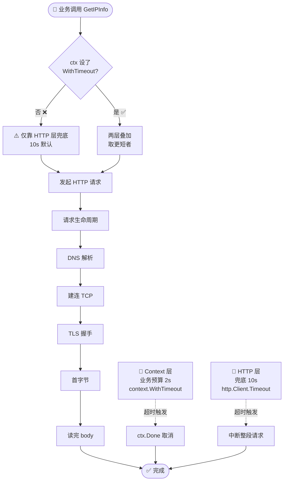
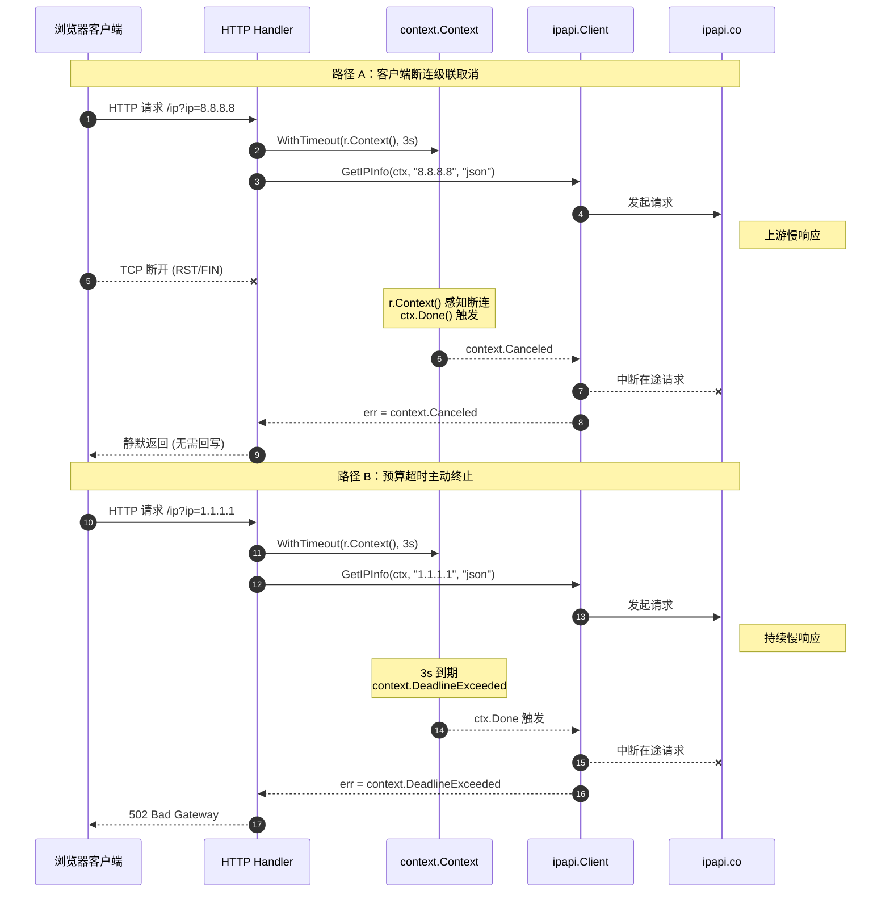

# ✅ 超时策略

> 分层超时：HTTP 客户端兜底 + Context 单次控制，让每一次 IP 查询都有明确的时间上限。

## 📌 背景

网络请求天生不可靠。对端可能延迟、连接可能挂起、代理可能堆积请求。如果在调用 ipapi.co 时**完全不设超时**，一个慢请求就可能：

- 🧨 占满 goroutine，让调用方协程长期阻塞；
- 🧨 在 HTTP 服务里拖垮整个请求池，把单点慢响应放大成雪崩；
- 🧨 配合重试逻辑形成"惊群"——重试越多，堆积越久。

ipapi.co-skills 在 [`NewClient`](../api/new-client) 里默认给 `http.Client` 设了 `10 * time.Second` 的兜底超时，同时所有查询方法的第一个参数都是 [`context.Context`](../guide/context)，请求通过 `http.NewRequestWithContext` 透传 ctx。这意味着超时**天然分两层**：

| 层级 | 谁控制 | 粒度 | 角色 |
| --- | --- | --- | --- |
| 🥇 HTTP 层 | `http.Client.Timeout` | 客户端全局 | **兜底**——防止任何一次请求无限挂起 |
| 🥈 Context 层 | `context.WithTimeout` | 单次调用 | **业务级**——按调用方预算精确控制 |

两层各司其职：HTTP 层是"安全网"，Context 层是"业务预算"。两者取**更短者**生效，缺一不可。

::: tip 🎨 一图抵千言
下图展示分层超时的生效路径：HTTP 层 `http.Client.Timeout` 兜底整个请求生命周期，Context 层按业务预算精确控制单次调用，取更短者生效。
:::



::: tip 💡 为什么必须两层
单靠 HTTP 层超时：无法按业务区分预算（登录校验 1s、批量补全 30s 用同一个 client）。  
单靠 Context 超时：一旦忘记 `WithTimeout`（比如直接传 `context.Background()`），请求就回到"无超时"裸奔状态。  
两层叠加，才能既灵活又有兜底。
:::

## 🛠 建议

### 1️⃣ 保留默认 HTTP 兜底，按需调高

默认 `10s` 适合多数场景。若网络条件差或走代理，适当调高，但**不要关掉**：

```go
client := ipapi.NewClient(
    ipapi.WithCustomHTTPClient(&http.Client{
        Timeout: 15 * time.Second, // 兜底，覆盖默认 10s
        Transport: &http.Transport{
            DialContext: (&net.Dialer{
                Timeout:   3 * time.Second, // 建连超时
                KeepAlive: 30 * time.Second,
            }).DialContext,
            ResponseHeaderTimeout: 5 * time.Second, // 首字节超时
            IdleConnTimeout:       90 * time.Second,
        },
    }),
)
```

`http.Client.Timeout` 覆盖整个请求生命周期（DNS、建连、TLS、首字节、读完 body），是最稳的兜底。配合 `Transport` 的细粒度超时（`DialContext`、`ResponseHeaderTimeout`），还能在卡死环节提前暴露问题。

::: details 🔧 Transport 细粒度超时一览
| Transport 字段 | 作用 | 推荐值 | 卡死时表现 |
| --- | --- | --- | --- |
| `DialContext.Timeout` | 建连超时 | 3s | DNS 慢/对端不可达 |
| `ResponseHeaderTimeout` | 首字节超时 | 5s | 服务端卡在处理 |
| `IdleConnTimeout` | 空闲连接回收 | 90s | 连接池泄漏 |
| `KeepAlive` | TCP 保活 | 30s | 长连接复用 |
| `http.Client.Timeout` | 整段兜底 | 10~15s | 任何环节卡死 |
:::

::: warning ⚠️ 别设 `Timeout: 0`
`0` 在 `net/http` 里表示**无超时**，等于关掉兜底。除非你 100% 确定每次调用都带 Context 超时，否则别这么干。
:::

### 2️⃣ 每次调用用 Context 精确设超时

HTTP 层超时是"全局上限"，业务上往往需要更短、更精准的预算。用 `context.WithTimeout` 控制单次调用：

```go
func lookupUserIP(client *ipapi.Client, ip string) (*ipapi.IPInfo, error) {
    ctx, cancel := context.WithTimeout(context.Background(), 2*time.Second)
    defer cancel() // 必须 cancel，否则泄漏计时器

    info, err := client.GetIPInfo(ctx, ip, "json")
    if err != nil {
        if errors.Is(err, context.DeadlineExceeded) {
            return nil, fmt.Errorf("IP 查询超时（2s 预算），ip=%s: %w", ip, err)
        }
        return nil, err
    }
    return info, nil
}
```

Context 超时会在 HTTP 超时之前生效（2s < 15s），让调用方按自己的 SLO 失败，而不是等到底。

### 3️⃣ 在 HTTP 服务里从 `r.Context()` 派生

服务端最危险的是"客户端已断开，后端还在查 IP"。正确做法是从请求 ctx 派生，并叠加自己的预算：

```go
func ipHandler(w http.ResponseWriter, r *http.Request) {
    // 客户端断开 → r.Context() 取消 → ipapi 请求立即中断
    // 同时叠加 3s 预算，防止上游慢响应拖垮本服务
    ctx, cancel := context.WithTimeout(r.Context(), 3*time.Second)
    defer cancel()

    ip := r.URL.Query().Get("ip")
    info, err := client.GetIPInfo(ctx, ip, "json")
    if err != nil {
        if errors.Is(err, context.Canceled) {
            // 客户端已走，无需回写
            return
        }
        http.Error(w, err.Error(), http.StatusBadGateway)
        return
    }
    _ = json.NewEncoder(w).Encode(info)
}
```

关键点：用 `r.Context()` 作父 ctx，断连会自动级联取消；再 `WithTimeout` 叠加预算。**别用 `context.Background()`**，否则客户端断开后请求仍在空跑。

### 4️⃣ 超时预算要算上重试

本库 `doRequest` 默认重试 2 次（`Retries=2`），每次间隔 `500ms`。也就是说最坏情况：`3 次请求 × 单次耗时 + 2 × 500ms`。Context 超时**覆盖整段重试链路**，设得过短会把"本可重试成功"的请求提前掐死：

```go
// ❌ 预算太紧：1s 撑不过 1 次重试 + 500ms 间隔
ctx, cancel := context.WithTimeout(context.Background(), 1*time.Second)

// ✅ 给足重试空间：默认重试下至少留 3~5s
ctx, cancel := context.WithTimeout(context.Background(), 5*time.Second)
```

若你要缩短重试链路，可调低 `Retries`，或自定义更短的 `defaultRetryDelay`（需自定义 HTTP 客户端配合），但别用超短超时去"砍"重试——那等于偷偷关掉了重试。

### 5️⃣ 区分超时错误类型

超时触发的错误有两类，处理逻辑不同：

```go
info, err := client.GetIPInfo(ctx, ip, "json")
switch {
case errors.Is(err, context.DeadlineExceeded):
    // Context 超时——通常是上游慢，可重试或降级
case errors.Is(err, context.Canceled):
    // 主动取消/客户端断开——不要再重试，直接返回
default:
    // 其他错误（4xx/5xx/网络），走正常错误处理
}
```

::: tip 💡 `DeadlineExceeded` vs `Canceled`
`DeadlineExceeded`：时间到了，可考虑降级或重试。  
`Canceled`：有人主动 `cancel()` 或上游断连，重试无意义，应快速退出。  
两者都通过 `errors.Is` 判定，兼容 `fmt.Errorf("...: %w", err)` 的包装。
:::

::: tip 🎨 一图抵千言
下面用序列图展示 HTTP 服务场景下"客户端断连"与"预算超时"两条触发路径如何级联取消 ipapi 请求——对应上面 `r.Context()` 派生与 `DeadlineExceeded`/`Canceled` 的区分。
:::



::: details 📊 超时预算计算示例
默认 `Retries=2`，固定退避 500ms，单次请求假设耗时 2s。最坏情况总耗时：

| 项 | 次数 | 单次耗时 | 小计 |
| --- | --- | --- | --- |
| 实际请求 | 3 次 | 2s | 6s |
| 重试间隔 | 2 次 | 500ms | 1s |
| **合计** | | | **7s** |

→ Context 预算至少留 7s 以上，建议 8~10s 富余。设 1s 会把重试链路提前掐死。
:::

## 🚫 反模式

### ❌ 直接传 `context.Background()` 不设任何超时

```go
// ❌ 没有任何超时保护，全靠 HTTP 层 10s 兜底
info, err := client.GetIPInfo(context.Background(), "8.8.8.8", "json")
```

业务方失去了精确控制权，且一旦未来有人把 HTTP 兜底调高或设 0，这里就裸奔。

### ❌ 关掉 HTTP 层超时，只靠 Context

```go
// ❌ Timeout: 0 等于无兜底
ipapi.WithCustomHTTPClient(&http.Client{Timeout: 0})
// ... 然后忘了在每次调用加 WithTimeout
client.GetIPInfo(context.Background(), "8.8.8.8", "json") // 无限挂起风险
```

HTTP 层超时是最后一道安全网，删掉它等于拆掉保险丝。

### ❌ `cancel()` 忘了 `defer`

```go
// ❌ 提前 return 时 cancel 不会被调用，泄漏计时器
ctx, cancel := context.WithTimeout(context.Background(), 3*time.Second)
info, err := client.GetIPInfo(ctx, "8.8.8.8", "json")
cancel() // 末尾 cancel，但中间任何 return/panic 都会跳过
```

正确写法永远是 `defer cancel()`，紧跟在 `WithTimeout` 之后。

### ❌ 在 HTTP handler 里用 `context.Background()` 派生

```go
// ❌ 客户端断开后，本请求不会感知，继续空跑
func handler(w http.ResponseWriter, r *http.Request) {
    ctx, cancel := context.WithTimeout(context.Background(), 3*time.Second)
    defer cancel()
    client.GetIPInfo(ctx, r.URL.Query().Get("ip"), "json")
}
```

应改为 `context.WithTimeout(r.Context(), 3*time.Second)`，让断连级联取消。

### ❌ 用超短 Context 超时"顺便"关掉重试

```go
// ❌ 800ms 超时 < 500ms 重试间隔 + 一次请求，重试永远跑不完
ctx, _ := context.WithTimeout(context.Background(), 800*time.Millisecond)
```

想关重试就直接设 `Retries: 0`（或用自定义 client），不要用超时"曲线救国"，语义不清且难以排查。

### ❌ 用 `time.Sleep` 在调用前模拟超时控制

```go
// ❌ 这不是超时控制，是阻塞；且无法取消已在途的 HTTP 请求
go func() { time.Sleep(2 * time.Second); cancel() }()
```

正确做法是 `context.WithTimeout`，它在请求真正卡住时能**中断在途的 HTTP 调用**，而不是干等。

## ✅ 检查清单

- [ ] `NewClient` 创建的 client 保留了 HTTP 层超时（默认 10s，或自定义但**非 0**）
- [ ] 自定义 `http.Client` 时同时配置了 `Timeout` 与 `Transport` 的细粒度超时（`DialContext`、`ResponseHeaderTimeout`）
- [ ] 每次查询调用都用 `context.WithTimeout` 设了明确的业务预算
- [ ] 所有 `WithTimeout` / `WithCancel` 紧跟 `defer cancel()`
- [ ] HTTP handler 里从 `r.Context()` 派生 ctx，而非 `context.Background()`
- [ ] Context 超时预算 ≥ 单次请求耗时 × (Retries+1) + 重试间隔 × Retries
- [ ] 错误处理里用 `errors.Is(err, context.DeadlineExceeded)` 与 `context.Canceled` 区分超时与取消
- [ ] 没有任何调用链路处于"无超时"状态（HTTP 层 + Context 层至少一层生效）
- [ ] 全局只创建一个 `Client` 实例复用，超时配置在初始化时一次定好

## 🔗 相关

- 📖 [上下文 Context](../guide/context) — Context 超时与取消的基础概念
- 📖 [自定义 HTTP 客户端](../guide/custom-http) — `WithCustomHTTPClient` 与 Transport 调优
- 📖 [重试与限流](../guide/retry-concept) — 重试次数、间隔与限流通道
- 🚀 [`NewClient`](../api/new-client) — 默认 HTTP 客户端与超时常量
- 🚀 [`WithCustomHTTPClient`](../api/with-custom-http-client) — 替换底层 `*http.Client`
- 🚀 [`GetIPInfo`](../api/get-ip-info) 等方法签名 — 第一个参数均为 `context.Context`
- ⏱ [重试策略](./retry-strategy) — 重试与超时的协同配合
- 🛡 [错误处理策略](./error-handling-strategy) — 超时错误的分级处理
