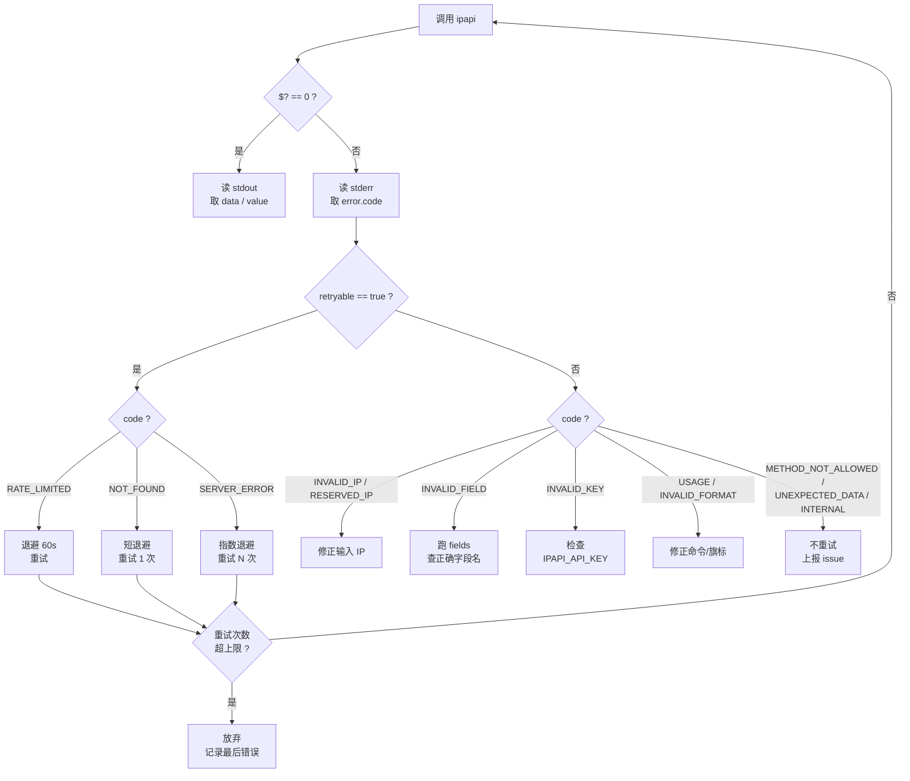
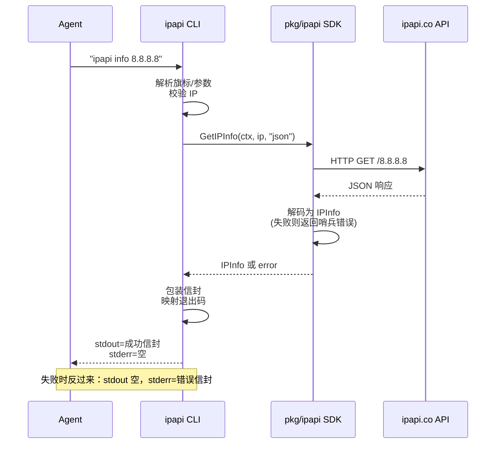

# 🤖 Agent 接入指南

> 本页面向 **AI Agent / LLM 工具调用 / 自动化脚本**。读完这一页，你的 Agent 就能把 `ipapi` 当成一个可靠的外部工具来调用：**无需读文档**，靠 `fields` 自描述摸清能力边界，靠退出码与 `ok`/`error` 信封判断成败，靠 `error.retryable` 决定是否退避重试。

`ipapi` CLI 是为程序化调用而生的 IP 地理位置工具。它**默认输出 JSON 信封**、**错误只走 stderr**、**退出码语义稳定**、**字段名可被本地枚举**——这四点合在一起，意味着 Agent 不需要任何先验知识就能安全驱动它。本指南把这套协议浓缩成可复制的调用模板与决策树。

::: tip 📦 一句话定位
`ipapi` 是一个"**自描述 + 结构化 + 退出码驱动**"的命令行工具。Agent 调用它时，stdout 永远是干净的数据，stderr 永远是结构化错误，`$?` 永远是稳定的语义码。
:::

---

## 🎯 为什么 Agent 适合用 ipapi

传统 CLI 文档假设读者是人类：要读 `--help`、要记旗标、要靠人眼分辨输出。Agent 不擅长这些。`ipapi` 的设计针对 Agent 的三个弱点做了对冲：

| Agent 的弱点 | ipapi 的对冲 |
|--------------|--------------|
| 不知道工具能做什么 | `ipapi fields` 本地枚举 28 个可查字段，**零网络** |
| 难从自然语言输出判断成败 | 默认 JSON 信封，`ok` 布尔 + 退出码双保险 |
| 不确定该不该重试 | `error.retryable` 显式标注，无需猜 HTTP 语义 |

结果：Agent 可以在**不读任何文档**的前提下，先用 `fields` 探查能力，再用 `info`/`field` 取数，最后按退出码分支处理。这正是仓库根目录 [`SKILLS.md`](https://github.com/cyberspacesec/ipapi.co-skills/blob/main/SKILLS) 的设计初衷——它就是写给 Agent 看的"一页说明书"。

::: details SKILLS.md 是什么？
`SKILLS.md` 是放在仓库根目录的 **Agent 接入说明**，遵循"skills"约定：Agent 在工作目录里发现这个文件，读完即可调用对应工具，无需翻完整文档。它覆盖了命令一览、输出协议、退出码、调用模板。本页是 `SKILLS.md` 的**扩展版**：补充了决策树、批量模式、错误处理策略与 SDK 桥接。两者内容一致，本页更适合人类开发者阅读与排错。
:::

---

## 🔭 第零步：自描述探查能力

Agent 第一次遇到 `ipapi` 时，**不要**假设你知道有哪些字段——先问工具本身。

```bash
ipapi fields --json
```

```json
{
  "groups": [
    {"name": "identity", "fields": ["ip", "network", "version", "hostname"]},
    {"name": "geo", "fields": ["city", "region", "region_code", "country", "country_name", "country_code", "country_code_iso3", "country_capital", "country_tld", "continent_code", "in_eu", "postal", "latitude", "longitude", "latlong"]},
    {"name": "time", "fields": ["timezone", "utc_offset"]},
    {"name": "network", "fields": ["asn", "org"]},
    {"name": "culture", "fields": ["languages", "country_calling_code"]},
    {"name": "economy", "fields": ["currency", "currency_name"]},
    {"name": "stats", "fields": ["country_area", "country_population"]}
  ],
  "all": ["ip", "network", "version", "hostname", "city", "region", "..."]
}
```

关键点：

- **本地无网络**：`fields` 不打 ipapi.co，瞬时返回，可放心高频调用。
- **`--json` 返回两个键**：`groups`（按 7 个分组组织）与 `all`（扁平的全部 28 个字段名数组）。
- **字段名即契约**：`all` 里的字符串就是 `field`/`me-field` 命令的合法 `<field>` 参数。Agent 拿到 `all` 后，从中挑字段去查，**绝不会传错字段名**（传错会得到 `INVALID_FIELD`，退出码 4）。

```bash
# 只看某一个分组
ipapi fields --group geo

# 人类可读模式（默认，无 --json）
ipapi fields
```

::: tip 🧭 探查→取值的固定两步
1. `ipapi fields --json` 拿 `all`，确认你要的字段存在。
2. `ipapi field <ip> <field>` 取值，或 `ipapi info <ip>` 一次拿全。
这两步组合是 Agent 最稳的调用范式——零猜测、零硬编码字段名。
:::

---

## ✅ 第一步：判断成功还是失败

`ipapi` 提供**三重信号**判断一次调用的成败，Agent 任选其一即可，但建议组合使用：

| 信号 | 位置 | 成功值 | 失败值 |
|------|------|--------|--------|
| 退出码 `$?` | 进程状态 | `0` | `2`–`12`、`70` |
| `ok` 字段 | stdout JSON | `true` | `false`（此时在 stderr） |
| stdout 是否为空 | stdout | 有内容 | 失败时 stdout 为空 |

最省事的判法是**先看退出码**：

```bash
if ipapi info "$IP" > /tmp/info.json 2>/tmp/err.json; then
  # 退出码 0，stdout 里有成功信封
  jq '.data.country_name' /tmp/info.json
else
  # 退出码非 0，stderr 里有错误信封，stdout 为空
  jq '.error.code' /tmp/err.json
fi
```

::: warning ⚠ stdout 与 stderr 必须分流
失败时 `ipapi` **不往 stdout 写任何东西**，错误信封只走 stderr。这是为了让 `ipapi ... | jq` 这种管道在失败时不会把错误 JSON 混进数据流。Agent 调用时务必用 `>out 2>err` 分流，否则你会丢失错误信息或污染下游解析。
:::

成功信封（stdout）的完整结构：

```json
{
  "ok": true,
  "command": "info",
  "args": {"ip": "8.8.8.8", "format": "json"},
  "data": { "...28 个 IPInfo 字段..." },
  "meta": {"format": "json", "durationMs": 312, "retrievedAt": "2026-07-04T10:01:22Z"}
}
```

- `command`： echo 回你调的子命令，便于审计。
- `args`： echo 回入参，便于排查"我到底传了什么"。
- `data`：真正的业务数据。`info`/`me` 是 28 字段的 `IPInfo`；`field`/`me-field` 是 `{field, value}`。
- `meta`：`durationMs` 是端到端耗时，`retrievedAt` 是 ISO 8601 时间戳。

---

## 🧯 第二步：处理错误

错误信封（stderr）的结构：

```json
{
  "ok": false,
  "command": "info",
  "args": {"ip": "999.1.1.1"},
  "error": {
    "code": "INVALID_IP",
    "message": "invalid IP address",
    "sentinel": "ErrInvalidIP",
    "retryable": false
  }
}
```

Agent 处理错误的**唯一可靠依据**是 `error.code`（稳定字符串）和 `error.retryable`（布尔）。**不要解析 `message`**——它是给人看的自然语言，措辞可能随版本调整。

### 退出码 ↔ code ↔ retryable 对照

| 退出码 | `error.code` | 含义 | `retryable` | Agent 应做 |
|:------:|--------------|------|:-----------:|-----------|
| 0 | — | 成功 | — | 取 `data` |
| 2 | `USAGE` | 参数/旗标错误 | 否 | 修正命令，不重试 |
| 3 | `INVALID_IP` | 无效 IP 地址 | 否 | 修正输入 |
| 4 | `INVALID_FIELD` | 无效字段名 | 否 | 跑 `fields` 查正确名 |
| 5 | `INVALID_FORMAT` | 无效响应格式 | 否 | 改 `-f` |
| 6 | `RATE_LIMITED` | API 限流 | **是** | 退避 60s 重试 |
| 7 | `RESERVED_IP` | 保留/私有 IP | 否 | 换公网 IP |
| 8 | `NOT_FOUND` | 资源未找到 | **是** | 短退避重试一次 |
| 9 | `SERVER_ERROR` | 服务端错误 | **是** | 指数退避重试 |
| 10 | `METHOD_NOT_ALLOWED` | 方法不允许 | 否 | 不重试，报上游 |
| 11 | `INVALID_KEY` | 无效 API key | 否 | 检查 `IPAPI_API_KEY` |
| 12 | `UNEXPECTED_DATA` | 响应无法解码 | 否 | 报 issue，不重试 |
| 70 | `INTERNAL` | 其他内部错误 | 否 | 报 issue，不重试 |

完整语义见 [退出码详解](./exit-codes)。

### 错误处理决策树

下图把"拿到非零退出码后怎么办"浓缩成一棵决策树。Agent 可以机械地照着走，无需人类判断。



::: tip 🧠 决策树就是 Agent 的"重试策略"
把上面这棵树翻译成你 Agent 框架的 `if/else` 或状态机，就得到了一个生产可用的 ipapi 调用器。关键约束：**只在 `retryable == true` 时重试**，且 `RATE_LIMITED` 必须长退避（≥60s），`SERVER_ERROR` 用指数退避。
:::

---

## 🧩 调用模板

下面是 Agent 最常用的几套调用模板，可直接复制。所有模板都假设已用 `go install github.com/cyberspacesec/ipapi.co-skills/cmd/ipapi@latest` 装好 `ipapi`。

### 模板 1：查一个 IP 的完整画像

```bash
ipapi info 8.8.8.8 > /tmp/info.json 2>/tmp/err.json
if [ $? -eq 0 ]; then
  jq '.data.country_name, .data.asn, .data.timezone' /tmp/info.json
else
  jq '.error.code' /tmp/err.json
fi
```

`info` 返回完整 28 字段，**仅支持 `--format json`**（结构化解析）。要 xml/csv/yaml/jsonp 原始字节，改用 `raw`。

### 模板 2：只取一个字段（最省配额）

```bash
# --human 直出纯值一行，便于 shell pipe
ipapi field 8.8.8.8 country --human
# => US

# 不加 --human，返回 JSON 信封 {field, value}
ipapi field 8.8.8.8 country
```

```json
{
  "ok": true,
  "command": "field",
  "args": {"ip": "8.8.8.8", "field": "country"},
  "data": {"field": "country", "value": "US"},
  "meta": {"format": "json", "durationMs": 280, "retrievedAt": "2026-07-04T10:02:11Z"}
}
```

::: tip 💡 何时用 field 而非 info
只关心一两个字段时，`field` 比 `info` 更省流量、更省 ipapi.co 配额。要 3 个以上字段时，`info` 一次拿全更划算（一次请求 vs 多次请求）。
:::

### 模板 3：查本机公网 IP

```bash
ipapi me | jq '.data.ip, .data.country_name'
ipapi me-field ip --human      # 只要本机 IP 字符串
```

`me` / `me-field` 由 ipapi.co 服务端识别你的来源连接，返回的是 **NAT/代理后的公网出口 IP**，不是内网网卡地址。

### 模板 4：先探查再取值（零硬编码）

```bash
# 拿到全部合法字段名
FIELDS=$(ipapi fields --json | jq -r '.all[]')

# 对每个字段查一次（带限速）
for f in $FIELDS; do
  ipapi field 8.8.8.8 "$f" --human
  sleep 1
done
```

这套范式保证 Agent **永远不会传错字段名**——字段名来自工具自描述，而非开发者记忆。

### 模板 5：批量查询带限速

```bash
for ip in 8.8.8.8 1.1.1.1 9.9.9.9; do
  if ipapi field "$ip" country --human > /tmp/v 2>/tmp/e; then
    echo "$ip => $(cat /tmp/v)"
  else
    echo "$ip => ERR: $(jq -r '.error.code' /tmp/e)"
  fi
  sleep 1   # 礼貌限速，避免触发 RATE_LIMITED
done
```

::: warning ⚠ 批量必限速
ipapi.co 对匿名调用有配额限制。批量查询**务必**加 `sleep`（建议 ≥1s/次），否则会撞 `RATE_LIMITED`（退出码 6）。生产环境配置 `IPAPI_API_KEY` 提升配额。更稳健的批量策略见 [限流策略](../best-practices/rate-limit-strategy)。
:::

### 模板 6：完整错误处理（bash）

```bash
lookup() {
  local ip="$1"
  local out=/tmp/ipapi.out err=/tmp/ipapi.err
  if ipapi info "$ip" >"$out" 2>"$err"; then
    jq '.data' "$out"
    return 0
  fi
  local code
  code=$(jq -r '.error.code' "$err")
  case "$code" in
    RATE_LIMITED)
      echo "限流，60s 后重试" >&2
      sleep 60 && lookup "$ip"   # 递归重试
      ;;
    INVALID_IP|RESERVED_IP)
      echo "无效/保留 IP: $ip" >&2
      return 3
      ;;
    INVALID_KEY)
      echo "API key 无效，检查 IPAPI_API_KEY" >&2
      return 11
      ;;
    *)
      cat "$err" >&2
      return 1
      ;;
  esac
}
```

### 模板 7：原始格式直出（喂给外部工具）

```bash
ipapi raw 8.8.8.8 -f csv      # 直出 CSV，不包信封
ipapi raw 8.8.8.8 -f xml      # 直出 XML
ipapi raw 8.8.8.8 -f yaml     # 直出 YAML
ipapi raw 8.8.8.8 -f jsonp --callback mycb   # JSONP 包裹
```

`raw` / `me-raw` **直出上游原始字节到 stdout，不装信封、不带 meta**。错误仍走 stderr 信封。适合把 ipapi 嵌进已有数据处理管线（如 `xmllint`、`csvkit`）。

---

## 🔁 重试与退避

`ipapi` 内置重试机制，由 `--retries`（默认 2，总请求 = `retries + 1`）控制。但**内置重试只在 `retryable` 为真时触发**，即仅 `RATE_LIMITED` / `NOT_FOUND` / `SERVER_ERROR` 三类。

Agent 在内置重试耗尽后，仍应在外层做自己的退避：

| `error.code` | 建议退避 | 建议重试上限 |
|--------------|---------|:-----------:|
| `RATE_LIMITED` | 固定 60s | 3 |
| `NOT_FOUND` | 固定 2s | 1 |
| `SERVER_ERROR` | 指数退避（2s→4s→8s） | 3 |

```bash
# 配置 CLI 内置重试
ipapi info 8.8.8.8 --retries 3 --timeout 15s
# 或用环境变量
IPAPI_RETRIES=3 IPAPI_TIMEOUT=15s ipapi info 8.8.8.8
```

::: details 为什么不可重试的码不会因 --retries 而重打？
SDK 的重试逻辑判断 `IsRetryableError(err)`，只有 `ErrRateLimited` / `ErrServerError` / `ErrNotFound` 返回 `true`。`USAGE` / `INVALID_IP` / `INVALID_FIELD` 等是确定性错误，重打也是同样结果，所以 `--retries` 多大都不会重打——既省配额又省时间。
:::

---

## ⚙️ 配置：让 Agent 调用更干净

Agent 调用时不必每次传一堆旗标。用配置文件与环境变量把默认值固化：

```bash
# 环境变量（适合 CI/容器）
export IPAPI_API_KEY=secret
export IPAPI_API_KEY_MODE=header   # 或 query
export IPAPI_FORMAT=json
export IPAPI_BASE_URL=https://ipapi.co/
export IPAPI_RETRIES=3
export IPAPI_TIMEOUT=15s

# 一次性调用覆盖
ipapi info 8.8.8.8 --timeout 30s
```

配置优先级：**旗标 > 环境变量 > `~/.ipapi.json` > 默认值**。完整说明见 [配置方式](./config)。

::: tip 🔑 API key 的两种模式
- `--api-key-mode header`（默认）：key 放在 `Authorization: Bearer` 头，不进 URL，更安全。
- `--api-key-mode query`：key 作为 `?key=` 查询参数，兼容某些旧上游/代理。
Agent 默认用 header 模式即可；仅当上游要求 query 时才切。
:::

---

## 📡 调用链：CLI ↔ SDK ↔ ipapi.co

`ipapi` CLI 是 `pkg/ipapi` Go SDK 的命令行封装。Agent 调用 CLI 时，数据流如下：



这意味着：**Agent 用 CLI 验证过的逻辑，可以 1:1 迁移到 Go SDK**。信封字段、退出码、`retryable` 语义与 SDK 的哨兵错误完全对应。要在 Go 程序内嵌入同样能力，见 [API 方法详解](../api/methods)。

---

## 🧠 Agent 调用清单（速查）

把下面这张清单贴进你的 Agent 系统提示，它就具备了调用 ipapi 的全部知识：

```text
1. 能力探查：ipapi fields --json        # 零网络，拿 .all[] 字段名
2. 完整查询：ipapi info <ip>             # 28 字段，仅 json
3. 单字段  ：ipapi field <ip> <f> --human # 纯值一行
4. 本机    ：ipapi me / ipapi me-field <f> --human
5. 原始格式：ipapi raw <ip> -f csv|xml|yaml|jsonp
6. 判成功  ：$? == 0 且 stdout 非空
7. 判错误  ：$? != 0，读 stderr 的 error.code（不解析 message）
8. 判重试  ：error.retryable == true → 退避后重试
9. 限流    ：RATE_LIMITED(6) 退避 60s；批量查询 sleep ≥1s
10. 配置   ：IPAPI_API_KEY / IPAPI_RETRIES / IPAPI_TIMEOUT 环境变量
```

::: details 完整的 Agent 调用伪代码（Python 风格）
```python
import subprocess, json, time

def ipapi(args, retries=3):
    for attempt in range(retries + 1):
        p = subprocess.run(["ipapi", *args], capture_output=True)
        if p.returncode == 0:
            return json.loads(p.stdout)        # 成功信封
        err = json.loads(p.stderr)             # 错误信封
        code = err["error"]["code"]
        if not err["error"]["retryable"]:
            raise RuntimeError(code)
        if code == "RATE_LIMITED":
            time.sleep(60)
        elif code == "NOT_FOUND":
            time.sleep(2); break if attempt else None
        elif code == "SERVER_ERROR":
            time.sleep(2 ** attempt)
    raise RuntimeError(f"retries exhausted: {code}")

# 用法
info = ipapi(["info", "8.8.8.8"])["data"]
country = subprocess.run(["ipapi", "field", "8.8.8.8", "country", "--human"],
                         capture_output=True, text=True).stdout.strip()
```
:::

---

## 🚫 常见 Agent 误用

| 误用 | 后果 | 正确做法 |
|------|------|---------|
| 解析 `error.message` 做分支 | 版本升级后措辞变 → 脚本崩 | 用 `error.code`（稳定字符串） |
| 失败时仍 `jq` stdout | stdout 为空，jq 报错 | 先看 `$?`，失败读 stderr |
| 对 `INVALID_IP` 重试 | 浪费配额 | 不可重试码直接放弃 |
| 批量查询不限速 | 撞 `RATE_LIMITED` | `sleep 1`+，或配 API key |
| `info` 用 `-f xml` | 报 `INVALID_FORMAT` | xml/csv/yaml 用 `raw` |
| 硬编码字段名 | 字段改名/拼错 → `INVALID_FIELD` | 先 `fields --json` 拿 `all` |
| 把 `--human` 表格当接口 | 对齐宽度随版本变 | `--human` 只给人看，结构化用 JSON |

---

## 📚 与 SKILLS.md 的关系

| 维度 | `SKILLS.md`（仓库根） | 本页（`cli/agent.md`） |
|------|----------------------|----------------------|
| 受众 | Agent / 自动化脚本（一页说明书） | 人类开发者 + Agent 实现者 |
| 位置 | 仓库根目录 | 文档站 CLI 区 |
| 篇幅 | 精简，覆盖命令/协议/退出码/模板 | 详尽，含决策树/批量/重试/SDK 桥接 |
| 用途 | Agent 在工作目录发现即可调用 | 排错、设计调用器、理解设计动机 |

两者**内容一致、不冲突**。`SKILLS.md` 是 Agent 的"快速启动卡"，本页是"实现指南"。如果你在写一个 Agent 框架的 ipapi 适配器，读 `SKILLS.md` 就够；如果要设计生产级重试/限流/错误处理策略，读本页。

::: tip 🔗 直接看 SKILLS.md
仓库根目录原文：[`SKILLS.md`](https://github.com/cyberspacesec/ipapi.co-skills/blob/main/SKILLS)
:::

---

## 🚀 生产级最佳实践

要把 `ipapi` 用到生产级 Agent 里，除了本页的调用模板，还建议参考 [最佳实践](../best-practices/) 区：

- [限流策略](../best-practices/rate-limit-strategy) —— 避免 `RATE_LIMITED` 的工程做法
- [重试策略](../best-practices/retry-strategy) —— 指数退避与抖动的具体参数
- [错误处理策略](../best-practices/error-handling-strategy) —— 哨兵错误与降级
- [优雅降级](../best-practices/graceful-degradation) —— ipapi 不可用时 Agent 怎么办
- [密钥管理](../best-practices/secret-management) —— `IPAPI_API_KEY` 的安全存放
- [可观测性](../best-practices/observability) —— 记录 `meta.durationMs` 与 `retrievedAt`

::: warning ⚠ 生产环境务必配 API key
匿名调用 ipapi.co 配额很低，Agent 批量跑会很快撞限流。生产环境一定配 `IPAPI_API_KEY`（[配置文件](./config) 或环境变量），并配合 `--retries` 与外层退避。
:::

---

## 下一步

- 📋 [命令速查](./commands) —— 全部 9 个子命令与全局旗标的一页式速查表
- 🚀 [快速开始](./quickstart) —— 五分钟跑通第一条命令
- 🔍 [info / me 命令](./command-info) —— 完整 28 字段查询的细节
- 🎯 [field / me-field 命令](./command-field) —— 单字段查询的所有用法
- 📡 [raw / me-raw 命令](./command-raw) —— 五种原始格式直出
- 🧭 [fields 命令](./command-fields) —— 28 个可查字段的自描述清单
- 🚪 [退出码详解](./exit-codes) —— 0–12 与 70 的完整语义
- ⚙️ [配置方式](./config) —— 旗标/环境变量/配置文件的四级优先级
- 🧠 [SKILLS.md 原文](https://github.com/cyberspacesec/ipapi.co-skills/blob/main/SKILLS) —— Agent 一页说明书
- 🍳 [实战手册](../cookbook/) —— CLI 与 SDK 的真实场景用法
- 🛡 [最佳实践](../best-practices/) —— 限流/重试/错误处理的生产级策略

## 对应 SDK 方法

ipapi CLI 是 `pkg/ipapi` SDK 的命令行封装。Agent 调用 CLI 与直接调 SDK 行为一致，可 1:1 迁移：

| CLI 命令 | SDK 方法 | 文档 |
|----------|----------|------|
| `ipapi info <ip>` | `Client.GetIPInfo(ctx, ip, "json")` | [/api/get-ip-info](../api/get-ip-info) |
| `ipapi me` | `Client.GetClientIPInfo(ctx, "json")` | [/api/get-client-ip-info](../api/get-client-ip-info) |
| `ipapi field <ip> <field>` | `Client.GetField(ctx, ip, field)` | [/api/get-field](../api/get-field) |
| `ipapi me-field <field>` | `Client.GetClientField(ctx, field)` | [/api/get-client-field](../api/get-client-field) |
| `ipapi raw <ip> -f <fmt>` | `Client.GetIPInfoRaw(ctx, ip, format)` | [/api/get-ip-info-raw](../api/get-ip-info-raw) |
| `ipapi me-raw -f <fmt>` | `Client.GetClientIPInfoRaw(ctx, format)` | [/api/get-client-ip-info-raw](../api/get-client-ip-info-raw) |
| `ipapi fields` | `ValidFields()` | [/api/fields](../api/fields) |
| 退出码 ↔ 哨兵 | 哨兵错误集（`ErrInvalidIP` 等） | [/api/errors](../api/errors) |
| `retryable` 判定 | `IsRetryableError(err) bool` | [/api/is-retryable](../api/is-retryable) |

::: tip 🔗 源码
CLI 命令定义见仓库 [`cmd/ipapi/`](https://github.com/cyberspacesec/ipapi.co-skills/blob/main/cmd/ipapi/) 目录；SDK 侧的 `GetIPInfo` / `GetField` / `ValidFields` / `IsRetryableError` 实现见 [`pkg/ipapi/api.go`](https://github.com/cyberspacesec/ipapi.co-skills/blob/main/pkg/ipapi/api.go) 与 [`pkg/ipapi/errors.go`](https://github.com/cyberspacesec/ipapi.co-skills/blob/main/pkg/ipapi/errors.go)。Agent 一页说明书见仓库根 [`SKILLS.md`](https://github.com/cyberspacesec/ipapi.co-skills/blob/main/SKILLS)。
:::
